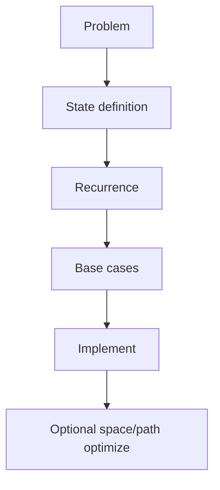

# Dynamic Programming

 overlapping subproblems + optimal substructure. Write the **state** and **transition** before code.

## Recipe

1. Define `dp[...]` in one English sentence.
2. Recurrence + base cases.
3. Choose top-down (memo) or bottom-up.
4. Optimize space if only last row/state needed.
5. Reconstruct solution if asked (parent pointers).



## 1D — Climbing stairs / House robber

```ts
export function climbStairs(n: number): number {
  if (n <= 2) return n
  let a = 1
  let b = 2
  for (let i = 3; i <= n; i++) {
    const c = a + b
    a = b
    b = c
  }
  return b
}

export function rob(nums: number[]): number {
  let prev2 = 0
  let prev1 = 0
  for (const x of nums) {
    const cur = Math.max(prev1, prev2 + x)
    prev2 = prev1
    prev1 = cur
  }
  return prev1
}
```

## 0/1 Knapsack

```ts
/** max value with capacity W; each item once */
export function knapsack(
  weights: number[],
  values: number[],
  W: number
): number {
  const n = weights.length
  const dp = Array.from({ length: n + 1 }, () => Array(W + 1).fill(0))
  for (let i = 1; i <= n; i++) {
    for (let w = 0; w <= W; w++) {
      dp[i][w] = dp[i - 1][w]
      if (weights[i - 1] <= w) {
        dp[i][w] = Math.max(
          dp[i][w],
          dp[i - 1][w - weights[i - 1]] + values[i - 1]
        )
      }
    }
  }
  return dp[n][W]
}

/** Space-optimized (iterate capacity descending) */
export function knapsack1D(
  weights: number[],
  values: number[],
  W: number
): number {
  const dp = Array(W + 1).fill(0)
  for (let i = 0; i < weights.length; i++) {
    for (let w = W; w >= weights[i]; w--) {
      dp[w] = Math.max(dp[w], dp[w - weights[i]] + values[i])
    }
  }
  return dp[W]
}
```

## Coin change

```ts
export function coinChange(coins: number[], amount: number): number {
  const dp = Array(amount + 1).fill(Infinity)
  dp[0] = 0
  for (let a = 1; a <= amount; a++) {
    for (const c of coins) {
      if (c <= a) dp[a] = Math.min(dp[a], dp[a - c] + 1)
    }
  }
  return dp[amount] === Infinity ? -1 : dp[amount]
}

export function changeCombinations(amount: number, coins: number[]): number {
  const dp = Array(amount + 1).fill(0)
  dp[0] = 1
  for (const c of coins) {
    for (let a = c; a <= amount; a++) dp[a] += dp[a - c]
  }
  return dp[amount]
}
```

## LIS — O(n log n)

```ts
export function lengthOfLIS(nums: number[]): number {
  const tails: number[] = []
  for (const x of nums) {
    let lo = 0
    let hi = tails.length
    while (lo < hi) {
      const mid = (lo + hi) >> 1
      if (tails[mid] < x) lo = mid + 1
      else hi = mid
    }
    tails[lo] = x
  }
  return tails.length
}
```

## Grid paths / unique paths with obstacles

```ts
export function uniquePathsWithObstacles(grid: number[][]): number {
  const m = grid.length
  const n = grid[0].length
  if (grid[0][0] === 1) return 0
  const dp = Array.from({ length: m }, () => Array(n).fill(0))
  dp[0][0] = 1
  for (let i = 0; i < m; i++) {
    for (let j = 0; j < n; j++) {
      if (grid[i][j] === 1) {
        dp[i][j] = 0
        continue
      }
      if (i > 0) dp[i][j] += dp[i - 1][j]
      if (j > 0) dp[i][j] += dp[i][j - 1]
    }
  }
  return dp[m - 1][n - 1]
}
```

## Edit distance

```ts
export function minDistance(word1: string, word2: string): number {
  const m = word1.length
  const n = word2.length
  const dp = Array.from({ length: m + 1 }, () => Array(n + 1).fill(0))
  for (let i = 0; i <= m; i++) dp[i][0] = i
  for (let j = 0; j <= n; j++) dp[0][j] = j
  for (let i = 1; i <= m; i++) {
    for (let j = 1; j <= n; j++) {
      if (word1[i - 1] === word2[j - 1]) dp[i][j] = dp[i - 1][j - 1]
      else {
        dp[i][j] =
          1 + Math.min(dp[i - 1][j], dp[i][j - 1], dp[i - 1][j - 1])
      }
    }
  }
  return dp[m][n]
}
```

## Interval DP — burst balloons (sketch)

```ts
export function maxCoins(nums: number[]): number {
  const a = [1, ...nums, 1]
  const n = a.length
  const dp = Array.from({ length: n }, () => Array(n).fill(0))
  for (let len = 2; len < n; len++) {
    for (let l = 0; l + len < n; l++) {
      const r = l + len
      for (let k = l + 1; k < r; k++) {
        dp[l][r] = Math.max(
          dp[l][r],
          a[l] * a[k] * a[r] + dp[l][k] + dp[k][r]
        )
      }
    }
  }
  return dp[0][n - 1]
}
```

## Top-down memo pattern

```ts
export function fibMemo(n: number, memo: Map<number, number> = new Map()): number {
  if (n <= 1) return n
  if (memo.has(n)) return memo.get(n)!
  const v = fibMemo(n - 1, memo) + fibMemo(n - 2, memo)
  memo.set(n, v)
  return v
}
```

## Interview Q&A

**Q: Greedy vs DP?**  
Greedy needs exchange/optimal-choice property proof. If unsure, DP is safer.

**Q: How to spot DP?**  
“Count ways / max-min over sequences / subsets with overlapping subproblems.”

**Q: Bitmask DP?**  
`dp[mask][i]` for TSP-like n ≤ 20.

## Common mistakes

| Mistake | Fix |
| --- | --- |
| Wrong state (missing dimension) | Include all choices that affect future |
| Iterating knapsack ascending for 0/1 | Must go descending in 1D |
| Forgetting base `dp[0]=1` for combinations | Ways to make 0 |

## Trade-offs

Memo: easier to write, stack risk. Bottom-up: clear complexity, easier space opt. Sometimes meet-in-the-middle beats DP.

## Production relevance

Pricing engines, inventory allocation, diff algorithms (edit distance), recommendation scoring, build scheduling — usually with heavy pruning / ILP beyond interview DP.
