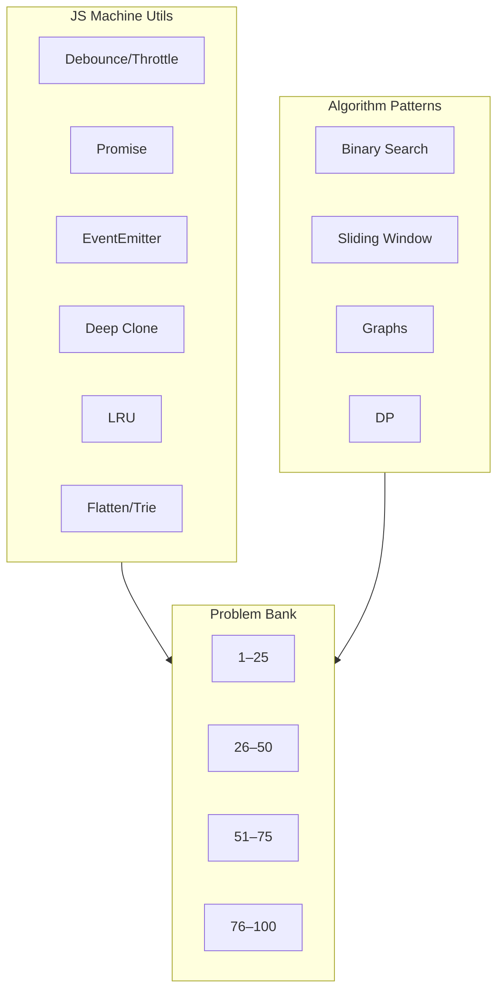

# Coding Interview — Pattern Map

Interview-dense revision for mid → senior full-stack. Prefer **pattern recognition → complexity → clean TypeScript** over memorizing solutions.

## How to use this track

1. Implement utils in [01–06](/coding/01-debounce-throttle) cold (no peeking).
2. Drill algorithmic patterns in [07–10](/coding/07-binary-search) with timed reps.
3. Grind [Problems 1–100](/coding/11-problems-01-25) — say the pattern out loud before coding.

## Pattern → problem map

| Pattern | When you smell it | Starter problems | Chapter |
| --- | --- | --- | --- |
| Debounce / throttle | Rate-limit user/input/network | Search box, scroll, resize | [01](/coding/01-debounce-throttle) |
| Promise combinators | Concurrent async orchestration | Retry, timeout, pool | [02](/coding/02-promise) |
| Pub/sub | Decouple producers/consumers | Event bus, DOM-like API | [03](/coding/03-event-emitter) |
| Deep clone / serialize | Structured copy, cycles | JSON clone traps | [04](/coding/04-deep-clone) |
| LRU / LFU | Bounded cache eviction | `get`/`put` O(1) | [05](/coding/05-lru) |
| Flatten / Trie | Nested lists, prefix search | Autocomplete | [06](/coding/06-flatten-trie) |
| Binary search | Sorted / monotonic predicate | First/last, peak, rotated | [07](/coding/07-binary-search) |
| Sliding window | Contiguous subarray/substring | Longest/shortest with constraint | [08](/coding/08-sliding-window) |
| Graphs (BFS/DFS/topo) | Edges, dependencies, islands | Shortest path unweighted | [09](/coding/09-graphs) |
| DP | Overlapping subproblems + optimal substructure | Knapsack, LIS, grid paths | [10](/coding/10-dp) |
| Two pointers | Sorted array, palindrome, pairs | Opposite / same direction | [11–14](/coding/11-problems-01-25) |
| Heap / Top-K | Streaming extremes | Merge K lists | [11–14](/coding/11-problems-01-25) |
| Intervals | Merge / insert / meeting rooms | Sort by start | [11–14](/coding/11-problems-01-25) |
| Backtracking | Combinations / permutations | Subsets, N-Queens | [11–14](/coding/11-problems-01-25) |
| Union-Find | Connected components, dynamic unions | Number of islands II | [11–14](/coding/11-problems-01-25) |
| Monotonic stack | Next greater / histogram | Daily temperatures | [11–14](/coding/11-problems-01-25) |

## Complexity cheat sheet (say this in interviews)

| Structure | Access | Search | Insert | Delete |
| --- | --- | --- | --- | --- |
| Array | O(1) | O(n) | O(n) | O(n) |
| HashMap | — | O(1) avg | O(1) avg | O(1) avg |
| Heap | min/max O(1) | — | O(log n) | O(log n) |
| Balanced BST | — | O(log n) | O(log n) | O(log n) |
| Trie | — | O(L) | O(L) | O(L) |
| Union-Find (α) | — | nearly O(1) | — | union nearly O(1) |

> [!TIP]
> Before coding: **inputs/outputs → constraints → brute force → optimize → edge cases → complexity**. Narrate each step.

## Interview traps

| Trap | Fix |
| --- | --- |
| Off-by-one in binary search | Use invariant: `lo` = first true / `hi` = last false |
| Mutating input unexpectedly | Clarify; prefer copy or document in-place |
| Ignoring null / empty / single element | Always list edge cases first |
| Wrong graph representation | Adj list for sparse; matrix for dense / grids |
| DP without state definition | Write `dp[i]` meaning in one sentence |

## Chapter index

| # | Topic |
| --- | --- |
| [01](/coding/01-debounce-throttle) | Debounce & Throttle |
| [02](/coding/02-promise) | Promise + all / any / race / allSettled |
| [03](/coding/03-event-emitter) | EventEmitter |
| [04](/coding/04-deep-clone) | Deep Clone |
| [05](/coding/05-lru) | LRU Cache |
| [06](/coding/06-flatten-trie) | Flatten & Trie |
| [07](/coding/07-binary-search) | Binary Search |
| [08](/coding/08-sliding-window) | Sliding Window |
| [09](/coding/09-graphs) | Graphs |
| [10](/coding/10-dp) | Dynamic Programming |
| [11](/coding/11-problems-01-25) | Problems 1–25 |
| [12](/coding/12-problems-26-50) | Problems 26–50 |
| [13](/coding/13-problems-51-75) | Problems 51–75 |
| [14](/coding/14-problems-76-100) | Problems 76–100 |
