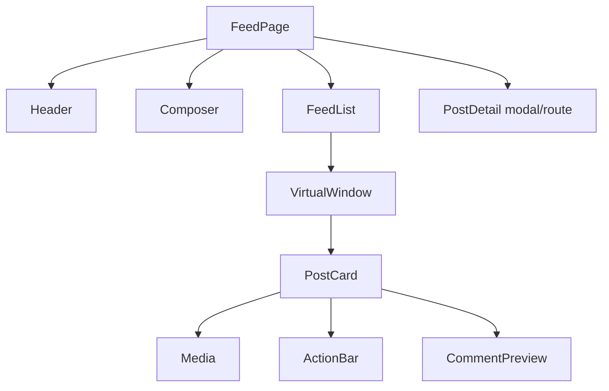
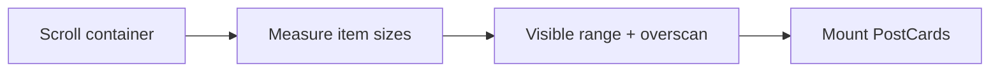

# News Feed UI

Frontend design for a social/home feed: infinite scroll, virtualization, media, and engagement actions.

## Requirements

### Functional

- Reverse-chronological or ranked feed
- Infinite scroll / load more
- Composer (text + image)
- Like / comment / share (comment thread can be deferred)
- Deep link to post

### Non-functional

- Smooth scroll on mid-tier mobile
- Fast first contentful paint for above-the-fold posts
- Offline-tolerant read of cached page (optional)
- a11y: keyboard, SR announcements for new items sparingly

### Clarify

- Media density? Ads? Stories rail? Web SEO for public posts?

## Component architecture



| Component | Responsibility |
| --- | --- |
| `FeedPage` | Route, auth gate, providers |
| `Composer` | Local draft state; mutation |
| `FeedList` | Infinite query + virtualizer |
| `PostCard` | Memoized row; stable key `postId` |
| `Media` | Responsive image/video; LQIP |
| `ActionBar` | Optimistic like |

**State ownership:** feed pages in React Query; composer draft local; like optimistic in mutation cache.

## Data fetching & caching

```text
useInfiniteQuery(['feed', filter], fetchPage, { getNextPageParam: last => last.nextCursor })
```

- Cursor pagination (align with [BE News Feed](/backend-system-design/02-news-feed))
- `staleTime` ~ 30–60s; refetch on focus carefully (don’t jump scroll)
- Prefetch next page when user is N items from end
- Mutations: `onMutate` optimistic like → `onError` rollback → `invalidate` sparingly (patch cache in place)

**New posts while scrolling:** banner “N new posts” instead of prepending (preserves scroll position).

## Virtualization



- Variable height rows (text + media) → measure or estimate + correct
- Libraries: TanStack Virtual / `react-window` patterns
- Overscan ~3–5 items
- Don’t virtualize if feed is short (&lt;30) — complexity cost

**Images:** fixed aspect boxes to reduce layout shift (CLS).

## Performance budgets

| Metric | Target |
| --- | --- |
| LCP (first post media) | &lt; 2.5s on 4G |
| Scroll | 60fps; INP &lt; 200ms on like |
| Row mount | Avoid heavy Markdown parse on main thread — defer |
| Bundle | Feed route code-split from admin/settings |

Techniques: blurhash/LQIP, `loading="lazy"` below fold, priority on first 1–2 images, virtualize, memo `PostCard`, stable callbacks.

## Accessibility

- Feed as list: `role="feed"` + `article` per post (or list/listitem)
- Composer: labeled controls; Escape cancels
- Like button: `aria-pressed`
- Infinite scroll: also offer **Load more** button for keyboard/AT users
- Focus: opening post detail → focus heading; restore focus on close
- Reduced motion: disable autoplay video

## Realtime

- WS/SSE: “new posts available” signal → banner
- Don’t splice into virtual list blindly
- Presence of live reactions: throttle updates per card

## Error / empty / loading

| State | UI |
| --- | --- |
| Initial load | Skeletons matching PostCard layout |
| Empty | CTA to follow people |
| Page error | Retry on failed page; keep prior pages |
| Mutation fail | Toast + rollback |

## Interview Q&A

**Q: Why virtualize?**  
DOM/layout cost of thousands of cards kills scroll. Mount only viewport (+ overscan).

**Q: Offset vs cursor?**  
Offset drifts when new posts insert; cursor stable — same as backend.

**Q: How avoid scroll jump on prefetch?**  
Append below; never reorder above viewport; measure carefully.

**Q: SSR the feed?**  
SSR first page for LCP/SEO; hydrate then infinite scroll client-side.

## Common mistakes

- Rendering full history into the DOM
- Prefetch invalidating and resetting to top
- Autoplay muted video without user control
- Like count as only local state (lost on remount) without cache write

## Trade-offs

| Choice | Gain | Cost |
| --- | --- | --- |
| Infinite scroll | Engagement | Hard a11y/history |
| Paginated pages | Simple | More clicks |
| Optimistic like | Feels instant | Conflict rare rollback |
| Variable-height virtualizer | Accurate | More code |

Related: [BE News Feed](/backend-system-design/02-news-feed), [Machine coding infinite scroll](/machine-coding/03-infinite-scroll).
