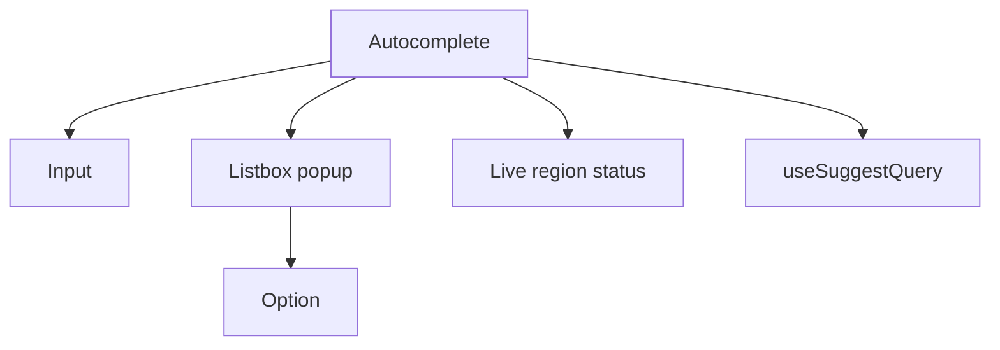

# Autocomplete UI

Typeahead / combobox: debounce, request races, keyboard a11y, and caching.

## Requirements

### Functional

- Suggest as user types (min chars)
- Keyboard: arrows, Enter, Escape, Home/End
- Mouse + touch select
- Optional: recent searches, categories, highlight match
- Submit → navigate to search results

### Non-functional

- Feels instant (&lt;100ms UI); network may be slower — show pending
- Cancel stale responses
- Works with screen readers (`combobox` pattern)
- Mobile: avoid janky keyboard resize issues

### Clarify

- Query suggest vs entity picker? Multi-select? Create-new option?

## Component architecture



| Piece | Role |
| --- | --- |
| Controlled input value | Source of truth for `q` |
| Highlighted index | Keyboard focus in list |
| Query hook | Debounced fetch + cache |
| Popup | Position (flip/shift), portal |

Prefer **WAI-ARIA Combobox** pattern (input + listbox).

## Data fetching & caching

```text
debouncedQ = useDeferredValue / debounce 200ms
useQuery(['suggest', debouncedQ], fetchSuggest, {
  enabled: debouncedQ.length >= 2,
  staleTime: 60_000,
  placeholderData: keepPreviousData
})
```

- **Debounce 150–300ms**; also **abort** prior fetch (`AbortController`)
- Cache by query string; warm popular prefixes
- Generation counter: ignore late responses if `q` changed
- Empty query → show recents from `localStorage` (privacy-aware)

Align with [BE Autocomplete](/backend-system-design/07-autocomplete).

## Race handling

```mermaid
sequenceDiagram
  participant U as User
  participant UI as Input
  participant N as Network
  U->>UI: a
  UI->>N: req a
  U->>UI: am
  UI->>N: abort a; req am
  N->>UI: am results
```

Never apply results for an outdated query.

## Performance budgets

| Budget | Target |
| --- | --- |
| Input → paint highlight | &lt; 16ms |
| Debounce | 200ms default |
| Bundle | Keep popup lightweight; no full page deps |
| List | Virtualize if &gt; 50 options |

`useDeferredValue` for highlighting large lists without blocking typing.

## Accessibility (critical)

```text
<input
  role="combobox"
  aria-expanded={open}
  aria-controls="listbox-id"
  aria-activedescendant={activeOptionId}
  aria-autocomplete="list"
/>
<ul id="listbox-id" role="listbox">
  <li role="option" aria-selected={...} id=...>
```

- Arrow keys move `aria-activedescendant` (don’t move DOM focus away from input — common pattern)
- Enter selects; Escape closes and optionally restores prior value
- Live region: “4 suggestions available” (debounced, not every key)
- Escape focus trap not needed if focus stays in input
- Color contrast on highlight; don’t use color alone

## UX details

- Loading indicator in field
- “No results” state
- IME composition: don’t debounce-break CJK (`compositionstart/end`)
- Mobile: full-screen suggest sheet optional
- Analytics: log selected index / query (privacy)

## Interview Q&A

**Q: Debounce vs throttle?**  
Debounce for suggest (wait until pause). Throttle for scroll handlers.

**Q: Why `aria-activedescendant`?**  
Keeps focus on input for typing while announcing active option.

**Q: Client filter vs server?**  
Client for tiny static lists; server for large/popularity-ranked corpora.

**Q: How to test races?**  
Mock slow fetch; type fast; assert only latest rendered.

## Common mistakes

- Focus moving into list items (breaks typing)
- No abort → flicker wrong results
- `mousedown` on option blurs input before click — use `preventDefault` on mousedown
- Announcing every keystroke to SR

## Trade-offs

| Choice | Gain | Cost |
| --- | --- | --- |
| Debounce longer | Less load | Feels laggy |
| Show previous results while loading | Stable UX | Brief mismatch |
| Client-only filter | Zero network | Weak ranking |
| Custom combobox | Control | a11y footguns — prefer solid headless (Downshift, React Aria) |

Related: [BE Autocomplete](/backend-system-design/07-autocomplete), [Design System](./04-design-system).
