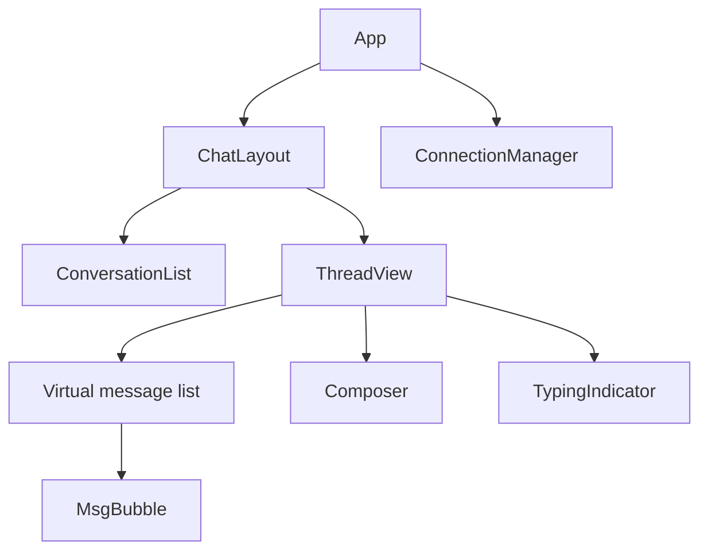

# Chat UI

Messaging client: connection state, optimistic sends, scroll anchoring, and virtualized history.

## Requirements

### Functional

- Conversation list + message thread
- Send text/media; retry failed
- Read receipts / typing (optional)
- Infinite scroll **up** for history
- Unread badges; deep link to conversation

### Non-functional

- Feels realtime when online; resilient offline queue
- Maintain scroll position when prepending history
- a11y: polite live regions, keyboard
- Battery-friendly: backoff WS reconnect

### Clarify

- Group chat? Threads? E2E? Markdown?

## Component architecture



| Module | Responsibility |
| --- | --- |
| `ConnectionManager` | WS lifecycle, resume cursor, reconnect |
| `ConversationList` | Query + unread sort |
| `ThreadView` | Messages infinite query + realtime merge |
| `Composer` | Local draft; send mutation |
| `MsgBubble` | Status ticks (pending/sent/failed) |

## Data fetching & caching

- Conversations: `useQuery` + realtime patch
- Messages: `useInfiniteQuery` **bi-directional** or pages of history with `getPreviousPageParam`
- Merge WS events into query cache by `conversationId`
- Dedupe by `serverMsgId` / `clientMsgId`
- Persist recent threads in IndexedDB for offline read (optional senior point)

Contracts: [BE Chat](/backend-system-design/03-chat).

## Optimistic send

```mermaid
sequenceDiagram
  participant U as User
  participant C as Cache
  participant API as API/WS
  U->>C: append pending clientMsgId
  C->>API: send
  alt ack
    API->>C: replace pending → confirmed
  else fail
    API->>C: mark failed; show retry
  end
```

## Scroll behavior

| Situation | Behavior |
| --- | --- |
| Open thread | Jump to bottom (last read) |
| New message, pinned to bottom | Autoscroll |
| User scrolled up | Show “New messages” pill |
| Load older | Preserve visual position (scroll anchoring / adjust `scrollTop` by height delta) |

Virtualize long threads; **stick to bottom** mode when `distanceFromBottom < threshold`.

## Performance budgets

| Budget | Target |
| --- | --- |
| Send → paint pending bubble | &lt; 50ms |
| History page fetch | Prefetch near top |
| WS parse | Batch incoming frames with `requestAnimationFrame` |
| Images in chat | Lazy; size caps |

## Accessibility

- Log: `role="log"` aria-live="polite" for new messages (throttle)
- Composer labeled; Ctrl/Cmd+Enter send
- Conversation list roving tabindex
- Don’t steal focus on every incoming message
- Status icons have text alternatives (“Sending”, “Failed”)

## Connection UX

```text
connected | reconnecting | offline
```

- Exponential backoff + jitter on WS
- Outbox queue while offline; flush on reconnect
- Resume with `lastReceivedId`

## Interview Q&A

**Q: How do you prepend history without jump?**  
Record height before fetch; after render set `scrollTop += newHeight - oldHeight` (or browser overflow-anchor).

**Q: Where does WS live?**  
Singleton connection in context/store; components subscribe to query cache updates.

**Q: Group typing storms?**  
Server coalesce; client show “Several people typing”.

**Q: Markdown/XSS?**  
Sanitize HTML; prefer safe subset renderer.

## Common mistakes

- Autoscroll fighting user reading history
- Re-rendering entire list on each WS tick
- No failed-send retry
- `aria-live` assertive on every message (noisy)

## Trade-offs

| Choice | Gain | Cost |
| --- | --- | --- |
| Virtualize | Scale long history | Sticky bottom complexity |
| Optimistic | Snappy | Ordering edge cases |
| IndexedDB cache | Offline | Sync complexity |
| Polling fallback | Simple networks | Latency/battery |

Related: [BE Chat](/backend-system-design/03-chat), [Machine coding chat](/machine-coding/07-chat-ui).
