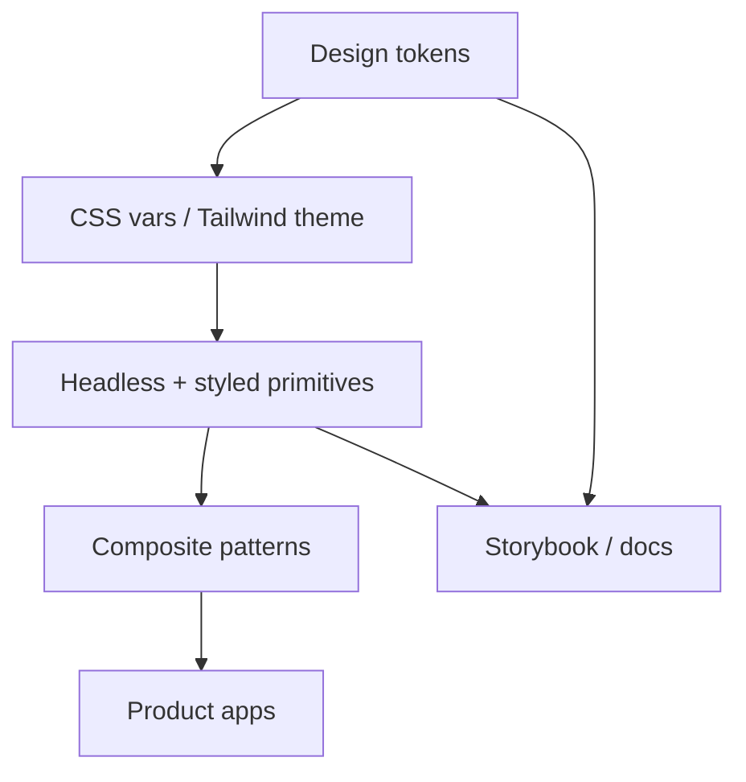
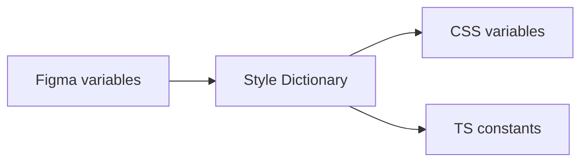
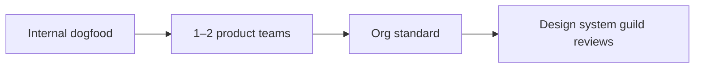

# Design System

Building a scalable UI kit: tokens, components, a11y contracts, versioning, and adoption.

## Requirements

### Functional

- Foundations: color, type, space, elevation, motion
- Primitives: Button, Input, Modal, Menu, Toast, …
- Patterns: Form field, empty state, page header
- Dark mode / themes; RTL-ready
- Docs site (Storybook) with do/don’t

### Non-functional

- a11y AA as default
- Tree-shakeable; minimal runtime
- Versioned releases; migration paths
- Multi-brand theming (optional)

### Clarify

- React-only? Web Components? Existing CSS framework?
- Product brands count?

## Architecture



### Layers

| Layer | Contents | Rule |
| --- | --- | --- |
| Tokens | `--color-bg`, `--space-2`, font sizes | No components |
| Primitives | Button, Icon, Checkbox | Fully a11y |
| Patterns | DateRangeField, ConfirmDialog | Compose primitives |
| Product | Features | May not skip down to raw HTML for core controls |

**Headless + style** (Radix/React Aria + design tokens) separates behavior from look.

## Token design

```text
primitive: blue.600
  → semantic: color.action.primary
    → component: button.bg
```

- Prefer **semantic** tokens in components (`--bg-danger`) over raw palettes
- Space scale: 4/8 base
- Type scale with rem; line-height tokens
- Motion: duration/easing; respect `prefers-reduced-motion`



## Component API principles

- Consistent props: `size`, `variant`, `isDisabled`, `isLoading`
- Polymorphic `asChild` / slots for composition
- Controlled + uncontrolled forms support
- Don’t expose too many variants — constrain the matrix

Example contract:

```ts
type ButtonProps = {
  variant?: 'primary' | 'secondary' | 'ghost' | 'danger'
  size?: 'sm' | 'md' | 'lg'
  isLoading?: boolean
  leftIcon?: ReactNode
} & ButtonHTMLAttributes<HTMLButtonElement>
```

## Accessibility (system-wide)

| Control | Must-have |
| --- | --- |
| Icon button | `aria-label` required in types |
| Modal | Focus trap, Escape, restore focus, `role="dialog"` |
| Menu | Arrow keys, typeahead |
| Toast | Live region; don’t only use color |
| Form | Error text linked via `aria-describedby` |

Lint: `eslint-plugin-jsx-a11y`; axe in Storybook CI.

## Theming & dark mode

- Class or `data-theme` on root flipping CSS variables
- Test contrast in both themes
- Avoid dual maintenance of separate component trees

## Performance budgets

| Budget | Target |
| --- | --- |
| Core primitives JS | Keep headless deps intentional |
| CSS | Prefer variables over huge utility dumps per app |
| Icons | SVG sprite / tree-shaken icon imports — no whole packs |

## Versioning & adoption

- Semver: tokens breaking → major
- Codemods for renames
- Deprecation window + dual-export
- “Escape hatch” documented (when to use custom CSS)



## Docs & governance

- Storybook: interactive props, a11y panel, visual regression
- Contribution RFC for new primitives
- Design–eng pairing on tokens

## Interview Q&A

**Q: Why tokens instead of hard-coded hex in components?**  
Themeability, consistency, single source for dark mode and multi-brand.

**Q: Build vs buy (MUI/Chakra)?**  
Buy for speed; wrap with tokens for brand. Build when differentiation + control matter — cost is a11y + maintenance.

**Q: How prevent one-off snowflakes?**  
Patterns library + design review + lint for raw `<button>` in product (gradual).

**Q: CSS-in-JS vs CSS variables?**  
Variables for theme runtime; CSS modules/Tailwind for structure — avoid runtime CSS-in-JS on hot paths if perf-critical.

## Common mistakes

- 40 button variants
- Shipping Modal without focus trap
- Tokens only in Figma, not code
- Breaking changes without codemod/migration notes
- Optional `aria-label` on icon-only buttons

## Trade-offs

| Choice | Gain | Cost |
| --- | --- | --- |
| Headless + custom style | Full brand control | Upfront work |
| Full component library | Speed | Override fights |
| Strict primitives only | Consistency | Slower feature UI |
| Multi-brand tokens | Scale | Complexity |

Related: [Autocomplete a11y](./02-autocomplete), [React optimization](/react/08-optimization).
