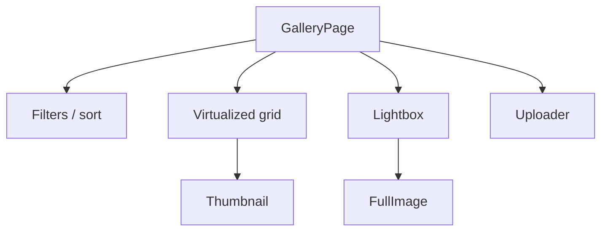
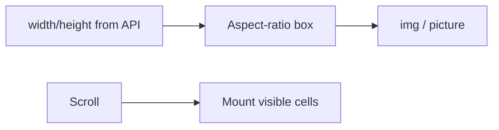

# Image Gallery

Grid/masonry gallery with lazy loading, responsive images, lightbox, and upload — performance-first.

## Requirements

### Functional

- Browse grid of images (filter/album)
- Lazy load; infinite scroll or pages
- Lightbox / detail with next-prev keyboard
- Optional upload with progress
- Shareable deep link to image

### Non-functional

- Excellent LCP for hero/first row
- Low CLS (reserved space)
- Memory-safe when scrolling thousands
- a11y lightbox focus trap

### Clarify

- Masonry vs fixed grid? Video? Editing? Public SEO?

## Component architecture

| Component | Notes |
| --- | --- |
| `Thumb` | `srcset`/`sizes`; blur placeholder |
| `Grid` | Window virtualization; fixed cell aspect preferred |
| `Lightbox` | Portal, focus trap, preload neighbors |
| `Uploader` | Pre-signed URL flow — see [BE File/CDN](/backend-system-design/06-file-cdn) |

## Data fetching & caching

- Infinite query of image metadata (`id`, `width`, `height`, `thumbUrl`, `fullUrl`)
- Prefetch next page near scroll end
- Lightbox open: ensure detail in cache; prefetch `i-1`, `i+1` full images
- Mutation upload → optimistic placeholder tile → replace on ready

## Layout & virtualization

- Prefer **uniform aspect** or known dimensions for cheap layout
- Masonry: harder to virtualize — mention trade-off; use libraries or CSS columns for small sets
- `content-visibility: auto` as progressive enhancement

## Images performance

| Technique | Why |
| --- | --- |
| CDN + responsive variants | Bytes on wire |
| `srcset` + `sizes` | DPR/viewport fit |
| Blurhash / LQIP | Perceived perf + CLS |
| `fetchpriority="high"` on LCP image | First row only |
| `loading="lazy"` below fold | Browser-native |
| AVIF/WebP with fallback | Compression |
| Immutable URLs | Cache forever |

**Never** load full 4K into grid thumbs.

## Performance budgets

| Metric | Target |
| --- | --- |
| LCP | &lt; 2.5s — optimize first visible image |
| CLS | ~0 — aspect boxes always |
| Memory | Virtualize; revoke object URLs on upload preview |
| Lightbox open | &lt; 200ms to interactive chrome |

## Accessibility

- Grid: each thumb a `<button>` or link with meaningful `alt` (filename fallback last resort)
- Lightbox: `role="dialog"`, focus trap, Escape closes, arrows next/prev
- Announce “Image 3 of 40”
- Respect reduced motion for transitions
- Don’t rely on color alone for “selected”

## Uploader UX

- Drag-drop + file picker; accept types/size client-side
- Parallel uploads with limit (e.g. 3)
- Progress per file; retry failed
- Virus scan pending state from backend status polling

## Interview Q&A

**Q: Masonry vs grid in interviews?**  
Grid + known aspect is easier to virtualize and CLS-safe. Masonry is prettier but costlier — state the trade-off.

**Q: How prevent CLS?**  
Width/height or CSS `aspect-ratio` before image loads.

**Q: SSR?**  
SSR first row HTML with correct `srcset` for LCP; rest client.

**Q: Why not CSS `background-image` for thumbs?**  
Harder `alt`/SEO; prefer ``/`<picture>`.

## Common mistakes

- Same huge URL for thumb and lightbox
- No virtualization on “view all 10k”
- Lightbox without focus management
- Object URLs leaked after upload
- Lazy-loading the LCP image

## Trade-offs

| Choice | Gain | Cost |
| --- | --- | --- |
| Fixed grid | Perf, CLS | Less “Pinterest” |
| Masonry | Aesthetics | Complex virtualization |
| Client crop | Control | CPU/battery |
| On-the-fly CDN transforms | Flexible | Vendor lock-in |

Related: [BE File/CDN](/backend-system-design/06-file-cdn), [Feed media](./01-feed).
