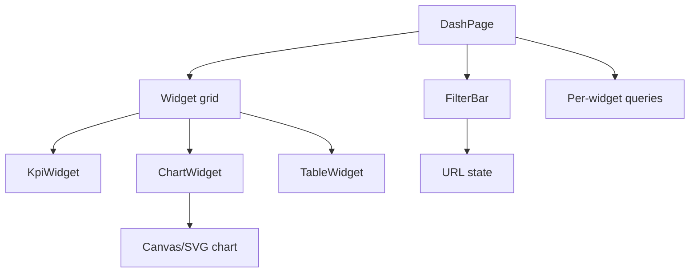
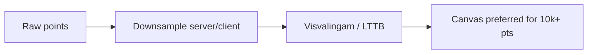

# Dashboard / Analytics UI

Data-dense admin/analytics: widgets, charts, filters, and performance under heavy series data.

## Requirements

### Functional

- Dashboard of widgets (KPIs, charts, tables)
- Global time range + filters in URL
- Drill-down; export CSV (optional)
- Customizable layout (drag widgets) — park if time-boxed
- Role-based widget visibility

### Non-functional

- Interactive charts without freezing main thread
- Consistent loading per widget (not one giant spinner)
- Accurate timezone / comparison ranges
- a11y: tables first; charts have text alternatives

### Clarify

- Realtime metrics vs batch? Multi-tenant? Mobile needed?

## Component architecture



| Piece | Responsibility |
| --- | --- |
| `FilterBar` | Time range, cohort → URL sync |
| `Widget` | Own suspense/error boundary + query |
| `ChartWidget` | Downsample; progressive load |
| `TableWidget` | Virtualized rows; sort/page |

**Isolation:** one widget error must not blank the dashboard (`ErrorBoundary` per widget).

## Data fetching & caching

```text
queryKey: ['metrics', widgetId, range, filters]
```

- Parallel widget queries; shared range key for dedupe
- `staleTime` aligned with data freshness (5m for business analytics)
- Prefetch on hover of drill-down links
- Heavy export: async job + download link (not in-browser for huge sets)
- Avoid one monolithic “dashboard API” if widgets fail independently — BFF batch OK with partial responses

**Compare mode:** `range` + `previousRange` as explicit params.

## Charts performance



| Technique | When |
| --- | --- |
| Server aggregation | Always for long ranges |
| Client downsample | Still too many points |
| Canvas chart | High point count |
| SVG | Sparse data, a11y annotations easier |
| Web Worker | Parse/downsample off main thread |

Don’t ship 100k points to the browser “for fidelity.”

## Virtualization & tables

- Large tables: virtual rows + sticky header
- Column virtualization for very wide datasets
- Sort/filter server-side when dataset &gt; few thousand

## Performance budgets

| Budget | Target |
| --- | --- |
| TTI dashboard shell | Fast; widgets stream in |
| Chart interaction | INP &lt; 200ms |
| Main thread | No long tasks &gt; 50ms on filter change |
| Bundle | Code-split chart libraries per route |

Filter changes: `startTransition` / deferred value so typing in filter doesn’t jank.

## Accessibility

- KPI: text, not color alone (include delta text)
- Chart: summary table toggle or `aria-description` with key stats
- Don’t rely on hover-only tooltips — keyboard focusable points or table fallback
- Filter controls labeled; time zone displayed explicitly
- Motion: optional disable chart animations

## Layout / UX

- Skeletons sized to widget
- Empty: “No data in range”
- Partial failure: widget-level retry
- URL shareability of exact dashboard state
- Dense mode vs comfortable spacing

## Interview Q&A

**Q: One request vs many?**  
Many = resilience + cache granularity; batch BFF when HTTP/1 multiplexing hurts. HTTP/2+ makes parallel fine.

**Q: Redux for filters?**  
URL is better for share/reload; local UI for ephemeral.

**Q: How realtime?**  
Poll 30–60s or SSE for KPIs; avoid re-rendering all charts every tick — update series immutably and throttle.

**Q: Timezones?**  
Store UTC; display in org/user TZ; show zone in UI to avoid “off by one day” support tickets.

## Common mistakes

- Single page-level spinner for 12 widgets
- Rendering full-resolution series in SVG
- Filters only in memory (not shareable)
- Chart-only without tabular fallback
- Drag-layout before data loading works

## Trade-offs

| Choice | Gain | Cost |
| --- | --- | --- |
| Widget-level fetch | Isolation | More requests |
| Fixed dashboards | Simple | Less personalization |
| Canvas charts | Perf | Harder a11y |
| Client downsample | Flexible | CPU + accuracy loss |

Related: [FE Observability](./07-observability), [Optimized table](/machine-coding/08-optimized-table).
