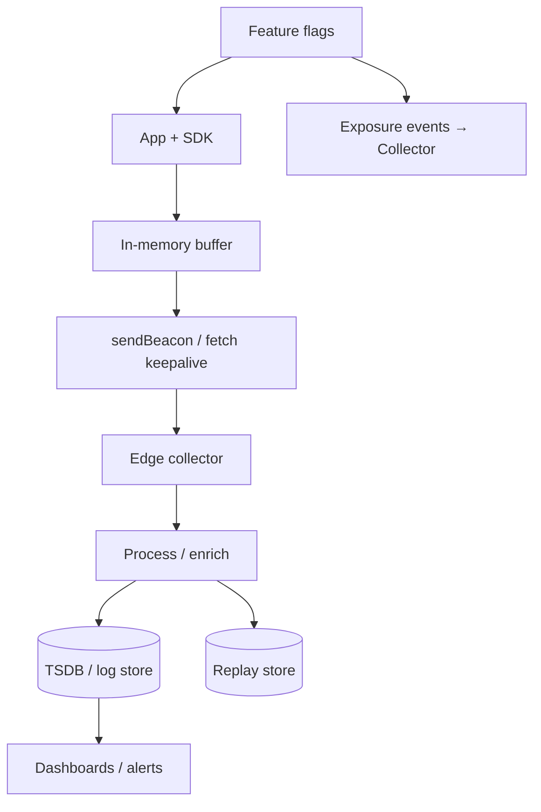
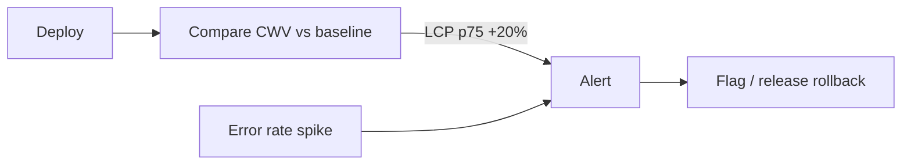

# Frontend Observability

Instrumenting the client: Core Web Vitals, errors, replays, feature flags, and privacy — as an FE system design topic.

## Requirements

### Functional

- Collect CWV (LCP, INP, CLS) and custom marks
- JavaScript error + unhandled rejection reporting
- Optional session replay / breadcrumbs
- Correlate with `trace_id` / user/session (careful PII)
- Feature flag exposure events
- Dashboards + alerts for regressions

### Non-functional

- Ultra-low overhead (must not worsen INP)
- Reliable delivery (beacon / batch)
- Privacy & consent compliant
- Sample high-volume events

### Clarify

- First-party only? GDPR regions? SPA vs MPA/Next?

## Architecture



## What to measure

| Category | Examples |
| --- | --- |
| CWV / RUM | LCP, INP, CLS, TTFB |
| Runtime | JS errors, source maps |
| Nav | Route changes, soft navigations |
| Product | Funnel events, convert |
| Health | API latency from client, empty/error UI rates |
| Flags | Which variant was seen |

Use **PerformanceObserver**, `web-vitals` library patterns, and framework hooks (Next analytics).

## Component / SDK architecture

```text
initObservability({ appId, sampleRate, consent })
  → listeners (error, vitals, nav)
  → enrich (release, route, device)
  → sample / filter PII
  → queue → flush
```

- Singleton SDK; tree-shake adapters
- Wrap `fetch` optionally for API timing (careful double-count with OTel)
- ErrorBoundary → `reportError(error, componentStack)`

## Data model (events)

```text
{
  type: "cwv.lcp",
  value: 2410,
  route: "/feed",
  release: "web@1.4.2",
  navigationType: "navigate",
  sessionId: "anon_...",
  traceId: "...",
  ts: 1710000000
}
```

Schema versioning; backend rejects PII fields via scrubbing.

## Transport & sampling

| Technique | Why |
| --- | --- |
| `sendBeacon` / `fetch(keepalive)` | Survive page unload |
| Batch every N sec / N events | Overhead control |
| Sample errors 100%, vitals 10–100% by traffic | Cost |
| Head sampling + tail sample rare slow pages | Signal |

## Performance budgets (dogfooding)

| Budget | Target |
| --- | --- |
| SDK main-thread | &lt; 5ms init; idle flush |
| Payload | Compress; cap replay size |
| Third-party | Prefer first-party proxy to cut main-thread contention |

Observability must not become the regression.

## Privacy & security

- Consent gate before replay / analytics cookies
- Scrub inputs, tokens, emails from breadcrumbs and replay
- `Authorization` headers never logged
- IP anonymization at collector
- Retention limits; DPA with vendors if any

## Alerting & workflows



- Alert on **p75 LCP/INP** by route, not only averages
- Source maps in secure store for symbolication
- Tie to release version + feature flag state

## Feature flags intersection

- Log exposures for experiment analysis
- Avoid flicker: evaluate flags before paint when possible (bootstrap)
- Kill switches for broken clients

## Interview Q&A

**Q: Why RUM if you have Lighthouse in CI?**  
Lab ≠ field. Devices, networks, geo — RUM catches real regressions.

**Q: INP vs old FID?**  
INP measures responsiveness across interactions; better product signal.

**Q: How correlate FE error to BE trace?**  
Propagate `traceparent` on API calls; attach same id to error events.

**Q: Session replay cost/privacy?**  
Sample; mask; consent; often enterprise-only.

**Q: Soft navigations (SPA)?**  
Track route changes as custom nav; emerging CWV soft-nav APIs — measure carefully.

## Common mistakes

- Logging PII “for debug”
- 100% replay on all sessions
- Synchronous `localStorage` thrash on every event
- Alerting on raw error counts without release normalization
- Blocking main thread with heavy serialization

## Trade-offs

| Choice | Gain | Cost |
| --- | --- | --- |
| Full RUM + replay | Debug power | Privacy/cost |
| First-party collector | Control | Ops |
| Vendor SDK | Speed | Main-thread + lock-in |
| High sample rate | Confidence | $$ |

Related: [Dashboard UI](./06-dashboard), [Backend observability](/backend/09-observability), [Browser performance](/browser/09-optimization).
