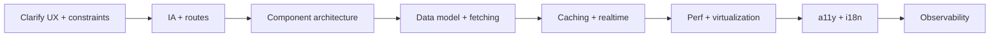

# Frontend System Design — Interview Framework

How to run an FE / full-stack UI system design round: component architecture, data, performance, and a11y — not just pretty boxes.

## What interviewers score

| Signal | Strong answer |
| --- | --- |
| Product clarity | MVP scope, devices, offline, realtime |
| Component tree | Smart containers vs presentational; state ownership |
| Data fetching | Caching, pagination, invalidation, races |
| Performance | Budgets, virtualization, images, JS weight |
| Accessibility | Keyboard, SR, focus, contrast — not an afterthought |
| Resilience | Error/empty/loading; optimistic UI rollback |

> [!TIP]
> Structure: **5m clarify → 10m information architecture + wire components → 15m data/caching → 10m perf/a11y → 5m follow-ups.**

## Step-by-step framework

### 1. Clarify

- Users & critical flows (happy path + empty/error)
- Web / mobile web / responsive breakpoints
- Auth? Realtime? Offline? SEO?
- Performance budgets (LCP, INP, bundle)
- Design system constraints (existing components?)

### 2. Information architecture

Routes, navigation, deep links, URL as state (`?q=`, filters).

### 3. Component architecture

Draw tree. Mark:

- **Server vs client** components (if React/Next)
- **State owners** (URL, server cache, local UI state)
- **List virtualization** boundaries
- **Suspense / loading** boundaries

### 4. Data fetching & caching

- Initial: SSR/RSC vs CSR vs hydrate
- Lists: cursor pagination + infinite query
- Mutations: optimistic + rollback + invalidate
- Deduping, stale-while-revalidate (React Query / SWR patterns)
- Race: abort controllers / generation counters

### 5. Performance

Budgets example: **JS &lt; 200KB gz critical**, **LCP &lt; 2.5s**, **INP &lt; 200ms**, feed scroll **60fps**.

Tools in answer: virtualize, code-split, image CDN, `content-visibility`, defer non-critical.

### 6. Accessibility

- Semantic HTML first
- Keyboard: tab order, Escape, arrows for widgets
- ARIA only when needed (`combobox`, `listbox`, `dialog`)
- Focus management on route/dialog open/close
- Live regions for toasts / new messages

### 7. Observability

RUM (CWV), error reporting, feature flags — see [Observability](./07-observability).

## Recurring FE patterns

| Pattern | Use |
| --- | --- |
| Container / presentational | Testable UI; clear data boundary |
| Headless hooks + styled leaves | Design system scale |
| Virtual list/grid | Long feeds, tables, logs |
| Windowed infinite scroll | Feeds/chat |
| Optimistic UI | Likes, send message |
| Skeleton / content placeholder | Perceived perf |
| Error boundary | Isolate widget crashes |

## State placement cheat sheet

| State | Where |
| --- | --- |
| Filters, page, selected id | **URL** |
| Server entities | **Query cache** (React Query) |
| Ephemeral UI (open menu) | **Local useState** |
| Cross-cutting session | **Auth context** (thin) |
| Draft form | Local / resumable storage |

Avoid dumping everything in global Redux “because scale.”

## How to use this part

| # | Design | Focus |
| --- | --- | --- |
| 1 | [News Feed UI](./01-feed) | Infinite scroll, virtualization, media |
| 2 | [Autocomplete](./02-autocomplete) | Debounce, a11y combobox, races |
| 3 | [Chat UI](./03-chat) | WS, scroll anchoring, optimistic send |
| 4 | [Design System](./04-design-system) | Tokens, a11y, versioning |
| 5 | [Image Gallery](./05-image-gallery) | Layout, lazy, lightbox |
| 6 | [Dashboard](./06-dashboard) | Charts, widgets, data density |
| 7 | [FE Observability](./07-observability) | CWV, errors, replay |

Cross-link [Backend SD](/backend-system-design/index) when the prompt is full-stack.

## Interview Q&A — framework

**Q: How is FE system design different from BE?**  
Same clarity and trade-offs, but center on **UX states, rendering cost, network waterfall, and a11y** — not shard keys (unless full-stack).

**Q: Do you draw the backend?**  
Boxes only as needed for contracts (REST/WS). Don’t spend 20m on Kafka unless asked.

**Q: Redux or React Query?**  
Server state → Query; client UI state → local/context. Redux when complex client workflows need time-travel/debug.

## Common mistakes

- Pixel-perfect mock discussion with no data flow
- Ignoring loading/error/empty
- “We’ll virtualize later” on a 10k list
- Zero a11y until the interviewer asks
- Mega Context causing tree-wide rerenders

## Trade-offs (meta)

| Choice | Gain | Cost |
| --- | --- | --- |
| CSR SPA | Simple deploy | SEO, TTFB/LCP |
| SSR/RSC | Fast first paint | Complexity, cache |
| Optimistic UI | Snappy | Conflict UX |
| Heavy client cache | Fewer round-trips | Stale / memory |
