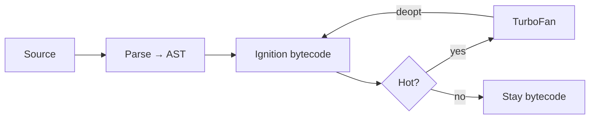
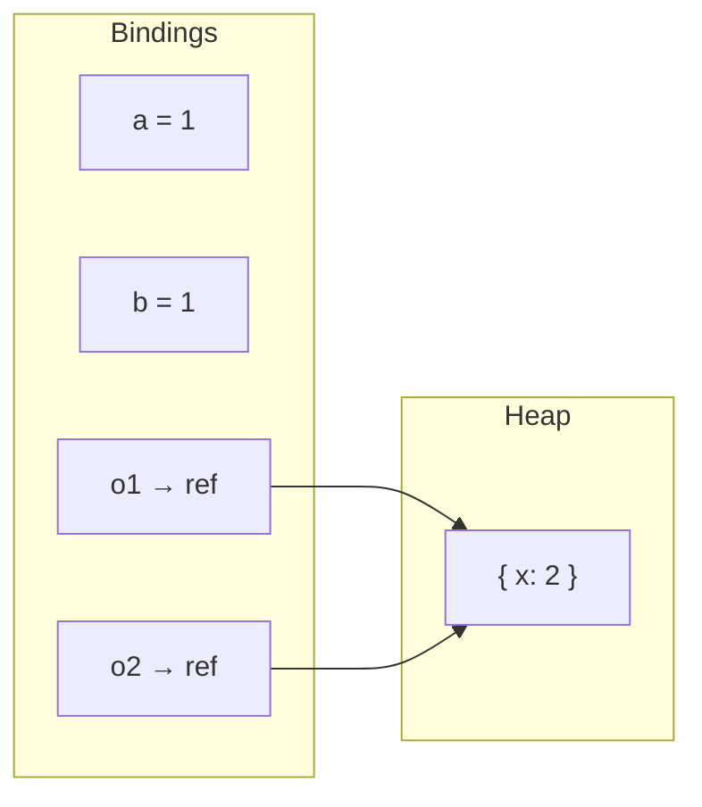
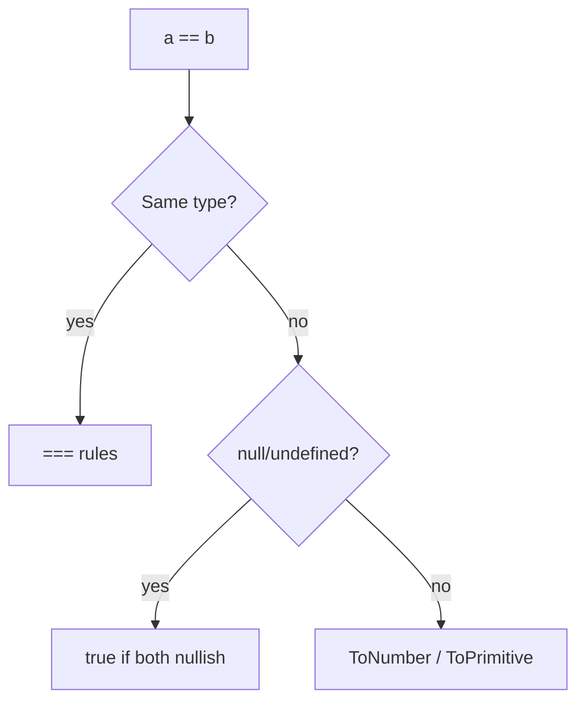

# Fundamentals Revisited

Types, coercion, equality, value vs reference, and engine basics — traps that still show up in senior screens.

## Engine vs runtime (30-second version)

| | ECMAScript (language) | Runtime / host |
| --- | --- | --- |
| Defines | Syntax, types ops, `Promise`, `Array` | `fetch`, `fs`, `setTimeout`, DOM |
| Event loop | Job queues (microtasks) | Tasks, I/O, rendering |
| Examples | V8 / SpiderMonkey / JavaScriptCore | Browser, Node, Deno, Bun |



Related: [V8](/node/07-v8), [Memory](/javascript/12-memory), [Event Loop](/javascript/10-event-loop).

---

## Primitive vs Object

| Category | Types | Compared by |
| --- | --- | --- |
| Primitive | `string`, `number`, `bigint`, `boolean`, `undefined`, `symbol`, `null` | Value |
| Object | plain objects, arrays, functions, dates, maps, … | Identity (reference) |

```ts
const a = 1
const b = a // copy of value

const o1 = { x: 1 }
const o2 = o1
o2.x = 2 // o1.x === 2 — same heap object
```

`typeof null === "object"` is a legacy bug. Treat `null` as a primitive in interviews; explain the quirk if asked.



## `typeof` cheat sheet

```ts
typeof undefined        // "undefined"
typeof null             // "object"  ← quirk
typeof true             // "boolean"
typeof 42               // "number"
typeof 42n              // "bigint"
typeof "hi"             // "string"
typeof Symbol()         // "symbol"
typeof {}               // "object"
typeof []               // "object"
typeof (() => {})       // "function"
```

Prefer `Array.isArray`, `value == null` for nullish checks, and narrowing helpers over raw `typeof` for domain types.

---

## Coercion — ToPrimitive / ToNumber / ToBoolean

```ts
Number("")          // 0
Number("  ")        // 0
Number("1e2")       // 100
Number(true)        // 1
Number(null)        // 0
Number(undefined)   // NaN
Number([])          // 0
Number([1, 2])      // NaN
Number({})          // NaN

Boolean(0)          // false
Boolean("")         // false
Boolean([])         // true  ← empty array is truthy
Boolean({})         // true
```

Falsy set (exactly): `false`, `0`, `-0`, `0n`, `""`, `null`, `undefined`, `NaN`.

### `Symbol.toPrimitive`

```ts
const money = {
  amount: 10,
  [Symbol.toPrimitive](hint: string) {
    if (hint === "string") return `$${this.amount}`
    return this.amount
  },
}

String(money) // "$10"
Number(money) // 10
money + 5     // 15
```

---

## Equality: `==` vs `===` vs `Object.is`

```ts
NaN === NaN           // false
Object.is(NaN, NaN)   // true
+0 === -0             // true
Object.is(+0, -0)     // false

null == undefined     // true
"0" == 0              // true
[] == false           // true
```



**Production rule:** `===` by default. Use `== null` only for intentional nullish checks. Use `Object.is` for `NaN` / signed zero.

---

## Boxing (autoboxing)

```ts
"hi".toUpperCase() // temporary String wrapper
const s = new String("hi")
typeof s            // "object"
s === "hi"          // false
```

Never use `new String` / `new Number` / `new Boolean` — identity surprises (`new Boolean(false)` is truthy).

---

## Pass-by-value of the reference

JS always passes the binding's value. For objects, that value is a reference.

```ts
function reassign(obj: { n: number }) {
  obj = { n: 99 } // local only
}
function mutate(obj: { n: number }) {
  obj.n = 99
}

const x = { n: 1 }
reassign(x) // still 1
mutate(x)   // 99
```

---

## `const` / `let` / `var`

| Keyword | Scope | Hoist | Redeclare | Rebind |
| --- | --- | --- | --- | --- |
| `var` | function | yes (`undefined`) | yes | yes |
| `let` | block | TDZ | no | yes |
| `const` | block | TDZ | no | no |

`const` freezes the **binding**, not the value:

```ts
const user = { id: 1 }
user.id = 2 // ok
```

Deep immutability → `Object.freeze` (shallow) or Immer — retention notes in [Memory](/javascript/12-memory).

---

## Symbols

```ts
Symbol("id") === Symbol("id") // false
Symbol.for("app.id") === Symbol.for("app.id") // true
```

Well-known symbols (`iterator`, `toPrimitive`, `toStringTag`) are language extension points.

---

## Numbers — IEEE-754 traps

```ts
0.1 + 0.2 === 0.3           // false
Number.MAX_SAFE_INTEGER + 1 === Number.MAX_SAFE_INTEGER + 2 // true
Number.isNaN("x" as never)  // false
isNaN("x")                  // true
```

Use `bigint` for integer IDs beyond safe range; never mix `bigint` + `number` with `+` without conversion.

---

## Structured clone vs JSON

```ts
structuredClone({ d: new Date(), n: 1n }) // OK
JSON.parse(JSON.stringify({ d: new Date() })) // string date; bigint throws
```

Same algorithm family as `postMessage` / IndexedDB — fails on functions / DOM nodes.

---

## Stable shapes & deopt (hot path)

```ts
function add(a: number, b: number) {
  return a + b
}
for (let i = 0; i < 1e6; i++) add(i, i) // monomorphic → JIT
// add("x" as never, 1) // megamorphic / deopt risk
```

Interview signal: engines optimize for stable types and object shapes.

---

## Interview Questions

**Q: Difference between `null` and `undefined`?**  
`undefined` = uninitialized / missing. `null` = intentional empty. `typeof` differs; `==` equates them.

**Q: Why is `[] == ![]` true?**  
`![]` → `false`. `[] == false` → both ToNumber → `0 == 0`.

**Q: Is JS pass-by-reference?**  
No. Pass-by-value; object values are references. Mutating through the reference is visible; rebinding the parameter is not.

**Q: ECMAScript vs JavaScript?**  
ECMAScript = language standard. JS = engine + host APIs.

**Q: Interpreted or compiled?**  
Both — bytecode interpreter + JIT for hot paths; can deoptimize.

**Q: When `Object.is`?**  
`NaN` equality or distinguishing `+0` / `-0`.

## Common Mistakes

- Treating empty arrays / objects as falsy.
- Using `==` with mixed types in conditionals.
- Assuming `const` deep-freezes objects.
- Relying on `typeof` for arrays / null.
- Confusing language features with host APIs (`fetch`, `require`).
- Micro-optimizing before stable shapes / real profiles.

## Trade-offs / Production Notes

- Strict equality everywhere; document rare `== null`.
- Explicit parsers at API boundaries (Zod / `Number.parseInt(s, 10)`).
- Money / IDs: integers as strings or `bigint`, never float.
- Serverless: cold start ↔ bundle size ↔ JIT warm-up.
- Related: [Hoisting](/javascript/04-hoisting), [Objects](/javascript/14-objects), [Numbers](/javascript/17-numbers).
