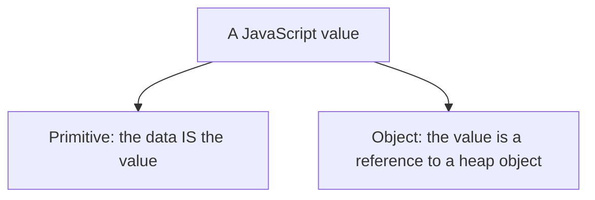
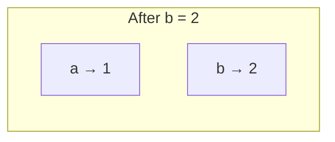
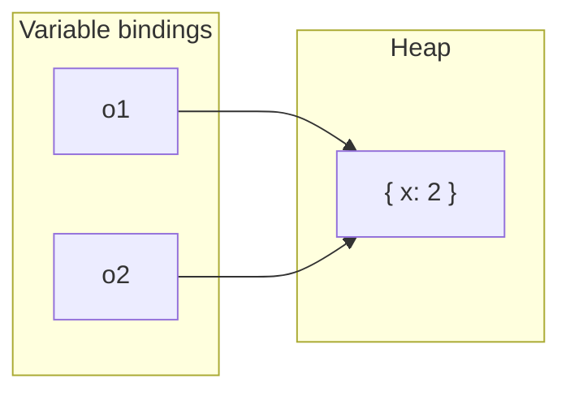
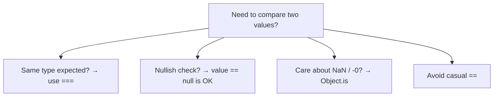
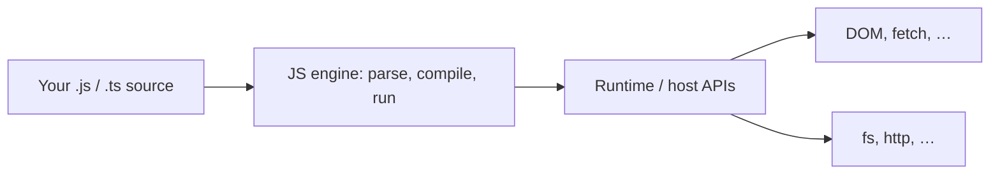
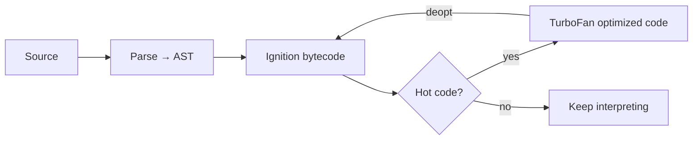

# Fundamentals

This chapter teaches JavaScript’s building blocks from scratch. You do not need to already know “primitives,” “coercion,” or “pass by reference.” By the end you should be able to explain **what kinds of values exist**, **how `typeof` and equality really work**, **why changing an object through one variable can surprise another**, and **what the engine vs the runtime each do**.

---

## 1. The problem this chapter solves

You write:

```ts
console.log(1 + "2")   // "12"
console.log(1 - "2")   // -1
console.log([] + [])   // ""
console.log({} + [])   // ?  (depends how you run it)
```

Same language, wildly different results. Or:

```ts
const a = { n: 1 }
const b = a
b.n = 2
console.log(a.n) // 2 — wait, I only changed `b`?
```

These are not random bugs. They follow rules. The rules feel strange until you have a clear mental model of:

1. **What a value is** (number vs object, etc.)
2. **How values move** (copy the value vs share the same object)
3. **When JavaScript silently converts** one type into another (coercion)
4. **How equality compares** those values
5. **Who runs your code** (engine) and **who provides browser/Node APIs** (runtime)

This chapter builds those models slowly.

---

## 2. Values: the only thing your program manipulates

A **value** is a piece of data your program can hold, pass, and return. Examples:

- the number `42`
- the text `"hello"`
- the boolean `true`
- “nothing here” (`null` / `undefined`)
- a bag of named fields `{ name: "Ada" }`
- a list `[1, 2, 3]`
- a function (yes — functions are values too)

Every expression evaluates to a value. Every variable holds a value (or, for objects, a **reference** to a value — we unpack that later).

Plain-language split that matters forever:

| Kind | Everyday meaning | Examples |
| --- | --- | --- |
| **Primitive** | A single, simple piece of data. Copying it copies the data itself. | numbers, strings, booleans, `null`, `undefined`, `symbol`, `bigint` |
| **Object** | A structured thing in memory that can have properties. Variables hold a **pointer** to it. | `{}`, `[]`, functions, `Date`, `Map`, … |

You will hear “primitive vs object” constantly. That table is what it means.



---

## 3. The seven primitive types — one by one

ECMAScript defines these primitives:

1. `undefined`
2. `null`
3. `boolean`
4. `number`
5. `bigint`
6. `string`
7. `symbol`

### 3.1 `undefined` — “no value was assigned”

```ts
let x
console.log(x) // undefined

function f(a?: number) {
  console.log(a) // undefined if caller omitted `a`
}
f()
```

`undefined` means: this binding exists, but nobody put a meaningful value in it (or a function returned nothing).

### 3.2 `null` — “intentionally empty”

```ts
let user: { name: string } | null = null
// We deliberately say: there is no user object right now
```

People confuse `null` and `undefined`. A useful distinction:

- **`undefined`**: not set / missing / forgotten
- **`null`**: set to “empty on purpose”

Both are falsy. Both mean “no real content.” Interviews often ask you to explain the difference and the `typeof` quirk below.

### 3.3 `boolean` — true or false

```ts
const ok = true
const fail = false
```

Later, **any** value can be treated as true/false in an `if` — that conversion is called **ToBoolean** (section 7).

### 3.4 `number` — IEEE-754 floating point

```ts
const a = 1
const b = 0.1 + 0.2
console.log(b)           // 0.30000000000000004
console.log(b === 0.3)   // false
```

Almost all “numbers” in JS are 64-bit floats. That is why money and precise decimals need care (`Number`, libraries, or integers via `bigint` / cents).

Special number values:

```ts
console.log(1 / 0)        // Infinity
console.log(-1 / 0)       // -Infinity
console.log(Number("x"))  // NaN  (Not a Number)
console.log(NaN === NaN)  // false!
```

`NaN` is a number type that means “this numeric operation failed.” It is not equal to itself — use `Number.isNaN(x)`.

### 3.5 `bigint` — integers of arbitrary size

```ts
const huge = 9007199254740993n // note the `n`
console.log(huge + 1n)
// console.log(huge + 1) // TypeError: cannot mix BigInt and Number
```

### 3.6 `string` — text

```ts
const name = "Ada"
const greeting = `Hello, ${name}` // template literal
```

Strings are primitives. They are **immutable**: methods like `toUpperCase()` return a **new** string; they do not change the original.

### 3.7 `symbol` — unique hidden labels

```ts
const a = Symbol("id")
const b = Symbol("id")
console.log(a === b) // false — each Symbol() call makes a new unique value
```

Used for property keys that should not collide with normal string keys. You will meet them more in the [Objects](/javascript/14-objects) chapter.

---

## 4. Objects — everything else

If it is not one of the seven primitives, it is an **object** (for day-to-day mental models):

```ts
const person = { name: "Ada", age: 36 } // plain object
const nums = [1, 2, 3]                   // array (specialized object)
const fn = function () {}                // function (callable object)
const d = new Date()                     // Date instance
```

Objects:

- live on the **heap** (a region of memory for longer-lived structured data)
- have **properties** (named slots)
- are compared and shared by **identity** (same object in memory?), not by “looks the same”

```ts
console.log({ a: 1 } === { a: 1 }) // false — two different objects
const x = { a: 1 }
const y = x
console.log(x === y)               // true — same object
```

---

## 5. `typeof` — asking “what kind is this?”

`typeof` returns a string describing the type of a value.

### 5.1 Slow walkthrough

```ts
typeof undefined        // "undefined"
typeof true             // "boolean"
typeof 42               // "number"
typeof 42n              // "bigint"
typeof "hi"             // "string"
typeof Symbol("x")      // "symbol"
typeof {}               // "object"
typeof []               // "object"   ← arrays are objects
typeof function () {}   // "function" ← special case of object
typeof null             // "object"   ← famous historical bug
```

### 5.2 Why `typeof null === "object"`?

Early JavaScript represented values with type tags. The tag for objects was `0`, and `null` was represented as the null pointer (`0`). So `typeof` reported `"object"`. The language kept the bug for compatibility.

**Interview answer:** Treat `null` as a primitive conceptually; explain that `typeof null` is a legacy quirk returning `"object"`.

### 5.3 Safer checks you will actually use

```ts
function isNullish(v: unknown): v is null | undefined {
  return v == null // true for null OR undefined (loose equality on purpose)
}

Array.isArray([1, 2])           // true
value === null                  // only null
typeof value === "function"     // callable check (imperfect but common)
```

Do not rely on `typeof` alone for “is this a plain object?” — arrays and `null` both confuse it.

---

## 6. Value vs reference — the core memory model

### 6.1 Primitives: copying copies the data

```ts
let a = 1
let b = a  // copy the number 1 into b
b = 2
console.log(a) // 1 — untouched
console.log(b) // 2
```



`a` and `b` are independent.

### 6.2 Objects: copying copies the reference

```ts
let o1 = { x: 1 }
let o2 = o1   // copy the *reference*, not a deep clone of the object
o2.x = 2
console.log(o1.x) // 2
```



Both variables point at the **same** heap object. Mutating through either name changes what both see.

### 6.3 Rebinding vs mutating

```ts
let o1 = { x: 1 }
let o2 = o1

o2 = { x: 99 }     // rebinding: o2 now points elsewhere
console.log(o1.x)  // 1 — o1 unchanged

o1 = { x: 1 }
o2 = o1
o2.x = 99          // mutating: same object
console.log(o1.x)  // 99
```

This distinction shows up everywhere: React state updates, Redux, function arguments, closures.

### 6.4 “Pass by value” — of what?

JavaScript always passes **by value**. For objects, the value being passed is a **reference** (a pointer-like handle).

```ts
function bump(n: number) {
  n = n + 1
}

let x = 10
bump(x)
console.log(x) // 10 — the function got a copy of 10

function setName(user: { name: string }) {
  user.name = "Grace" // mutate the shared object
}

const u = { name: "Ada" }
setName(u)
console.log(u.name) // "Grace"

function replace(user: { name: string }) {
  user = { name: "Other" } // rebinds local parameter only
}

replace(u)
console.log(u.name) // still "Grace"
```

**Phrase to use:** “Pass by value of the reference” for objects — not “pass by reference” in the C++ sense (which would let you rebind the caller’s variable).

Related: [Memory](/javascript/12-memory), [Objects](/javascript/14-objects).

---

## 7. Coercion — silent conversion between types

**Coercion** means: JavaScript converts a value from one type to another because an operation needs a specific type.

Example problem:

```ts
"5" - 2  // needs numbers → 3
"5" + 2  // `+` with a string prefers string concat → "52"
```

### 7.1 Why coercion exists

JS was designed to be forgiving in browsers: `"5"` from an input field should still work with math. That convenience creates footguns. Prefer being **explicit** in application code; still **understand** coercion for interviews and legacy code.

### 7.2 ToBoolean — truthy and falsy

In `if (value)`, JS converts `value` to boolean.

**Falsy values** (become `false`):

```ts
false
0
-0
0n
""
null
undefined
NaN
```

**Everything else is truthy**, including:

```ts
true
1
"0"        // non-empty string!
"false"    // non-empty string!
[]         // empty array is truthy
{}         // empty object is truthy
function () {}
```

Slow walkthrough:

```ts
if ([]) {
  console.log("yes") // runs — [] is truthy
}

if (0) {
  console.log("no") // skipped
}

if ("") {
  console.log("no") // skipped
}
```

### 7.3 ToNumber — strings and weird objects to numbers

```ts
Number("42")     // 42
Number("")       // 0
Number("  ")     // 0
Number("42px")   // NaN
Number(true)     // 1
Number(false)    // 0
Number(null)     // 0
Number(undefined)// NaN
```

Unary `+` is a common shorthand:

```ts
+"42" // 42
+true // 1
```

### 7.4 ToString

```ts
String(null)      // "null"
String(undefined) // "undefined"
String([1, 2])    // "1,2"
String({})        // "[object Object]"
```

### 7.5 `+` is special

- If either side is a string (after some ToPrimitive steps), `+` **concatenates**.
- Otherwise `+` does numeric addition.

```ts
1 + 2        // 3
1 + "2"      // "12"
"1" + 2      // "12"
1 + 2 + "3"  // "33"  (left to right: 3 + "3")
"1" + 2 + 3  // "123"
```

Subtraction always goes numeric:

```ts
"5" - "2" // 3
```

### 7.6 Objects and ToPrimitive (sketch)

When an object must become a primitive (e.g. for `+` or comparison), JS roughly asks:

1. Prefer `valueOf()`, then `toString()` (or the reverse, depending on hint)
2. Use the resulting primitive

```ts
const obj = {
  valueOf() {
    return 10
  },
  toString() {
    return "obj"
  },
}

console.log(obj + 1)      // 11  (used valueOf → number)
console.log(String(obj))  // "obj"
```

You rarely write custom `valueOf`, but this explains `[] + [] === ""` (arrays stringify to joined elements).

---

## 8. Equality — `===`, `==`, and `Object.is`

### 8.1 `===` Strict equality (prefer this)

Same type and same value (with a couple of number edge cases):

```ts
1 === 1         // true
1 === "1"       // false — different types, no coercion
null === undefined // false
NaN === NaN     // false
0 === -0        // true
```

### 8.2 `==` Loose equality (coerces)

If types differ, JS converts before comparing. The full algorithm is long; learn the patterns that bite:

```ts
1 == "1"          // true  — string → number
0 == false        // true  — boolean → number
"" == false       // true
null == undefined // true  — special rule
null == 0         // false
[] == false       // true  — [] → "" → 0, false → 0
[] == ![]         // true  — famous gotcha
```

**Rule of thumb for new code:** use `===` / `!==`. Use `== null` only as an intentional nullish check:

```ts
if (value == null) {
  // true when value is null OR undefined
}
```

### 8.3 `Object.is` — same-value equality

```ts
Object.is(NaN, NaN) // true
Object.is(0, -0)    // false
Object.is(1, 1)     // true
```

Useful when you care about `NaN` or distinguishing `-0`.



---

## 9. Boxing (autoboxing) — primitives briefly act like objects

Primitives are not objects, but you can write:

```ts
"hi".toUpperCase() // "HI"
(42).toFixed(1)    // "42.0"
```

What happens: the engine temporarily wraps the primitive in a **wrapper object** (`String`, `Number`, `Boolean`), calls the method, then throws the wrapper away.

```ts
const s = "hi"
// conceptually: new String(s).toUpperCase(), then discard wrapper
```

You can create wrappers yourself — usually a bad idea:

```ts
const bad = new Boolean(false)
if (bad) {
  console.log("runs!") // object is truthy even though it wraps false
}
```

Prefer primitive literals, not `new String` / `new Number` / `new Boolean`.

---

## 10. Engine vs runtime — who does what?

### 10.1 Plain language

- **ECMAScript / the language**: syntax, types, operators, `Array`, `Promise`, how functions work.
- **Engine**: the program that **parses and executes** JS (V8 in Chrome/Node, SpiderMonkey in Firefox, JavaScriptCore in Safari).
- **Runtime / host**: the **environment** around the engine — browser tabs, Node processes — providing APIs the language standard does not define: `fetch`, `document`, `fs`, `setTimeout`, etc.



### 10.2 Why interviews ask this

`setTimeout` is **not** part of the core language the way `+` is. The **host** schedules timers; the **engine** runs your callback when the host says so. That split is the foundation of the [Event Loop](/javascript/10-event-loop) chapter.

### 10.3 Rough pipeline inside an engine (V8 sketch)



You do not need compiler internals for most interviews — just: engines parse, often start interpreting, and optimize hot paths. Unpredictable object shapes can make optimized code **deoptimize**. Related: [V8](/node/07-v8), [Performance](/javascript/22-performance).

---

## 11. `let`, `const`, `var` — binding keywords (preview)

These declare **bindings** (names → values). Full scoping rules live in [Scope](/javascript/03-scope) and [Hoisting](/javascript/04-hoisting). Minimum you need now:

```ts
var a = 1   // function-scoped (or global); legacy
let b = 2   // block-scoped; can reassign
const c = 3 // block-scoped; cannot reassign the binding
```

```ts
const user = { name: "Ada" }
user.name = "Grace" // allowed — const blocks rebinding, not object mutation
// user = {}        // TypeError
```

Prefer `const` by default; `let` when you must reassign; avoid `var` in new code.

---

## 12. Numbers — traps you will hit

```ts
0.1 + 0.2 === 0.3           // false
Number.MAX_SAFE_INTEGER     // 9007199254740991
Number.MAX_SAFE_INTEGER + 1 === Number.MAX_SAFE_INTEGER + 2 // true — precision lost

parseInt("08")              // 8 (modern); historically octal surprises
parseInt("42px", 10)        // 42 — always pass radix
Number.isFinite(Infinity)   // false
Number.isNaN("x" as any)    // false — use Number.isNaN after ToNumber, or Number.isNaN(Number(x))
```

For money: store integer cents, or use a decimal library — do not trust binary floats for currency.

More: [Numbers](/javascript/17-numbers).

---

## 13. Structured clone vs JSON (copying objects)

```ts
const o = { n: 1, d: new Date(), nested: { x: true } }

// JSON round-trip: loses Date type, functions, undefined, etc.
const viaJson = JSON.parse(JSON.stringify(o))

// structuredClone: better deep clone for many built-ins
const clone = structuredClone(o)
clone.nested.x = false
console.log(o.nested.x) // true — deep copy
```

`structuredClone` cannot clone functions. Neither replaces careful immutable updates in UI state. Related: [Memory](/javascript/12-memory).

---

## 14. Worked example — put the models together

```ts
function demo() {
  const score = "10"
  const bonus = 5

  // coercion with +
  console.log(score + bonus) // "105"

  // explicit conversion
  console.log(Number(score) + bonus) // 15

  const state = { lives: 3 }
  const snapshot = state          // same reference
  const copy = { ...state }       // shallow copy of top-level props

  snapshot.lives = 2
  console.log(state.lives)        // 2
  console.log(copy.lives)         // 3

  console.log(typeof null)        // "object"
  console.log(null == undefined)  // true
  console.log(null === undefined) // false
}

demo()
```

What you practiced:

1. Coercion vs explicit conversion  
2. Shared reference vs shallow copy  
3. `typeof` / equality quirks  

---

## Interview Questions

### Q1. What is the difference between a primitive and an object?
**Expected:** Primitives hold the data itself and are copied by value; objects live on the heap and variables hold references, so assignment/sharing can mutate the same object.  
**Common wrong:** “Objects are just fancy primitives” / “strings are objects because they have methods.”  
**Follow-ups:** Why can you call methods on strings? (Autoboxing.)

### Q2. Why does `typeof null === "object"`?
**Expected:** Historical bug from early type-tagging; kept for compatibility. Conceptually `null` is a primitive.  
**Common wrong:** “Because null is an object.”  
**Follow-ups:** How do you correctly check for `null`? (`value === null`)

### Q3. Explain `==` vs `===`.
**Expected:** `===` compares without coercing types; `==` coerces when types differ (plus `null == undefined`). Prefer `===` in app code.  
**Common wrong:** “`==` checks value, `===` checks value and type” without mentioning coercion.  
**Follow-ups:** When is `== null` useful?

### Q4. Is JavaScript pass-by-reference?
**Expected:** No — pass-by-value. For objects the value is a reference, so mutations are visible to the caller, but rebinding the parameter is not.  
**Common wrong:** “Objects are pass-by-reference.”  
**Follow-ups:** Show a snippet that mutates vs rebinds.

### Q5. What is coercion? Give an example that surprises people.
**Expected:** Implicit conversion for an operation; e.g. `"5" + 1 === "51"` vs `"5" - 1 === 4`, or `[] == false`.  
**Common wrong:** Only listing `Number("1")` (that’s explicit conversion).  
**Follow-ups:** List the falsy values.

### Q6. Engine vs runtime?
**Expected:** Engine executes JS language semantics; runtime/host provides environment APIs (`DOM`, `fs`, timers) and scheduling.  
**Common wrong:** Treating `setTimeout` as a pure language feature with no host.  
**Follow-ups:** Name two engines and two runtimes.

### Q7. Why is `0.1 + 0.2 !== 0.3`?
**Expected:** IEEE-754 binary floating point cannot represent those decimals exactly.  
**Common wrong:** “JavaScript math is broken.”  
**Follow-ups:** What is `Number.MAX_SAFE_INTEGER`?

## Common Mistakes

- Using `typeof` to detect arrays or nullish values.
- Mutating an object and thinking a second variable still has the “old” data because you “copied” it with `=`.
- Using `==` casually and tripping on `[]`, `""`, `0`, `false`.
- Believing `const` makes objects immutable.
- Creating `new Boolean(false)` / wrapper objects.
- Mixing `bigint` and `number` in arithmetic.
- Assuming JSON clone preserves `Date`, `undefined`, functions, or `Map`.

## Trade-offs / Production Notes

- Prefer **explicit conversions** (`Number`, `String`, `Boolean`, or helpers) at system boundaries (forms, APIs, query params).
- Prefer **`===`**, with intentional `== null` for nullish.
- Treat shared mutable objects carefully in React/state — immutability patterns reduce reference bugs.
- Know float limits for money/IDs; use integers, `bigint`, or libraries where needed.
- Related: [Execution Context](/javascript/02-execution-context), [Scope](/javascript/03-scope), [Memory](/javascript/12-memory), [Numbers](/javascript/17-numbers), [Event Loop](/javascript/10-event-loop).
