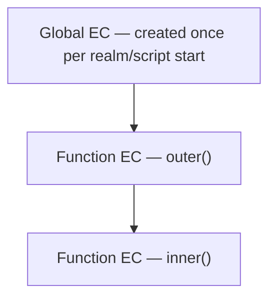
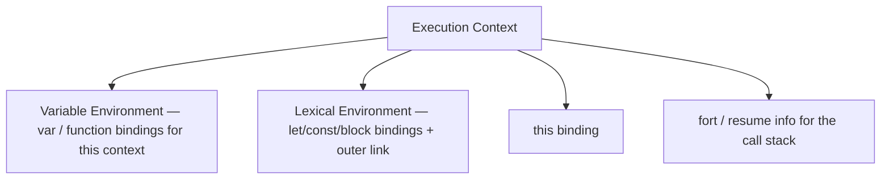
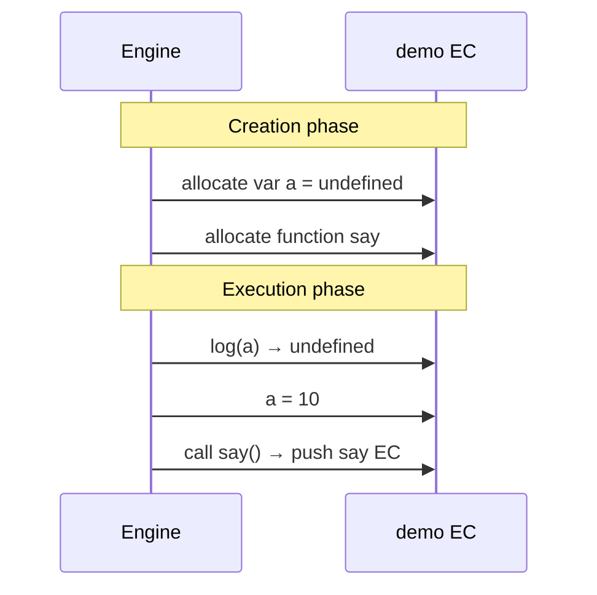
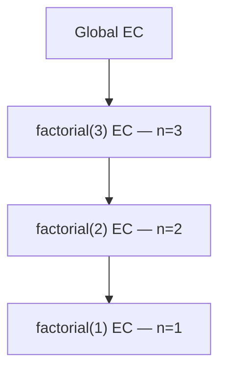
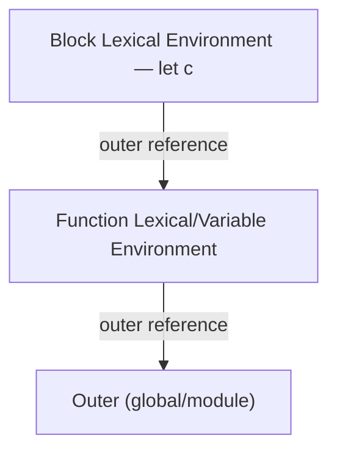
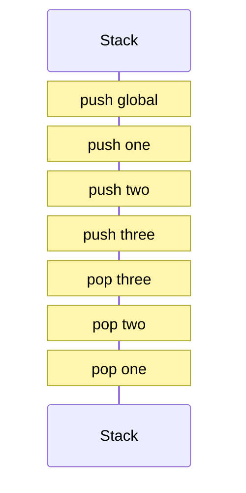
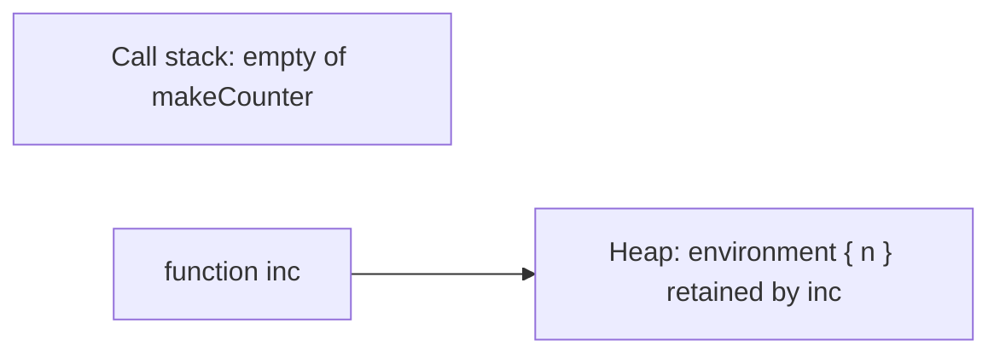
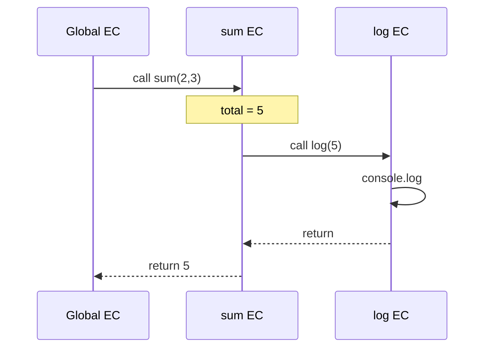

# Execution Context

This chapter teaches **what happens when JavaScript runs a piece of code**. You do not need to already know “execution context,” “lexical environment,” or “call stack.” By the end you should be able to explain **what an execution context is**, **how the global and function contexts differ**, **what the creation phase vs execution phase do**, and **how the call stack tracks nested calls**.

---

## 1. The problem: “where am I, and what can I see?”

When this runs:

```ts
const greeting = "hi"

function outer() {
  const name = "Ada"

  function inner() {
    console.log(greeting, name)
  }

  inner()
}

outer()
```

JavaScript must answer, at every moment:

1. **Which code is running right now?** (`inner`, `outer`, or top-level?)
2. **What does `this` refer to?** (covered deeply in [`this`](/javascript/06-this))
3. **Which variables are visible?** (`name` exists inside `outer` / `inner`, not outside)
4. **Where do I return to when this function finishes?**

An **execution context (EC)** is the engine’s internal “folder” of information for one run of a chunk of code. The **call stack** is the stack of those folders for nested function calls.

Plain-language definition:

> An **execution context** is the environment record the engine creates to run a piece of code — it tracks variables for that code, how `this` is set, and where to resume when the code finishes.

---

## 2. Types of execution context you will meet

| Kind | When it is created | Example |
| --- | --- | --- |
| **Global execution context** | When a script / module starts | Top-level `const x = 1` |
| **Function execution context** | Each time a function is **invoked** | `foo()` creates one; another `foo()` creates another |
| **Eval execution context** | When `eval` runs code (avoid in real apps) | `eval("var x = 1")` |

Arrow functions and methods still create function-style contexts when called; `this` rules differ ([`this`](/javascript/06-this)).



Modules also have their own top-level scope ([Modules](/javascript/13-modules)), but the “context + stack” mental model still applies when functions run.

---

## 3. What one execution context contains

Think of an EC as a box with labeled compartments:



You do not need every spec name memorized. You need this intuition:

1. **Bindings** — names like `x`, `foo`, and where they live
2. **Outer link** — where to look next if a name is not local ([Scope](/javascript/03-scope))
3. **`this`** — the receiver for this invocation (for non-arrows)
4. **Stack position** — so `return` knows where to go

Older teaching materials say “variable object” / “activation object.” Modern mental model: **Lexical Environment** + **Variable Environment** (often the same at function start; they differ when `eval` / blocks get involved — see section 7).

---

## 4. Creation phase vs execution phase

When the engine is about to run a function (or the global code), it does work in two conceptual phases.

### 4.1 Creation phase — “set up the room before acting”

Before any line of your function body “runs” for its side effects, the engine:

1. Creates the execution context
2. Sets up the environment for bindings
3. **Allocates** space for declared variables and functions
4. Initializes some of them early (classic `var` → `undefined`; function declarations → the actual function)
5. Determines `this` for this call
6. Links to the outer lexical environment (scope chain)

This is why people say things are “hoisted.” Hoisting is not magic floating — it is **creation-phase memory setup**. Full deep dive: [Hoisting](/javascript/04-hoisting).

### 4.2 Execution phase — “run the lines”

Then the engine walks your code top to bottom (with control flow):

1. Assignments happen (`x = 10`)
2. Function calls push new contexts
3. Expressions evaluate

### 4.3 Slow-motion example

```ts
function demo() {
  console.log(a) // undefined — not ReferenceError
  var a = 10
  console.log(a) // 10

  say() // works — function declaration available

  function say() {
    console.log("hi")
  }
}

demo()
```

**Creation phase for `demo` (simplified):**

| Binding | After creation phase |
| --- | --- |
| `a` | exists, value `undefined` (`var`) |
| `say` | exists, value = the function |

**Execution phase:**

1. `console.log(a)` → reads `undefined`
2. `a = 10` → assign
3. `console.log(a)` → `10`
4. `say()` → new EC for `say`, run it, pop



Contrast with `let`:

```ts
function demoLet() {
  // console.log(b) // ReferenceError — TDZ
  let b = 10
  console.log(b)
}
```

During creation, `b` is **declared** but **uninitialized** until the `let` line runs. Accessing it early throws. That gap is the **Temporal Dead Zone** ([Scope](/javascript/03-scope), [Hoisting](/javascript/04-hoisting)).

---

## 5. Global execution context

### 5.1 When it appears

When a classic browser script loads, or a Node file starts, the engine creates **one global EC** and begins executing top-level code.

```ts
// top-level
const appName = "demo"

function start() {
  console.log(appName)
}

start()
```

- `appName` and `start` live in the **global** environment (or module environment in ESM).
- Calling `start()` pushes a **function** EC on top of the global one.

### 5.2 Browser global object vs module

In a classic script (non-module):

```html
<script>
  var x = 1
  console.log(window.x) // 1
</script>
```

In an ES module:

```ts
// app.js type="module"
const x = 1
// not automatically on window
console.log(typeof window !== "undefined" ? window.x : undefined)
```

Modules keep top-level bindings **private to the module** ([Modules](/javascript/13-modules)). The global EC / realm still exists; your bindings are not dumped onto `window`.

### 5.3 `globalThis`

```ts
globalThis // window in browsers, global in Node, self in workers
```

Use `globalThis` when you must touch the global object portably.

---

## 6. Function execution context

Every **call** creates a fresh function EC:

```ts
function add(a: number, b: number) {
  const sum = a + b
  return sum
}

add(1, 2) // EC #1: a=1, b=2, sum=3
add(3, 4) // EC #2: separate bindings
```

Locals from call #1 do not overwrite call #2. That is why recursion works:

```ts
function factorial(n: number): number {
  if (n <= 1) return 1
  return n * factorial(n - 1)
}

factorial(3)
```



Each frame has its own `n`.

---

## 7. Lexical Environment vs Variable Environment

### 7.1 Plain language

- **Lexical Environment**: “the place where identifiers are stored for this scope, plus a link to the outer scope.” This is the backbone of [lexical scope](/javascript/03-scope) and [closures](/javascript/05-closures).
- **Variable Environment**: historically the environment used specifically for `var` and function declarations in that context.

In a simple function with no blocks, you can treat them as the same bag of bindings. They **split** when blocks introduce their own lexical environments while `var` still belongs to the function:

```ts
function example() {
  var a = 1
  if (true) {
    var b = 2      // function-scoped — Variable Environment of example
    let c = 3      // block-scoped — Lexical Environment of the if-block
  }
  console.log(a) // 1
  console.log(b) // 2
  // console.log(c) // ReferenceError
}
```



**Interview phrasing:** Lexical Environment tracks scope chain / `let`/`const`/blocks; Variable Environment is where `var` bindings live for the function. Closures close over the **lexical** environment.

### 7.2 Outer reference = scope chain link

When code looks up a name:

1. Check current environment
2. If missing, follow **outer** link
3. Repeat until global / module, then `ReferenceError`

That chain is built at **write time** (where the function was defined), not call time — that is lexical scope. Details: [Scope](/javascript/03-scope).

---

## 8. The call stack — slow walkthrough

The **call stack** is a LIFO (last-in, first-out) stack of execution contexts.

### 8.1 Push on call, pop on return

```ts
function one() {
  two()
  console.log("one end")
}

function two() {
  three()
  console.log("two end")
}

function three() {
  console.log("three")
}

one()
```

Step by step:

| Step | Stack (top on the right) | Output |
| --- | --- | --- |
| start | `[global]` | |
| call `one` | `[global, one]` | |
| call `two` | `[global, one, two]` | |
| call `three` | `[global, one, two, three]` | |
| `three` logs | same | `three` |
| `three` returns | `[global, one, two]` | |
| `two` logs | same | `two end` |
| `two` returns | `[global, one]` | |
| `one` logs | same | `one end` |
| `one` returns | `[global]` | |



### 8.2 Stack overflow

```ts
function recurse(): void {
  recurse()
}

// recurse() // RangeError: Maximum call stack size exceeded
```

Each call pushes a frame until the engine hits a size limit.

### 8.3 Async does not mean “another stack forever”

```ts
console.log("A")
setTimeout(() => console.log("B"), 0)
console.log("C")
// A, C, then later B
```

`setTimeout` schedules work with the **host**. When the callback runs later, the engine creates a **new** function EC on a stack that starts from that turn of the event loop — it is not still sitting under `one`/`two` from earlier. Deep dive: [Event Loop](/javascript/10-event-loop), [Async](/javascript/11-async).

---

## 9. `this` is part of the context — but not lexical for normal functions

For a traditional `function`, `this` is set by **how the function is called**, and stored as part of that invocation’s EC:

```ts
function show() {
  console.log(this)
}

const obj = { show }

show()     // default binding (undefined in strict / modules; global in sloppy)
obj.show() // implicit: this === obj
```

Arrow functions do **not** get their own `this` from the call site; they capture `this` from the surrounding lexical environment. Full rules: [`this`](/javascript/06-this).

Important separation:

| Concept | Decided by |
| --- | --- |
| Free variable lookup (`name`, `greeting`) | **Lexical** scope (where function was written) |
| `this` (non-arrow) | **Call site** (how it was invoked) |

---

## 10. Closures: contexts go away, environments can remain

When a function returns, its EC is **popped** from the stack. But if an inner function still needs variables from that outer function, those bindings stay alive on the heap:

```ts
function makeCounter() {
  let n = 0
  return function inc() {
    n++
    return n
  }
}

const c = makeCounter()
console.log(c()) // 1
console.log(c()) // 2
```

After `makeCounter` returns, you cannot see a `makeCounter` frame on the stack — yet `n` still exists for `inc`. That retained environment is the heart of [Closures](/javascript/05-closures).



---

## 11. Executable code kinds (spec vocabulary, lightly)

The specification talks about running:

- **Global code**
- **Function code**
- **Eval code**
- **Module code**

Same big idea: each has environment setup rules. Module code is strict and has module scope ([Modules](/javascript/13-modules)). Eval can introduce bindings in surprising places — seniors avoid it.

---

## 12. Environment records (names you may hear)

| Spec-ish term | Plain meaning |
| --- | --- |
| Declarative Environment Record | Stores `let`/`const`/`var`/functions/classes as bindings |
| Object Environment Record | Backs `with` or global object bindings |
| Global Environment Record | Global + connection to global object |
| Function Environment Record | Function locals + `this` / `super` support |
| Module Environment Record | Module bindings + imports |

You rarely need to recite these. If an interviewer uses the terms, map them back to: **where bindings live** + **outer link** + **`this`**.

---

## 13. Generators and async functions — contexts that pause

```ts
async function load() {
  const data = await fetch("/api")
  return data.json()
}
```

An `async` function still has an execution context, but `await` **pauses** the function and yields to the event loop. Later the function resumes with the same local bindings. It is not “a brand new random scope” — locals persist across the pause. Details: [Async](/javascript/11-async), [Event Loop](/javascript/10-event-loop).

Generators (`function*`) similarly suspend and resume with retained locals.

---

## 14. `eval` and `with` — why they complicate contexts

```ts
// Anti-patterns — understand, don't use
eval("var hidden = 1")

with (obj) {
  // name lookups can hit obj properties dynamically
}
```

These make identifier resolution **less statically analyzable**, hurt optimization, and confuse scope. Modern code and modules make them irrelevant; interviews may ask why they are disliked.

---

## 15. Worked whiteboard script

Say this out loud for:

```ts
var x = 1
function outer() {
  var y = 2
  function inner() {
    console.log(x, y)
  }
  return inner
}
const fn = outer()
fn()
```

1. Global EC created; creation phase registers `x`, `outer`.
2. Execution: `x = 1`; `outer` assigned (already as function declaration).
3. `outer()` → push outer EC; create `y`, `inner`; `y = 2`; return `inner`.
4. Pop outer EC from stack; **environment with `y` retained** because `inner` closes over it.
5. `fn()` → push inner EC; lookup `x` → global; lookup `y` → outer’s retained env; log `1 2`.

---

## 16. Slow-motion: arguments, locals, and nested calls

```ts
function sum(a: number, b: number) {
  const total = a + b
  log(total)
  return total
}

function log(msg: number) {
  console.log("total=", msg)
}

sum(2, 3)
```

**Creation for `sum(2, 3)`:**

| Binding | After creation |
| --- | --- |
| `a` | `2` (parameter already initialized from arguments) |
| `b` | `3` |
| `total` | if `const`/`let` → TDZ until its line; here we treat as uninitialized until `const total = ...` |

**Execution:**

1. Evaluate `a + b` → `5`, assign `total`
2. Call `log(total)` → push `log` EC with `msg = 5`
3. `log` prints; pop `log`
4. `return total` → pop `sum`, yield `5` to caller



Parameters are part of the function’s environment from the start of that invocation — they are not “hoisted `undefined`” the way a later `var` inside the body is.

---

## 17. How DevTools maps to these ideas

When you pause in Chrome/Node debugger:

| UI panel | Concept |
| --- | --- |
| **Call Stack** | Stack of execution contexts (frames) |
| **Scope → Local** | Bindings of the current function EC |
| **Scope → Closure** | Outer lexical environments retained by the function |
| **Scope → Script / Module / Global** | Outer chain toward the top |
| **this** | The `this` value for the current frame |

Practice: write a nested function, set a breakpoint inside the inner one, and name each Scope section out loud. That is the best way to make EC + lexical environments concrete.

---

## 18. Strict mode’s effect on contexts (practical)

Strict mode (default in modules and classes) changes several context-related behaviors:

1. Bare calls get `this === undefined` (not the global object).
2. Assigning to undeclared names throws (does not create an accidental global).
3. `eval` / `with` are restricted or forbidden.
4. Duplicate parameter names are a syntax error.

```ts
// module or "use strict"
function f() {
  // undeclared = 1 // ReferenceError
  console.log(this) // undefined when called bare
}
f()
```

Why seniors care: fewer silent globals, clearer `this`, easier static reasoning about environments.

---

## 19. Recursion depth — what the stack holds

```ts
function walk(n: number): number {
  if (n === 0) return 0
  return n + walk(n - 1)
}

walk(3)
```

Frames (top first while deepest call runs):

```text
walk(0)  n=0
walk(1)  n=1
walk(2)  n=2
walk(3)  n=3
global
```

Each frame stores its own `n` and return address. Tail-call optimization is **not** something you should count on in JS engines for interview purposes — deep recursion can still blow the stack. Prefer loops for large `n`.

---

## 20. Putting EC together with the rest of the language

| Topic | How it connects to EC |
| --- | --- |
| [Scope](/javascript/03-scope) | Rules for which environment a name resolves in |
| [Hoisting](/javascript/04-hoisting) | Creation-phase initialization of bindings |
| [Closures](/javascript/05-closures) | Keeping environments alive after the EC pops |
| [`this`](/javascript/06-this) | Receiver stored on the function EC (non-arrows) |
| [Event Loop](/javascript/10-event-loop) | When a new EC is pushed for a macrotask/microtask |
| [Modules](/javascript/13-modules) | Module environment as the outer scope for module code |

If you can narrate one function call using “create context → create/init bindings → run → push/pop stack,” you have the backbone for all of those chapters.

---

## Interview Questions

### Q1. What is an execution context?
**Expected:** The engine’s structure for running a piece of code — bindings, `this`, and link to outer environment; created for global code and each function invocation.  
**Common wrong:** “It is the same thing as scope” (related but not identical — scope is about visibility rules; EC is the runtime instance).  
**Follow-ups:** What is on the call stack?

### Q2. Creation phase vs execution phase?
**Expected:** Creation allocates/initializes bindings (hoisting behavior); execution runs statements and assignments.  
**Common wrong:** “Creation phase runs your console.logs.”  
**Follow-ups:** Why does `var` log `undefined` before its line?

### Q3. Lexical Environment vs Variable Environment?
**Expected:** Lexical Environment is the scope-chain structure (including blocks / `let`); Variable Environment holds `var` for the function. Closures use lexical environments.  
**Common wrong:** “They are unrelated to scope.”  
**Follow-ups:** Show `var` leaking out of an `if` block.

### Q4. What happens on the call stack when `a` calls `b` calls `c`?
**Expected:** Push global → a → b → c; pop c, b, a on return.  
**Common wrong:** “All three run in parallel on the stack.”  
**Follow-ups:** What is stack overflow?

### Q5. Does a returned inner function keep the outer execution context on the stack?
**Expected:** No — the outer EC is popped; the needed bindings remain reachable via the closure’s [[Environment]] / lexical environment on the heap.  
**Common wrong:** “The outer function stays on the call stack forever.”  
**Follow-ups:** Link to GC / memory leaks ([Memory](/javascript/12-memory)).

### Q6. How does `this` relate to execution context?
**Expected:** For non-arrow functions, `this` is determined at call time and stored for that invocation’s context; arrows inherit lexically.  
**Common wrong:** “`this` is always the global object.”  
**Follow-ups:** Point to [`this`](/javascript/06-this).

## Common Mistakes

- Confusing **scope** (visibility rules) with **execution context** (runtime instance of running code).
- Thinking async callbacks continue under the same stack frame that scheduled them.
- Believing closed-over variables require the outer function to remain on the call stack.
- Ignoring creation phase when explaining hoisting / TDZ.
- Using `eval` / `with` and assuming normal lexical reasoning still holds.

## Trade-offs / Production Notes

- Prefer **modules + `let`/`const`** so environments match how you read the file.
- Keep call stacks shallow in hot paths; deep recursion may need iteration or trampolines.
- When debugging, DevTools “Scope” / “Call Stack” panels map directly to these concepts.
- Related: [Scope](/javascript/03-scope), [Hoisting](/javascript/04-hoisting), [Closures](/javascript/05-closures), [`this`](/javascript/06-this), [Event Loop](/javascript/10-event-loop), [Memory](/javascript/12-memory).
