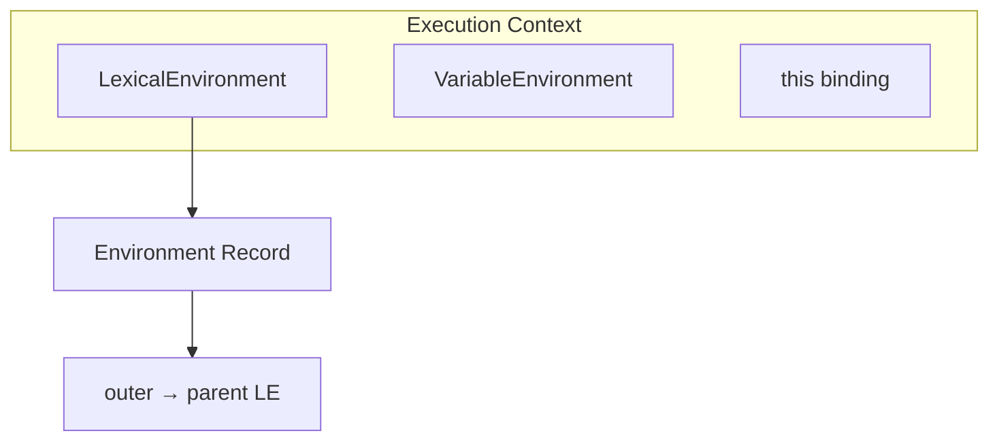
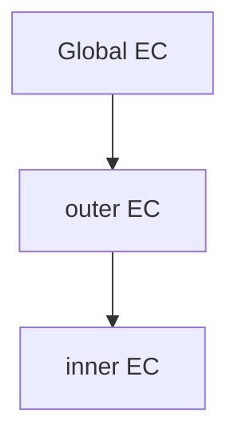
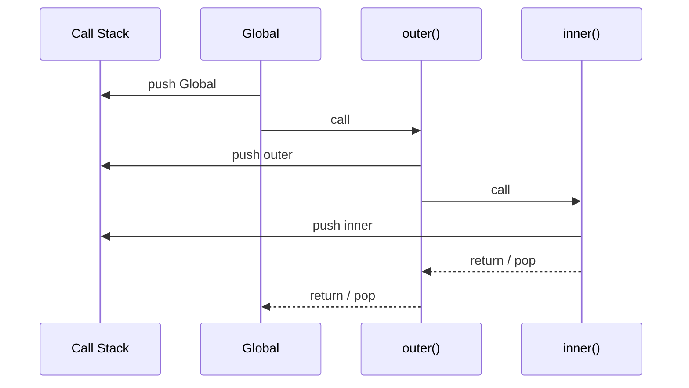

# Execution Context

Every function call (and the global script) gets an **execution context**: environment + `this` + control state. This is the mental model behind scope, closures, and the call stack.

## What an execution context contains

| Component | Role |
| --- | --- |
| Lexical Environment | Variable / function / module bindings + outer link |
| Variable Environment | Historically where `var` bindings live |
| `this` binding | Resolved at call time (except arrows — lexical) |
| Environment record | Object / declarative / global / module record |
| Evaluation state | Instruction pointer / generator / async state |



## Creation vs execution phases

1. **Creation (instantiation):** allocate environment; bind parameters; hoist `var` / function declarations; create `let`/`const` bindings in TDZ; resolve `this`.
2. **Execution:** run statements; initialize `let`/`const` at their declarations; assign values.

```ts
function demo(a: number) {
  console.log(x) // undefined (var hoisted)
  // console.log(y) // ReferenceError TDZ
  var x = 1
  let y = 2
  return a + x + y
}
```

See [Hoisting](/javascript/04-hoisting) for the binding timeline.

## Types of execution context

| Kind | Created when | Notes |
| --- | --- | --- |
| Global | Script / module evaluation starts | One per realm |
| Function | Call / `new` / `apply` | Most common |
| Eval | Direct / indirect `eval` | Avoid |
| Module | ESM evaluation | Strict; top-level `this` is `undefined` |

```ts
const g = 1

function outer() {
  function inner() {}
  inner()
}
outer()
```



## Call stack

Contexts push/pop on the **call stack**. Async callbacks get *new* contexts later — they do not keep the original frame on the stack (generators / async suspend separately).



```ts
function a() {
  b()
}
function b() {
  c()
}
function c() {
  throw new Error("boom")
}
// Stack trace: c → b → a → ...
```

Stack overflow = deep sync recursion. Engines generally do **not** guarantee TCO.

## Lexical vs variable environment

Modern interview model:

- **Lexical environment** = scope chain for identifier resolution.
- Function declarations and `var` initialize early; `let`/`const`/`class` are in TDZ until evaluated.
- Blocks push a new declarative environment on the chain.

```ts
function f() {
  var x = 1
  {
    let x = 2 // shadows
    console.log(x) // 2
  }
  console.log(x) // 1
}
```

## `this` is not lexical (non-arrows)

`this` is a component of the EC, determined by **how** the function is called. Arrows capture `this` from the enclosing lexical environment.

```ts
const obj = {
  n: 1,
  regular() {
    return this.n
  },
  arrow: () => this,
}

obj.regular() // 1
obj.arrow()   // not obj
```

Deep dive: [this Keyword](/javascript/06-this).

## Executable code kinds

| Code | Strict? | Top-level `this` |
| --- | --- | --- |
| Classic script (sloppy) | no | `globalThis` |
| `"use strict"` script | yes | `undefined` in bare calls |
| Module | always | `undefined` |
| Class bodies | always | — |

## Environment records (spec vocabulary)

- **Declarative** — `let`/`const`/`var`/params/functions  
- **Object** — `with`, global object bindings  
- **Global** — declarative + object environment  
- **Module** — imports / exports, live bindings  
- **Function** — params + `arguments` (non-arrow)

## Closures link

When a function is created, it stores a reference to the **current lexical environment**. Contexts pop; environments may survive.

```ts
function make() {
  let count = 0
  return () => ++count // retains make's LE
}
const inc = make() // EC gone; LE lives on
```

See [Closures](/javascript/05-closures).

## Async / generator contexts

`async` / generators create a function context that can **suspend**. The call stack unwinds on `await` / `yield`; resumption restores locals on a later event-loop turn.

```ts
async function load() {
  const a = 1
  await Promise.resolve()
  return a
}
```

Related: [Event Loop](/javascript/10-event-loop), [Async](/javascript/11-async), [Node phases](/node/02-event-loop).

## Eval & `with` (why seniors say never)

Both dynamically inject bindings and defeat static scope analysis / optimization. Direct `eval` can mutate the caller’s environment in sloppy mode.

## Interview Questions

**Q: What is an execution context?**  
Runtime structure for evaluating code: lexical environment, `this`, and control state.

**Q: Difference between EC and lexical environment?**  
EC is the full activation (includes `this` + state). LE is the scope / binding component shared with closures.

**Q: What happens when you call a function?**  
Create EC → push stack → instantiate bindings → bind `this` → execute → pop on return/throw.

**Q: Does `setTimeout(fn)` keep the outer EC on the stack?**  
No. Outer returns; later a *new* EC runs `fn`. Closed-over variables survive via the environment.

**Q: LexicalEnvironment vs VariableEnvironment?**  
Historically VE for `var`, LE for block bindings; teach nested environment records + outer links.

**Q: Why is `this` call-time?**  
Non-arrow `this` is not looked up on the scope chain — call-site binding rules apply.

## Common Mistakes

- Conflating call stack frames with closed-over scopes.
- Thinking `this` is looked up like a variable (non-arrows).
- Believing modules share a mutable global `this` like classic scripts.
- Assuming engines keep VE distinct in every modern case — know history, teach LE model.
- Using `eval` / `with` "just for this one tool."

## Trade-offs / Production Notes

- Keep call stacks shallow for hot paths; prefer iteration over deep recursion.
- Source maps + async stack traces matter in Node/Chrome — enable in staging.
- Avoid `eval` / `with` — they defeat optimization.
- Cross-link: [Node V8](/node/07-v8).
- Next: [Scope](/javascript/03-scope).
