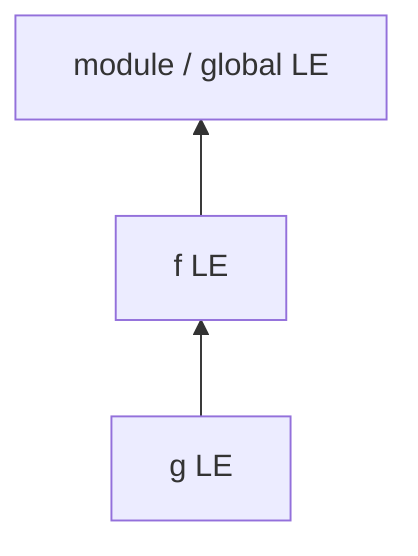
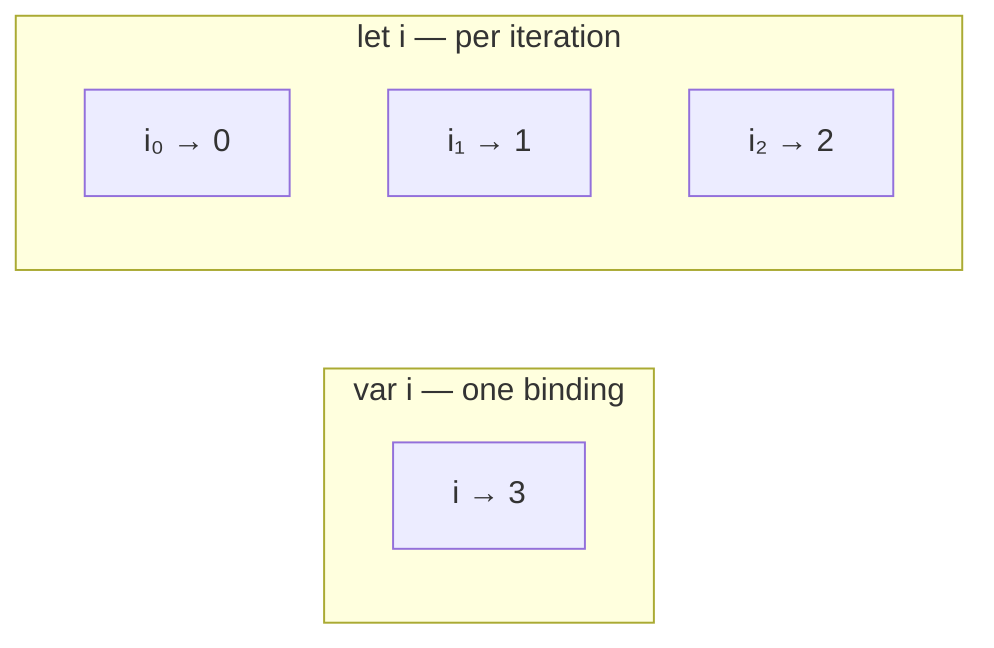

# Scope & Lexical Environment

Scope answers: **which binding does this identifier resolve to?** JS uses **lexical (static) scope** — determined by where the code is written, not where it is called.

## Lexical scope

```ts
const outer = "outer"

function f() {
  const inner = "inner"
  function g() {
    return outer + inner // resolves lexically outward
  }
  return g
}

const h = f()
h() // "outerinner" — call site does not matter
```



Contrast with dynamic scope (not JS): lookup would follow the call chain. That is closer to how `this` works for non-arrows — different mechanism.

## Scope types

| Scope | Introduced by | Lifetime |
| --- | --- | --- |
| Global | script / shared global object | process / page |
| Module | ESM file | module instance |
| Function | `function` / methods / most callables | while reachable (closures) |
| Block | `{ }`, `let`/`const`/`class`, `catch` | block + closures from inside |
| Catch | `catch (e)` | binding scoped to catch (modern) |

```ts
if (true) {
  var a = 1   // function/global scoped
  let b = 2   // block scoped
  const c = 3 // block scoped
}
```

## Identifier resolution

1. Look in the current environment record.  
2. If missing, follow `outer` to the parent lexical environment.  
3. Repeat until global / module.  
4. If still missing: `ReferenceError` (or create binding on global object in sloppy assignment — never rely on this).

```ts
function read() {
  return missing // ReferenceError in modules / strict
}
```

## Shadowing

```ts
const x = 1
function f() {
  const x = 2
  {
    const x = 3
    console.log(x) // 3
  }
  console.log(x) // 2
}
```

Shadowing imports / `arguments` is a readability footgun — ban via lint when possible.

## Free variables & closures

A **free variable** is referenced but not declared in the current scope. The function closes over the environment that provides those bindings.

```ts
function counter(start: number) {
  let n = start
  return () => ++n
}
```

Details: [Closures](/javascript/05-closures).

## Block scope pitfalls with loops

```ts
const fns: Array<() => number> = []
for (var i = 0; i < 3; i++) {
  fns.push(() => i)
}
fns.map((f) => f()) // [3, 3, 3]

const fns2: Array<() => number> = []
for (let i = 0; i < 3; i++) {
  fns2.push(() => i)
}
fns2.map((f) => f()) // [0, 1, 2]
```



## `var` function scope

```ts
function f(flag: boolean) {
  if (flag) {
    var x = 1
  }
  return x // undefined if flag false — binding exists
}
```

Prefer `let`/`const`. Treat `var` as legacy unless maintaining old code.

## Global scope: classic script vs module

| | Classic script | ES module |
| --- | --- | --- |
| Top-level `let`/`const` | global LE, not always `window` props | module scope |
| Top-level `var` / function | become `globalThis` properties | module-local |
| Shared across files | yes | no (imports/exports) |

```ts
// module A
export const appName = "x"

// module B
import { appName } from "./a"
```

## Scope chain vs prototype chain

| | Scope chain | Prototype chain |
| --- | --- | --- |
| Looks up | identifiers | property names |
| Linked by | lexical nesting | `[[Prototype]]` |
| Failure | `ReferenceError` | `undefined` |

```ts
const o = { a: 1 }
console.log(o.b) // undefined
// console.log(b) // ReferenceError
```

See [Prototype Chain](/javascript/07-prototype).

## Temporal Dead Zone

```ts
{
  // TDZ for x
  // console.log(x) // ReferenceError
  let x = 1
}

const x = 1
{
  // console.log(x) // ReferenceError — inner x in TDZ, not outer
  const x = 2
}
```

Full treatment: [Hoisting](/javascript/04-hoisting).

## `typeof` undeclared vs TDZ

```ts
typeof notDeclared // "undefined" — undeclared
{
  typeof x // ReferenceError — declared let in TDZ
  let x = 1
}
```

## IIFE — historical block scope

```ts
var counters = []
for (var i = 0; i < 3; i++) {
  counters.push(
    (function (j) {
      return () => j
    })(i),
  )
}
```

Still useful for isolating `var` or one-shot setup; modules + `let` cover most modern cases.

## Nested functions cost

Each nested function creation captures an environment. Hot paths that recreate closures every render / request can allocate more than necessary — measure first; React care: [Closures](/javascript/05-closures#react-stale-closures).

## `with` and dynamic scope contamination

```ts
// never in production
with ({ a: 1 }) {
  console.log(a)
}
```

Banned in strict mode. Defeats static analysis.

## Interview Questions

**Q: Lexical vs dynamic scope?**  
Lexical: definition site. Dynamic: call site. JS identifiers are lexical; `this` (non-arrow) is call-site.

**Q: What is a lexical environment?**  
Structure holding an environment record (bindings) plus a reference to an outer lexical environment.

**Q: Why does `let` in `for` fix the classic loop bug?**  
Per-iteration environment bindings; each closure captures a different `i`.

**Q: Why does `const` object still mutate?**  
Binding immutable; object contents not frozen unless `Object.freeze`.

**Q: Module scope vs function scope?**  
Module wraps the file in its own environment with live import bindings; not visible as `globalThis` properties.

**Q: Scope chain vs prototype chain?**  
Identifiers vs properties; `ReferenceError` vs `undefined`.

## Common Mistakes

- Expecting block scope from `var`.
- Confusing scope chain with prototype chain.
- Accidental globals from sloppy assignments.
- Assuming closures capture *values* — they capture *bindings* (mutable).
- Shadowing outer names unintentionally in large functions.
- Claiming "`let` is not hoisted" — it is, but TDZ applies.

## Trade-offs / Production Notes

- Default to `const`; `let` when rebinding; never `var` in new code.
- Keep functions shallow — deep nesting hurts readability and accidental capture.
- ESLint: `no-var`, `no-inner-declarations`, `no-shadow`.
- Related: [Execution Context](/javascript/02-execution-context), [Closures](/javascript/05-closures), [Modules](/javascript/13-modules).
