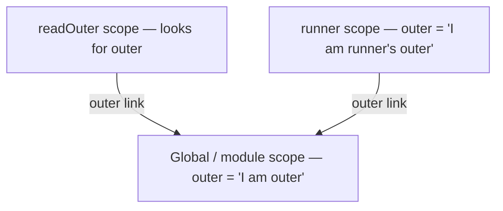
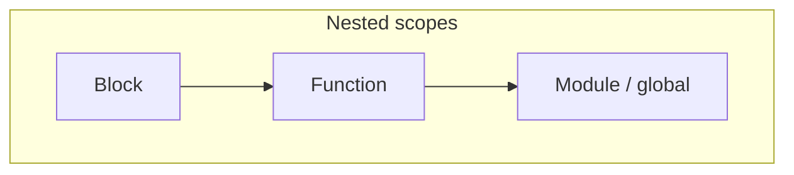
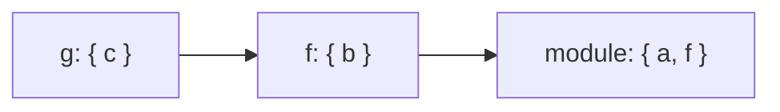
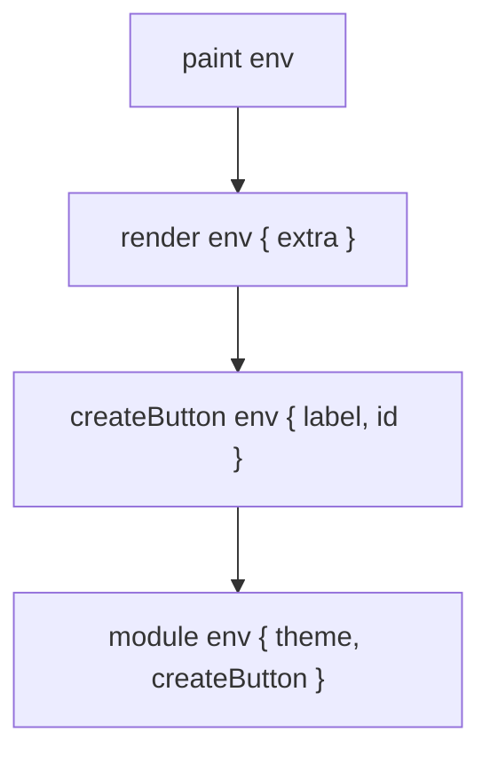

# Scope

This chapter teaches **where a name can be used** in JavaScript. You do not need to already know “lexical scope,” “TDZ,” or “scope chain.” By the end you should be able to explain **global vs function vs block scope**, **why nested functions see outer variables**, **how `var` differs from `let`/`const`**, and **what the Temporal Dead Zone is**.

---

## 1. The problem scope solves

Programs need names:

```ts
const taxRate = 0.2

function priceWithTax(amount: number) {
  return amount * (1 + taxRate)
}
```

`priceWithTax` uses `taxRate` even though `taxRate` was not declared inside the function. That is useful — and dangerous if every name were visible everywhere:

```ts
// Imaginary broken world: everything global
function save() {
  data = "secret" // whose data? anyone's?
}
```

**Scope** is the set of rules that answers:

> Given this line of code, which bindings (variable/function names) am I allowed to see?

Plain-language definition:

> **Scope** is the region of a program where a particular binding is visible and usable.

---

## 2. Lexical scope — “where you write it,” not “where you call it”

**Lexical** (also called **static**) scope means: visibility is decided by how the source code is **nested when you write it**, not by who calls whom at runtime.

```ts
const outer = "I am outer"

function readOuter() {
  console.log(outer)
}

function runner(fn: () => void) {
  const outer = "I am runner's outer" // does NOT affect readOuter
  fn()
}

runner(readOuter) // logs "I am outer"
```

Slow walkthrough:

1. `readOuter` was **defined** in the same scope as `const outer = "I am outer"`.
2. When `readOuter` looks up `outer`, it follows its **definition-site** chain.
3. `runner`’s local `outer` is irrelevant to that lookup.



If JavaScript used **dynamic scope** (it does not, for normal variables), `readOuter` might see `runner`’s `outer`. JS variable lookup is lexical. (`this` is different — [`this`](/javascript/06-this).)

Related foundation: [Execution Context](/javascript/02-execution-context).

---

## 3. The three scopes you use every day

### 3.1 Global scope

Top-level bindings in a classic script, or the outermost shared environment:

```ts
var globalish = 1 // in classic browser scripts, also on window
```

In **ES modules**, top-level `let`/`const`/`class`/`function` are scoped to the **module**, not automatically `window` ([Modules](/javascript/13-modules)). People still say “global” loosely for “outermost.”

### 3.2 Function scope

Each function body creates a scope for its parameters and locals:

```ts
function add(a: number, b: number) {
  const sum = a + b
  return sum
}

// console.log(sum) // ReferenceError — sum not visible here
```

`var` is **function-scoped** (or global): it ignores blocks like `if` / `for`.

### 3.3 Block scope

A **block** is anything in `{ ... }`: `if`, `for`, `while`, `switch`, bare blocks, `try`/`catch`.

`let` and `const` (and `class`) are **block-scoped**:

```ts
if (true) {
  let hidden = 1
  const also = 2
}
// console.log(hidden) // ReferenceError
```



---

## 4. Identifier resolution — walking the scope chain

When the engine evaluates a name `x`:

1. Look in the **current** lexical environment.
2. If not found, follow the **outer** reference.
3. Repeat until found, or throw `ReferenceError`.

```ts
const a = 1

function f() {
  const b = 2
  function g() {
    const c = 3
    console.log(a, b, c) // finds c local, b outer, a outer-outer
  }
  g()
}

f()
```



This chain is built from nesting in source — the **scope chain**.

---

## 5. Shadowing — inner name hides outer name

```ts
const x = "outer"

function f() {
  const x = "inner"
  console.log(x) // "inner"
}

f()
console.log(x) // "outer"
```

The inner `x` **shadows** the outer one inside `f`. Lookup stops at the first match.

```ts
let count = 0

function bump() {
  let count = 1 // shadows — does NOT update outer count
  count++
}

bump()
console.log(count) // 0
```

Shadowing is legal but easy to misread in long functions — prefer clear names.

---

## 6. Free variables — names that come from outside

A **free variable** in a function is a name that is **used** but **not declared** in that function.

```ts
function makeGreeter(greeting: string) {
  return function greet(name: string) {
    // `greeting` is free in `greet` — comes from outer scope
    return `${greeting}, ${name}`
  }
}

const hi = makeGreeter("Hi")
console.log(hi("Ada")) // "Hi, Ada"
```

When a function with free variables outlives its outer call, you get a **closure** ([Closures](/javascript/05-closures)). Scope is the prerequisite; closures are “scope + retained environment.”

---

## 7. `var` vs `let` vs `const` — scoping rules in depth

### 7.1 `var` — function scoped, ignore blocks

```ts
function f() {
  if (true) {
    var x = 1
  }
  console.log(x) // 1 — leaked out of the if
}

f()
```

Loops:

```ts
for (var i = 0; i < 3; i++) {
  /* ... */
}
console.log(i) // 3 — `i` still visible after the loop
```

### 7.2 `let` — block scoped, reassignable

```ts
let n = 1
n = 2 // ok

if (true) {
  let n = 99 // different binding
}
console.log(n) // 2
```

### 7.3 `const` — block scoped, not reassignable

```ts
const n = 1
// n = 2 // TypeError

const user = { name: "Ada" }
user.name = "Grace" // ok — object mutation
// user = {} // TypeError — rebinding forbidden
```

`const` protects the **binding**, not deep immutability.

### 7.4 Comparison table

| | `var` | `let` | `const` |
| --- | --- | --- | --- |
| Scope | Function / global | Block | Block |
| Reassign | Yes | Yes | No |
| Redeclare in same scope | Yes (bad) | No | No |
| TDZ | No (initialized `undefined`) | Yes | Yes |
| Hoisted? | Binding yes, value `undefined` | Binding yes, uninitialized | Same as `let` |

Prefer `const` by default, `let` when needed, avoid `var` in new code.

---

## 8. Temporal Dead Zone (TDZ) — deep examples

### 8.1 Plain language

From the start of a block until the `let`/`const` declaration line runs, the binding **exists but is uninitialized**. Accessing it throws `ReferenceError`. That time window is the **Temporal Dead Zone**.

```ts
{
  // TDZ for `x` starts
  // console.log(x) // ReferenceError
  let x = 1 // TDZ ends; x initialized
  console.log(x) // 1
}
```

### 8.2 Why TDZ exists

It catches bugs where you use a variable before its intended initialization — especially with `const`, which must be initialized on declaration.

### 8.3 TDZ and functions

```ts
function weird() {
  // console.log(a) // ReferenceError if uncommented
  let a = 10
}

function capture() {
  function inner() {
    return value
  }
  // return inner() // would throw — value still in TDZ
  let value = 42
  return inner() // ok — runs after initialization
}

console.log(capture()) // 42
```

Creating a function that **mentions** a TDZ variable is fine. **Calling** it before initialization is not.

### 8.4 `typeof` and TDZ vs undeclared

```ts
console.log(typeof notDeclaredAtAll) // "undefined" — no error

{
  // console.log(typeof inTdz) // ReferenceError!
  let inTdz = 1
}
```

`typeof` does **not** protect you from TDZ. That surprises people who think `typeof` never throws.

### 8.5 `const` in TDZ

```ts
{
  // console.log(c) // ReferenceError
  const c = 1
}
```

Same TDZ rules as `let`; plus you must initialize in the declaration.

### 8.6 Parameters and default values

```ts
function f(a = b, b = 2) {
  // using `b` before it is initialized in the parameter list can TDZ
}

// f() // ReferenceError in the default initializer for `a`
```

Default parameters have their own scoping quirks — initialize in dependency order:

```ts
function g(b = 2, a = b) {
  return [a, b]
}
console.log(g()) // [2, 2]
```

---

## 9. Block scope pitfalls with loops

### 9.1 The classic `var` loop + async

```ts
for (var i = 0; i < 3; i++) {
  setTimeout(() => console.log(i), 0)
}
// prints 3, 3, 3 — one shared `i`
```

Slow walkthrough:

1. `var i` is **one** binding for the whole function/global.
2. Loop ends with `i === 3`.
3. Timeouts run later; each closure reads the **same** `i` → `3`.

### 9.2 Fix with `let`

```ts
for (let i = 0; i < 3; i++) {
  setTimeout(() => console.log(i), 0)
}
// 0, 1, 2
```

`let` in `for` creates a **new binding per iteration** (special rule), so each timeout closes over a different `i`.

### 9.3 Fix with an IIFE (historical)

```ts
for (var i = 0; i < 3; i++) {
  ;((j) => {
    setTimeout(() => console.log(j), 0)
  })(i)
}
```

Before `let`, people copied `i` into a function-scoped `j`. Related: [Closures](/javascript/05-closures).

---

## 10. Global scope: classic script vs module

```html
<script>
  var a = 1
  let b = 2
  console.log(window.a) // 1
  console.log(window.b) // undefined — let does not become a window property
</script>

<script type="module">
  const c = 3
  // c is module-scoped, not on window
</script>
```

| Declaration | Classic script | ES module |
| --- | --- | --- |
| `var` at top | Global + `window` property | Module scope (not on `window`) |
| `let`/`const` at top | Script global, not `window` prop | Module scope |
| Top-level `this` | `window` (sloppy) | `undefined` |

---

## 11. Scope chain vs prototype chain

These are different mechanisms that both “walk outward looking for a name”:

| | Scope chain | Prototype chain |
| --- | --- | --- |
| Looks up | Variables / bindings | Object properties |
| Linked by | Nested lexical environments | `[[Prototype]]` / `__proto__` |
| Failure | `ReferenceError` | `undefined` (reading missing prop) |

```ts
const x = 1
const obj = { y: 2 }
// obj.x is undefined — does NOT look at variable `x`
// reading `x` does NOT look at `obj`
```

Do not mix them in interviews. Prototypes: [Prototype](/javascript/07-prototype).

---

## 12. IIFE — historical “block scope”

Before `let`, an **Immediately Invoked Function Expression** created a private scope:

```ts
var counter = (function () {
  var n = 0
  return {
    inc() {
      n++
      return n
    },
  }
})()

console.log(counter.inc()) // 1
// n is not global
```

Today: prefer block scope + modules. IIFEs still appear in older code and bundler output.

---

## 13. Nested functions and readability

```ts
function handleRequest(req: { userId: string }) {
  const userId = req.userId

  function authorize() {
    return userId.startsWith("admin-")
  }

  function execute() {
    if (!authorize()) throw new Error("denied")
    return "ok"
  }

  return execute()
}
```

Nested functions freely see `userId` — clear and fine. Extremely deep nesting makes the scope chain hard to reason about; flatten when clarity suffers. Closures also retain memory ([Memory](/javascript/12-memory)).

---

## 14. `with` and dynamic lookup (avoid)

```ts
const obj = { a: 1 }
with (obj) {
  console.log(a) // 1 — looked up on obj
}
```

`with` adds an object to the front of the scope chain **at runtime**, breaking lexical clarity and hurting optimization. Forbidden in strict mode. Know it exists; never use it.

---

## 15. Worked example — shadowing + TDZ + blocks

```ts
const name = "global"

function run() {
  console.log(name) // "global" — outer still visible

  if (true) {
    // console.log(name) // ReferenceError — TDZ of inner `name`
    const name = "block"
    console.log(name) // "block"
  }

  console.log(name) // "global"
}

run()
```

Why line A would throw: inside the block, `const name` **shadows** from the start of the block, but is uninitialized until its line — so `console.log(name)` hits TDZ, not the global.

---

## 16. Catch scopes — a special block

```ts
try {
  throw new Error("boom")
} catch (err) {
  console.log(err.message) // "boom"
}
// console.log(err) // ReferenceError — err is scoped to the catch block
```

`err` lives in the `catch` block’s scope (modern engines), similar to a `let` binding for that block. Nested `catch` can shadow:

```ts
try {
  throw new Error("outer")
} catch (err) {
  try {
    throw new Error("inner")
  } catch (err) {
    console.log(err.message) // "inner"
  }
  console.log(err.message) // "outer"
}
```

---

## 17. Switch cases share one block (unless you nest)

```ts
function handle(code: number) {
  switch (code) {
    case 1:
      // let msg = "one"  // careful — same switch block as case 2
      {
        let msg = "one"
        return msg
      }
    case 2: {
      let msg = "two" // ok — separate block
      return msg
    }
    default:
      return "other"
  }
}
```

Without inner `{ }`, `let`/`const` in different `case`s can collide because `switch` uses one block. Wrap cases in braces when declaring bindings.

---

## 18. Function parameters are a scope layer

```ts
const x = "outer"

function f(x: string) {
  // parameter `x` shadows outer `x`
  console.log(x)
}

f("param") // "param"
```

Default values can see earlier parameters, and body `let` can shadow a parameter (messy — avoid):

```ts
function g(a = 1) {
  // let a = 2 // SyntaxError in many cases — duplicate binding
  const b = a + 1
  return b
}
```

Think of parameters as bindings created with the function’s environment before the body runs.

---

## 19. Deep nested walkthrough — three lookups

```ts
const theme = "dark"

function createButton(label: string) {
  const id = `btn-${label}`

  function render(extra: string) {
    function paint() {
      // free: theme (global/module), id + label (createButton), extra (render)
      return `[${theme}] ${id} (${label}) ${extra}`
    }
    return paint()
  }

  return render
}

console.log(createButton("save")("primary"))
// [dark] btn-save (save) primary
```

Lookup for `theme` inside `paint`:

1. Not in `paint`
2. Not in `render`
3. Not in `createButton`
4. Found in module/global



This is lexical scope in action — and the setup that becomes a closure if you return `paint` instead of calling it immediately ([Closures](/javascript/05-closures)).

---

## 20. Practical rules for readable scopes

1. Prefer **small functions** so the free-variable set stays obvious.
2. Avoid shadowing names like `data`, `item`, `res` across three nesting levels.
3. Declare bindings **close to first use** (with `const`/`let`), not “all vars at the top” as in old `var` style.
4. Use modules for file-level privacy instead of inventing nested IIFEs.
5. When reviewing, ask: “If I rename this outer binding, which inner free uses break?”

---

## Interview Questions

### Q1. What is lexical scope?
**Expected:** Variable visibility is determined by where functions/blocks are nested in source code, not by the call stack.  
**Common wrong:** “Scope depends on who called the function.”  
**Follow-ups:** Contrast with `this` call-site rules.

### Q2. Difference between `var`, `let`, and `const` regarding scope?
**Expected:** `var` is function/global scoped; `let`/`const` are block scoped; `const` cannot rebind.  
**Common wrong:** “`const` is immutable for objects.”  
**Follow-ups:** Does `var` in an `if` leak?

### Q3. What is the Temporal Dead Zone?
**Expected:** The period from block start until `let`/`const` initialization where access throws `ReferenceError`.  
**Common wrong:** “`let` is not hoisted.” (The binding is hoisted; it is uninitialized.)  
**Follow-ups:** Does `typeof` avoid TDZ errors? (No.)

### Q4. Why does `for (var i...)` + `setTimeout` print `3,3,3`?
**Expected:** One shared `var i`; timeouts run after the loop with `i === 3`.  
**Common wrong:** “setTimeout is broken.”  
**Follow-ups:** How does `let` fix it?

### Q5. Scope chain vs prototype chain?
**Expected:** Scope resolves bindings/variables; prototype resolves object properties.  
**Common wrong:** Treating them as the same lookup.  
**Follow-ups:** What error vs value do you get on failure?

### Q6. What is a free variable?
**Expected:** A name used in a function but declared in an outer scope.  
**Common wrong:** “Any variable you haven’t initialized.”  
**Follow-ups:** How do free variables relate to closures?

## Common Mistakes

- Assuming `var` is block scoped because it was written inside `{ }`.
- Thinking `let` is “not hoisted,” then being surprised by TDZ `ReferenceError`.
- Shadowing accidentally (`const data` inside a function that also needs outer `data`).
- Using `typeof x` to “safely check” a `let` before declaration.
- Confusing module scope with `window` globals.
- Mixing up scope chain with prototype chain in explanations.

## Trade-offs / Production Notes

- Default to **`const`**, then `let`; ban `var` in lint rules for new code.
- Prefer **modules** for privacy over clever globals or IIFEs.
- Keep nesting shallow enough that free-variable origins stay obvious in review.
- Related: [Execution Context](/javascript/02-execution-context), [Hoisting](/javascript/04-hoisting), [Closures](/javascript/05-closures), [Modules](/javascript/13-modules), [`this`](/javascript/06-this).
