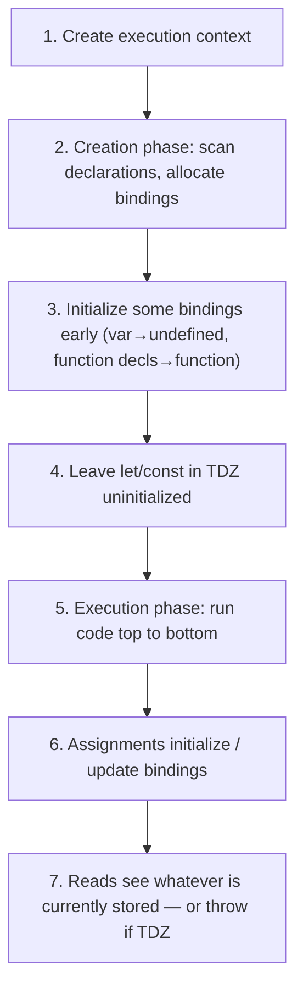
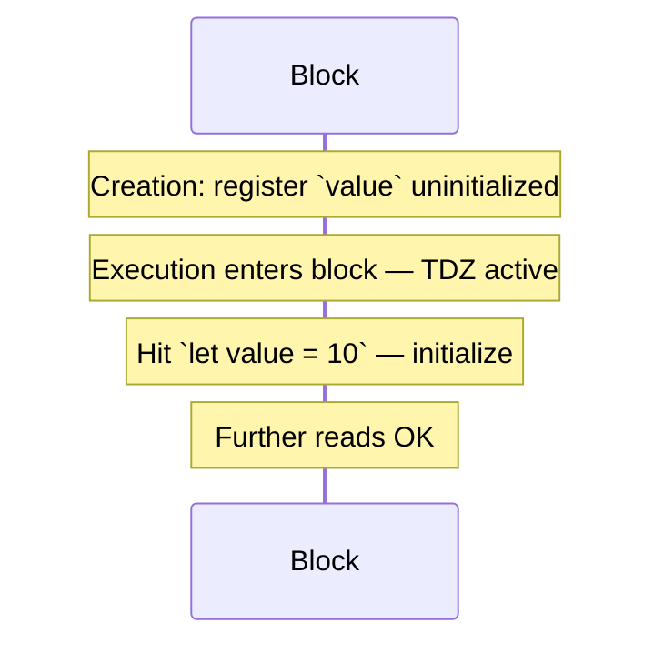
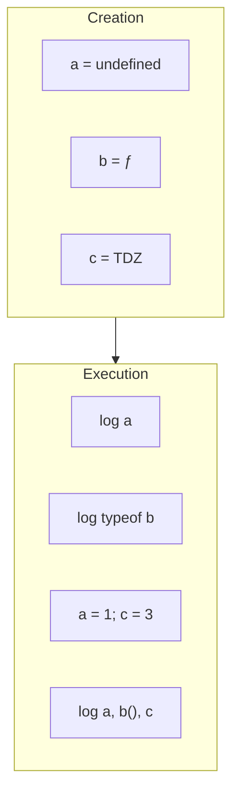
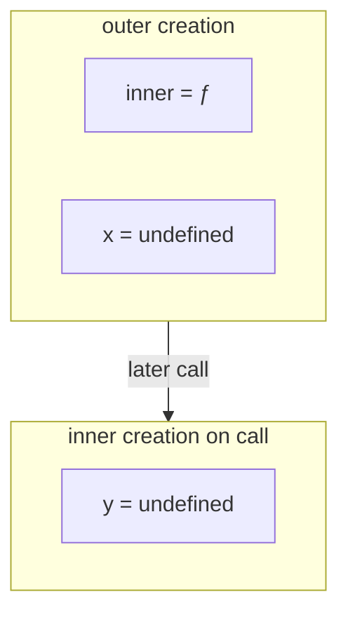

# Hoisting

This chapter teaches **why you can sometimes use a name before its line appears in the file** — and why other times you get a `ReferenceError`. You do not need to already know “hoisting” as a buzzword. By the end you should be able to walk through **Creation Phase → memory allocation → Execution Phase → assignments → access**, and explain **`var`, function declarations, `let`/`const` TDZ, and common traps**.

---

## 1. The confusing behavior people notice first

```ts
console.log(a) // undefined — not an error!
var a = 10

say() // works!
function say() {
  console.log("hi")
}

console.log(b) // ReferenceError!
let b = 20
```

It looks like the engine “moved” declarations to the top. The word **hoisting** comes from that metaphor. The accurate model is better:

> Declarations are processed during the **creation phase** of an [execution context](/javascript/02-execution-context), **before** the execution phase runs your statements in order.

Nothing is literally cut-and-pasted upward in your file. Memory for bindings is set up early; assignments still happen when their lines run.

---

## 2. The full pipeline — memorize this order

For a function call (or global/module evaluation), conceptually:



We will walk each step with code.

---

## 3. Creation phase — memory allocation in detail

### 3.1 What the engine scans for

During creation, the engine finds declarations such as:

- `var` names
- `function` declarations
- `let` / `const` / `class` names
- function parameters (for function contexts)

It creates **bindings** in the appropriate environment ([Scope](/javascript/03-scope)).

### 3.2 How different declarations are initialized

| Declaration | After creation phase, before its line runs |
| --- | --- |
| `var x` | Binding exists, value **`undefined`** |
| `function f() {}` | Binding exists, value is the **function object** |
| `let x` / `const x` | Binding exists, **uninitialized** (TDZ) |
| `class C {}` | Like `let` — TDZ until the class line runs |
| `var x = function() {}` | Name `x` is `undefined` until assignment (expression not hoisted as a function) |

### 3.3 Slow-motion: `var`

```ts
function demo() {
  console.log(x) // step A
  var x = 5      // step B
  console.log(x) // step C
}

demo()
```

**Creation phase for `demo`:**

1. See `var x`
2. Allocate `x` in the variable environment
3. Set `x = undefined`

**Execution phase:**

1. Step A: read `x` → `undefined`
2. Step B: assign `x = 5`
3. Step C: read `x` → `5`

Equivalent mental rewrite (not what the parser outputs, but helpful):

```ts
function demo() {
  var x // undefined
  console.log(x)
  x = 5
  console.log(x)
}
```

---

## 4. Execution phase — assignments and access

Assignments are **not** hoisted. Only the declaration machinery runs early.

```ts
console.log(n) // undefined
var n = 100
console.log(n) // 100
```

If you only remember one sentence:

> **Declaration is set up early; assignment stays in place.**

---

## 5. Function declarations — fully available early

```ts
alpha() // "alpha" — works before the line below

function alpha() {
  console.log("alpha")
}
```

**Creation:** binding `alpha` = the function.  
**Execution:** calling `alpha()` works anywhere in that scope after creation (including “above” the declaration in source order).

### 5.1 Nested example

```ts
function outer() {
  inner() // works

  function inner() {
    console.log("inner")
  }
}

outer()
```

`inner` is created when `outer`’s creation phase runs — each time `outer` is **called**.

### 5.2 Duplicate function declarations

```ts
function f() {
  return 1
}
function f() {
  return 2
}
console.log(f()) // 2 — later declaration wins in same scope (non-module / non-strict nuances exist)
```

Do not rely on duplicates; use unique names.

---

## 6. Function expressions — the name may hoist, the function may not

### 6.1 Anonymous function expression assigned to `var`

```ts
console.log(square) // undefined
// square(3)        // TypeError: square is not a function

var square = function (n: number) {
  return n * n
}

console.log(square(3)) // 9
```

Creation only sets `square = undefined`. The function object is created at the assignment line during execution.

### 6.2 `let` / `const` function expressions

```ts
// square(3) // ReferenceError — TDZ
const square = (n: number) => n * n
```

### 6.3 Named function expression

```ts
const fact = function f(n: number): number {
  if (n <= 1) return 1
  return n * f(n - 1) // internal name `f` for recursion
}
```

The outer binding is `fact`. The inner name `f` is local to the function expression — a separate topic from hoisting of `fact`.

---

## 7. `let` / `const` and the Temporal Dead Zone

### 7.1 Binding is “hoisted,” value is not ready

People say “`let` is not hoisted.” More precise:

> The binding is registered during creation, but remains uninitialized until the declaration line executes. Access before that → **TDZ `ReferenceError`**.

```ts
{
  // TDZ for value starts at block begin
  // console.log(value) // ReferenceError
  let value = 10
  console.log(value) // 10
}
```



### 7.2 `typeof` still throws in TDZ

```ts
{
  // typeof value // ReferenceError
  let value = 1
}
```

Unlike undeclared variables (`typeof nope === "undefined"`), TDZ is stricter.

### 7.3 Temporal across nested functions

```ts
function example() {
  function read() {
    return x
  }
  // return read() // ReferenceError if called here
  let x = 1
  return read() // 1
}
```

---

## 8. `class` declarations behave like `let`

```ts
// const p = new Person() // ReferenceError — TDZ
class Person {
  constructor(public name: string) {}
}
const p = new Person("Ada")
```

Class **expressions** follow the binding they are assigned to (`const P = class {}`).

---

## 9. Preferential order when names collide

Within the same scope, creation-phase rules roughly prioritize:

1. Parameters (function context)
2. Function declarations
3. `var` / other var-like

Exact conflict rules get sticky with duplicates across blocks in sloppy mode. Practical advice: **never reuse the same name for a function declaration and a `var` in one scope**.

```ts
var foo = 1
function foo() {}
console.log(typeof foo) // "function" in many classic cases — messy
```

Use modules + `let`/`const` and avoid collisions.

---

## 10. Parameter defaults and “hoisting” illusions

```ts
function f(a = 1, b = a) {
  return [a, b]
}
console.log(f()) // [1, 1]
```

```ts
function g(a = b, b = 1) {
  return [a, b]
}
// g() // ReferenceError — `b` in TDZ while evaluating default for `a`
```

Defaults run in a special scope; order matters. This is adjacent to hoisting/TDZ thinking.

---

## 11. Import hoisting (modules)

```ts
say() 
import { say } from "./mod.js"
```

Static `import` declarations are hoisted / linked before module evaluation. You can call imported bindings after linking even if the `import` line is visually lower — style guides still put imports at the top. Details: [Modules](/javascript/13-modules).

---

## 12. Why hoisting exists (historical / practical)

1. **Function declarations first** — allows mutually recursive functions and “declare helpers below, call above” style in older codebases.
2. **`var` semantics** — early JS had only `var`; uninitialized reads became `undefined` instead of hard failures.
3. Modern `let`/`const` kept **declaration scanning** (so shadowing/TDZ can be defined) but made early access an error — safer.

You do not need to love hoisting; you need to predict it.

---

## 13. Common traps — interview output drills

### Trap 1 — `var` in a block

```ts
function f() {
  console.log(x) // undefined
  if (true) {
    var x = 2
  }
  console.log(x) // 2
}
f()
```

`var x` is function-scoped; creation initializes it `undefined` for all of `f`.

### Trap 2 — function vs expression

```ts
console.log(typeof a) // "function"
console.log(typeof b) // "undefined"

function a() {}
var b = function () {}
```

### Trap 3 — TDZ shadowing

```ts
let x = 1
{
  // console.log(x) // ReferenceError — inner x in TDZ, not outer 1
  let x = 2
}
```

### Trap 4 — `for` + `var`

```ts
for (var i = 0; i < 3; i++) {
  setTimeout(() => console.log(i), 0)
}
// 3 3 3
```

Hoisting/`var` scope: one `i`. Fix with `let` ([Scope](/javascript/03-scope), [Closures](/javascript/05-closures)).

### Trap 5 — duplicate `var`

```ts
var x = 1
var x = 2
console.log(x) // 2 — allowed with var
```

```ts
let y = 1
// let y = 2 // SyntaxError
```

### Trap 6 — conditional function declarations

```ts
if (true) {
  function maybe() {
    return "yes"
  }
}
// Behavior historically varied by engine/mode — avoid declaring functions inside blocks; use const fn = () => {}
```

### Trap 7 — reading before assignment with `var` in loops

```ts
var funcs = []
for (var i = 0; i < 3; i++) {
  funcs.push(function () {
    return i
  })
}
console.log(funcs.map((f) => f())) // [3, 3, 3]
```

Same shared binding story — not “timer magic.”

### Trap 8 — `const` must initialize

```ts
// const z // SyntaxError — missing initializer
const z = 1
```

---

## 14. End-to-end walkthrough (say this in an interview)

Code:

```ts
function demo() {
  console.log(a)
  console.log(typeof b)
  // console.log(c)

  var a = 1
  function b() {
    return 2
  }
  let c = 3

  console.log(a, b(), c)
}

demo()
```

**Creation phase of `demo`:**

| Name | State |
| --- | --- |
| `a` | `undefined` |
| `b` | function |
| `c` | uninitialized (TDZ) |

**Execution:**

1. `console.log(a)` → `undefined`
2. `console.log(typeof b)` → `"function"`
3. If `console.log(c)` → `ReferenceError`
4. `a = 1`
5. `c = 3` (leaves TDZ)
6. Final log → `1 2 3`



---

## 15. Mental checklist when you see a name “used early”

1. Is it `function declaration`? → likely callable.
2. Is it `var`? → readable as `undefined` before assignment.
3. Is it `let`/`const`/`class`? → TDZ until its line.
4. Is it a `function` **expression** assigned later? → name may exist early (`var`) but not be a function yet.
5. Is it an `import`? → linked before evaluation, still put imports at top for humans.

---

## 16. Access timeline — one diagram for all declaration kinds

```ts
function timeline() {
  // --- after creation, before any body line runs ---
  // a: undefined (var)
  // b: function
  // c: TDZ (let)
  // d: TDZ (const)
  // e: undefined (var), not yet a function

  console.log(a)
  console.log(b())
  // console.log(c)
  // console.log(d)
  // e()

  var a = 1
  function b() {
    return "b"
  }
  let c = 3
  const d = 4
  var e = function () {
    return "e"
  }

  console.log(a, b(), c, d, e())
}
```

| Moment | `a` | `b` | `c` | `d` | `e` |
| --- | --- | --- | --- | --- | --- |
| After creation | `undefined` | ƒ | TDZ | TDZ | `undefined` |
| After all assignments | `1` | ƒ | `3` | `4` | ƒ |

If you can fill this table for any snippet, you understand hoisting.

---

## 17. Nested scopes — hoisting is per environment

```ts
function outer() {
  console.log(typeof inner) // "function" — inner's declaration in outer
  // console.log(x) // undefined if var x below; TDZ if let x

  function inner() {
    // console.log(y) // undefined (var) or TDZ (let)
    var y = 1
    return y
  }

  var x = 10
  return inner()
}
```

Creation of `outer` sets up `inner` and `x`. Creation of `inner` (when `inner` is **called**) sets up `y`. Hoisting does not pull `y` into `outer`.



---

## 18. More output drills (write answers before running)

### Drill A

```ts
var a = 1
function f() {
  console.log(a)
  var a = 2
  console.log(a)
}
f()
```

**Answer:** `undefined` then `2`. Inner `var a` shadows outer; creation sets local `a = undefined`.

### Drill B

```ts
function f() {
  // console.log(a)
  let a = 1
  {
    // console.log(a)
    let a = 2
    console.log(a)
  }
  console.log(a)
}
f()
```

**Answer:** `2` then `1`. Uncommented early logs throw TDZ for the binding of that block.

### Drill C

```ts
console.log(foo())
function foo() {
  return bar()
  function bar() {
    return 1
  }
}
```

**Answer:** `1`. Both declarations are available after their scopes’ creation phases.

### Drill D

```ts
var foo = 1
function bar() {
  if (!foo) {
    var foo = 10
  }
  console.log(foo)
}
bar()
```

**Answer:** `10`. `var foo` inside `bar` is function-scoped and shadows the outer `foo`; starts `undefined` (falsy), then assigned `10`.

---

## 19. How to explain hoisting in one minute (script)

> “When a function runs, JavaScript first creates an execution context and registers declarations. `var` names get `undefined`, function declarations get the real function, and `let`/`const` exist but stay uninitialized until their line — that’s the TDZ. Then it runs the body. So it looks like declarations floated up, but assignments stay put. That’s why `console.log(x)` before `var x = 1` prints `undefined`, and the same pattern with `let` throws.”

Practice saying that without notes.

---

## Interview Questions

### Q1. What is hoisting, precisely?
**Expected:** During creation phase, declarations are registered/initialized per rules before execution assigns and runs statements — not literal code moving.  
**Common wrong:** “JavaScript moves lines to the top of the file.”  
**Follow-ups:** Creation vs execution phase?

### Q2. Why does `console.log(x)` before `var x = 1` print `undefined`?
**Expected:** `var x` allocated and set to `undefined` in creation; assignment `= 1` happens later.  
**Common wrong:** “x does not exist yet.”  
**Follow-ups:** What if it were `let`?

### Q3. Are `let` and `const` hoisted?
**Expected:** Their bindings are created at the start of the scope but uninitialized (TDZ) until the declaration executes.  
**Common wrong:** Flat “no.”  
**Follow-ups:** What does TDZ stand for / cause?

### Q4. Difference between function declaration and function expression regarding hoisting?
**Expected:** Declarations are available as functions throughout the scope after creation; `var f = function(){}` only hoists `f` as `undefined`.  
**Common wrong:** “Both hoist the same way.”  
**Follow-ups:** What about `const f = () => {}`?

### Q5. Why do people get `ReferenceError` instead of `undefined` with `let`?
**Expected:** TDZ — access before initialization is an error by design.  
**Common wrong:** “The variable was never declared.”  
**Follow-ups:** `typeof` on a TDZ binding?

### Q6. Predict output: function declaration after call vs `var` async loop.
**Expected:** Be able to walk creation/execution and shared `var` bindings.  
**Common wrong:** Guessing without a phase model.  
**Follow-ups:** How does `let` in `for` change closures?

## Common Mistakes

- Explaining hoisting as physical code rearrangement.
- Saying “`let` is not hoisted” without mentioning TDZ.
- Calling a `var`-assigned function expression before assignment → `TypeError`.
- Declaring functions inside `if` blocks and assuming consistent behavior.
- Forgetting imports are linked before module body runs.
- Mixing up `SyntaxError` (bad `const` with no initializer) vs TDZ `ReferenceError`.

## Trade-offs / Production Notes

- Write declarations **before** use for readability — do not rely on hoisting style.
- Prefer `const`/`let` + function expressions / arrow functions in blocks.
- Enable lint rules (`no-use-before-define`, no `var`) to make TDZ/hoisting footguns rare.
- Related: [Execution Context](/javascript/02-execution-context), [Scope](/javascript/03-scope), [Closures](/javascript/05-closures), [Modules](/javascript/13-modules), [Functions](/javascript/09-functions).
