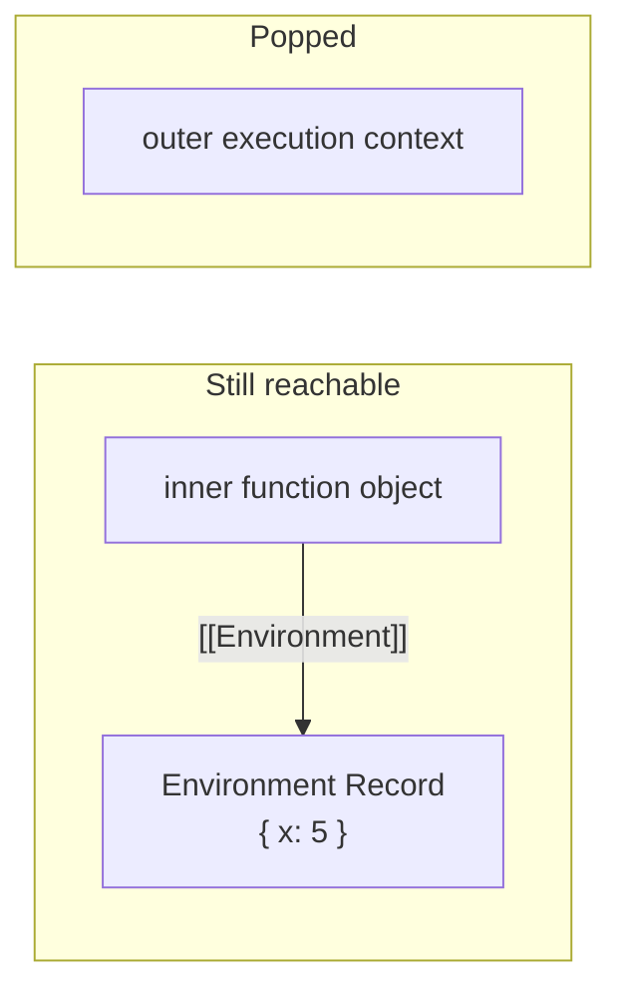
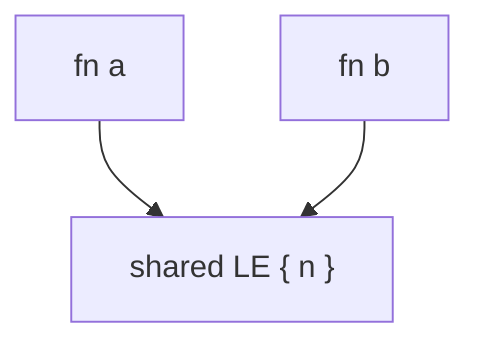
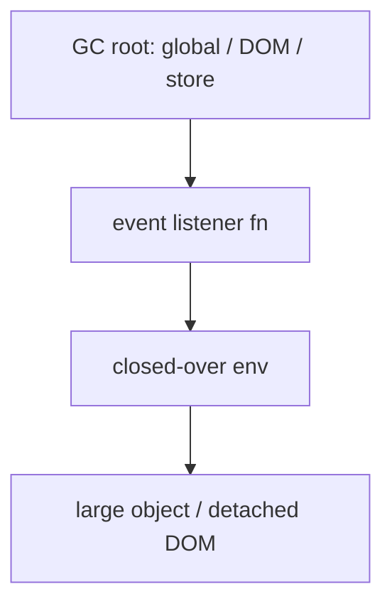

# Closures

A **closure** is a function bundled with its **lexical environment** — the bindings it can reach by walking the scope chain. Interview bar: explain *what is retained*, *why engines keep it*, and *when it leaks*.

## Definition that survives follow-ups

```ts
function outer(x: number) {
  return function inner(y: number) {
    return x + y // x is free → resolved in outer's environment
  }
}

const add5 = outer(5)
add5(10) // 15
```

After `outer` returns, its **execution context** is gone. The **lexical environment** that holds `x` remains reachable from `inner`, so it is not GC'd.



**Capture is by reference to bindings**, not a snapshot of values:

```ts
function make() {
  let n = 0
  return {
    inc: () => ++n,
    get: () => n,
  }
}
const c = make()
c.inc()
c.get() // 1 — shared mutable binding
```

---

## What is actually stored?

Engines differ (V8 Context / ContextExtension, SpiderMonkey environments), but the interview-accurate model:

| Artifact | Contains | Lifetime |
| --- | --- | --- |
| Function object | bytecode / feedback + pointer to lexical environment | while references exist |
| Lexical environment | environment record + `outer` link | while any closure (or child env) references it |
| Environment record | slots for `let`/`const`/`var`/params | same |
| Execution context | temporary activation (`this`, stack state) | call duration only |

### Not a private copy of the whole scope

Naive myth: "the closure copies all local variables." Reality:

- The function retains a link to an **environment**.
- Engines often **optimize** to keep only variables that escape (are used by nested functions).
- If *any* variable in an environment escapes, sometimes siblings stay alive too (implementation detail — don't rely on partial GC of one binding).

```ts
function big() {
  const huge = new Array(1e6).fill(0)
  const tiny = 1
  return () => tiny
  // Hope: huge GC'd. Reality: may or may not — depends on env sharing.
}
```

Safer pattern when retaining a long-lived closure:

```ts
function big() {
  const huge = new Array(1e6).fill(0)
  const tiny = 1
  // use huge...
  return ((t: number) => () => t)(tiny) // only t escapes
}
```

### Shared environments across multiple closures

```ts
function pair() {
  let n = 0
  return {
    a: () => ++n,
    b: () => n,
  }
}
const { a, b } = pair()
a()
b() // 1 — same environment record
```



---

## Why closures exist (design purpose)

1. **Data hiding / encapsulation** without classes  
2. **Partial application / currying** — bake in config  
3. **Callbacks** that remember request/user/context  
4. **Module pattern** (pre-ESM) and factory functions  
5. **Hooks & middleware** — stateful behavior as first-class values  

Without closures, you'd pass context objects everywhere (`ctx.n`, `ctx.user`) or use globals. Closures are the language's lightweight capability for **capability-based** APIs: give a function, not the raw binding.

```ts
function createBank(initial: number) {
  let balance = initial
  return {
    deposit: (n: number) => {
      balance += n
    },
    withdraw: (n: number) => {
      if (n > balance) throw new Error("insufficient")
      balance -= n
    },
    getBalance: () => balance,
  }
}
// no public write to balance except through methods
```

---

## Creation time vs call time

| | Lexical variables (`x`) | `this` (non-arrow) | `arguments` |
| --- | --- | --- | --- |
| Resolved | Definition scope | Call site | Call (non-arrow) |
| Closed over? | yes | arrows only | rare / avoid |

```ts
const obj = {
  x: 1,
  make() {
    return () => this.x // arrow closes over this from make
  },
  makeBad() {
    return function () {
      return this.x // this from call site
    }
  },
}

const f = obj.make()
f() // 1
const g = obj.makeBad()
g() // undefined / global — lost receiver
```

---

## Classic interview puzzles

### Loop + `var`

```ts
function build() {
  const out: Array<() => number> = []
  for (var i = 0; i < 3; i++) {
    out.push(() => i)
  }
  return out
}
build().map((f) => f()) // [3,3,3]
```

One binding `i`, mutated to `3`. Fix: `let`, or IIFE / `bind`, or push with parameter capture.

### Accidental capture in async

```ts
for (var i = 0; i < 3; i++) {
  setTimeout(() => console.log(i), 0)
}
// 3 3 3
```

Same binding issue; timers fire after the loop. See [Event Loop](/javascript/10-event-loop).

### Returning methods that share state

```ts
function Counter() {
  let n = 0
  this.inc = () => ++n
  this.get = () => n
}
```

Prototype methods wouldn't close over per-instance `n` unless stored on `this` — factory + closure vs class fields trade-off.

---

## Memory & GC — when closures leak

A closure keeps its environment alive. Leaks = **long-lived references** to functions that close over **large** or **growing** data.



### Patterns that retain memory

| Pattern | Retention |
| --- | --- |
| `element.addEventListener('click', handler)` | handler → env → anything it closes over |
| React `useEffect(() => {...}, [])` | effect closure until cleanup / unmount |
| Express middleware factory | per-app lifetime |
| Module-level caches inside closures | process lifetime |
| Uncleared `setInterval` | forever until clear |

### Detached DOM example

```ts
function setup(button: HTMLButtonElement) {
  const panel = document.getElementById("panel") // large subtree
  button.addEventListener("click", () => {
    console.log(panel?.id)
  })
  // even if panel removed from document, listener may keep it alive
}
```

Mitigations: remove listeners, `AbortController`, null out refs, close over IDs not nodes, WeakRef/WeakMap where appropriate.

### Growing closed-over arrays

```ts
function logger() {
  const lines: string[] = []
  return (msg: string) => {
    lines.push(msg) // grows forever if fn lives forever
    console.log(msg)
  }
}
```

### Module singleton "closures"

```ts
// auth.ts
let secret: string | null = null
export function setSecret(s: string) {
  secret = s
}
export function getSecret() {
  return secret
}
```

Module scope *is* a long-lived environment — intentional for DI, dangerous for unbounded caches.

Deep dive: [Memory Management](/javascript/12-memory).

---

## Nested closures & scope chain length

```ts
function a(x: number) {
  return function b(y: number) {
    return function c(z: number) {
      return x + y + z
    }
  }
}
a(1)(2)(3) // 6
```

Each level adds an environment link. Engines optimize, but deep nesting is a readability cost. Prefer flattening or explicit context objects for deep pipelines.

---

## IIFE and the module pattern

```ts
const api = (function () {
  const privateKey = "..."
  function sign(payload: string) {
    return privateKey + payload
  }
  return { sign }
})()
```

ESM replaced most IIFE modules; still appears in bundles, bookmarklets, and isolating `var`.

---

## Partial application & factories

Closures are the implementation mechanism for curry/partial — see [Functions](/javascript/09-functions).

```ts
function multiply(a: number) {
  return (b: number) => a * b
}
const double = multiply(2)
```

Config baked at creation; call sites stay thin.

---

## React examples {#react-stale-closures}

### Stale closure in effects / handlers

```tsx
function Search({ query }: { query: string }) {
  useEffect(() => {
    const id = setInterval(() => {
      console.log(query) // may be stale if deps wrong
    }, 1000)
    return () => clearInterval(id)
  }, []) // ❌ empty deps — forever sees initial query
  return null
}
```

Fix: include `query` in deps, or use a ref for latest value:

```tsx
function Search({ query }: { query: string }) {
  const queryRef = useRef(query)
  queryRef.current = query

  useEffect(() => {
    const id = setInterval(() => {
      console.log(queryRef.current) // always latest
    }, 1000)
    return () => clearInterval(id)
  }, [])
  return null
}
```

### Functional `setState` avoids stale state

```tsx
setCount((c) => c + 1) // not setCount(count + 1) inside async
```

### `useCallback` closes over deps

```tsx
const onSave = useCallback(() => {
  save(userId)
}, [userId]) // new function when userId changes — intentional
```

Missing deps → stale; over-broad deps → churn. Closures are why the dependency array exists.

### Custom hooks as closure factories

```tsx
function useAuthHeader(token: string | null) {
  return useCallback(
    (init: RequestInit = {}): RequestInit => ({
      ...init,
      headers: {
        ...init.headers,
        ...(token ? { Authorization: `Bearer ${token}` } : {}),
      },
    }),
    [token],
  )
}
```

### Event handlers and list items

```tsx
items.map((item) => (
  <button key={item.id} onClick={() => select(item.id)}>
    {item.name}
  </button>
))
```

Each handler closes over `item` / `id`. Fine at moderate scale; for huge lists, prefer delegation (one listener) to cut function allocation — measure first.

### React Strict Mode double-mount

Effects run twice in dev — closures in setup/cleanup must be idempotent; don't assume single subscription without cleanup.

---

## Express middleware {#express-middleware}

Middleware factories are closures over config and shared state.

```ts
import type { Request, Response, NextFunction } from "express"

function rateLimit(opts: { windowMs: number; max: number }) {
  const hits = new Map<string, { count: number; reset: number }>()

  return function rateLimitMiddleware(
    req: Request,
    res: Response,
    next: NextFunction,
  ) {
    const key = req.ip ?? "unknown"
    const now = Date.now()
    let entry = hits.get(key)
    if (!entry || now > entry.reset) {
      entry = { count: 0, reset: now + opts.windowMs }
      hits.set(key, entry)
    }
    entry.count++
    if (entry.count > opts.max) {
      res.status(429).json({ error: "too many requests" })
      return
    }
    next()
  }
}

// app.use(rateLimit({ windowMs: 60_000, max: 100 }))
```

What lives forever:

- `hits` Map — **process lifetime** (memory leak if unbounded keys — use TTL eviction / Redis).
- `opts` — small, fine.

```ts
function requireRole(role: string) {
  return (req: Request, res: Response, next: NextFunction) => {
    const user = (req as Request & { user?: { roles: string[] } }).user
    if (!user?.roles.includes(role)) {
      res.status(403).end()
      return
    }
    next()
  }
}
```

Closure over `role` string — cheap, correct.

### Request-scoped vs app-scoped capture

```ts
// ❌ capturing mutable req across async if reused wrongly
function bad() {
  let lastReq: Request
  return (req: Request, _res: Response, next: NextFunction) => {
    lastReq = req
    setTimeout(() => {
      console.log(lastReq.url) // may be a later request
    }, 100)
    next()
  }
}
```

Always close over the *current* `req` in the same tick's callback, or copy needed fields:

```ts
return (req, _res, next) => {
  const url = req.url
  setTimeout(() => console.log(url), 100)
  next()
}
```

Related: [Node middleware](/node/09-middleware), [JWT & Auth](/node/08-jwt-auth).

---

## Event listeners {#event-listeners}

```ts
function onOutsideClick(el: HTMLElement, cb: () => void) {
  function handler(e: MouseEvent) {
    if (!el.contains(e.target as Node)) cb()
  }
  document.addEventListener("click", handler)
  return () => document.removeEventListener("click", handler)
}
```

`handler` closes over `el` and `cb`. The returned disposer must run or the pair leaks.

### AbortController pattern

```ts
function listen(
  target: EventTarget,
  type: string,
  fn: EventListener,
  signal: AbortSignal,
) {
  target.addEventListener(type, fn, { signal })
}

const ac = new AbortController()
listen(window, "resize", () => resize(), ac.signal)
// unmount:
ac.abort() // removes all listeners registered with signal
```

### Closures vs `bind`

```ts
button.addEventListener("click", this.onClick.bind(this))
// bind creates a new function — must store ref to remove
```

Prefer arrows on class fields or AbortController for cleanup hygiene.

---

## Auth patterns {#auth}

### Token in a closure (SPA)

```ts
function createApiClient(getToken: () => string | null) {
  return {
    async fetch(input: RequestInfo, init: RequestInit = {}) {
      const token = getToken()
      const headers = new Headers(init.headers)
      if (token) headers.set("Authorization", `Bearer ${token}`)
      return fetch(input, { ...init, headers })
    },
  }
}

let accessToken: string | null = null
const api = createApiClient(() => accessToken)
// logout: accessToken = null — client stays; capability revoked
```

Better than baking a string at creation time: close over a **getter** so refresh works without recreating the client.

### Refresh single-flight

```ts
function createAuth(refresh: () => Promise<string>) {
  let token: string | null = null
  let inflight: Promise<string> | null = null

  async function getToken() {
    if (token) return token
    if (!inflight) {
      inflight = refresh().then((t) => {
        token = t
        inflight = null
        return t
      })
    }
    return inflight
  }

  function clear() {
    token = null
    inflight = null
  }

  return { getToken, clear }
}
```

State (`token`, `inflight`) is private via closure — classic encapsulation.

### Server: signing key not on `req`

```ts
function createJwtMiddleware(secret: string) {
  return async (req: Request, res: Response, next: NextFunction) => {
    const hdr = req.headers.authorization
    if (!hdr?.startsWith("Bearer ")) {
      res.status(401).end()
      return
    }
    try {
      // verify(hdr.slice(7), secret) — secret never attached to req
      next()
    } catch {
      res.status(401).end()
    }
  }
}
```

Closing over `secret` keeps it out of logs that dump `req`. Still: secret lives in process memory — protect heap dumps / debug endpoints.

### Capability tokens as functions

```ts
type DeleteUser = (id: string) => Promise<void>

function makeDeleteUser(db: Db, actor: Actor): DeleteUser | null {
  if (!actor.perms.includes("user:delete")) return null
  return async (id) => {
    await db.users.delete({ id, tenantId: actor.tenantId })
  }
}
```

If you never hand out the function, the caller cannot delete — **closure as authorization**. Prefer over boolean flags when composing services.

---

## Closures vs objects vs classes

| Approach | Privacy | Testability | Overhead |
| --- | --- | --- | --- |
| Closure factory | true privacy | inject deps into factory | per-instance functions |
| Class + `#private` | true privacy | prototype sharing for methods | fields on instance |
| Class + public fields | none | easy spy | shared methods |
| Module singleton | privacy by convention | hard to reset in tests | one env |

```ts
// class private
class Counter {
  #n = 0
  inc() {
    return ++this.#n
  }
}
```

Prototype methods are shared; closed-over methods are per-instance. For millions of instances, class methods win memory; for few rich capabilities, closures are fine.

---

## Debugging closures

- Chrome DevTools: Scope pane → Closure section when paused inside the function.
- `console.dir(fn)` — not reliable for env contents.
- Heap snapshots: search for detached HTMLElement retained by listener → closure.
- Name functions (`function rateLimitMiddleware`) for stack traces.

```ts
return function rateLimitMiddleware(req, res, next) {
  /* ... */
}
```

---

## Performance notes

- Creating a function allocates; closing over variables can prevent some optimizations / keep contexts.
- Avoid defining heavy closures inside hot tight loops without need.
- Don't prematurely hoist everything to module scope — clarity first; profile second.
- V8: consistently shaped closures optimize better than megamorphic call sites.

---

## Mental checklist in code review

1. What does this function close over?  
2. How long does the function live?  
3. Is anything large / DOM / request-scoped in that env?  
4. Is there a cleanup path (removeListener, effect return, clearInterval)?  
5. Are we capturing a binding that mutates (stale vs shared state)?  

---

## Interview Questions

**Q: What is a closure?**  
A function plus the lexical environment it was defined in, retaining access to free variables after the outer function has returned.

**Q: Do closures store values or references?**  
Bindings (mutable references to variables), not frozen snapshots — unless you copy into a new binding.

**Q: Why did `var` in a loop bite people?**  
One function-scoped binding shared by all closures; `let` creates per-iteration bindings.

**Q: How can closures cause memory leaks?**  
Long-lived function references (listeners, intervals, caches, module state) keep environments — and everything those environments point to — alive.

**Q: Closures vs private class fields?**  
Both can encapsulate. Closures: per-function env, great for factories/middleware. `#fields`: clearer OOP shape, shared prototype methods.

**Q: What is a stale closure in React?**  
A callback/effect that captured an old binding because dependencies weren't updated; reads outdated props/state.

**Q: How does Express middleware use closures?**  
Factories close over config and shared state; returned `(req,res,next)` is the closure used for every request.

**Q: Can you GC part of a closed-over environment?**  
Not something to rely on; if the env is reachable, treat sibling bindings as potentially retained. Structure code so large data isn't in the same env as long-lived tiny captures.

**Q: Difference between closing over `this` with arrow vs `function`?**  
Arrow lexical `this`; classic `function` gets `this` from the call site and does not close over `this` as a variable.

**Q: Module scope — is that a closure?**  
Top-level functions close over the module environment. The module env is a long-lived "closure space."

## Common Mistakes

- Assuming closures deep-copy closed values.
- Forgetting to remove event listeners / clear intervals.
- Empty React dep arrays with used props/state.
- Closing over entire `req`/`res` or large props when only one field is needed.
- Unbounded Maps inside middleware factories (rate limit by IP without eviction).
- Creating new closures every render without memoization when referential equality matters (context providers).
- Using `var` in async loops.
- Logging secrets held in closures via accidental `util.inspect` on rich objects.

## Trade-offs / Production Notes

- Prefer **short-lived** closures for request handlers; put multi-gb caches in dedicated stores with TTL (Redis) — see [Redis](/backend/05-redis).
- Auth: close over getters / refresh logic, not forever-fixed tokens.
- React: understand stale closures before adding refs everywhere — deps are usually the right fix.
- Memory: pair every `addEventListener` / `subscribe` with disposal; AbortController scales well.
- Related: [Scope](/javascript/03-scope), [this](/javascript/06-this), [Event Loop](/javascript/10-event-loop), [Memory](/javascript/12-memory), [Node event loop](/node/02-event-loop).

---

## Appendix — closure interview whiteboard

Draw three boxes:

1. **Function object** — code + `[[Environment]]` pointer  
2. **Environment record** — slots (`n`, `user`, `secret`)  
3. **Outer link** — chain to module/global  

Then narrate a leak: DOM root → listener → env → large panel. Cut the edge with `removeEventListener` / `AbortController`.

### Snapshot vs binding (force the distinction)

```ts
function snap() {
  let n = 0
  const frozen = n // copy value now
  return {
    live: () => ++n,
    snap: () => frozen,
    get: () => n,
  }
}
const s = snap()
s.live()
s.get() // 1
s.snap() // 0
```

### Once / memoize via closure

```ts
function once<F extends (...args: any[]) => any>(fn: F): F {
  let called = false
  let result: ReturnType<F>
  return function (this: unknown, ...args: any[]) {
    if (!called) {
      called = true
      result = fn.apply(this, args)
    }
    return result
  } as F
}
```

### Pub/sub with private subscribers

```ts
function createEmitter<T>() {
  const subs = new Set<(v: T) => void>()
  return {
    subscribe(fn: (v: T) => void) {
      subs.add(fn)
      return () => {
        subs.delete(fn)
      }
    },
    emit(v: T) {
      for (const fn of subs) fn(v)
    },
  }
}
```

`subs` is unreachable except through the returned API — classic module/factory encapsulation.

### React Query / SWR style stale-while-revalidate (closure cache)

```ts
function createSWR<T>(key: string, loader: () => Promise<T>) {
  let data: T | undefined
  let inflight: Promise<T> | null = null
  const listeners = new Set<(v: T) => void>()

  async function revalidate() {
    if (!inflight) {
      inflight = loader().then((v) => {
        data = v
        inflight = null
        listeners.forEach((l) => l(v))
        return v
      })
    }
    return inflight
  }

  return {
    getSnapshot: () => data,
    subscribe: (l: (v: T) => void) => {
      listeners.add(l)
      return () => {
        listeners.delete(l)
      }
    },
    revalidate,
  }
}
```

Same shape as many client caches — closures hold `data` / `inflight` / `listeners` for the lifetime of the store.

### Express: compose middleware with closed-over logger

```ts
function withRequestId(generate = () => crypto.randomUUID()) {
  return (req: any, res: any, next: any) => {
    const id = generate()
    req.id = id
    res.setHeader("x-request-id", id)
    const log = (...args: unknown[]) => console.log(id, ...args)
    req.log = log
    next()
  }
}
```

Each request gets a `log` closure over that request's `id` — no AsyncLocalStorage required for the simple case (ALS still better for deep call stacks — know both).

### Event listener + React cleanup pairing

```tsx
useEffect(() => {
  const ac = new AbortController()
  const onKey = (e: KeyboardEvent) => {
    if (e.key === "Escape") onClose()
  }
  window.addEventListener("keydown", onKey, { signal: ac.signal })
  return () => ac.abort()
}, [onClose])
```

If `onClose` is unstable, effect re-runs often — wrap `onClose` in `useCallback` or read from a ref to avoid churn while still closing over the latest behavior.
