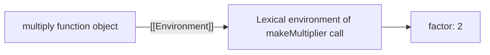
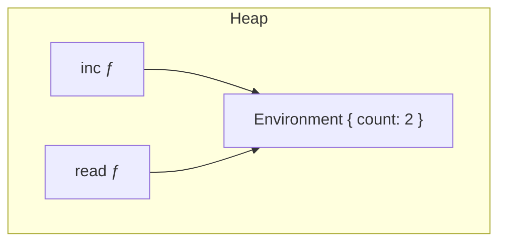
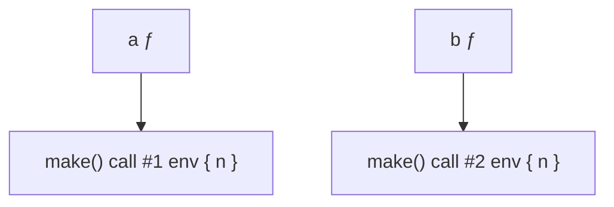
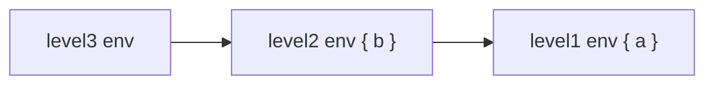
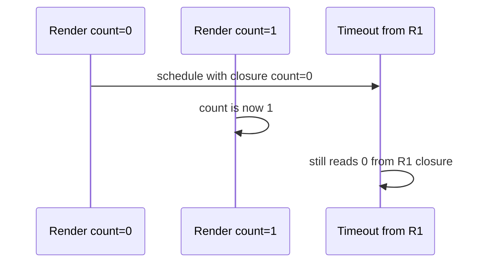

# Closures

This chapter teaches closures from scratch. You do not need to already know the word “closure,” “free variable,” or “lexical environment.” By the end you should be able to explain **what a closure is**, **what data is actually retained**, **why the language needs this behavior**, **how memory and garbage collection interact with closures**, and **how closures show up in React, Express, event listeners, and auth code**.

Prerequisites worth skimming first: [Scope](/javascript/03-scope), [Execution Context](/javascript/02-execution-context). You can still start here — we rebuild the needed ideas.

---

## 1. The problem closures solve

You want a function that **remembers** something from when it was created:

```ts
function makeMultiplier(factor: number) {
  return function multiply(n: number) {
    return n * factor
  }
}

const double = makeMultiplier(2)
const triple = makeMultiplier(3)

console.log(double(5)) // 10
console.log(triple(5)) // 15
```

After `makeMultiplier(2)` returns, that call’s stack frame is gone. Yet `double` still knows `factor` is `2`.

Without a mechanism to keep `factor` alive, this pattern would be impossible. That mechanism is the **closure**.

Plain-language definition:

> A **closure** is a function bundled with the **outer variables it needs** — the function can use those variables even after the outer function has finished running.

Slightly more precise:

> A closure is a function plus a reference to the **lexical environment** in which it was created, so free variables resolve to the bindings from that environment.

---

## 2. Free variables — the names that force a closure

Inside `multiply`, `n` is a **parameter** (local). `factor` is **not declared** in `multiply` — it comes from outside. `factor` is a **free variable** relative to `multiply`.

```ts
return function multiply(n: number) {
  return n * factor // `factor` is free here
}
```

Whenever a function uses free variables, the engine must remember where those names live. That remembered link is what people mean by “the function closes over `factor`.”



You do not write `[[Environment]]` in code — it is an internal slot. DevTools “Scope → Closure” panels show the same idea.

---

## 3. What is actually stored? (not a snapshot of values)

### 3.1 Wrong intuition: “it copied the number 2”

Many people think:

```ts
const double = makeMultiplier(2)
// surely `double` stored a private copy of the value 2 forever?
```

For primitives this **looks** similar to a copy, but the accurate model is:

> The closure keeps a **live reference to the binding** (the variable itself), not a frozen photocopy of whatever value it had at creation time — unless you create a new binding per closure (e.g. loop `let`).

### 3.2 Live bindings — mutation is visible

```ts
function makeWatcher() {
  let count = 0

  function inc() {
    count++
  }

  function read() {
    return count
  }

  return { inc, read }
}

const w = makeWatcher()
console.log(w.read()) // 0
w.inc()
w.inc()
console.log(w.read()) // 2 — same `count` binding
```

Both `inc` and `read` close over the **same** `count` binding.



### 3.3 Objects — the reference is retained

```ts
function attach(user: { name: string }) {
  return function label() {
    return `User: ${user.name}`
  }
}

const ada = { name: "Ada" }
const label = attach(ada)
ada.name = "Grace"
console.log(label()) // "User: Grace"
```

The closure retained the **reference** to the object. Mutating the object is visible. (Same reference rules as [Fundamentals](/javascript/01-fundamentals).)

### 3.4 What is *not* stored automatically

The closure retains bindings that are **reachable through free-variable needs** (engines can optimize, but conceptually: closed-over variables). It does not mean “the entire outer function’s stack frame stays on the call stack.” The outer **execution context** is popped; the **environment record** may remain on the heap.

```ts
function outer() {
  const huge = new Array(1_000_000).fill("x")
  const tiny = 1
  return function inner() {
    return tiny // only needs tiny
  }
}
```

In theory only `tiny` must be retained. In practice, engines vary; older engines sometimes retained more than expected. Do not assume `huge` is always freed — measure if it matters ([Memory](/javascript/12-memory)). Mentally: **closing over a value can extend its lifetime**.

---

## 4. Why closures exist (design purpose)

Closures are not an accident. They enable:

### 4.1 Data hiding / encapsulation

```ts
function createBankAccount(initial: number) {
  let balance = initial // private

  return {
    deposit(amount: number) {
      balance += amount
    },
    getBalance() {
      return balance
    },
  }
}

const acct = createBankAccount(100)
acct.deposit(50)
console.log(acct.getBalance()) // 150
// console.log(acct.balance) // undefined — no public field
```

Before ES modules / `#private` fields were common, this **module pattern** / revealing module pattern used closures for privacy.

### 4.2 Function factories / configuration

```ts
function makeLogger(prefix: string) {
  return (msg: string) => console.log(`${prefix}: ${msg}`)
}

const authLog = makeLogger("auth")
authLog("login ok")
```

### 4.3 Callbacks that need context

```ts
function loadUser(id: string, onDone: (name: string) => void) {
  fetch(`/api/users/${id}`)
    .then((r) => r.json())
    .then((user) => onDone(user.name))
}

function main() {
  const label = "User"
  loadUser("1", (name) => {
    console.log(label, name) // closes over `label`
  })
}
```

### 4.4 Partial application

```ts
function add(a: number, b: number) {
  return a + b
}

function partialAdd(a: number) {
  return (b: number) => add(a, b)
}

const add10 = partialAdd(10)
console.log(add10(5)) // 15
```

Closures are how JS does a lot of what other languages use objects or explicit “environment” structs for.

---

## 5. Creation time vs call time

### 5.1 Capture happens when the inner function is **created**

The lexical environment link is fixed when the function object is created (when the `function` / `=>` expression runs), not when you later call it.

```ts
function build() {
  let x = 1
  const f = () => x
  x = 2
  return f
}

const f = build()
console.log(f()) // 2 — live binding, current value
```

### 5.2 Call time only reads the binding

```ts
function make() {
  let n = 0
  return () => ++n
}

const a = make()
const b = make()
console.log(a()) // 1
console.log(a()) // 2
console.log(b()) // 1 — separate environment per make() call
```

Each call to `make()` creates a **new** environment. Closures from different calls do not share `n`.



---

## 6. Nested closures and the scope chain

```ts
function level1(a: number) {
  return function level2(b: number) {
    return function level3(c: number) {
      return a + b + c
    }
  }
}

console.log(level1(1)(2)(3)) // 6
```

`level3` closes over `a` and `b` through the chain:



Deep chains are powerful and can make code hard to follow. Prefer flatter structures when nesting is only for privacy.

---

## 7. Classic interview puzzles — slow walkthroughs

### 7.1 The `var` loop

```ts
const fns: Array<() => number> = []

for (var i = 0; i < 3; i++) {
  fns.push(function () {
    return i
  })
}

console.log(fns.map((f) => f())) // [3, 3, 3]
```

**Why:**

1. `var i` is **one** binding for the enclosing function/global.
2. Each pushed function closes over **that same** `i`.
3. After the loop, `i === 3`.
4. Calling the functions later reads `3`.

### 7.2 Fix with `let`

```ts
const fns: Array<() => number> = []

for (let i = 0; i < 3; i++) {
  fns.push(function () {
    return i
  })
}

console.log(fns.map((f) => f())) // [0, 1, 2]
```

`let` in a `for` head creates a **new binding per iteration**. Each function closes over a different `i`.

### 7.3 Fix with an IIFE (legacy)

```ts
const fns: Array<() => number> = []

for (var i = 0; i < 3; i++) {
  fns.push(
    (function (j) {
      return function () {
        return j
      }
    })(i),
  )
}
```

The IIFE creates a new function scope per iteration with parameter `j` holding the current `i`.

### 7.4 Closures and `this` (preview)

```ts
const obj = {
  n: 1,
  // bad for `this` if detached — see this chapter
  getN() {
    return this.n
  },
  // closure over obj via lexical this of arrow in methods — careful in objects
}
```

Closures capture **variables**. They do **not** magically fix `this` for traditional functions. Arrows capture lexical `this`. Full story: [`this`](/javascript/06-this).

---

## 8. Memory & GC — when closures keep things alive

### 8.1 Reachability

Garbage collection frees objects that are **unreachable**. A closure that references a binding keeps that binding’s value reachable.

```ts
function setup() {
  const cache = new Map<string, string>()
  cache.set("a", "big".repeat(10000))

  return function lookup(key: string) {
    return cache.get(key)
  }
}

const lookup = setup()
// `cache` stays alive as long as `lookup` is reachable
```

If you store `lookup` in a long-lived place (global, React state, a listener registry), `cache` lives too.

### 8.2 Accidental retention

```ts
function attachHandler(el: HTMLElement) {
  const huge = readHugeFile() // imagine a big string / buffer

  function onClick() {
    console.log("clicked", el.id)
    // forgot: we closed over `huge` even if we don't use it in the body?
    // If the body references huge, it is retained. If not, engine may drop it —
    // but if you reference it even once, it stays.
  }

  // Worse pattern: close over everything in scope unintentionally
  el.addEventListener("click", () => {
    console.log(huge.length) // pins huge for the listener's lifetime
  })
}
```

**Rule:** Anything a long-lived callback references can outlive the code that “felt temporary.”

### 8.3 Detaching listeners

```ts
function mount(el: HTMLElement) {
  const onScroll = () => {
    console.log(el.scrollTop)
  }
  window.addEventListener("scroll", onScroll)

  return function unmount() {
    window.removeEventListener("scroll", onScroll)
    // allow GC of onScroll → and anything it closed over
  }
}
```

Failing to remove listeners is a classic leak: the closure stays registered, retaining DOM nodes and data. Related: [Memory](/javascript/12-memory).

### 8.4 Modules as long-lived closures

```ts
// config.ts
let secret = "initial"

export function setSecret(s: string) {
  secret = s
}

export function getSecret() {
  return secret
}
```

Module scope is a long-lived environment. Exports that close over module state persist for the life of the module instance ([Modules](/javascript/13-modules)).

---

## 9. IIFE and the module pattern

```ts
const Counter = (function () {
  let n = 0

  function inc() {
    n++
  }

  function value() {
    return n
  }

  return { inc, value }
})()

Counter.inc()
console.log(Counter.value()) // 1
```

Slow walkthrough:

1. The outer function runs **immediately**.
2. It creates `n` and inner functions.
3. It returns a public API object.
4. Outer function ends; `n` remains via closures on `inc` / `value`.

Today ES modules often replace this pattern, but the **closure privacy** idea is the same.

---

## 10. Partial application & factories in real APIs

```ts
type FetchFn = (url: string, init?: RequestInit) => Promise<Response>

function createApiClient(baseUrl: string, fetchImpl: FetchFn = fetch) {
  return {
    get(path: string) {
      return fetchImpl(`${baseUrl}${path}`)
    },
    post(path: string, body: unknown) {
      return fetchImpl(`${baseUrl}${path}`, {
        method: "POST",
        headers: { "content-type": "application/json" },
        body: JSON.stringify(body),
      })
    },
  }
}

const api = createApiClient("https://example.com")
api.get("/users")
```

`get` / `post` close over `baseUrl` and `fetchImpl`. This is idiomatic “factory returns object of closures.”

---

## 11. React examples {#react-stale-closures}

React function components re-run on render. Event handlers and effects often **close over** props/state from a specific render. That is the source of **stale closure** bugs.

### 11.1 Stale state in a timeout

```tsx
import { useState } from "react"

export function BrokenCounter() {
  const [count, setCount] = useState(0)

  function handleClick() {
    setTimeout(() => {
      // closes over `count` from the render when handleClick was created
      console.log(count)
      setCount(count + 1) // may overwrite newer updates
    }, 1000)
  }

  return <button onClick={handleClick}>{count}</button>
}
```

If the user clicks quickly, each timeout may see an **old** `count`.

**Fix — functional updates:**

```tsx
setCount((c) => c + 1) // React gives latest state; less reliance on closed-over count
```

**Fix — refs for always-current values:**

```tsx
import { useEffect, useRef, useState } from "react"

export function LatestCountLogger() {
  const [count, setCount] = useState(0)
  const countRef = useRef(count)

  useEffect(() => {
    countRef.current = count
  }, [count])

  useEffect(() => {
    const id = setInterval(() => {
      console.log(countRef.current) // not a stale render snapshot
    }, 1000)
    return () => clearInterval(id)
  }, [])

  return <button onClick={() => setCount((c) => c + 1)}>{count}</button>
}
```

### 11.2 `useEffect` missing dependencies

```tsx
useEffect(() => {
  const id = setInterval(() => {
    console.log(count) // eslint warns: count should be a dependency
  }, 1000)
  return () => clearInterval(id)
}, []) // empty deps: effect closure forever sees initial count
```

The empty dependency array means: “create this effect closure once.” It captures the first render’s `count`.

**Mental model:** every render creates **new** function values. Effects/handlers close over the props/state from the render that created them — unless you use refs or functional updates.



### 11.3 Event handlers in lists

```tsx
function List({ items }: { items: string[] }) {
  return (
    <ul>
      {items.map((item) => (
        <li key={item}>
          <button
            onClick={() => {
              console.log(item) // closes over this iteration's item — good
            }}
          >
            {item}
          </button>
        </li>
      ))}
    </ul>
  )
}
```

Here closures are **desired**: each handler remembers its `item`.

### 11.4 Custom hooks as closure factories

```ts
import { useCallback, useState } from "react"

function useToggle(initial = false) {
  const [on, setOn] = useState(initial)
  const toggle = useCallback(() => setOn((v) => !v), [])
  return [on, toggle] as const
}
```

`toggle` closes over `setOn` (stable) and uses functional updates — a small, intentional closure.

---

## 12. Express middleware {#express-middleware}

### 12.1 Configuration closed over by middleware

```ts
import type { Request, Response, NextFunction } from "express"

function requireRole(role: string) {
  return function middleware(req: Request, res: Response, next: NextFunction) {
    const user = (req as any).user as { roles?: string[] } | undefined
    if (!user?.roles?.includes(role)) {
      res.status(403).json({ error: "forbidden" })
      return
    }
    next()
  }
}

// app.get("/admin", requireRole("admin"), handler)
```

`requireRole("admin")` returns a middleware function that **remembers** `role`.

### 12.2 Shared mutable state — careful

```ts
function rateLimit(limit: number) {
  const hits = new Map<string, number>()

  return function middleware(req: Request, res: Response, next: NextFunction) {
    const ip = req.ip ?? "unknown"
    const n = (hits.get(ip) ?? 0) + 1
    hits.set(ip, n)
    if (n > limit) {
      res.status(429).end()
      return
    }
    next()
  }
}
```

All requests share the same `hits` Map via one closure. That is useful (in-memory limiter) and dangerous (unbounded Map growth → memory leak; multi-instance deploys don’t share memory).

### 12.3 Per-request closures

```ts
app.use((req, res, next) => {
  const requestId = crypto.randomUUID()
  res.locals.log = (msg: string) => console.log(requestId, msg)
  next()
})
```

`res.locals.log` closes over `requestId` for that request.

---

## 13. Event listeners {#event-listeners}

```ts
function wireSearch(input: HTMLInputElement, onQuery: (q: string) => void) {
  let last = ""

  function handler() {
    const q = input.value.trim()
    if (q === last) return
    last = q
    onQuery(q)
  }

  input.addEventListener("input", handler)

  return () => input.removeEventListener("input", handler)
}
```

`handler` closes over `input`, `onQuery`, and `last`. The returned cleanup function closes over the **same** `handler` reference so removal works.

**Bug pattern:**

```ts
// cannot remove — each arrow is a new function
input.addEventListener("input", () => onQuery(input.value))
input.removeEventListener("input", () => onQuery(input.value)) // no-op
```

Keep a stable function reference (often a named function / closure you store).

---

## 14. Auth patterns {#auth}

### 14.1 Token in a closure

```ts
function createAuthClient(getToken: () => string | null) {
  return {
    async apiFetch(path: string) {
      const token = getToken()
      const headers: Record<string, string> = {}
      if (token) headers.authorization = `Bearer ${token}`
      return fetch(path, { headers })
    },
  }
}

let accessToken: string | null = null
const client = createAuthClient(() => accessToken)

accessToken = "abc"
client.apiFetch("/me")
```

`apiFetch` does not snapshot the token string forever if you pass a **getter**; it closes over `getToken`, which reads the latest token. If you closed over a string copy instead, you could go stale:

```ts
function createAuthClientStale(token: string) {
  return {
    apiFetch(path: string) {
      return fetch(path, {
        headers: { authorization: `Bearer ${token}` }, // frozen at create time
      })
    },
  }
}
```

### 14.2 Higher-order route guards

```ts
function withAuth(
  handler: (req: Request, res: Response) => void,
) {
  return (req: Request, res: Response) => {
    if (!(req as any).user) {
      res.status(401).end()
      return
    }
    handler(req, res)
  }
}
```

### 14.3 Curried permission checks

```ts
const can =
  (action: string) =>
  (user: { permissions: string[] }) =>
    user.permissions.includes(action)

const canEdit = can("edit")
canEdit({ permissions: ["edit", "view"] }) // true
```

Each arrow adds a closed-over layer (`action`, then `user`).

---

## 15. Closures vs objects vs classes

| Approach | Privacy | State | When it shines |
| --- | --- | --- | --- |
| Closure factory | Strong (by default) | In lexical env | Small APIs, middleware, hooks |
| Object / class | Public unless `#private` / convention | On `this` | Many methods, inheritance, `instanceof` |
| Module scope | File-private | Module env | Singletons, app config |

```ts
// Class equivalent flavor
class BankAccount {
  #balance: number
  constructor(initial: number) {
    this.#balance = initial
  }
  deposit(amount: number) {
    this.#balance += amount
  }
  getBalance() {
    return this.#balance
  }
}
```

Closures and classes both encapsulate. Prefer whatever your codebase already uses; be ready to translate between them in interviews.

---

## 16. Debugging closures

1. **Chrome DevTools:** set a breakpoint inside the inner function → Scope pane → “Closure” sections show retained bindings.
2. **Ask:** “When was this function created?” That render / that loop iteration / that `makeX()` call owns the environment.
3. **Stale values:** log both a closed-over variable and a ref/latest source.
4. **Memory:** heap snapshot → retainer path often goes through a context object tied to a listener or React fiber.

---

## 17. Performance notes

- Creating functions inside hot loops allocates many function objects + environments — sometimes measurable.
- React: new inline handlers each render can break `memo` / pure child optimizations — not because closures are slow, but because **referential identity** changes.
- Prefer clarity first; optimize when profiling shows allocation pressure.

---

## 18. Mental checklist in code review

1. Does this callback outlive the function that created it? (timers, listeners, hooks)
2. What bindings does it close over? Any large objects?
3. Is it intentionally sharing mutable state or accidentally?
4. In React: stale props/state risk? Missing effect deps?
5. Can the listener/subscription be cleaned up?
6. Would a class / explicit object make the state clearer?

---

## 19. Worked example — put it together

```ts
type User = { id: string; name: string }

function createUserService(apiBase: string) {
  const cache = new Map<string, User>()

  async function fetchUser(id: string): Promise<User> {
    const cached = cache.get(id)
    if (cached) return cached
    const res = await fetch(`${apiBase}/users/${id}`)
    const user = (await res.json()) as User
    cache.set(id, user)
    return user
  }

  function clearCache() {
    cache.clear()
  }

  function getCached(id: string) {
    return cache.get(id)
  }

  return { fetchUser, clearCache, getCached }
}

const users = createUserService("/api")
await users.fetchUser("1")
console.log(users.getCached("1"))
```

What you used:

- Factory creates a private `cache`
- Multiple methods share one environment
- Module-level `users` keeps that environment alive for the app lifetime

---

## Interview Questions

### Q1. What is a closure?
**Expected:** A function paired with its lexical environment so it can access free variables even after the outer function returns.  
**Common wrong:** “A function inside a function” (nesting alone is not the definition — retention of the environment is).  
**Follow-ups:** What is a free variable?

### Q2. Does a closure store a copy of the value or a reference to the variable?
**Expected:** It references the binding; mutations are visible to all closures sharing that binding.  
**Common wrong:** “Always a deep snapshot at creation.”  
**Follow-ups:** Show two functions sharing one `let count`.

### Q3. Why does the `var` loop + closure puzzle print the same number?
**Expected:** One shared `var` binding; after the loop it holds the final value.  
**Common wrong:** “JavaScript is asynchronous so it forgets the index.”  
**Follow-ups:** How do `let` / IIFE fix it?

### Q4. Can closures cause memory leaks?
**Expected:** Yes — long-lived callbacks retaining large closed-over data or DOM nodes, especially with forgotten listeners.  
**Common wrong:** “GC always frees outer variables immediately when the outer function returns.”  
**Follow-ups:** How do you verify with DevTools?

### Q5. What is a stale closure in React?
**Expected:** A handler/effect closes over props/state from an earlier render and does not see updates.  
**Common wrong:** “React does not use closures.”  
**Follow-ups:** Fixes: functional `setState`, refs, correct effect dependencies.

### Q6. How do Express middleware factories use closures?
**Expected:** Outer function takes config (`role`, `limit`); returned middleware closes over that config/state.  
**Common wrong:** Only describing `app.use(fn)` without the factory layer.  
**Follow-ups:** Risks of shared mutable maps in middleware?

### Q7. Closures vs private class fields?
**Expected:** Both encapsulate; closures use lexical environments; classes use per-instance private slots / methods with `this`.  
**Common wrong:** “Classes cannot do privacy.”  
**Follow-ups:** When would you pick one?

## Common Mistakes

- Defining closure as “nested function” without environment retention.
- Assuming closed-over primitives are snapshotted and immune to later assignment to the **same binding**.
- Creating listeners with inline arrows and failing to remove them.
- React empty-deps effects that capture initial state forever.
- Closing over huge objects “just in case” in long-lived callbacks.
- Sharing one mutable closure state across requests without bounds (rate limiter Map growth).
- Thinking the outer function remains on the call stack while the closure lives.

## Trade-offs / Production Notes

- Closures are the backbone of callbacks, hooks, middleware, and module privacy — use them deliberately.
- For long-lived subscriptions, pair every registration with cleanup.
- In React, treat “which render created this function?” as a first-class question.
- Prefer passing getters / refs when you need **latest** values inside long-lived closures.
- Related: [Scope](/javascript/03-scope), [Execution Context](/javascript/02-execution-context), [Memory](/javascript/12-memory), [`this`](/javascript/06-this), [Modules](/javascript/13-modules), [Async](/javascript/11-async), [Event Loop](/javascript/10-event-loop).

## Appendix — whiteboard script

Draw and narrate:

```text
makeMultiplier(2)
  └─ environment { factor: 2 }
        ↑
   multiply ƒ  [[Environment]]

Call multiply(5):
  local n = 5
  read factor from closed env → 2
  return 10
```

Then redraw the `var` loop with **one** box for `i`, vs `let` with **three** boxes.

---

## Appendix B — closure vs object side by side

Same behavior, two styles:

```ts
// Closures
function createPoint(x: number, y: number) {
  return {
    getX: () => x,
    getY: () => y,
    move(dx: number, dy: number) {
      x += dx
      y += dy
    },
  }
}

// Object / class fields
class Point {
  constructor(
    private x: number,
    private y: number,
  ) {}
  getX() {
    return this.x
  }
  getY() {
    return this.y
  }
  move(dx: number, dy: number) {
    this.x += dx
    this.y += dy
  }
}
```

Interview angle: closures hide state without exposing `this` binding issues; classes share methods on the prototype and use private fields for encapsulation. Both are valid — pick based on codebase conventions.

---

## Appendix C — stale closure mini-lab (predict, then fix)

```ts
function createPlayer() {
  let score = 0

  function add(n: number) {
    score += n
  }

  function bonusLater() {
    setTimeout(() => {
      add(10)
      console.log("score", score)
    }, 0)
  }

  function resetBroken() {
    score = 0
    // Does the pending timeout see 0 or keep going from old value?
    // Same binding — it sees the live `score`. reset affects it.
  }

  return { add, bonusLater, getScore: () => score, resetBroken }
}

const p = createPlayer()
p.add(5)
p.bonusLater()
p.resetBroken()
// timeout still runs against the SAME score binding → logs 10 (0+10), not 15
```

Contrast with React render snapshots: each render can create a **new** `count` binding in a new function instance. Module/factory `let score` is one long-lived binding. Knowing **which binding** you closed over is the whole skill.

---

## Appendix D — when NOT to use a closure

1. The state needs to be inspected/serialized (prefer plain objects).
2. Many instances each with huge method sets (class prototype sharing may be clearer/cheaper).
3. You need inheritance hierarchies (classes/`extends`).
4. The “closed over” value should update from outside without shared mutable binding — pass parameters explicitly instead.

Closures are a tool, not a default for every piece of state.
