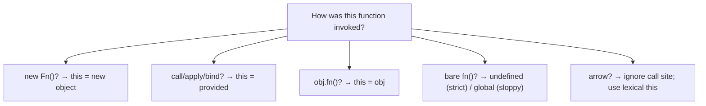
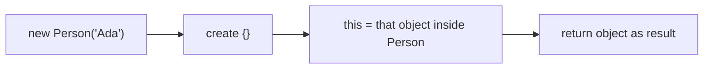
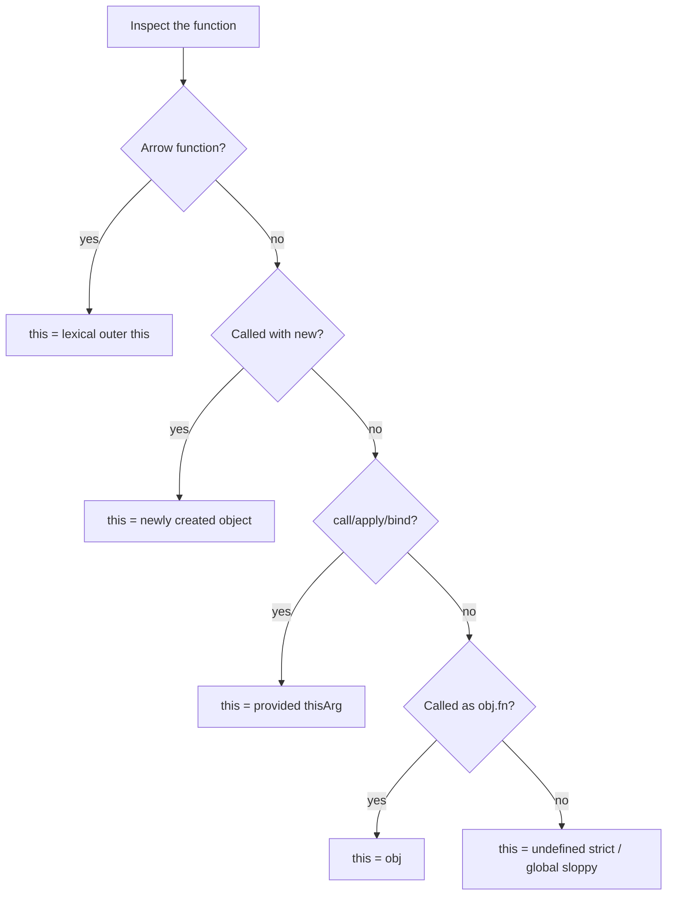

# `this`

This chapter teaches the `this` keyword from scratch. You do not need to already know “binding rules,” “call site,” or “lexical this.” By the end you should be able to explain **what `this` is for**, **how default / implicit / explicit / `new` / arrow bindings work**, **why each rule exists**, and **how this shows up in React and DOM code**.

Closely related: [Execution Context](/javascript/02-execution-context), [Closures](/javascript/05-closures), [Functions](/javascript/09-functions), [Classes](/javascript/08-classes).

---

## 1. The problem `this` solves

Objects often have methods that need to talk about **the object itself**:

```ts
const user = {
  name: "Ada",
  greet() {
    return `Hi, ${user.name}` // hard-coded — breaks if renamed / copied
  },
}
```

Hard-coding `user.name` inside the method is brittle. You want a pronoun that means “**the object this method was called on**”:

```ts
const user = {
  name: "Ada",
  greet() {
    return `Hi, ${this.name}`
  },
}

console.log(user.greet()) // "Hi, Ada"
```

Plain-language definition:

> For ordinary functions, **`this` is a value set when the function is called**, usually meaning “the object that owns this call” (the receiver). It is **not** looked up like a normal variable from where the function was written (except for **arrow functions**, which are special).

That last sentence is the whole game: **`this` is call-site oriented for `function`; arrows are lexically oriented.**

---

## 2. Why JavaScript did it this way (intuition)

Many languages bake the receiver into the method: `obj.method()` always has a fixed `self`/`this`. JavaScript functions are **first-class values** — you can rip a method off an object and call it alone:

```ts
const greet = user.greet
greet() // `this` is no longer `user`
```

Because functions are detachable, the language needed a rule: **`this` depends on how you call the function**, not only where it was defined. That flexibility powers mixins, callbacks, and `call`/`apply` — and creates the famous footguns.



Order of thinking in interviews (traditional functions):

1. Was it called with `new`?
2. Was `this` set with `call` / `apply` / `bind`?
3. Was it called as `obj.method()`?
4. Otherwise default binding.

Arrows skip that ladder and use lexical `this`.

---

## 3. Default binding — bare function calls

### 3.1 What you write

```ts
function show() {
  console.log(this)
}

show() // bare call — no owner object
```

### 3.2 What happens

| Mode | `this` value |
| --- | --- |
| **Strict mode** (modules are always strict) | `undefined` |
| **Sloppy mode** (old scripts) | Global object (`window` / `global`) |

```ts
"use strict"
function show() {
  console.log(this) // undefined
}
show()
```

### 3.3 Why this rule exists

If nothing specified a receiver, there is no honest object to plug in. Sloppy mode historically fell back to the global object (convenient and dangerous). Strict mode made the mistake visible (`undefined`), so `this.foo` throws instead of creating accidental globals.

### 3.4 Slow walkthrough — accidental global (sloppy)

```js
function setName(name) {
  this.name = name // sloppy: writes to window.name
}
setName("oops")
```

In modern ESM / `"use strict"`, `this` is `undefined` and this throws — good.

---

## 4. Implicit binding — `obj.method()`

### 4.1 The rule

When a call looks like **`something.fn(...)`**, `this` inside `fn` becomes `something` (the object before the dot).

```ts
const counter = {
  n: 0,
  inc() {
    this.n++
    return this.n
  },
}

console.log(counter.inc()) // 1 — this === counter
console.log(counter.inc()) // 2
```

### 4.2 Why this rule exists

It matches how people read the code: “call `inc` **on** `counter`.” The object before the dot is the receiver.

### 4.3 Only the **last** link before the call matters

```ts
const a = {
  name: "a",
  b: {
    name: "b",
    hello() {
      console.log(this.name)
    },
  },
}

a.b.hello() // "b" — this === a.b, not a
```

### 4.4 The loss-of-binding trap

```ts
const counter = {
  n: 0,
  inc() {
    this.n++
  },
}

const fn = counter.inc // detach
fn() // default binding — broken (or throws in strict when touching this.n)
```

```mermaid
sequenceDiagram
  participant Call as Call site
  Note over Call: counter.inc() → this = counter
  Note over Call: const fn = counter.inc; fn() → default this
```

**Why it breaks:** the call site is no longer `counter.inc()` — it is a bare `fn()`. Implicit binding requires the property-access call shape.

Passing methods as callbacks has the same issue:

```ts
setTimeout(counter.inc, 0) // loses counter
setTimeout(() => counter.inc(), 0) // ok — wrapper call keeps implicit binding
setTimeout(counter.inc.bind(counter), 0) // ok — explicit bind
```

---

## 5. Explicit binding — `call`, `apply`, `bind`

### 5.1 `call` and `apply`

```ts
function intro(greeting: string, punct: string) {
  return `${greeting}, ${this.name}${punct}`
}

const user = { name: "Ada" }

console.log(intro.call(user, "Hello", "!"))
// Hello, Ada!

console.log(intro.apply(user, ["Hello", "!"]))
// same — apply takes arguments as an array
```

| | Sets `this` | Passes arguments |
| --- | --- | --- |
| `fn.call(thisArg, a, b)` | `thisArg` | list |
| `fn.apply(thisArg, [a, b])` | `thisArg` | array |

### 5.2 `bind`

`bind` creates a **new function** permanently tied to a `this` value (and optionally preset args):

```ts
const bound = intro.bind(user, "Hi")
console.log(bound(".")) // "Hi, Ada."
```

```ts
const forever = intro.bind(user)
forever.call({ name: "Other" }, "Hey", "!")
// still uses user — bind wins over later call in normal use
```

### 5.3 Why explicit binding exists

Because functions are values, libraries need a way to say “run this function **as if** it were a method of X” without putting it on X:

```ts
function forEach(arr: number[], fn: (n: number) => void) {
  for (let i = 0; i < arr.length; i++) {
    fn.call(arr, arr[i]) // historical style — rarely needed with arrows
  }
}
```

DOM APIs and older codebases use `bind` heavily for event handlers.

### 5.4 `bind` vs arrow for fixing callbacks

```ts
class Timer {
  seconds = 0
  tick() {
    this.seconds++
  }
  start() {
    setInterval(this.tick.bind(this), 1000)
    // or: setInterval(() => this.tick(), 1000)
  }
}
```

---

## 6. `new` binding — constructor calls

### 6.1 What `new` does (simplified)

```ts
function Person(this: { name: string }, name: string) {
  this.name = name
}

const p = new Person("Ada")
console.log(p.name) // "Ada"
```

Rough steps when you write `new Person("Ada")`:

1. Create a new empty object.
2. Set that object’s prototype link to `Person.prototype`.
3. Call `Person` with `this` bound to the new object.
4. If the function returns an object, use that; otherwise return the new object.



### 6.2 Why this rule exists

Constructors need a blank instance to initialize. `new` is the language’s way to allocate that instance and feed it as `this`.

### 6.3 Forgetting `new`

```ts
function Person(this: { name: string }, name: string) {
  this.name = name
}

// Person("Ada") in sloppy mode → pollutes global
// in strict → TypeError (cannot set name on undefined)
```

ES classes throw if you call a class constructor without `new`.

### 6.4 Return override

```ts
function Weird() {
  this.a = 1
  return { b: 2 } // returned object replaces `this` as the new result
}

console.log(new Weird()) // { b: 2 }
```

If you return a non-object, the new `this` object is still used.

---

## 7. Arrow functions — lexical `this`

### 7.1 The rule

Arrow functions do **not** get `this` from the call site. They use `this` from the **surrounding scope** (the same way they close over variables).

```ts
const obj = {
  n: 1,
  outer() {
    const arrow = () => {
      console.log(this.n)
    }
    arrow() // 1 — this from outer()'s this
  },
}

obj.outer()
```

### 7.2 Why arrows work this way

Callbacks almost always want the **outer** `this` (the class instance, the React component mindset, the enclosing method’s receiver). Traditional functions re-bind `this` on every call, which broke that expectation constantly. Arrows were designed to close over `this` like any other free binding.

```ts
class Button {
  count = 0
  handleClick = () => {
    this.count++ // always this Button instance
  }
}
```

### 7.3 Arrows cannot be used as constructors

```ts
const F = () => {}
// new F() // TypeError
```

Arrows have no construct behavior and no own `prototype` for `new`.

### 7.4 Arrows as object methods — usually wrong

```ts
const obj = {
  n: 1,
  // lexical this is NOT obj — it is whatever surrounds this object literal
  getN: () => this.n,
}

console.log(obj.getN()) // undefined (or window.n in sloppy global)
```

**Why:** the arrow captures `this` from outside the literal (often `undefined` in modules). Prefer method shorthand `getN() { return this.n }`.

### 7.5 Arrows do not have their own `arguments`

```ts
function outer() {
  const arrow = () => arguments[0] // inherits outer's arguments (non-arrow)
  return arrow()
}
```

Prefer rest params: `(...args) => ...`.

---

## 8. Binding precedence (traditional functions)

When several rules could seem to apply, use this order:

1. **`new`** — `new Fn()` → new object
2. **Explicit** — `call` / `apply` / `bind`
3. **Implicit** — `obj.fn()`
4. **Default** — bare call → `undefined` / global

Arrows: **ignore 1–4 for `this`**; use lexical.

```ts
function f(this: { tag: string }) {
  console.log(this.tag)
}

const obj = { tag: "obj", f }
const bound = f.bind({ tag: "bound" })

obj.f() // "obj" — implicit
f.call({ tag: "call" }) // "call" — explicit
bound() // "bound"
new (bound as any)() // `new` with bound functions is weird — avoid; classes are clearer
```

Interview tip: be careful claiming “`new` always beats `bind`” for exotic bound-function cases — prefer saying: **don’t mix `new` with bound functions; use classes.**

---

## 9. Classes — `this` in modern OOP

```ts
class Counter {
  n = 0

  inc() {
    this.n++
  }

  // field arrow — lexical this of the instance
  incArrow = () => {
    this.n++
  }
}

const c = new Counter()
c.inc()
const detached = c.inc
// detached() // loses this

const detachedArrow = c.incArrow
detachedArrow() // works — arrow closed over instance
```

### 9.1 Why class fields as arrows exist

So you can pass `this.incArrow` to React/`addEventListener` without binding in the constructor. Trade-off: each instance gets its own function copy (slightly more memory than shared prototype methods).

### 9.2 Prototype methods share one function

```ts
class A {
  method() {}
}
const a1 = new A()
const a2 = new A()
console.log(a1.method === a2.method) // true — same function on prototype
```

`this` still differs per call: `a1.method()` vs `a2.method()`.

More: [Classes](/javascript/08-classes), [Prototype](/javascript/07-prototype).

---

## 10. DOM handlers

```ts
const btn = document.querySelector("button")!

btn.addEventListener("click", function () {
  console.log(this) // the element — implicit-ish receiver from the DOM
})

btn.addEventListener("click", () => {
  console.log(this) // lexical this from outer scope — NOT the element
})
```

**Why DOM does this:** listeners historically behaved like methods on the element. Arrows opt out of that.

If you need both the element and outer `this`:

```ts
btn.addEventListener("click", (event) => {
  const el = event.currentTarget as HTMLButtonElement
  // use el, and outer lexical this if in a class/module
})
```

---

## 11. React examples

### 11.1 Function components — `this` is almost irrelevant

```tsx
function Profile({ name }: { name: string }) {
  return <div>{name}</div> // no `this`
}
```

Function components and hooks are designed around **closures** and props/state, not `this`. Prefer that model.

### 11.2 Class components — where `this` still bites

```tsx
import { Component } from "react"

type State = { n: number }

class Counter extends Component<{}, State> {
  state: State = { n: 0 }

  // Broken if passed bare to onClick — loses component as this
  handleClickBroken() {
    this.setState({ n: this.state.n + 1 })
  }

  handleClick = () => {
    this.setState((s) => ({ n: s.n + 1 }))
  }

  render() {
    return (
      <button onClick={this.handleClick}>
        {this.state.n}
      </button>
    )
  }
}
```

**Why class fields / bind:** JSX does `onClick={this.handleClick}` — that **detaches** the method. Without bind/arrow, React calls it as a bare function → `this` wrong.

Constructor bind (older style):

```tsx
constructor(props: {}) {
  super(props)
  this.handleClick = this.handleClick.bind(this)
}
```

### 11.3 Don’t invent `this` in hooks

```tsx
function useThing() {
  // there is no useful component `this` here
  const onClick = () => {
    /* close over state setters */
  }
  return { onClick }
}
```

If you find yourself fighting `this` in new React code, you are probably using a class pattern that hooks replaced.

---

## 12. Indirect calls and edge cases

### 12.1 `obj.fn()` vs `(obj.fn)()`

```ts
const obj = {
  n: 1,
  f() {
    return this.n
  },
}

console.log(obj.f()) // 1
console.log((obj.f)()) // still 1 in practice for this pattern
```

Some older puzzles use comma tricks to strip the reference base — treat them as trivia; focus on “is there a clear receiver at the call site?”

### 12.2 `globalThis`

```ts
globalThis // portable global object
```

In sloppy default binding, `this === globalThis` often holds in browsers/`Node` for bare calls. Do not rely on that in modern code.

### 12.3 `this` in modules

```ts
// es module
console.log(this) // undefined at top level
```

Top-level `this` in ESM is `undefined`, not `window`. Related: [Modules](/javascript/13-modules).

### 12.4 Extracting prototype methods

```ts
const { map } = Array.prototype
// map([1, 2], (x) => x * 2) // fails — needs proper this (the array)

console.log(map.call([1, 2], (x: number) => x * 2)) // [2, 4]
```

Why: `map` expects `this` to be the array-like receiver.

---

## 13. `this` vs closures — do not mix up the tools

| Need | Use |
| --- | --- |
| Remember a variable from outer scope | Closure / lexical variable |
| Talk about the call’s receiver object | `this` (or pass `obj` explicitly) |
| Stable callback with instance methods | Arrow class field, `bind`, or wrapper arrow |

```ts
class Example {
  label = "ex"

  // closure over nothing special; this from call site
  method() {
    return this.label
  }

  // lexical this
  methodArrow = () => this.label
}

function makeGreeter(label: string) {
  // no this required — closure over label
  return () => label
}
```

---

## 14. Worked example — one function, five call styles

```ts
function tag(this: { id: string }, suffix: string) {
  return this.id + suffix
}

const a = { id: "A", tag }
const b = { id: "B" }

console.log(a.tag("!")) // "A!" — implicit
console.log(tag.call(b, "!")) // "B!" — explicit
console.log(tag.apply(b, ["?"])) // "B?"
const bound = tag.bind({ id: "C" })
console.log(bound("#")) // "C#"

// default:
tag("x") // TypeError in strict — this undefined

// new — unusual for this function shape, but:
function TagObj(this: { id: string }, id: string) {
  this.id = id
}
console.log(new TagObj("Z")) // TagObj { id: "Z" }
```

Walk each line by naming the rule aloud.

---

## 15. Decision flowchart you can redraw on a whiteboard



---

## Interview Questions

### Q1. How is `this` determined for a normal function?
**Expected:** Primarily by call site — `new`, explicit `call`/`apply`/`bind`, implicit `obj.fn()`, else default.  
**Common wrong:** “`this` always refers to the object where the function was defined.”  
**Follow-ups:** What changes with arrows?

### Q2. Why does passing `obj.method` to `setTimeout` break?
**Expected:** The method is detached; the timer does a bare call → default binding, not `obj`.  
**Common wrong:** “setTimeout clones the object wrong.”  
**Follow-ups:** Show three fixes (wrapper arrow, bind, class field arrow).

### Q3. What is the difference between `call` and `apply`?
**Expected:** Both set `this`; `call` takes args list, `apply` takes args array.  
**Common wrong:** “`apply` is async.”  
**Follow-ups:** What does `bind` return?

### Q4. How do arrow functions treat `this`?
**Expected:** Lexically capture surrounding `this`; no construct/`new`; bad as object methods when you wanted the object as `this`.  
**Common wrong:** “Arrows bind `this` to the object they are written inside of in an object literal.”  
**Follow-ups:** Why no `new` on arrows?

### Q5. What does `new` do to `this`?
**Expected:** Creates an object, sets it as `this` during the constructor call, returns it (unless constructor returns another object).  
**Common wrong:** “`new` only sets the prototype.”  
**Follow-ups:** What if you forget `new` on a constructor function?

### Q6. How does `this` work in React class vs function components?
**Expected:** Class methods need bind/arrows when passed as handlers; function components rely on closures, not `this`.  
**Common wrong:** “Hooks use `this.state`.”  
**Follow-ups:** Why did class field arrows become popular?

### Q7. `this` in an ES module top level?
**Expected:** `undefined`.  
**Common wrong:** “Always `window`.”  
**Follow-ups:** Classic script vs module differences.

## Common Mistakes

- Assuming `this` is lexical for `function` declarations/expressions.
- Using arrow functions as object literal methods expecting `this === obj`.
- Detaching methods (`const f = obj.f`) and expecting `this` to stick.
- Forgetting `bind` / arrows in React class handlers.
- Relying on sloppy-mode global `this`.
- Mixing up closure-captured variables with `this`.
- Calling class constructors without `new`.

## Trade-offs / Production Notes

- Prefer **functions + closures** (and hooks) over `this`-heavy designs in new app code.
- When you need methods, prefer **`class`** with clear bind strategy, or pass `obj` explicitly for clarity.
- Use arrows for callbacks that must preserve outer `this`; use method shorthand when the object should be the receiver.
- Lint rules (`@typescript-eslint/no-invalid-this`, React class handler checks) catch many bugs early.
- Related: [Closures](/javascript/05-closures), [Classes](/javascript/08-classes), [Prototype](/javascript/07-prototype), [Execution Context](/javascript/02-execution-context), [Modules](/javascript/13-modules), [Functions](/javascript/09-functions).
