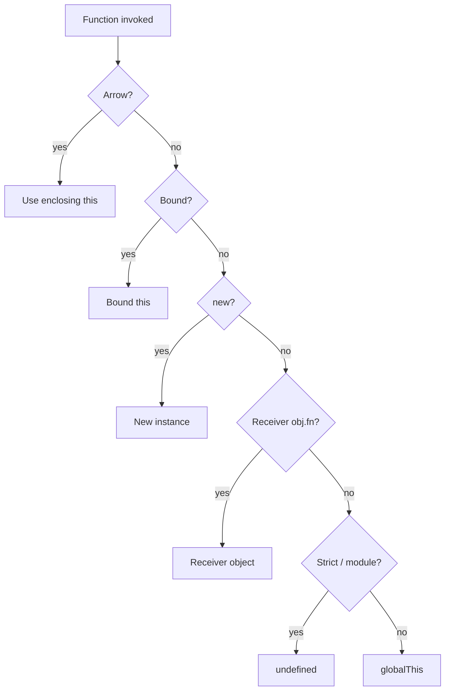

# this Keyword

`this` is a **call-site binding** for ordinary functions — not lexical lookup (except arrows / bound functions). Interviewers want the rule table and edge cases with `class`, DOM, and React.

## The rule table

| Call pattern | `this` |
| --- | --- | --- |
| `fn()` | `undefined` (strict / modules) · `globalThis` (sloppy) |
| `obj.fn()` | `obj` |
| `obj.fn.call(x, ...)` / `apply` | `x` |
| `fn.bind(x)` then call | `x` (fixed) |
| `new Fn()` | new object (unless returns object) |
| Arrow `() =>` | lexical `this` from enclosing scope |
| DOM `el.addEventListener('click', fn)` | `el` (for classic `function`) |
| `class` methods | receiver; undefined if detached in strict |



## Call-site examples

```ts
function show(this: { id: number }) {
  return this.id
}

const a = { id: 1, show }
const b = { id: 2 }

a.show() // 1
show.call(b) // 2
const bound = show.bind(a)
bound() // 1
```

Losing the receiver:

```ts
const fn = a.show
fn() // TypeError if this typed / undefined.id in strict
```

## `call` / `apply` / `bind`

```ts
function greet(this: { name: string }, greeting: string) {
  return `${greeting}, ${this.name}`
}

greet.call({ name: "Ada" }, "Hi")
greet.apply({ name: "Ada" }, ["Hi"])
const hiAda = greet.bind({ name: "Ada" }, "Hi")
hiAda()
```

| | Args | Returns | `this` |
| --- | --- | --- | --- |
| `call` | list | result | first arg |
| `apply` | array-like | result | first arg |
| `bind` | partial list | **new function** | fixed |

`bind` is composable once; rebinding a bound function does not change original bound `this`.

## Arrow functions

```ts
const obj = {
  n: 1,
  run() {
    const arrow = () => this.n
    const classic = function (this: unknown) {
      return this
    }
    return { arrow: arrow(), classic: classic() }
  },
}

obj.run() // { arrow: 1, classic: undefined }
```

Arrows cannot be used with `new`. No own `arguments` / `prototype`. Prefer arrows for callbacks that must see outer `this`; prefer methods for overridable OOP APIs.

## `new` binding

```ts
function User(this: { name: string }, name: string) {
  this.name = name
}

const u = new User("Ada")
```

`new` steps (simplified): create object → set `[[Prototype]]` → call with `this` = object → return object (or explicit object return).

```ts
function Trick() {
  this.a = 1
  return { b: 2 } // returned instead of `this`
}
new Trick() // { b: 2 }
```

## Classes

Class bodies are strict. Detached methods lose `this`:

```ts
class Counter {
  n = 0
  inc() {
    this.n++
  }
}

const c = new Counter()
const { inc } = c
// inc() // TypeError
```

Fixes:

```ts
class Counter {
  n = 0
  inc = () => {
    this.n++
  } // lexical this per instance
  // or bind in constructor
}
```

Trade-off: arrow class fields are **per-instance** (memory); prototype methods are shared.

## DOM handlers

```ts
button.addEventListener("click", function (this: HTMLButtonElement) {
  console.log(this.id)
})

button.addEventListener("click", () => {
  // this is outer lexical — not the button
})
```

## React note

React class components used `this` heavily; function components do not. Event handlers in React receive the synthetic event; DOM `this` is not used. Class field arrows were common for auto-binding.

## Indirect calls

```ts
const f = obj.method
;(0, obj.method)() // loses receiver — comma operator / indirection
```

Optional chaining call:

```ts
obj.method?.() // still called with receiver obj if method exists
```

## `globalThis`

Portable global: `globalThis` (browser `window`, worker `self`, Node `global`). Never assume `window` in shared code.

## Interview Questions

**Q: How is `this` determined?**  
By call site rules (or lexical capture for arrows / bind), not by where the function was defined (except arrows).

**Q: Why does extracting a method break?**  
`obj.fn` without the call path `obj.fn()` drops the receiver.

**Q: Difference between `bind` and arrow?**  
`bind` creates a exotic bound function with fixed `this`/partials. Arrow captures lexical `this` at creation from enclosing scope — no `this` of its own.

**Q: What is `this` in an ES module top-level?**  
`undefined` (not `globalThis`).

**Q: `super` and `this` in derived constructors?**  
Must call `super()` before using `this` — uninitialized instance until parent finishes.

## Common Mistakes

- Assuming `this` follows lexical scope for `function`.
- Using arrows for methods that need dynamic receiver / prototype sharing.
- Forgetting `bind` creates a new function identity (breaks removeEventListener).
- Relying on sloppy-mode global `this`.
- Class method pass-through to `setTimeout(this.inc, 0)` without bind/arrow.

## Trade-offs / Production Notes

- Prefer explicit parameters over `this` for utilities (easier to test/tree-shake).
- In OOP libraries, document whether methods are detach-safe.
- TypeScript `this` parameters (`function f(this: Foo)`) catch detach bugs at compile time.
- Related: [Closures](/javascript/05-closures), [Classes](/javascript/08-classes), [Prototype](/javascript/07-prototype).
