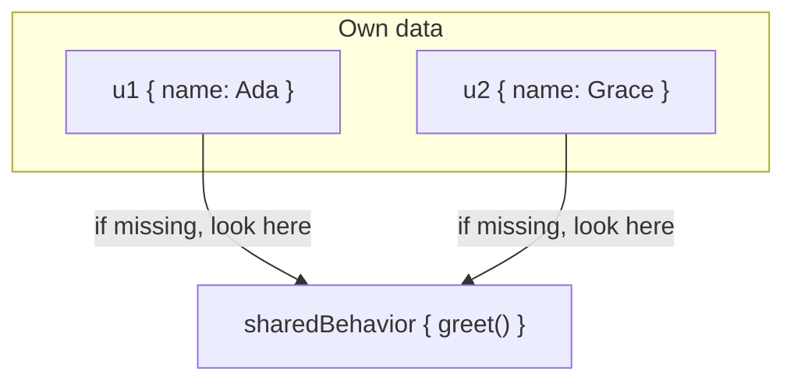
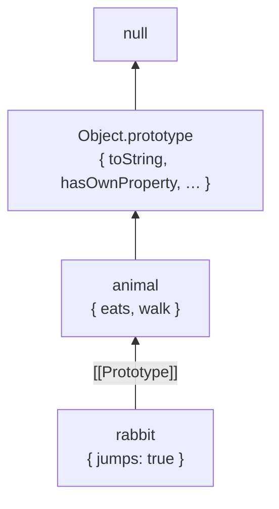
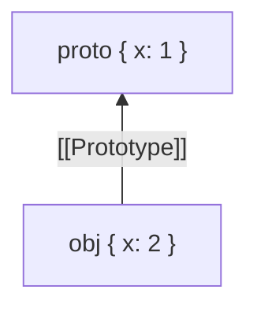
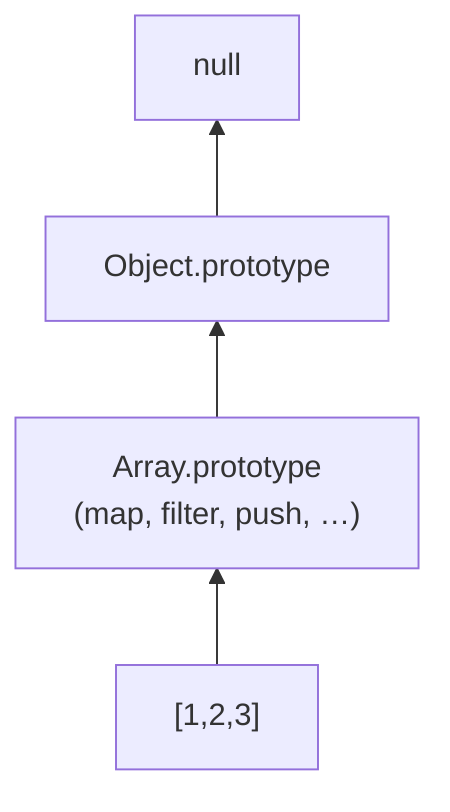
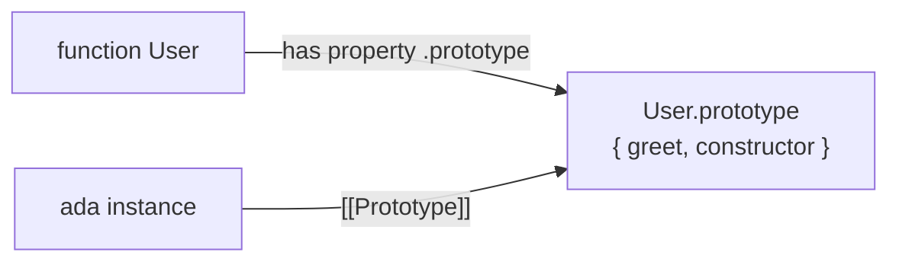
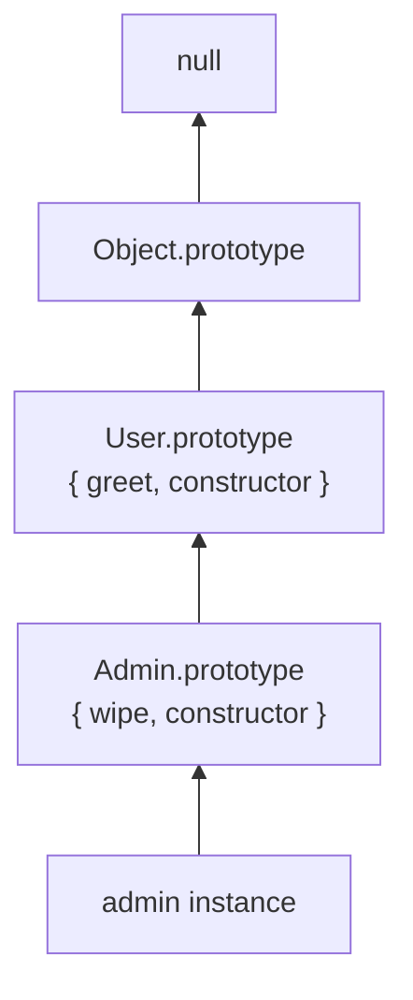
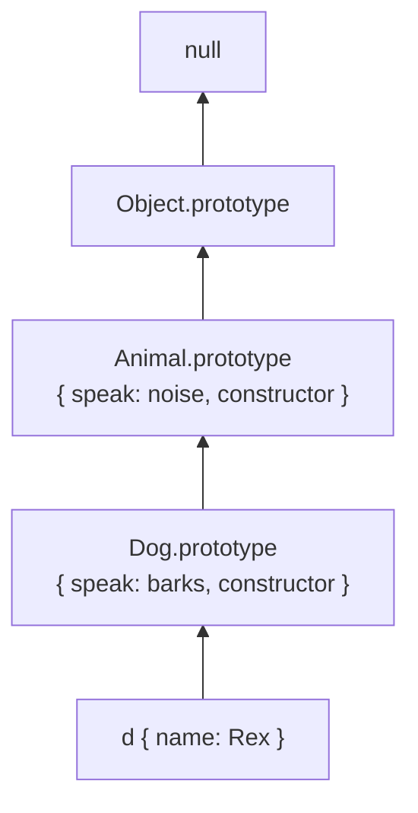

# Prototypes

This chapter teaches JavaScript’s object inheritance model from scratch. You do not need to already know “prototype,” `new`, `instanceof`, or `Object.create`. By the end you should be able to explain **what an object is**, **how property lookup walks a chain**, **what `new` actually does**, and **why `instanceof` is not magic**.

Classes (`class Foo {}`) are **syntax sugar** over this same model. We cover them in [Classes](/javascript/08-classes). Here we build the mental model those classes sit on.

---

## 1. The problem: sharing behavior without copying

Suppose you have many users, and each should be able to greet:

```ts
const u1 = {
  name: "Ada",
  greet() {
    return `Hi, I'm ${this.name}`
  },
}

const u2 = {
  name: "Grace",
  greet() {
    return `Hi, I'm ${this.name}`
  },
}
```

This works, but every user object carries its **own copy** of the `greet` function. That wastes memory and makes updates painful: if you fix a bug in `greet`, you must update every object.

What you want:

- Each object has its **own data** (`name`)
- All objects **share** the same behavior (`greet`)

JavaScript’s answer is the **prototype link**: an object can say “if I don’t have a property, look on this other object.”



That “look here” link is the prototype.

---

## 2. What is an object, really?

In JavaScript, almost everything you work with day to day is an **object**: a bag of named properties, plus a few hidden internal slots.

A property is a name → value association:

```ts
const dog = {
  name: "Rex",
  age: 3,
}

dog.name // "Rex"
dog.age // 3
```

Properties can be:

- **data properties** — hold a value (`name: "Rex"`)
- **accessor properties** — use `get` / `set` functions

Objects also have an internal slot called **`[[Prototype]]`**. You cannot write `obj.[[Prototype]]` in normal code. You interact with it via:

| Tool | What it does |
| --- | --- |
| `Object.getPrototypeOf(obj)` | read `[[Prototype]]` |
| `Object.setPrototypeOf(obj, p)` | change `[[Prototype]]` (slow; avoid in hot paths) |
| `obj.__proto__` | legacy getter/setter for the same thing (don’t use in new code) |
| `Object.create(proto)` | create a new object whose `[[Prototype]]` is `proto` |

Plain language:

> Every ordinary object has a hidden pointer to **another** object (or `null`). That pointer is the prototype.

```ts
const a = {}
Object.getPrototypeOf(a) === Object.prototype // true for normal {}
```

---

## 3. Property lookup: walk until you find it (or hit null)

When you write `obj.prop`, the engine does **not** only look at `obj`. It walks:

1. Does `obj` have an **own** property named `prop`? If yes, use it.
2. Otherwise, follow `[[Prototype]]` and ask the same question.
3. Repeat until found, or until the prototype is `null`.

```ts
const animal = {
  eats: true,
  walk() {
    return "walking"
  },
}

const rabbit = Object.create(animal)
rabbit.jumps = true

rabbit.jumps // true  — own property
rabbit.eats // true   — found on animal
rabbit.walk() // "walking" — found on animal
rabbit.toString() // "[object Object]" — found further up on Object.prototype
rabbit.fly // undefined — walked all the way to null, never found
```



This linked list of objects is the **prototype chain**.

### 3.1 Own vs inherited

- **Own property**: stored directly on that object.
- **Inherited property**: found by walking the chain.

```ts
Object.hasOwn(rabbit, "jumps") // true
Object.hasOwn(rabbit, "eats") // false — inherited
"eats" in rabbit // true — `in` walks the chain
```

> [!TIP]
> Prefer `Object.hasOwn(obj, key)` over `obj.hasOwnProperty(key)`. Why? Objects created with `Object.create(null)` have **no** `hasOwnProperty` method (their chain does not include `Object.prototype`).

### 3.2 Reading vs writing (critical)

**Reading** walks the chain. **Writing** usually does **not**.

```ts
const proto = { x: 1 }
const obj = Object.create(proto)

obj.x = 2 // creates OWN property x on obj
console.log(obj.x) // 2
console.log(proto.x) // 1 — proto unchanged
```

After the write, `obj` **shadows** the prototype’s `x`:



Lookup finds `obj.x` first and stops. The prototype’s `x` is still there but hidden for that name.

Exception: if the prototype has a **setter** for that name, assignment can call the setter instead of creating an own data property. That is rarer, but interviews ask about it.

```ts
const proto = {
  _n: 0,
  get n() {
    return this._n
  },
  set n(v: number) {
    this._n = v
  },
}

const o = Object.create(proto)
o.n = 10
// setter runs with this === o, so o gets own _n: 10
console.log(o.n) // 10
console.log(Object.hasOwn(o, "_n")) // true
console.log(Object.hasOwn(proto, "_n")) // true still (proto's own _n may stay 0)
```

### 3.3 Deleting

`delete` only removes **own** properties. It does not climb the chain to delete on the prototype.

```ts
delete rabbit.eats // false / no-op for inherited — eats still visible via chain
delete rabbit.jumps // removes own jumps
```

---

## 4. `Object.create` — the clearest way to make a chain

`Object.create(proto)` means:

> Create a brand-new empty object, and set its `[[Prototype]]` to `proto`.

```ts
const proto = {
  greet() {
    return "hi"
  },
}

const obj = Object.create(proto)
obj.greet() // "hi"
```

You can pass `null` to create an object with **no** prototype:

```ts
const dict = Object.create(null)
dict.foo = 1
dict.toString // undefined — no Object.prototype methods
```

That is useful for **safe dictionaries** (keys that might be `"__proto__"` or `"hasOwnProperty"` won’t collide with inherited names). In modern code, `Map` is often clearer for arbitrary keys.

Optional second argument: property descriptors (same shape as `Object.defineProperties`).

```ts
const o = Object.create(proto, {
  name: {
    value: "Ada",
    writable: true,
    enumerable: true,
    configurable: true,
  },
})
```

---

## 5. Where do methods on `{}` come from?

```ts
const o = {}
o.toString()
```

You never defined `toString` on `o`. The chain explains it:

```ts
Object.getPrototypeOf({}) === Object.prototype // true
typeof Object.prototype.toString // "function"
Object.getPrototypeOf(Object.prototype) // null — end of the chain
```

So a normal object’s chain is:

```text
yourObject → Object.prototype → null
```

`Object.prototype` is the shared bag of default methods: `toString`, `valueOf`, `hasOwnProperty`, etc.

Arrays, functions, and dates have **longer** chains:

```ts
const arr = [1, 2, 3]
Object.getPrototypeOf(arr) === Array.prototype // true
Object.getPrototypeOf(Array.prototype) === Object.prototype // true
```



That is why arrays “have” both `map` (from `Array.prototype`) and `toString` (from `Object.prototype`, unless Array overrides it — arrays do override `toString`).

---

## 6. Constructor functions — the old pattern (still essential)

Before `class`, people shared behavior like this:

```ts
function User(name: string) {
  this.name = name
}

User.prototype.greet = function () {
  return `Hi, I'm ${this.name}`
}

const ada = new User("Ada")
ada.greet() // "Hi, I'm Ada"
```

There are **three** related pieces. Confusing them is the #1 interview failure.

### 6.1 The function object `User`

`User` is a regular function. Functions are objects, so they can have properties.

By default, every function (except arrow functions and some exotic cases) gets a property named **`prototype`** — a plain object, created for you:

```ts
typeof User.prototype // "object"
User.prototype.constructor === User // true by default
```

Plain language:

> `User.prototype` is **not** the prototype of the function `User`. It is the object that will become the `[[Prototype]]` of instances created with `new User(...)`.



### 6.2 What `new` does — step by step

When you write `new User("Ada")`, the engine roughly:

1. Creates a new empty object: `{}`
2. Sets that object’s `[[Prototype]]` to `User.prototype`
3. Calls `User` with `this` bound to the new object, and the arguments you passed
4. If `User` returns an **object** (or function), that return value is used instead; otherwise the new object is returned

```ts
function User(name: string) {
  this.name = name
  // implicit return of `this` when using `new`
}

const ada = new User("Ada")
Object.getPrototypeOf(ada) === User.prototype // true
```

Mental model implementation (teaching only — not a perfect polyfill):

```ts
function myNew<A extends unknown[], R>(
  Ctor: new (...args: A) => R,
  ...args: A
): R {
  const instance = Object.create((Ctor as Function).prototype)
  const result = (Ctor as Function).apply(instance, args)
  // If constructor returned an object, use it; else use instance
  if (result !== null && (typeof result === "object" || typeof result === "function")) {
    return result as R
  }
  return instance as R
}
```

Walkthrough with `User`:

```ts
const ada = myNew(User as any, "Ada")
// 1. instance = Object.create(User.prototype)
// 2. User.apply(instance, ["Ada"]) → instance.name = "Ada"
// 3. User returned undefined → return instance
```

### 6.3 Why methods go on `Ctor.prototype`

```ts
function User(name: string) {
  this.name = name
  // BAD: this.greet = function () { ... }  // new function every instance
}

User.prototype.greet = function () {
  return `Hi, I'm ${this.name}`
}
```

Every instance shares one `greet` function. Inside `greet`, `this` is the instance (when called as `ada.greet()`), so `this.name` still works. See [this keyword](/javascript/06-this).

### 6.4 Forgetting `new`

```ts
function User(name: string) {
  this.name = name
}

const oops = User("Ada") // without new
// In non-strict mode, `this` may be the global object — disaster
// In strict mode / modules, `this` is undefined → TypeError
```

Always call constructors with `new` (or use `class`, which throws if you forget).

---

## 7. `instanceof` — “is this object’s chain linked to that constructor’s prototype?”

```ts
ada instanceof User // true
ada instanceof Object // true
```

What `instanceof` actually checks (simplified):

> Walk `obj`’s prototype chain. Is `Ctor.prototype` anywhere on that chain?

Teaching approximation:

```ts
function myInstanceof(obj: unknown, Ctor: Function): boolean {
  if (obj === null || (typeof obj !== "object" && typeof obj !== "function")) {
    return false
  }
  let proto = Object.getPrototypeOf(obj)
  const target = Ctor.prototype
  while (proto !== null) {
    if (proto === target) return true
    proto = Object.getPrototypeOf(proto)
  }
  return false
}
```

```ts
myInstanceof(ada, User) // true
myInstanceof(ada, Object) // true — Object.prototype is further up
myInstanceof({}, User) // false
```

Important consequences:

1. `instanceof` does **not** look at the constructor’s name string.
2. It breaks across **realms** (iframes, workers): each realm has its own `Array.prototype`, so `iframeArray instanceof Array` can be `false` in the parent. Prefer `Array.isArray`.
3. You can fool it by manually setting the prototype:

```ts
const fake = Object.create(User.prototype)
fake instanceof User // true — even though `new User` never ran
```

For “was this created by my constructor?”, `instanceof` is a chain check, not a birth certificate.

---

## 8. Inheritance between constructors (pre-`class`)

Suppose `Admin` should reuse `User` behavior:

```ts
function User(name: string) {
  this.name = name
}
User.prototype.greet = function () {
  return `Hi, I'm ${this.name}`
}

function Admin(name: string, level: number) {
  User.call(this, name) // run User’s initialization on this Admin instance
  this.level = level
}

// Link Admin.prototype → User.prototype
Admin.prototype = Object.create(User.prototype)
Admin.prototype.constructor = Admin // fix constructor pointer after replace

Admin.prototype.wipe = function () {
  return `wipe as level ${this.level}`
}

const a = new Admin("Ada", 10)
a.greet() // from User.prototype
a.wipe() // from Admin.prototype
a instanceof Admin // true
a instanceof User // true
```



Why `Object.create(User.prototype)` instead of `Admin.prototype = User.prototype`?

Because then they would be the **same object**. Adding `wipe` would also appear on every `User`. `Object.create` makes a **new** object whose prototype is `User.prototype`.

`class Admin extends User` does this linking for you. Same chain underneath.

---

## 9. `__proto__` vs `.prototype` vs `[[Prototype]]`

This naming mess trips everyone. Memorize with a table:

| Name | What it is |
| --- | --- |
| `[[Prototype]]` | Internal slot — the real link used for lookup |
| `Object.getPrototypeOf(o)` | Standard way to read `[[Prototype]]` |
| `o.__proto__` | Legacy accessor that reads/writes `[[Prototype]]` |
| `F.prototype` | Property on a **function** `F` — used as `[[Prototype]]` of instances when you `new F()` |

```ts
function F() {}
const o = new F()

o.__proto__ === F.prototype // true (legacy)
Object.getPrototypeOf(o) === F.prototype // true (prefer this)
F.__proto__ === Function.prototype // F itself is a function object
```

Rule of thumb:

- Talking about **instances** → think `[[Prototype]]` / `getPrototypeOf`
- Talking about **constructors** → think `.prototype` (the shared methods object)

---

## 10. Property descriptors and the prototype (brief, interview-useful)

Every property has attributes:

```ts
Object.getOwnPropertyDescriptor({ a: 1 }, "a")
// { value: 1, writable: true, enumerable: true, configurable: true }
```

Methods on prototypes are usually **enumerable: false** when created via `class` or `Object.defineProperty`, so `for...in` behaves better. Plain assignment `User.prototype.greet = fn` makes enumerable methods (older style).

`for...in` walks the chain and visits enumerable properties. `Object.keys` only lists **own** enumerable keys.

```ts
const p = { inherited: 1 }
const o = Object.create(p)
o.own = 2

Object.keys(o) // ["own"]
for (const k in o) {
  // "own", then "inherited"
}
```

---

## 11. `this` on the prototype chain

When you call a method found on the prototype, `this` is still the **receiver** (the object before the dot), not the prototype object:

```ts
const proto = {
  greet() {
    return this.name
  },
}
const obj = Object.create(proto)
obj.name = "Ada"
obj.greet() // "Ada" — this === obj
```

If you extract the function, you lose the receiver:

```ts
const g = obj.greet
g() // this is undefined (strict) or global — not obj
```

Use `g.call(obj)` or keep it as a method call. Full story: [this](/javascript/06-this).

---

## 12. Mutating prototypes at runtime

You *can* add methods later:

```ts
User.prototype.sayBye = function () {
  return "bye"
}
ada.sayBye() // works — lookup finds it on the shared prototype
```

You *can* change an object’s prototype:

```ts
Object.setPrototypeOf(obj, otherProto)
```

But changing `[[Prototype]]` on live objects is **slow** (engines optimize shapes; breaking the chain hurts). Prefer setting the prototype at creation time (`Object.create` / `class` / `new`).

Never do this in library code for built-ins without extreme care:

```ts
Array.prototype.myMap = ... // pollutes every array; conflicts; surprises
```

---

## 13. Worked mental model — put it together

```ts
function Animal(name: string) {
  this.name = name
}
Animal.prototype.speak = function () {
  return `${this.name} makes a noise`
}

function Dog(name: string) {
  Animal.call(this, name)
}
Dog.prototype = Object.create(Animal.prototype)
Dog.prototype.constructor = Dog
Dog.prototype.speak = function () {
  return `${this.name} barks`
}

const d = new Dog("Rex")
```

Ask yourself:

1. What are `d`’s **own** properties? → `name` (and maybe nothing else)
2. Where is `speak` found? → `Dog.prototype` (shadows `Animal.prototype.speak`)
3. `d instanceof Dog`? → yes
4. `d instanceof Animal`? → yes
5. `Object.getPrototypeOf(d) === Dog.prototype`? → yes
6. `Object.getPrototypeOf(Dog.prototype) === Animal.prototype`? → yes



If you can answer those without looking, you understand prototypes.

---

## Interview Questions

### Q1. What is a prototype in JavaScript?
**Expected:** An object that another object links to via `[[Prototype]]`; property lookup walks that chain until a match or `null`.  
**Common wrong:** “A copy of the parent object” / “the class of the object.”  
**Follow-ups:** How do you read the link? (`Object.getPrototypeOf`)

### Q2. What does `new Fn()` do?
**Expected:** Create object, set `[[Prototype]]` to `Fn.prototype`, call `Fn` with `this` = that object, return the object (unless `Fn` returns another object).  
**Common wrong:** “Just calls the function.”  
**Follow-ups:** What if the constructor returns `{ ok: true }`?

### Q3. Difference between `__proto__` and `.prototype`?
**Expected:** `__proto__` accesses an instance’s `[[Prototype]]`; `.prototype` is a property on functions used as the `[[Prototype]]` for instances created with `new`.  
**Common wrong:** “They are the same thing.”  
**Follow-ups:** Do arrow functions have `.prototype`? (No.)

### Q4. How does `instanceof` work?
**Expected:** Checks whether `Ctor.prototype` appears anywhere on the value’s prototype chain.  
**Common wrong:** “Checks the constructor name” / “checks who created it.”  
**Follow-ups:** Why can `instanceof` fail across iframes?

### Q5. Own property vs inherited?
**Expected:** Own is stored on the object; inherited is found by walking `[[Prototype]]`. Assignment usually creates/shadows own properties.  
**Common wrong:** “Writing always updates the prototype.”  
**Follow-ups:** `in` vs `Object.hasOwn`?

### Q6. Why put methods on `Ctor.prototype` instead of `this.method = ...` in the constructor?
**Expected:** One shared function for all instances — less memory, single place to update behavior.  
**Common wrong:** “It makes `this` work” (`this` works either way if called as a method).  

## Common Mistakes

- Confusing `Fn.prototype` with `Object.getPrototypeOf(Fn)`.
- Using `Admin.prototype = User.prototype` (shared object) instead of `Object.create(User.prototype)`.
- Forgetting to restore `constructor` after replacing `.prototype`.
- Calling constructors without `new`.
- Assuming `instanceof` means “constructed by.”
- Mutating built-in prototypes in app code.
- Using `__proto__` in modern code instead of `getPrototypeOf` / `Object.create`.
- Expecting `delete obj.x` to remove an inherited `x`.

## Trade-offs / Production Notes

- Prefer **`class`** syntax for new OOP-style code — same prototype model, clearer intent, `new` required.
- Prefer **`Object.create(null)`** or **`Map`** for dictionaries with untrusted keys.
- Avoid `Object.setPrototypeOf` in performance-sensitive paths; set the chain at creation.
- For type checks of builtins, prefer dedicated helpers (`Array.isArray`, `typeof`) over `instanceof` when realms matter.
- Related: [Classes](/javascript/08-classes), [this](/javascript/06-this), [Objects](/javascript/14-objects), [Closures](/javascript/05-closures).
