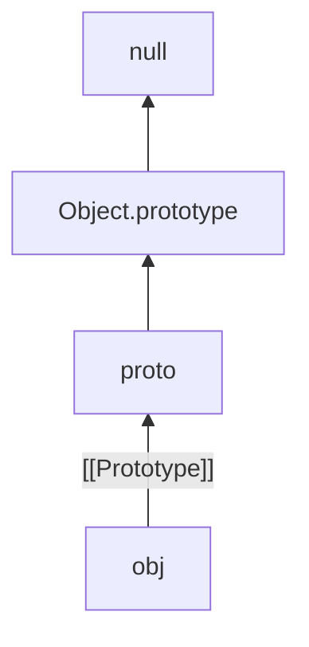
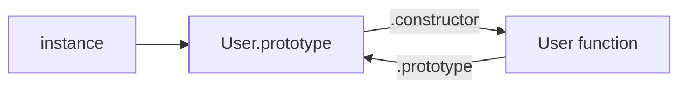

# Prototype Chain

Objects inherit properties via an internal `[[Prototype]]` link. Classes are syntax over this model.

## Core links

```ts
const proto = {
  greet() {
    return "hi"
  },
}
const obj = Object.create(proto)
obj.greet() // "hi" — found on prototype
obj.toString() // from Object.prototype further up
```



## Reading vs writing

| Operation | Behavior |
| --- | --- |
| Get | walk chain until found or `null` |
| Has (`in`) | walk chain |
| `hasOwnProperty` / `Object.hasOwn` | own only |
| Set | usually sets **own** property (does not mutate proto) |
| Delete | own only |

```ts
const p = { x: 1 }
const o = Object.create(p)
o.x = 2 // shadows — p.x still 1
```

Accessor on prototype can intercept sets:

```ts
const p = {
  _n: 0,
  get n() {
    return this._n
  },
  set n(v: number) {
    this._n = v
  },
}
const o = Object.create(p)
o.n = 5 // setter runs with this === o
```

## `__proto__` vs `Object.getPrototypeOf`

```ts
Object.getPrototypeOf(obj)
Object.setPrototypeOf(obj, other) // slow / avoid in hot paths
obj.__proto__ // legacy accessor; don't use in new code
```

Mutating prototypes of built-ins or shared objects is a production hazard (break isolation, deoptimize).

## Constructor functions (pre-class)

```ts
function User(this: { name: string }, name: string) {
  this.name = name
}
User.prototype.hello = function (this: { name: string }) {
  return `hi ${this.name}`
}

const u = new User("Ada")
u.hello()
u.constructor === User // usually true via prototype.constructor
```



`new` sets instance `[[Prototype]]` to `Constructor.prototype`.

## `Object.create` / `Object.create(null)`

```ts
const dict = Object.create(null) // no toString, no pollution from Object.prototype
dict["__proto__"] = "x" // own string key, safe map-like
```

Use null-prototype objects for untrusted key maps — or prefer `Map`.

## Property lookup algorithm (interview)

1. If own property key exists → use it.  
2. Else `P = [[Prototype]]`; if `P` is `null` → undefined / fail.  
3. Else repeat on `P`.

For `[[Call]]` methods, retrieved function is called with receiver = original object (`this` = instance), even if found on prototype.

## Shadowing & `super`

```ts
const parent = {
  speak() {
    return "p"
  },
}
const child = {
  __proto__: parent,
  speak() {
    return super.speak() + "c"
  },
}
```

`super` in object literals / classes uses the home object's prototype chain — not the dynamic `this` prototype.

## Prototype vs `__proto__` on functions

| Property | On | Points to |
| --- | --- | --- |
| `F.prototype` | function | object that will be `[[Prototype]]` of `new F()` |
| `[[Prototype]]` of `F` | function | usually `Function.prototype` |

```ts
function F() {}
Object.getPrototypeOf(F) === Function.prototype // true
F.prototype.constructor === F // true by default
```

Arrow functions have no `prototype` — cannot be `new`'d.

## `instanceof`

```ts
u instanceof User // walks u's prototype chain for User.prototype
```

Can be spoofed with `Symbol.hasInstance`. Across realms (iframes), different `Array.prototype` → `instanceof Array` fails; use `Array.isArray`.

## Extending built-ins (careful)

```ts
class MyArray extends Array {
  unique() {
    return [...new Set(this)]
  }
}
```

Prefer composition over patching `Array.prototype` in app code. Library polyfills must be careful and spec-compliant.

## Interview Questions

**Q: What is the prototype chain?**  
Linked list of objects via `[[Prototype]]` used for property lookup.

**Q: Difference between `__proto__` and `prototype`?**  
`prototype` is a property of constructors. `__proto__` / `getPrototypeOf` accesses an object's `[[Prototype]]`.

**Q: How does `new` relate?**  
Creates object, sets `[[Prototype]]` to `Constructor.prototype`, invokes constructor with that `this`.

**Q: Why is `Object.create(null)` useful?**  
Dictionary without inherited keys / methods; avoids `__proto__` pollution attacks on plain objects.

**Q: Does assignment walk the chain to write on proto?**  
Normally no — creates own property. Setters on the chain can run.

## Common Mistakes

- Confusing `F.prototype` with `Object.getPrototypeOf(F)`.
- Mutating `Object.prototype` / shared prototypes.
- Using plain objects as maps with user keys.
- Expecting `instanceof` to work cross-iframe.
- Deep prototype chains for application modeling — hard to serialize/debug.

## Trade-offs / Production Notes

- Prefer `class` or factory functions over hand-rolled constructor/`prototype` unless maintaining legacy.
- Don't call `Object.setPrototypeOf` in hot paths — deoptimizes shapes in V8.
- For inheritance of behavior, shallow chains; for data, composition.
- Related: [Classes](/javascript/08-classes), [this](/javascript/06-this), [Objects](/javascript/14-objects), [V8](/node/07-v8).
