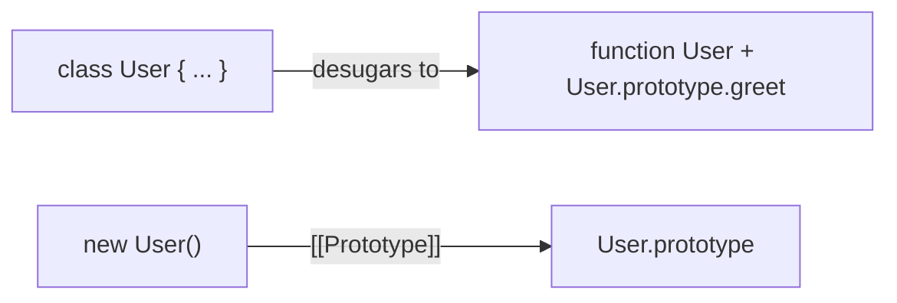
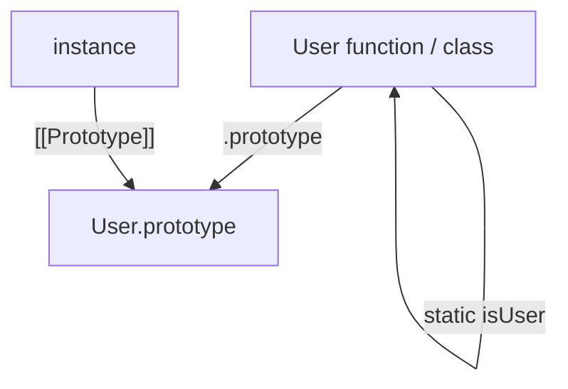
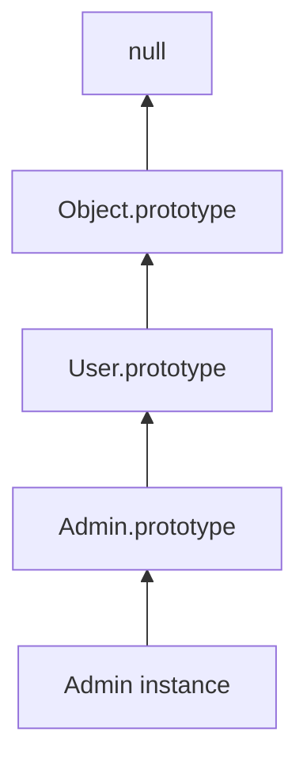
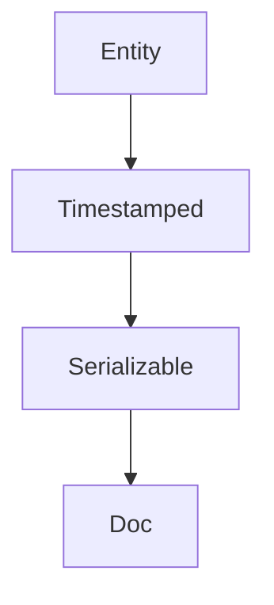

# Classes

This chapter teaches ES6 `class` from scratch. You do not need to already know constructors, `extends`, `static`, or private fields. By the end you should explain **what a class really is** (syntax over prototypes), **how `constructor` / `extends` / `super` work**, and **what `static` and `#private` mean**.

If you have not read [Prototypes](/javascript/07-prototype), skim at least sections on `[[Prototype]]`, `new`, and `.prototype`. Classes sit on that model.

---

## 1. The problem classes solve

We already know how to share behavior with constructor functions:

```ts
function User(name: string) {
  this.name = name
}
User.prototype.greet = function () {
  return `Hi, I'm ${this.name}`
}
```

This works, but:

1. The “shape” of a User is split across the function body and `User.prototype` assignments.
2. Inheritance (`Admin` extends `User`) requires careful `Object.create` + `constructor` fixups.
3. Nothing stops someone calling `User()` without `new`.

A **class** is a clearer syntax for the same underlying prototype setup.

```ts
class User {
  name: string
  constructor(name: string) {
    this.name = name
  }
  greet() {
    return `Hi, I'm ${this.name}`
  }
}

const ada = new User("Ada")
ada.greet()
```

Under the hood (simplified):

- `User` is still a function (the constructor)
- Methods like `greet` go on `User.prototype`
- Instances still get `[[Prototype]] === User.prototype`



**Interview line:** Classes are mostly syntax sugar over the prototype model — not a second inheritance system.

---

## 2. Anatomy of a class — piece by piece

```ts
class User {
  // 1. Constructor: runs on `new User(...)`
  constructor(name: string) {
    this.name = name
  }

  // 2. Instance method: lives on User.prototype
  greet() {
    return `Hi, I'm ${this.name}`
  }

  // 3. Getter: also on the prototype, as an accessor
  get upperName() {
    return this.name.toUpperCase()
  }
}
```

### 2.1 `constructor`

The `constructor` method is the function that runs when you `new` the class. It is where you set **per-instance** data:

```ts
constructor(name: string) {
  this.name = name // own property on each instance
}
```

If you omit `constructor`, JavaScript supplies an empty one (or one that calls `super(...)` in a subclass — see inheritance).

### 2.2 Instance methods

Methods written in the class body (not marked `static`) are placed on **`ClassName.prototype`**, shared by all instances:

```ts
typeof User.prototype.greet // "function"
Object.hasOwn(ada, "greet") // false — inherited via prototype
```

They are non-enumerable (nicer than old-style `User.prototype.greet = ...` assignments).

### 2.3 You must use `new`

```ts
User("Ada") // TypeError: Class constructor User cannot be invoked without 'new'
```

Unlike loose constructor functions, classes refuse to run as plain functions. That removes a whole class of bugs.

### 2.4 Class bodies are not hoisted like `function` declarations

```ts
const u = new User("x") // ReferenceError if class is below
class User {}
```

The class binding is in the **temporal dead zone** until the class declaration is evaluated (similar to `let`). Class **expressions** exist too:

```ts
const User = class {
  constructor(public name: string) {}
}
```

---

## 3. Fields: instance data declared on the class

Modern JavaScript (and TypeScript) lets you declare fields:

```ts
class Counter {
  count = 0 // instance field — each object gets its own count

  inc() {
    this.count++
  }
}

const a = new Counter()
const b = new Counter()
a.inc()
a.count // 1
b.count // 0 — separate own properties
```

What happens:

1. A new object is created (`new`)
2. Instance fields are initialized on that object
3. `constructor` runs (if present)

```ts
class Demo {
  x = this.hint() // fields run before constructor body finishes setup carefully
  constructor() {
    console.log("ctor", this.x)
  }
  hint() {
    return 1
  }
}
```

Prefer initializing fields that need constructor arguments **inside** `constructor`:

```ts
class User {
  name: string
  constructor(name: string) {
    this.name = name
  }
}
```

TypeScript’s parameter properties are shorthand:

```ts
class User {
  constructor(public name: string) {}
  // equivalent to declaring name and assigning this.name = name
}
```

---

## 4. `static` — belonging to the class, not the instance

Sometimes a helper related to `User` does not need a particular user:

```ts
class User {
  constructor(public name: string) {}

  static isUser(value: unknown): value is User {
    return value instanceof User
  }

  static createGuest() {
    return new User("guest")
  }
}

User.isUser(new User("Ada")) // true
User.createGuest().name // "guest"

const u = new User("Ada")
// u.createGuest — undefined / error — static is NOT on instances
```

Plain language:

> `static` members hang off the **constructor function** itself (`User.isUser`), not off `User.prototype`.



### 4.1 Static fields

```ts
class Config {
  static version = "1.0.0"
  static defaults = { theme: "dark" }
}

Config.version
```

### 4.2 Static inheritance

Subclasses inherit static members via the **prototype chain of the constructor functions**:

```ts
class Animal {
  static kingdom = "animalia"
}
class Dog extends Animal {}
Dog.kingdom // "animalia"
Object.getPrototypeOf(Dog) === Animal // true for classes!
```

That last line is important: for `class Dog extends Animal`, `Object.getPrototypeOf(Dog) === Animal`. So static lookup walks `Dog → Animal → …`.

---

## 5. Private fields (`#`) — real encapsulation

Historically, people used a leading underscore as a *convention*:

```ts
this._secret = 1 // still fully accessible from outside
```

JavaScript now has **private fields** with `#`:

```ts
class BankAccount {
  #balance = 0

  deposit(amount: number) {
    if (amount <= 0) throw new Error("invalid")
    this.#balance += amount
  }

  getBalance() {
    return this.#balance
  }
}

const a = new BankAccount()
a.deposit(100)
a.getBalance() // 100
// a.#balance — SyntaxError: private field not accessible here
```

Rules that matter:

1. `#name` is only visible **inside** the class body that declared it.
2. Private fields are **per-instance** own slots (not on the prototype as public methods are).
3. Subclasses do **not** see the parent’s private fields.
4. You cannot dynamically access them with `obj["#balance"]`.

Private methods and getters/setters also exist:

```ts
class C {
  #hidden() {
    return 1
  }
  publicCall() {
    return this.#hidden()
  }
}
```

There are also **private static** fields: `static #cache = new Map()`.

> [!TIP]
> Soft-private (`_foo`) is still common in older codebases. Prefer `#` when you need actual privacy. TypeScript’s `private` keyword is **compile-time only** — it disappears in emitted JS unless you use `#` or `private` with recent emit settings carefully. For runtime privacy, use `#`.

---

## 6. Inheritance with `extends` and `super`

### 6.1 The goal

`Admin` should reuse `User`’s data setup and methods, then add more:

```ts
class User {
  constructor(public name: string) {}
  greet() {
    return `Hi, I'm ${this.name}`
  }
}

class Admin extends User {
  constructor(name: string, public level: number) {
    super(name) // must call before using `this`
  }

  wipe() {
    return `${this.name} wipes (level ${this.level})`
  }

  greet() {
    return `${super.greet()} [admin]`
  }
}

const a = new Admin("Ada", 10)
a.greet() // "Hi, I'm Ada [admin]"
a.wipe()
a instanceof Admin // true
a instanceof User // true
```

### 6.2 What `extends` sets up



Also, the constructor functions are linked for static inheritance:

```text
Admin [[Prototype]] → User
Admin.prototype [[Prototype]] → User.prototype
```

### 6.3 `super` in the constructor

In a derived class, you **must** call `super(...)` before you touch `this`:

```ts
class Admin extends User {
  constructor(name: string, level: number) {
    // this.level = level // ReferenceError — this not initialized yet
    super(name)
    this.level = level // OK after super
  }
}
```

Why? The parent constructor is responsible for creating/initializing the instance’s base state. Until `super` returns, `this` is not ready.

What `super(name)` does: call the parent constructor with the current instance as `this` (roughly like `User.call(this, name)` in the old pattern).

### 6.4 `super` in methods

In an instance method, `super.method()` looks up `method` on the **parent prototype**, then calls it with the current `this`:

```ts
greet() {
  return `${super.greet()} [admin]`
  // finds User.prototype.greet, calls it with this === current Admin instance
}
```

That is different from `User.prototype.greet()` which would set `this` incorrectly if you are not careful — `super` handles the receiver correctly.

### 6.5 Overriding

If the subclass defines the same method name, instances find the subclass version first (shadowing). Use `super` when you want to extend rather than replace behavior.

---

## 7. Getters, setters, and computed names

```ts
class Temperature {
  #c = 0

  get celsius() {
    return this.#c
  }
  set celsius(v: number) {
    this.#c = v
  }
  get fahrenheit() {
    return this.#c * 1.8 + 32
  }
}

const t = new Temperature()
t.celsius = 100
t.fahrenheit // 212
```

Computed method names:

```ts
const method = "greet"
class Greeter {
  [method]() {
    return "hi"
  }
}
```

---

## 8. Mixins — sharing behavior without a deep hierarchy

Inheritance is an **is-a** relationship (`Admin` is a `User`). Sometimes you want **reusable behavior** without forcing a single parent:

> “This object can be timestamped” and “this object can be serialized” — neither needs to own the other.

A **mixin** is an object (or factory) whose methods you copy onto a prototype:

```ts
type Ctor<T = {}> = new (...args: any[]) => T

function Timestamped<TBase extends Ctor>(Base: TBase) {
  return class extends Base {
    createdAt = new Date()
    touch() {
      this.createdAt = new Date()
    }
  }
}

function Serializable<TBase extends Ctor>(Base: TBase) {
  return class extends Base {
    serialize() {
      return JSON.stringify(this)
    }
  }
}

class Entity {
  constructor(public id: string) {}
}

class Doc extends Serializable(Timestamped(Entity)) {
  constructor(id: string, public title: string) {
    super(id)
  }
}

const d = new Doc("1", "Notes")
d.touch()
d.serialize()
```



Plain language:

> A mixin **composes** behavior into a class. Prefer mixins (or plain functions/composition) when relationships are “can do X,” not “is a kind of Y.”

Caveats:

- Deep mixin stacks can hurt readability and TypeScript inference.
- Private fields in mixins have subtleties — keep mixins simple.
- Often **composition** is clearer: hold a `timestamps` helper object instead of extending.

```ts
class Doc {
  createdAt = new Date()
  constructor(public id: string, public title: string) {}
  serialize() {
    return JSON.stringify(this)
  }
}
```

---

## 9. Classes vs plain objects vs factories

Not everything needs `class`.

| Pattern | When it fits |
| --- | --- |
| `class` | Many instances, shared methods, clear hierarchy, `instanceof` useful |
| Factory function | Prefer closures for privacy, no `new`, flexible return shapes |
| Plain object | One-off configs, data bags, module singletons |

Factory example:

```ts
function createCounter(start = 0) {
  let count = start // truly private via closure
  return {
    inc: () => ++count,
    value: () => count,
  }
}
```

Classes shine when you want prototypes, inheritance, and a standard construction story. Factories shine for lightweight APIs and closure privacy without `#` syntax.

---

## 10. Desugaring — prove classes are prototypes

Rough mental desugaring of:

```ts
class User {
  constructor(name: string) {
    this.name = name
  }
  greet() {
    return this.name
  }
  static create(name: string) {
    return new User(name)
  }
}
```

Behaves like:

```ts
function User(this: { name: string }, name: string) {
  if (!(this instanceof User)) {
    throw new TypeError(" mag without new")
  }
  this.name = name
}

User.prototype.greet = function () {
  return this.name
}

User.create = function (name: string) {
  return new User(name)
}
```

(Real engines also set non-enumerable methods, special `[[IsClassConstructor]]` internals, etc. The picture above is enough for interviews.)

Verify:

```ts
const u = new User("Ada")
Object.getPrototypeOf(u) === User.prototype
typeof User.prototype.greet === "function"
typeof u.greet === "function"
Object.hasOwn(u, "greet") === false
```

---

## 11. `instanceof` and classes

Same rule as with constructors: walk the prototype chain for `Class.prototype`.

```ts
class A {}
class B extends A {}
const b = new B()
b instanceof B // true
b instanceof A // true
b instanceof Object // true
```

Customizing with `Symbol.hasInstance` is possible but rare:

```ts
class Even {
  static [Symbol.hasInstance](x: unknown) {
    return typeof x === "number" && x % 2 === 0
  }
}
2 instanceof Even // true
```

---

## 12. Worked example

```ts
class Vehicle {
  constructor(public brand: string) {}
  describe() {
    return this.brand
  }
}

class Car extends Vehicle {
  #odometer = 0

  constructor(brand: string, public doors: number) {
    super(brand)
  }

  drive(km: number) {
    this.#odometer += km
  }

  describe() {
    return `${super.describe()} (${this.doors} doors, ${this.#odometer} km)`
  }

  static fromJSON(json: string) {
    const data = JSON.parse(json) as { brand: string; doors: number }
    return new Car(data.brand, data.doors)
  }
}

const c = Car.fromJSON('{"brand":"Toyota","doors":4}')
c.drive(10)
c.describe()
```

Trace:

1. `Car.fromJSON` is **static** — called on `Car`, returns an instance
2. `constructor` calls `super(brand)` then sets `doors`
3. `#odometer` is private — only `drive` / `describe` inside the class touch it
4. `describe` uses `super.describe()` for the brand string

---

## Interview Questions

### Q1. Are JavaScript classes “real” classes like in Java?
**Expected:** No — they are syntax over constructor functions + prototypes; inheritance is still the prototype chain.  
**Common wrong:** “JS now has classical class inheritance instead of prototypes.”  
**Follow-ups:** Where do instance methods live? (`Class.prototype`)

### Q2. What does `static` mean?
**Expected:** The member is on the constructor function itself, not on instances / the prototype (for instance methods).  
**Common wrong:** “Static means immutable.”  
**Follow-ups:** Do subclasses inherit statics? (Yes, via constructor `[[Prototype]]`.)

### Q3. Why must you call `super()` before `this` in a subclass constructor?
**Expected:** The parent constructor initializes the instance; `this` is not available until `super` completes.  
**Common wrong:** “It’s just a style rule.”  
**Follow-ups:** What if the class does not `extend`? (No `super` in constructor.)

### Q4. `#private` vs TypeScript `private`?
**Expected:** `#` is enforced at runtime by the language; TS `private` is mostly a compile-time check unless emitted as `#`.  
**Common wrong:** “They are identical.”  
**Follow-ups:** Can subclasses access `#` fields of the parent? (No.)

### Q5. What is a mixin?
**Expected:** A pattern to compose reusable behavior into classes without a rigid single-inheritance tree — often a function that takes a class and returns an extended class.  
**Common wrong:** “Another name for `extends`.”  
**Follow-ups:** When prefer composition over mixins?

### Q6. What happens if you call a class without `new`?
**Expected:** `TypeError` — class constructors require `new`.  
**Common wrong:** “It pollutes `globalThis` like old functions.”  

## Common Mistakes

- Thinking `class` removed the prototype chain.
- Forgetting `super()` in subclass constructors.
- Putting per-instance mutable data on the prototype by accident.
- Expecting `static` methods to be available as `instance.method()`.
- Using TypeScript `private` and assuming runtime privacy.
- Deep `extends` hierarchies where composition would be clearer.
- Arrow functions as class fields when you need prototype sharing / inheritance of methods (field arrows are per-instance; sometimes intentional for `this` binding).

## Trade-offs / Production Notes

- Prefer **`class`** for domain entities with clear identity and shared methods.
- Prefer **composition / factories** for behavior bags and simple state machines.
- Use **`#` private** for real encapsulation at runtime.
- Keep inheritance **shallow**; reach for mixins or helpers when “can-do” piles up.
- Related: [Prototypes](/javascript/07-prototype), [this](/javascript/06-this), [Functions](/javascript/09-functions), [Objects](/javascript/14-objects).
