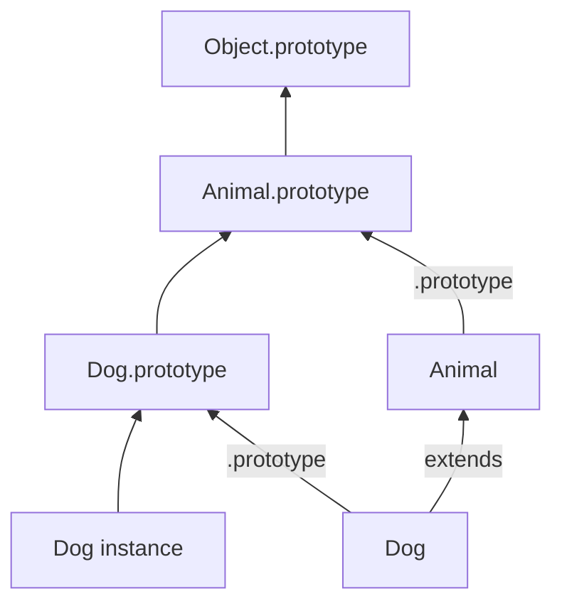

# Classes

`class` is mostly **syntax sugar** over prototypes + constructor functions, with stricter semantics (`super`, TDZ, non-callable without `new`).

## Basic shape

```ts
class Animal {
  constructor(public name: string) {}
  speak() {
    return "..."
  }
}

class Dog extends Animal {
  constructor(name: string, public breed: string) {
    super(name)
  }
  override speak() {
    return "woof"
  }
}

const d = new Dog("Rex", "lab")
d.speak()
d instanceof Dog
d instanceof Animal
```



## What desugars to (mental model)

```ts
// approximate
function Animal(this: { name: string }, name: string) {
  this.name = name
}
Animal.prototype.speak = function () {
  return "..."
}
```

Differences from handwritten: classes are not callable without `new`; methods are non-enumerable; `extends` wires `[[Prototype]]` of both constructor and `.prototype`.

## Fields: public, static, private

```ts
class Counter {
  static instances = 0
  n = 0 // public instance field — per object
  #secret = 42 // private — per object, not on prototype

  constructor() {
    Counter.instances++
  }

  inc() {
    this.n++
    return this.#secret
  }

  static zero() {
    return new Counter()
  }
}
```

| Kind | Shared? | Visible outside? |
| --- | --- | --- |
| Method on prototype | yes | yes |
| Public field | per instance | yes |
| `#private` field/method | per instance | no |
| `static` | on constructor | yes |
| `static #x` | on constructor | no |

Private brands: `#x` access outside throws `TypeError` — true encapsulation (unlike `_x` convention).

## `super`

- In constructor: `super(...args)` calls parent constructor — **required** before `this` in derived classes.
- In methods: `super.method()` calls parent prototype method with same `this`.

```ts
class A {
  hello() {
    return "A"
  }
}
class B extends A {
  override hello() {
    return super.hello() + "B"
  }
}
```

## Initialization order

1. Parent fields / constructor chain via `super`  
2. Child fields initialized  
3. Child constructor body  

```ts
class Parent {
  x = this.hint()
  hint() {
    return 1
  }
}
class Child extends Parent {
  override hint() {
    return 2
  }
}
new Child().x // 2 — careful: overridden methods during parent field init
```

Interview trap: calling overridable methods from constructors/fields.

## Arrow class fields vs prototype methods

```ts
class C {
  onClick = () => {
    /* this always C instance */
  }
  handle() {
    /* prototype method — detachable */
  }
}
```

| | Prototype method | Arrow field |
| --- | --- | --- |
| Memory | one per class | one per instance |
| `this` | call-site | lexical |
| Overridable via proto | yes | harder |
| Useful for | OOP APIs | DOM/React class handlers |

## `extends` builtins

```ts
class MyError extends Error {
  constructor(message: string, public code: string) {
    super(message)
    this.name = "MyError"
  }
}
```

Ensure `super` + correct `name`; older transpile targets needed `Object.setPrototypeOf` hacks — know history for legacy Babel output.

## Mixins (pattern, not syntax)

```ts
type Constructor<T = {}> = new (...args: any[]) => T

function Timestamped<TBase extends Constructor>(Base: TBase) {
  return class extends Base {
    createdAt = new Date()
  }
}

class User {
  constructor(public id: string) {}
}
const TimestampedUser = Timestamped(User)
```

Prefer composition when mixins obscure type identity.

## Abstract patterns in TypeScript

```ts
abstract class Repo<T> {
  abstract get(id: string): Promise<T>
  async getOrThrow(id: string) {
    const v = await this.get(id)
    if (!v) throw new Error("missing")
    return v
  }
}
```

`abstract` is erased at runtime — enforce with types, not JS.

## Interview Questions

**Q: Are classes just syntactic sugar?**  
Mostly over prototypes, but with real semantic differences: strict mode, `new` required, `super` rules, private fields, non-enumerable methods.

**Q: Where do methods live?**  
On `.prototype` (shared). Fields live on instances (or constructor if static).

**Q: Why call `super` before `this`?**  
Derived instance isn't initialized until parent constructor completes.

**Q: Private fields vs closures?**  
`#` is per-instance branded storage; closures hide in environment. Both encapsulate; different memory/sharing trade-offs — see [Closures](/javascript/05-closures).

**Q: Can you extend `null`?**  
`class X extends null` — exotic; rare. Usually extend `Object` or nothing.

## Common Mistakes

- Forgetting `new` (throws on class).
- Using `this` before `super` in subclass.
- Putting heavy logic in constructors that subclasses override.
- Assuming TypeScript `private` is runtime-private (it's only compile-time; use `#` for runtime).
- Mutating shared static state without concurrency care in Node clusters — [Cluster](/node/05-cluster).

## Trade-offs / Production Notes

- Prefer classes when you need identity, `instanceof`, and shared methods at scale.
- Prefer factories/closures for capability objects with few instances and true privacy.
- Don't deep-inherit for app domain models — shallow hierarchies or composition.
- Related: [Prototype](/javascript/07-prototype), [this](/javascript/06-this), [Functions](/javascript/09-functions).
