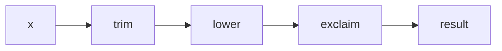

# Functions

First-class functions: create, pass, return, compose. Machine-coding staples — **curry, partial, compose, memoize** — implemented from scratch below.

## Function kinds (runtime)

| Kind | `this` | `new` | `arguments` | Hoist as callable |
| --- | --- | --- | --- | --- |
| Declaration | dynamic | yes | yes | yes |
| Expression | dynamic | yes | yes | no |
| Arrow | lexical | no | no (use rest) | no |
| Method | dynamic | rarely | yes | n/a |
| `async` | same rules | same | same | per form |
| Generator | dynamic | yes | yes | per form |

```ts
function decl() {}
const expr = function name() {} // name is local to function body
const arrow = (...args: number[]) => args
```

## Rest / default / length

```ts
function f(a: number, b = 2, ...rest: number[]) {
  return [a, b, rest]
}
f.length // 1 — params before first default / rest
```

## Higher-order functions

```ts
function map<T, U>(arr: T[], fn: (x: T, i: number) => U): U[] {
  const out: U[] = []
  for (let i = 0; i < arr.length; i++) out.push(fn(arr[i]!, i))
  return out
}
```

Closures power HOFs — [Closures](/javascript/05-closures).

---

## Curry (from scratch)

**Currying** transforms `(a, b, c) => R` into `a => b => c => R`.

```ts
type AnyFn = (...args: any[]) => any

function curry<F extends AnyFn>(fn: F, arity = fn.length) {
  function curried(this: unknown, ...args: any[]): any {
    if (args.length >= arity) {
      return fn.apply(this, args.slice(0, arity))
    }
    return function (this: unknown, ...more: any[]) {
      return curried.apply(this, args.concat(more))
    }
  }
  return curried as any
}

function sum3(a: number, b: number, c: number) {
  return a + b + c
}

const cSum = curry(sum3)
cSum(1)(2)(3) // 6
cSum(1, 2)(3) // 6
cSum(1)(2, 3) // 6
```

### Variadic / placeholder curry (interview flex)

```ts
const _ = Symbol("placeholder")

function curryPlaceholder(fn: AnyFn, arity = fn.length) {
  function next(saved: any[]) {
    return (...args: any[]) => {
      const merged: any[] = []
      let ai = 0
      for (const s of saved) {
        if (s === _ && ai < args.length) merged.push(args[ai++])
        else merged.push(s)
      }
      while (ai < args.length) merged.push(args[ai++])
      const filled = merged.filter((x) => x !== _).length
      if (filled >= arity && !merged.slice(0, arity).includes(_)) {
        return fn(...merged.slice(0, arity))
      }
      return next(merged)
    }
  }
  return next([])
}

function greet(greeting: string, name: string) {
  return `${greeting}, ${name}`
}
const cGreet = curryPlaceholder(greet)
cGreet(_, "Ada")("Hello") // "Hello, Ada"
```

---

## Partial application (from scratch)

**Partial** fixes some arguments now; rest later. Unlike curry, typically returns a function expecting the *remaining* args in one call (not necessarily unary).

```ts
function partial<F extends AnyFn>(fn: F, ...preset: any[]) {
  return function partiallyApplied(this: unknown, ...later: any[]) {
    return fn.apply(this, preset.concat(later))
  }
}

function multiply(a: number, b: number, c: number) {
  return a * b * c
}

const doubleThen = partial(multiply, 2)
doubleThen(3, 4) // 24

const timesSix = partial(multiply, 2, 3)
timesSix(4) // 24
```

### Partial with placeholders

```ts
function partialRight(fn: AnyFn, ...presetRight: any[]) {
  return function (this: unknown, ...left: any[]) {
    return fn.apply(this, left.concat(presetRight))
  }
}

function partialWithPlaceholders(fn: AnyFn, ...preset: any[]) {
  return (...later: any[]) => {
    const args = preset.map((p) => (p === _ ? later.shift() : p))
    return fn(...args, ...later)
  }
}
```

**Curry vs partial:** curry → nested unary (or accumulating until arity). Partial → prefill arbitrary positions, usually one remaining call.

---

## Compose / pipe (from scratch)

```ts
type Unary = (x: any) => any

function compose<T>(...fns: Unary[]) {
  return function composed(x: T) {
    return fns.reduceRight((acc, fn) => fn(acc), x as any)
  }
}

function pipe<T>(...fns: Unary[]) {
  return function piped(x: T) {
    return fns.reduce((acc, fn) => fn(acc), x as any)
  }
}

const trim = (s: string) => s.trim()
const lower = (s: string) => s.toLowerCase()
const exclaim = (s: string) => `${s}!`

const shout = compose(exclaim, lower, trim)
shout("  Hey ") // "hey!"

const shoutPipe = pipe(trim, lower, exclaim)
shoutPipe("  Hey ") // "hey!"
```



Typed compose for interviews (binary building):

```ts
function compose2<A, B, C>(f: (b: B) => C, g: (a: A) => B) {
  return (a: A) => f(g(a))
}
```

Async pipe:

```ts
function pipeAsync(...fns: Array<(x: any) => any>) {
  return async (x: any) => {
    let acc = x
    for (const fn of fns) acc = await fn(acc)
    return acc
  }
}
```

---

## Memoize (from scratch)

Cache results of pure functions by arguments.

```ts
function memoize<F extends AnyFn>(
  fn: F,
  keyFn: (...args: any[]) => string = (...args) => JSON.stringify(args),
): F {
  const cache = new Map<string, ReturnType<F>>()
  const memoized = function (this: unknown, ...args: any[]) {
    const key = keyFn(...args)
    if (cache.has(key)) return cache.get(key)!
    const result = fn.apply(this, args)
    cache.set(key, result)
    return result
  } as F
  ;(memoized as any).clear = () => cache.clear()
  ;(memoized as any).cache = cache
  return memoized
}

const fib = memoize((n: number): number => {
  if (n < 2) return n
  return fib(n - 1) + fib(n - 2)
})
fib(40) // fast after cache warms
```

### Promise-aware memoize (in-flight dedupe)

```ts
function memoizeAsync<F extends (...args: any[]) => Promise<any>>(
  fn: F,
  keyFn: (...args: any[]) => string = (...args) => JSON.stringify(args),
): F {
  const cache = new Map<string, Promise<any>>()
  return function (this: unknown, ...args: any[]) {
    const key = keyFn(...args)
    if (!cache.has(key)) {
      const p = fn.apply(this, args).catch((err: unknown) => {
        cache.delete(key) // allow retry
        throw err
      })
      cache.set(key, p)
    }
    return cache.get(key)!
  } as F
}
```

### LRU-bounded memoize sketch

```ts
function memoizeLru<F extends AnyFn>(fn: F, limit: number): F {
  const cache = new Map<string, any>()
  return function (this: unknown, ...args: any[]) {
    const key = JSON.stringify(args)
    if (cache.has(key)) {
      const v = cache.get(key)
      cache.delete(key)
      cache.set(key, v) // refresh insertion order
      return v
    }
    const v = fn.apply(this, args)
    cache.set(key, v)
    if (cache.size > limit) {
      const oldest = cache.keys().next().value as string
      cache.delete(oldest)
    }
    return v
  } as F
}
```

**Caveats:** `JSON.stringify` keying fails on order of object keys, `undefined`, functions, circular refs. Use custom `keyFn` for domain IDs. Don't memoize impure functions (Date.now, I/O without intent).

---

## Debounce / throttle (related HOFs)

Often asked alongside memoize — see [Debounce / Throttle](/coding/01-debounce-throttle).

```ts
function debounce<F extends AnyFn>(fn: F, ms: number) {
  let t: ReturnType<typeof setTimeout> | undefined
  return function (this: unknown, ...args: any[]) {
    clearTimeout(t)
    t = setTimeout(() => fn.apply(this, args), ms)
  }
}
```

---

## `Function.prototype` utilities

```ts
fn.call(thisArg, ...args)
fn.apply(thisArg, argsArray)
fn.bind(thisArg, ...partialArgs)
```

`bind` ≈ partial + fixed `this`. Our `partial` above does not fix `this` unless you wrap.

---

## Recursion & stack

```ts
function factorial(n: number, acc = 1): number {
  if (n <= 1) return acc
  return factorial(n - 1, acc * n) // TCO not guaranteed in JS
}
```

Prefer loops for deep recursion; trampolines if you must.

---

## Interview Questions

**Q: Curry vs partial?**  
Curry: arity-driven nested application until saturated. Partial: pre-fill some args, call with rest (often once).

**Q: Compose order?**  
`compose(f,g,h)(x)` = `f(g(h(x)))` — right to left. `pipe` is left to right.

**Q: When is memoization safe?**  
Referentially transparent functions; stable keying; bounded cache if arg space large; careful with promises/errors.

**Q: Why does `fn.length` matter for curry?**  
Default arity detection; default params / rest make `length` smaller — pass explicit arity.

**Q: Arrow vs function for HOFs?**  
Arrows inherit `this` — good for callbacks; bad if you need `new` or dynamic `this`.

## Common Mistakes

- Memoizing functions that close over changing state without including it in the key.
- Using `JSON.stringify` on objects with unstable key order.
- Infinite recursion in naive `fib` without memo.
- Confusing compose direction under pressure.
- Currying methods and losing `this` — use `fn.call` carefully or wrap.

## Trade-offs / Production Notes

- Lodash `curry` / `partial` are battle-tested; reimplement in interviews, reuse in prod.
- Memoize at network boundaries with TTL — see React Query patterns ([React Query](/react/06-react-query)).
- Composition beats deep inheritance for data transforms.
- Related: [Closures](/javascript/05-closures), [Coding Promise](/coding/02-promise), [Async](/javascript/11-async).
