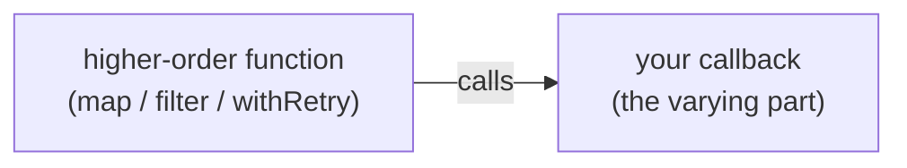
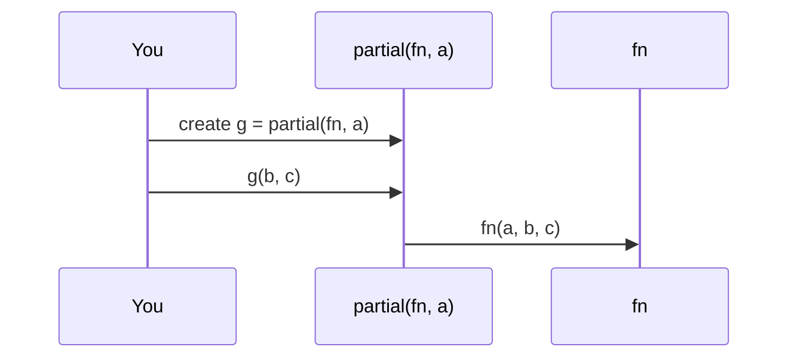
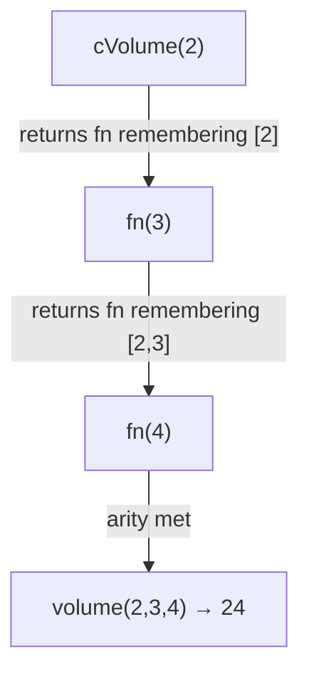
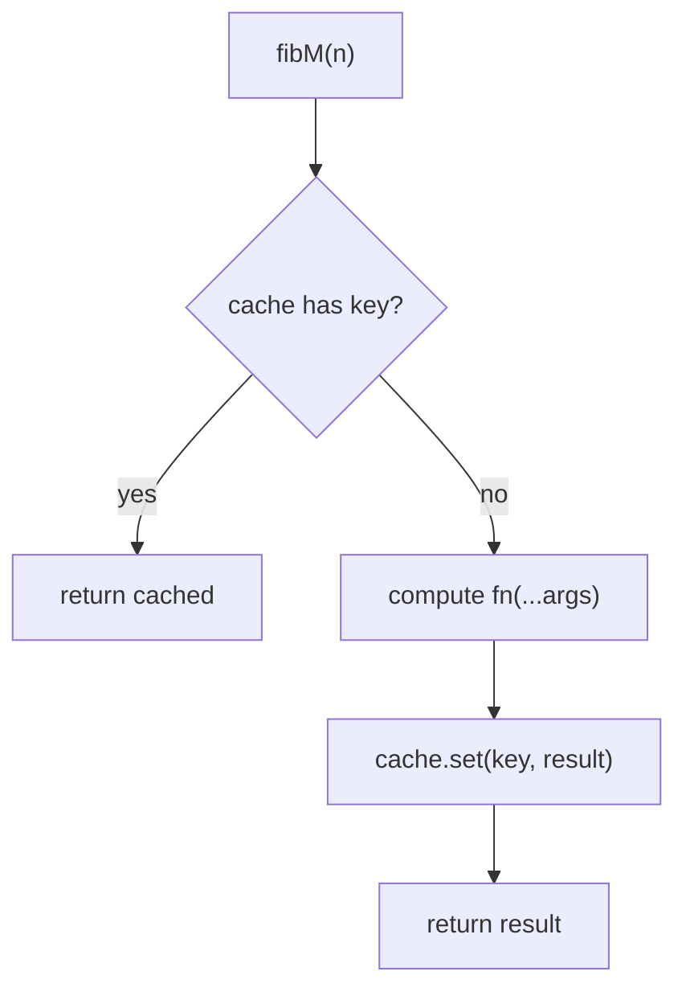

# Functions

This chapter teaches functions as values from scratch. You do not need to already know “first-class,” “higher-order,” “curry,” or “compose.” By the end you should explain **why functions can be passed around**, **what callbacks and higher-order functions are**, and **how to implement curry / partial / compose / memoize yourself — and why anyone bothers**.

Related: [Closures](/javascript/05-closures) (how nested functions keep variables), [this](/javascript/06-this) (how methods get their receiver).

---

## 1. The problem: code that should be configurable

Imagine a list of numbers. Sometimes you want the sum. Sometimes the product. Sometimes the maximum.

```ts
function sum(arr: number[]) {
  let total = 0
  for (const n of arr) total += n
  return total
}

function product(arr: number[]) {
  let total = 1
  for (const n of arr) total *= n
  return total
}
```

The **loop structure** is the same. Only the combining step differs. You want to write the loop once and pass in “how to combine”:

```ts
function reduce(arr: number[], combine: (acc: number, n: number) => number, start: number) {
  let acc = start
  for (const n of arr) {
    acc = combine(acc, n)
  }
  return acc
}

reduce([1, 2, 3], (a, b) => a + b, 0) // 6
reduce([1, 2, 3], (a, b) => a * b, 1) // 6
```

That only works because **functions are values** — you can pass `(a, b) => a + b` the same way you pass a number.

---

## 2. First-class functions — functions are data

A language has **first-class functions** when functions can do the same things other values can:

1. Assign to a variable
2. Pass as an argument
3. Return from another function
4. Store in a data structure

```ts
// 1. Assign
const shout = (s: string) => s.toUpperCase()

// 2. Pass as argument
;["a", "b"].map(shout)

// 3. Return from a function
function makeShout() {
  return (s: string) => s.toUpperCase()
}

// 4. Store in a structure
const ops = {
  add: (a: number, b: number) => a + b,
  sub: (a: number, b: number) => a - b,
}
ops.add(1, 2)
```

Plain language:

> In JavaScript, a function is an object you can call. It is not a special second-class citizen.

That is why `map`, `filter`, event listeners, and Promise callbacks all feel natural.

### 2.1 Function declaration vs expression vs arrow

```ts
// Declaration — hoisted as a complete function binding
function add(a: number, b: number) {
  return a + b
}

// Expression — value produced then stored
const add2 = function (a: number, b: number) {
  return a + b
}

// Arrow — short expression form; lexical `this` (see this chapter)
const add3 = (a: number, b: number) => a + b
```

All three are first-class values once created. Differences that matter:

| Kind | Hoisting | `this` | `arguments` | Can be `new`’d |
| --- | --- | --- | --- | --- |
| `function` declaration/expression | decl yes | dynamic | yes | yes (has `.prototype`) |
| arrow | no | lexical (enclosing) | no | no |

---

## 3. Higher-order functions (HOFs)

A **higher-order function** is a function that either:

- takes another function as an argument, or
- returns a function, or
- both

```ts
// Takes a function
function withLogging<T>(fn: () => T): T {
  console.log("start")
  const result = fn()
  console.log("end")
  return result
}

// Returns a function
function twice(fn: (n: number) => number) {
  return (n: number) => fn(fn(n))
}

const plus1 = (n: number) => n + 1
const plus2 = twice(plus1)
plus2(5) // 7
```

Built-in HOFs you already use:

```ts
;[1, 2, 3].map((n) => n * 2)
;[1, 2, 3].filter((n) => n > 1)
;[1, 2, 3].reduce((a, b) => a + b, 0)
setTimeout(() => console.log("hi"), 0)
```

**Why HOFs exist:** they separate **what varies** (the callback) from **what stays fixed** (the iteration, the timing, the retry policy).



---

## 4. Callbacks — “call this when you’re ready”

A **callback** is a function you pass in so someone else can call it later (or immediately).

```ts
function loadUser(id: string, callback: (user: { id: string }) => void) {
  // pretend async work
  setTimeout(() => {
    callback({ id })
  }, 100)
}

loadUser("1", (user) => {
  console.log(user.id)
})
```

Plain language:

> You hand over a phone number (the function). When the work finishes, they dial it (call your function) with the result.

Callbacks can also be **synchronous**:

```ts
function forEach<T>(arr: T[], cb: (item: T, i: number) => void) {
  for (let i = 0; i < arr.length; i++) {
    cb(arr[i], i)
  }
}
```

Problems with callback-heavy async code (“callback hell”) led to Promises and `async/await` — see [Async](/javascript/11-async). The idea of “pass a function to run later” remains fundamental.

### 4.1 Error-first callbacks (Node style)

Older Node APIs used:

```ts
fs.readFile(path, (err, data) => {
  if (err) {
    // handle error
    return
  }
  // use data
})
```

First argument is an error or `null`. Knowing this pattern helps reading legacy code.

---

## 5. Partial application — fix some arguments now

### 5.1 The problem

```ts
function sendEmail(from: string, to: string, body: string) {
  return `${from} → ${to}: ${body}`
}
```

In one module, `from` is always `"noreply@app.com"`. You do not want to repeat that string:

```ts
const sendFromApp = (to: string, body: string) =>
  sendEmail("noreply@app.com", to, body)
```

That is **partial application**: create a new function with some arguments already filled in.

### 5.2 Implement `partial` from scratch

```ts
function partial<A extends unknown[], R>(
  fn: (...args: A) => R,
  ...fixed: Partial<A> // teaching-friendly; real typing of partial is hard
): (...rest: unknown[]) => R {
  return (...rest: unknown[]) => {
    // Call fn with fixed args first, then the rest
    return fn(...([...fixed, ...rest] as A))
  }
}

const sendFromApp = partial(sendEmail, "noreply@app.com")
sendFromApp("ada@ex.com", "Hello")
// → sendEmail("noreply@app.com", "ada@ex.com", "Hello")
```

Simpler version without fancy types:

```ts
function partial(fn: (...args: any[]) => unknown, ...fixed: unknown[]) {
  return (...rest: unknown[]) => fn(...fixed, ...rest)
}
```

**Why it matters:**

- Removes repetition of common configuration
- Creates specialized APIs from general ones
- Works well with HOFs (`map(partial(fn, fixed))`)



---

## 6. Currying — one argument at a time

### 6.1 What curry means

A **curried** function takes arguments **one at a time**, returning a new function until it has enough to compute the result:

```ts
// Normal
const add = (a: number, b: number) => a + b
add(1, 2)

// Curried
const addC = (a: number) => (b: number) => a + b
addC(1)(2) // 3

const add1 = addC(1)
add1(5) // 6
```

Partial application and currying are related but not identical:

| | Partial | Curry |
| --- | --- | --- |
| Idea | Pre-fill any number of args, call with the rest later | Transform so each call takes one arg (classically) |
| Shape | `f(a,b,c)` → `g(b,c)` after fixing `a` | `f(a,b,c)` → `f(a)(b)(c)` |

In practice people often say “curry” for “make it easy to partially apply.”

### 6.2 Why curry? A concrete win

```ts
const users = [
  { name: "Ada", role: "admin" },
  { name: "Grace", role: "user" },
]

const prop = (key: string) => (obj: Record<string, unknown>) => obj[key]

users.map(prop("name")) // ["Ada", "Grace"]
```

Without curry/partial you write arrows everywhere: `users.map((u) => u.name)`. That is fine! Curry shines when you **reuse** the specialized function in many places, or build pipelines.

### 6.3 Implement `curry` from scratch

```ts
function curry(fn: (...args: any[]) => any) {
  const arity = fn.length // number of declared parameters

  return function curried(this: unknown, ...args: any[]): any {
    if (args.length >= arity) {
      return fn.apply(this, args)
    }
    return (...more: any[]) => curried.apply(this, args.concat(more))
  }
}

function volume(l: number, w: number, h: number) {
  return l * w * h
}

const cVolume = curry(volume)
cVolume(2)(3)(4) // 24
cVolume(2, 3)(4) // 24 — this version allows multi-arg chunks
cVolume(2)(3, 4) // 24
```

Walkthrough of `cVolume(2)(3)(4)`:

1. `args = [2]`, length `1 < 3` → return a function that remembers `[2]`
2. Call with `3` → `args = [2, 3]`, still `< 3` → return another function
3. Call with `4` → `args = [2, 3, 4]`, `>= 3` → `volume(2, 3, 4)`



Caveats for interviews:

- `fn.length` ignores rest params and defaults poorly — real libraries track arity differently.
- TypeScript typing for arbitrary curry is complex; many codebases curry by hand for 2–3 args.

### 6.4 Manual curry is often clearer

```ts
const match = (regex: RegExp) => (s: string) => regex.test(s)
const isEmail = match(/^[^@]+@[^@]+$/)
;["a@b.co", "nope"].filter(isEmail)
```

You do not need a generic `curry` helper to get the benefits.

---

## 7. Compose and pipe — build pipelines

### 7.1 The problem

```ts
const trim = (s: string) => s.trim()
const lower = (s: string) => s.toLowerCase()
const exclaim = (s: string) => s + "!"

// Nested — hard to read (inside-out)
exclaim(lower(trim("  Hi "))) // "hi!"
```

You want to write the steps **in order** as a pipeline.

### 7.2 `compose` — right to left (math style)

`compose(f, g, h)(x)` means `f(g(h(x)))` — **last function listed runs first**.

```ts
function compose<T>(...fns: Array<(x: T) => T>) {
  return (x: T) => fns.reduceRight((acc, fn) => fn(acc), x)
}

const shout = compose(exclaim, lower, trim)
shout("  Hi ") // "hi!"
// trim → lower → exclaim
```

### 7.3 `pipe` — left to right (often more readable)

`pipe(f, g, h)(x)` means `h(g(f(x)))` — **first function listed runs first**.

```ts
function pipe<T>(...fns: Array<(x: T) => T>) {
  return (x: T) => fns.reduce((acc, fn) => fn(acc), x)
}

const shout2 = pipe(trim, lower, exclaim)
shout2("  Hi ") // "hi!"
```


**Why it matters:**

- Keeps transformation steps readable and testable in isolation
- Encourages small pure functions
- Foundation of functional-style code (and of libraries like RxJS pipe)

Teaching note: start with `pipe` in application code — left-to-right matches how people read English.

### 7.4 Async pipe (preview)

```ts
function pipeAsync<T>(...fns: Array<(x: T) => T | Promise<T>>) {
  return async (x: T) => {
    let acc: T = x
    for (const fn of fns) {
      acc = await fn(acc)
    }
    return acc
  }
}
```

---

## 8. Memoize — cache results of pure functions

### 8.1 The problem

```ts
function fib(n: number): number {
  if (n < 2) return n
  return fib(n - 1) + fib(n - 2)
}
fib(40) // slow — recomputes the same subproblems many times
```

If a function is **pure** (same inputs → same output, no side effects), you can remember past answers.

### 8.2 Implement `memoize` from scratch

```ts
function memoize<A extends unknown[], R>(fn: (...args: A) => R) {
  const cache = new Map<string, R>()

  return function memoized(...args: A): R {
    const key = JSON.stringify(args)
    if (cache.has(key)) {
      return cache.get(key)!
    }
    const result = fn(...args)
    cache.set(key, result)
    return result
  }
}

const fibM = memoize(function fib(n: number): number {
  if (n < 2) return n
  return fibM(n - 1) + fibM(n - 2) // recursive calls must use memoized version
})

fibM(40) // fast after caching
```

Walkthrough for `fibM(3)`:

1. Compute `fibM(3)` → needs `fibM(2)` and `fibM(1)`
2. `fibM(1)` → `1`, store under key `"[1]"`
3. `fibM(2)` → needs `fibM(1)` (cache hit) + `fibM(0)` → store `"[2]"`
4. Store `"[3]"` → later calls return instantly



### 8.3 Why — and when not to

**Use memoize when:**

- Function is pure
- Same inputs are requested often
- Result is expensive relative to storing it

**Do not memoize when:**

- Function depends on time, randomness, or mutable external state
- Arguments cannot be serialized safely (`JSON.stringify` fails on circular objects, treats `{}` keys inconsistently for object identity)
- Cache would grow without bound (memory leak) — need LRU / max size / WeakMap for object keys

Better keying for single object arguments:

```ts
function memoizeObjectArg<T extends object, R>(fn: (arg: T) => R) {
  const cache = new WeakMap<T, R>()
  return (arg: T): R => {
    if (cache.has(arg)) return cache.get(arg)!
    const result = fn(arg)
    cache.set(arg, result)
    return result
  }
}
```

`WeakMap` lets keys be GC’d — see [Memory](/javascript/12-memory).

---

## 9. Other useful HOF patterns (from scratch)

### 9.1 `once` — run at most one time

```ts
function once<A extends unknown[], R>(fn: (...args: A) => R) {
  let called = false
  let result: R
  return (...args: A): R => {
    if (!called) {
      called = true
      result = fn(...args)
    }
    return result
  }
}

const init = once(() => {
  console.log("init")
  return 42
})
init() // logs, returns 42
init() // returns 42, no log
```

### 9.2 `debounce` — wait until calls settle

```ts
function debounce<A extends unknown[]>(fn: (...args: A) => void, ms: number) {
  let timer: ReturnType<typeof setTimeout> | undefined
  return (...args: A) => {
    clearTimeout(timer)
    timer = setTimeout(() => fn(...args), ms)
  }
}

// Use: search-as-you-type — only search after user pauses typing
const onType = debounce((q: string) => console.log("search", q), 300)
```

### 9.3 `throttle` — at most once per window

```ts
function throttle<A extends unknown[]>(fn: (...args: A) => void, ms: number) {
  let last = 0
  return (...args: A) => {
    const now = Date.now()
    if (now - last >= ms) {
      last = now
      fn(...args)
    }
  }
}

// Use: scroll handlers — fire at a limited rate
```

These show up constantly in UI interviews. Related timing details: [Event Loop](/javascript/10-event-loop).

---

## 10. Pure vs impure — why functional helpers care

```ts
// Pure: output depends only on inputs
const add = (a: number, b: number) => a + b

// Impure: depends on / changes outside world
let total = 0
const addToTotal = (n: number) => {
  total += n
  return total
}
```

`memoize`, `compose`, and easy testing work best with **pure** functions. Side effects (DOM, network, logging) should sit at the edges of your program.

---

## 11. Worked example — assemble the toolkit

```ts
const trim = (s: string) => s.trim()
const lower = (s: string) => s.toLowerCase()
const words = (s: string) => s.split(/\s+/).filter(Boolean)

const countWord = curry(function countWord(word: string, list: string[]) {
  return list.filter((w) => w === word).length
})

const normalize = pipe(trim, lower, words)
const countHello = pipe(normalize, countWord("hello"))

countHello("  Hello world hello ") // 2

const expensiveNormalize = memoize(normalize)
```

Ideas in play:

- `pipe` for a clear left-to-right pipeline
- `curry` so `countWord("hello")` becomes a function over lists
- `memoize` if `normalize` were costly and repeated

You could write the same logic with plain loops. The toolkit is about **clarity and reuse**, not magic.

---

## Interview Questions

### Q1. What does “functions are first-class” mean?
**Expected:** Functions can be assigned, passed as arguments, returned, and stored like any other value.  
**Common wrong:** “Functions are declared with the `function` keyword.”  
**Follow-ups:** Give an example of returning a function (closure factory).

### Q2. What is a higher-order function?
**Expected:** A function that takes functions as arguments and/or returns a function.  
**Common wrong:** “Any async function.”  
**Follow-ups:** Is `Array.prototype.map` a HOF? (Yes.)

### Q3. Curry vs partial application?
**Expected:** Curry transforms a multi-arg function into a chain of single-arg calls; partial fixes some arguments and returns a function for the rest. Related but not identical.  
**Common wrong:** “They are exactly the same.”  
**Follow-ups:** Implement a simple `partial`.

### Q4. When is memoization safe?
**Expected:** When the function is pure and cache keys correctly represent inputs; watch memory growth.  
**Common wrong:** “Memoize every function for speed.”  
**Follow-ups:** Why is `JSON.stringify` a risky cache key?

### Q5. Write `compose` / `pipe`.
**Expected:** Working reduce / reduceRight implementations and explain order.  
**Common wrong:** Mixing up left-to-right vs right-to-left.  
**Follow-ups:** How would you pipe async functions?

### Q6. What is a callback?
**Expected:** A function passed to be invoked by another function, often later with a result or on an event.  
**Common wrong:** “Only for asynchronous code.”  

## Common Mistakes

- Confusing curry with partial (and overusing generic `curry` when a one-liner closure is clearer).
- Memoizing impure functions (stale or wrong results).
- Unbounded memoize caches → memory leaks.
- Forgetting that `fn.length` is a weak arity signal.
- Nesting callbacks deeply instead of Promises/`async`.
- Using arrow functions when you need dynamic `this` or constructability.
- Debouncing incorrectly and wondering why the last call “never fires” (component unmounted / timer cleared).

## Trade-offs / Production Notes

- Prefer **readable pipes of small functions** over clever deep curry stacks.
- Use **debounce/throttle** for high-frequency UI events; know the event loop cost of timers.
- Memoize **selectively** with clear cache eviction when inputs are large or numerous.
- TypeScript: hand-curry 2–3 argument helpers; avoid fighting infinite curry typings unless a library helps.
- Related: [Closures](/javascript/05-closures), [this](/javascript/06-this), [Event Loop](/javascript/10-event-loop), [Async](/javascript/11-async), [Arrays](/javascript/15-arrays).
