# Event Loop

This chapter teaches how JavaScript schedules work from scratch. You do not need to already know “macrotask,” “microtask,” “libuv,” or “nextTick.” By the end you should explain **why a single-threaded language can still feel concurrent**, **what happens after `setTimeout` / `fetch` / `Promise.then`**, and **how the browser loop differs from Node’s phases**.

This is the longest JavaScript fundamentals chapter on purpose. Slow timelines and diagrams matter more than memorizing buzzwords.

Cross-links: [Async](/javascript/11-async) · [Closures](/javascript/05-closures) · Node details in `/node` if present in your notes.

---

## 1. The problem: one cook, many orders

JavaScript in the browser (and the main thread in Node for your JS) runs on **one call stack**. Only one piece of your JS runs at a time.

Yet this works:

```ts
console.log("A")
setTimeout(() => console.log("B"), 1000)
console.log("C")
// prints A, C immediately; B about 1 second later
```

If JS were blocked waiting 1 second inside `setTimeout`, `C` would wait too. It does not. So something else must be going on.

Plain language model:

1. Your JS starts work (“please wait 1 second, then run this function”).
2. The **host environment** (browser or Node) owns the timer — not the JS stack.
3. When the timer fires, the callback is placed in a **queue**.
4. When the stack is empty, the **event loop** picks the next job from a queue and runs it.

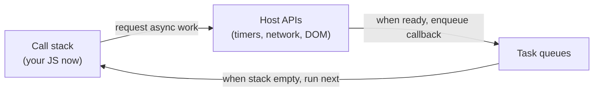

That loop — “run JS until the stack is empty, then take the next queued job” — is the **event loop**.

---

## 2. Building blocks from zero

### 2.1 The call stack

The **call stack** tracks which function is running. Calling a function pushes a frame; returning pops it.

```ts
function c() {
  console.log("c")
}
function b() {
  c()
}
function a() {
  b()
}
a()
```

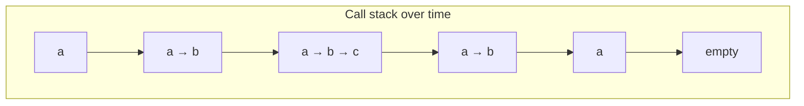

While `c` runs, `a` and `b` are still on the stack. **No other JS** on this thread runs until the stack drains back to empty (for that turn of work).

Long synchronous work freezes the page:

```ts
function block(ms: number) {
  const end = Date.now() + ms
  while (Date.now() < end) {
    /* busy wait — never do this */
  }
}
block(5000) // UI cannot paint or handle clicks for ~5s
```

### 2.2 The heap

Objects and closures live on the **heap** (memory). The stack holds references into the heap. Details: [Memory](/javascript/12-memory). For the event loop, remember: async callbacks often **close over** heap data that must stay alive until they run.

### 2.3 Host APIs (Web APIs / Node bindings)

Your JS cannot literally “sleep” and then resume on the same stack without blocking. Instead it asks the host:

| You write | Host does |
| --- | --- |
| `setTimeout(fn, 100)` | start a timer; later queue `fn` |
| `fetch(url)` | start network I/O; later queue promise settlement work |
| `addEventListener("click", fn)` | wait for OS/browser events; later queue `fn` |
| `fs.readFile` (Node) | ask libuv / threadpool; later queue callback |

These are **not** part of the ECMAScript language core. They are provided by the **embedding** (browser, Node, Deno, etc.).

### 2.4 Queues of work

When the host finishes, it does not interrupt your mid-function stack (usually). It **enqueues** a callback. There is more than one queue. The two you must know for interviews:

1. **Task queue** (also called macrotask queue, or just “tasks” in the HTML spec)
2. **Microtask queue**

Priority (browser / HTML model, simplified):

> After finishing a task, run **all** available microtasks before taking the next task (and before rendering, in the common teaching model).

---

## 3. Browser event loop — the big picture

### 3.1 Pieces on the table

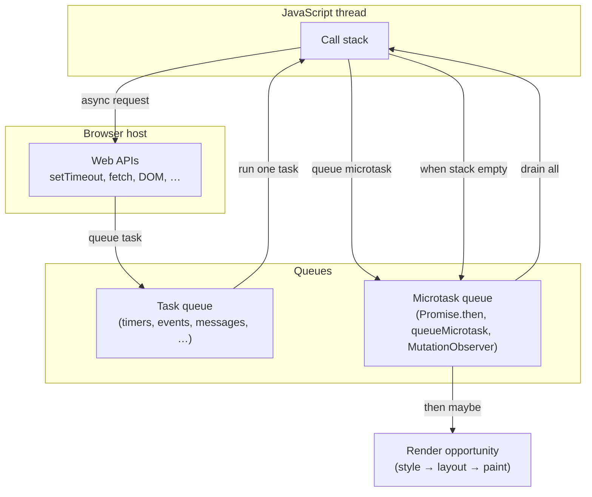

### 3.2 One turn of the loop (teaching model)

Simplified but interview-usable:

1. **Take one task** from the task queue (if any) and run it until the call stack is empty.
2. **Drain the microtask queue**: while microtasks exist, run them one by one (each may enqueue more microtasks — keep draining).
3. **Optionally render** (if the browser decides it is time to update the screen).
4. Go back to step 1.

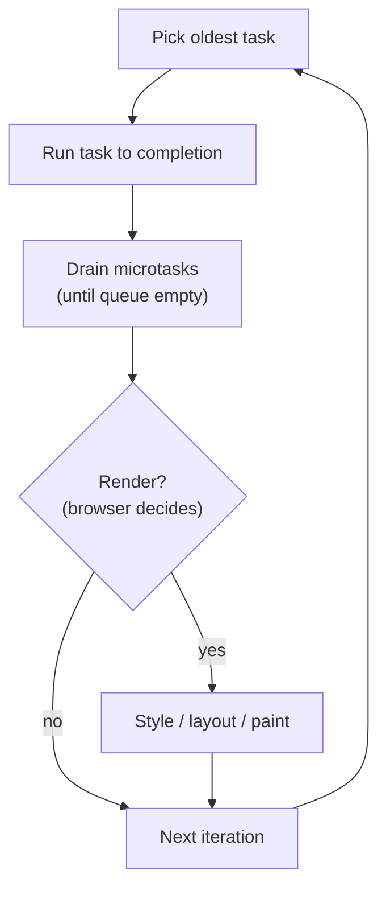

Exact HTML spec wording is more detailed (perform a “checkpoint,” update the rendering, etc.). For interviews, the model above is the expected story.

### 3.3 What counts as a “task” (macrotask)?

Examples that enqueue **tasks**:

- `setTimeout` / `setInterval` callbacks
- DOM / UI events (`click`, `keydown`, …) when dispatched as tasks
- `postMessage` / `MessageChannel` port messages
- `setImmediate` (Node / older IE — not standard in modern browsers)
- Parsing scripts, many other host callbacks

### 3.4 What counts as a microtask?

- `promise.then` / `catch` / `finally` reactions
- `queueMicrotask(fn)`
- `MutationObserver` callbacks
- `await` continuation after a Promise (because `await` uses Promise reactions under the hood)

---

## 4. `setTimeout` timeline — walk slowly

```ts
console.log("1 sync")

setTimeout(() => {
  console.log("2 timeout")
}, 0)

console.log("3 sync")
```

**What people expect:** `1`, `2`, `3` because delay is `0`.  
**What happens:** `1`, `3`, `2`.

### 4.1 Step-by-step

| Time | Call stack | Timer | Task queue | Output |
| --- | --- | --- | --- | --- |
| t0 | run script | — | empty | |
| | log 1 | | | `1 sync` |
| | schedule timeout 0 | timer started | | |
| | log 3 | | | `3 sync` |
| | stack empty | timer may already be due | `[timeout cb]` | |
| | | | run timeout cb | `2 timeout` |

Even `setTimeout(fn, 0)` means: “queue `fn` as a **task** after at least 0 ms,” **not** “run `fn` before anything else.” The current script is itself a task. Microtasks queued during the script run before the timeout task.

### 4.2 Nested timeouts vs busy work

```ts
setTimeout(() => console.log("timeout"), 0)

const end = Date.now() + 100
while (Date.now() < end) {}
console.log("after block")
```

The timeout cannot run until the blocking `while` finishes and the stack clears — even if 0 ms already passed. **Timers guarantee a minimum delay, not a maximum.**

### 4.3 Browser minimum delay clamping

Browsers may clamp nested `setTimeout` to a minimum of ~4ms in some cases, and background tabs throttle timers aggressively. Do not use `setTimeout` for precise animation — use `requestAnimationFrame`.

---

## 5. Promises and microtasks — walk slowly

```ts
console.log("A")

Promise.resolve().then(() => {
  console.log("B microtask")
})

console.log("C")
```

Output: `A`, `C`, `B microtask`.

Why? `then` callbacks are **microtasks**. They run after the current task completes (the script), before the next timer task.

### 5.1 Classic ordering drill

```ts
console.log("script start")

setTimeout(() => console.log("timeout"), 0)

Promise.resolve()
  .then(() => console.log("promise1"))
  .then(() => console.log("promise2"))

console.log("script end")
```

Expected output:

```text
script start
script end
promise1
promise2
timeout
```

Timeline:

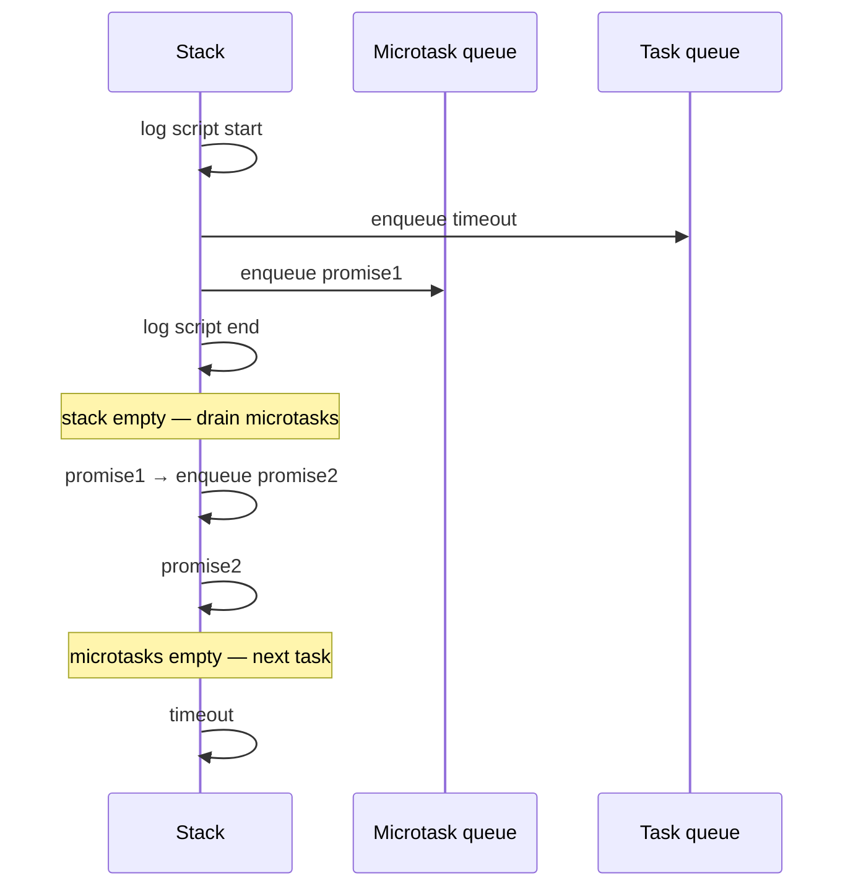

### 5.2 Microtasks can starve rendering / timers

```ts
function flood() {
  Promise.resolve().then(() => {
    // schedule another microtask forever
    flood()
  })
}
// flood() // BAD — never returns to task queue / render
```

Because the loop drains **all** microtasks before the next task, an endless microtask chain can freeze the page just like a `while (true)`.

### 5.3 `queueMicrotask`

```ts
queueMicrotask(() => {
  console.log("micro")
})
```

Same queue family as Promise reactions. Prefer `queueMicrotask` when you want “after current JS, before next task/paint” **without** creating a Promise.

```ts
console.log(1)
queueMicrotask(() => console.log(2))
Promise.resolve().then(() => console.log(3))
console.log(4)
// 1, 4, 2, 3  (order between 2 and 3 is queue order — both microtasks)
```

---

## 6. `async`/`await` and the event loop

```ts
async function f() {
  console.log("f1")
  await null // or await Promise.resolve()
  console.log("f2")
}

console.log("s1")
f()
console.log("s2")
```

Output:

```text
s1
f1
s2
f2
```

Why? `await` pauses the async function and schedules the **rest** as a Promise continuation (microtask). Roughly:

```ts
function f() {
  console.log("f1")
  return Promise.resolve(null).then(() => {
    console.log("f2")
  })
}
```

So `f2` waits for the current task to finish and for prior microtasks, like any `.then`.

More Promise internals: [Async](/javascript/11-async).

---

## 7. Rendering and `requestAnimationFrame`

Browsers paint when they can, typically aiming ~60fps (~16.7ms per frame) when a page is visible and work allows it.

Teaching model:

> A frame often looks like: run tasks → drain microtasks → rAF callbacks → style → layout → paint.

```ts
setTimeout(() => console.log("timeout"), 0)
requestAnimationFrame(() => console.log("rAF"))
Promise.resolve().then(() => console.log("micro"))
console.log("sync")
```

Typical order in an active tab (not a guarantee in every browser edge case, but the usual interview answer):

```text
sync
micro
rAF
timeout
```

…or sometimes timeout before rAF depending on timing of when the frame vs task is processed. Safer interview statement:

- Microtasks run before the next rendering opportunity after the current task.
- `requestAnimationFrame` is aligned with rendering, not with the timer task queue.
- Do not rely on timeout-vs-rAF ordering for correctness; use rAF for visual updates.

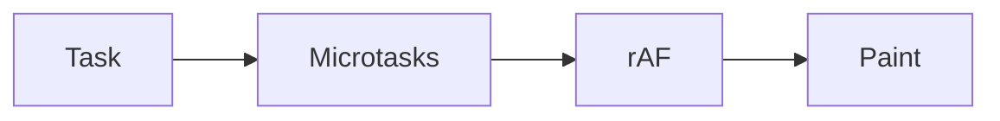

---

## 8. `MutationObserver` — microtasks for DOM changes

```ts
const target = document.createElement("div")
const obs = new MutationObserver(() => {
  console.log("mutated")
})
obs.observe(target, { childList: true })

console.log("before")
target.appendChild(document.createTextNode("x"))
console.log("after")
// before, after, then "mutated" as a microtask
```

Observer callbacks are delivered as **microtasks** (batched). That lets the browser coalesce many DOM mutations into one callback turn.

---

## 9. `MessageChannel` — a macrotask trick

`setTimeout(fn, 0)` is a task, but timers are clamped/throttled. `MessageChannel` posts a message that also queues a **task**, often with less timer weirdness:

```ts
function macrotask(fn: () => void) {
  const { port1, port2 } = new MessageChannel()
  port1.onmessage = () => fn()
  port2.postMessage(null)
}

console.log("a")
macrotask(() => console.log("c task"))
Promise.resolve().then(() => console.log("b micro"))
console.log("d")
// a, d, b micro, c task
```

Libraries (and older React scheduler ideas) used MessageChannel to break work into tasks without `setTimeout` delays.

---

## 10. Putting browser primitives on one timeline

```ts
console.log("1 sync")

setTimeout(() => console.log("5 timeout"), 0)

queueMicrotask(() => console.log("3 queueMicrotask"))

Promise.resolve().then(() => {
  console.log("4 promise then")
})

console.log("2 sync")
```

Expected:

```text
1 sync
2 sync
3 queueMicrotask
4 promise then
5 timeout
```

Drill variant — microtask schedules a timeout; timeout schedules a microtask:

```ts
setTimeout(() => {
  console.log("timeout")
  Promise.resolve().then(() => console.log("micro after timeout"))
}, 0)

Promise.resolve().then(() => {
  console.log("micro")
  setTimeout(() => console.log("timeout from micro"), 0)
})
```

Output:

```text
micro
timeout
micro after timeout
timeout from micro
```

Reasoning:

1. Script task runs; schedules timeout T1; schedules micro M1.
2. Drain micros: M1 runs, logs `micro`, schedules timeout T2.
3. Next task T1: logs `timeout`, schedules micro M2.
4. Drain micros: M2 logs `micro after timeout`.
5. Next task T2: logs `timeout from micro`.

Practice drawing the queues until this feels mechanical.

---

## 11. Node.js event loop — from zero

Node also runs JavaScript on one main thread (worker threads exist but are separate). The event loop is implemented with **libuv**. The **mental model differs** from the browser HTML loop: Node organizes work into **phases**.

### 11.1 Why Node needs phases

A server handles:

- timers (`setTimeout`)
- I/O callbacks (network, disk)
- `setImmediate`
- close events
- and special queues: `process.nextTick` and Promises (microtasks)

Phases keep these ordered predictably.

### 11.2 The phases (interview map)

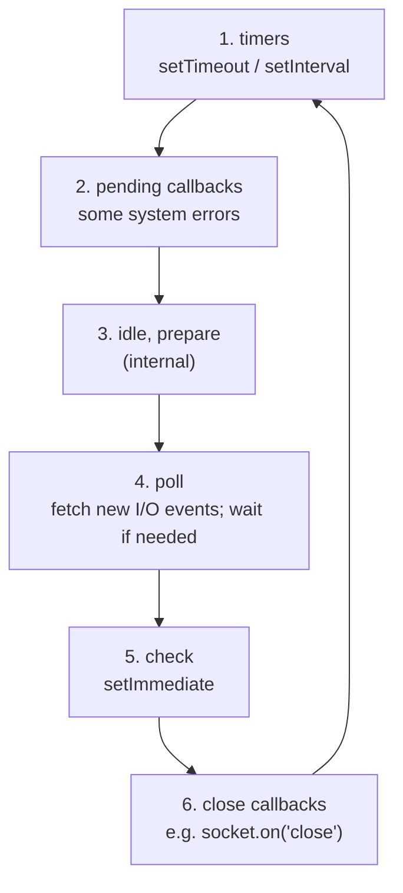

Between / around these, Node runs **microtasks** and **`process.nextTick`** with special priority (details below).

Plain language for each phase:

| Phase | What runs |
| --- | --- |
| **timers** | callbacks whose timer deadline has been reached |
| **pending callbacks** | a few deferred system callbacks (not your everyday app code focus) |
| **idle, prepare** | internal bookkeeping |
| **poll** | almost all I/O; may wait for incoming connections/data |
| **check** | `setImmediate` callbacks |
| **close callbacks** | `'close'` handlers |

### 11.3 `process.nextTick` vs Promise vs `setImmediate`

This trio is a classic Node interview trap.

```ts
setImmediate(() => console.log("immediate"))
process.nextTick(() => console.log("nextTick"))
Promise.resolve().then(() => console.log("promise"))
console.log("sync")
```

Typical output:

```text
sync
nextTick
promise
immediate
```

Rules of thumb:

1. **Current JS finishes** (sync).
2. **`process.nextTick` queue drains** (all nextTick callbacks; each can queue more nextTicks — can starve).
3. **Then Promise / other microtasks** drain (in modern Node, after nextTicks).
4. Then the event loop continues phases; **`setImmediate`** runs in the **check** phase.

> [!WARNING]
> Exact interleaving of `nextTick` and Promises has changed across Node versions historically. The safe interview answer: **`nextTick` runs before `setImmediate` and before I/O continues; it has higher priority than timers/immediates; do not flood `nextTick`.** Prefer `queueMicrotask` / Promises for portable microtask semantics; use `nextTick` only when you need “before any other phase work” for API compatibility.

### 11.4 `setTimeout(0)` vs `setImmediate`

```ts
setTimeout(() => console.log("timeout"), 0)
setImmediate(() => console.log("immediate"))
```

Order is **not guaranteed** when both are scheduled from the main module — it depends on how long startup took vs the timer phase. When scheduled **inside an I/O callback**, `setImmediate` usually fires before `setTimeout(0)`:

```ts
const fs = require("fs")
fs.readFile(__filename, () => {
  setTimeout(() => console.log("timeout"), 0)
  setImmediate(() => console.log("immediate"))
})
// usually: immediate, then timeout
```

Why (intuition): after I/O in **poll**, the loop goes to **check** (`setImmediate`) before wrapping around to **timers**.

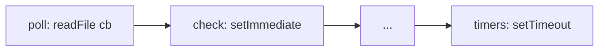

### 11.5 Node microtask drain points

In Node, after many callbacks, the runtime drains `nextTick` then microtasks before moving on. That means a Promise `.then` inside a timer still runs before the next timer phase advances — similar “microtasks cut in front” intuition as the browser, plus `nextTick` in front of that.

```ts
setTimeout(() => {
  console.log("timer")
  Promise.resolve().then(() => console.log("micro in timer"))
  process.nextTick(() => console.log("nextTick in timer"))
}, 0)
```

Typical:

```text
timer
nextTick in timer
micro in timer
```

---

## 12. Browser vs Node — comparison table

| Topic | Browser | Node |
| --- | --- | --- |
| Spec mental model | HTML event loop (tasks + microtasks + rendering) | libuv phases |
| Timers | `setTimeout` / `setInterval` | same + phase interaction |
| Immediate-ish | `MessageChannel`, `setTimeout(0)` | `setImmediate` |
| Microtasks | Promises, `queueMicrotask`, MutationObserver | Promises, `queueMicrotask` |
| Extra queue | — | `process.nextTick` (before microtasks in practice) |
| Rendering | yes (paint, rAF) | no DOM paint on server |
| I/O | Web APIs | libuv (epoll/kqueue/IOCP, threadpool for disk/DNS) |

**Interview line:** Same language, different hosts — queues and phases are host rules layered on one call stack.

---

## 13. Every scheduling primitive — field guide

### 13.1 `setTimeout` / `setInterval`

- Queues a **task** after a delay.
- Delay is a minimum.
- `setInterval` can drift; overlapping callbacks if work > interval (unless you reschedule with `setTimeout` recursively).

```ts
// Safer periodic work
function every(ms: number, fn: () => void) {
  let cancelled = false
  const tick = async () => {
    if (cancelled) return
    await fn()
    if (!cancelled) setTimeout(tick, ms)
  }
  setTimeout(tick, ms)
  return () => {
    cancelled = true
  }
}
```

### 13.2 `queueMicrotask`

- Portable microtask scheduling.
- Prefer over abusing `Promise.resolve().then(fn)` when you do not need a Promise.

### 13.3 Promise then/catch/finally

- Settling a Promise queues reaction jobs as microtasks.
- Chaining queues another microtask per link.

### 13.4 `MutationObserver`

- DOM mutation batching via microtasks (browser).

### 13.5 `process.nextTick` (Node)

- “ asap before continuing the loop.”
- Can starve I/O if recursively scheduled — like microtask floods.

### 13.6 `setImmediate` (Node)

- Check phase.
- Prefer for “after I/O callback, yield to the event loop” patterns in Node-specific code.

### 13.7 `MessageChannel` / `postMessage`

- Task-queue scheduling in browsers; useful for yielding.

### 13.8 `requestAnimationFrame`

- Before paint; for visual updates.
- Pauses in background tabs (usually).

### 13.9 `requestIdleCallback`

- Run low-priority work when the browser has idle time.
- Not for correctness-critical work; may never fire under load.
- Timeout option exists for a deadline.

---

## 14. Long tasks, yielding, and responsiveness

If one task runs 200ms of sync JS, the page janks: no paint, no click handlers.

**Yield** strategies:

```ts
async function processAll(items: string[]) {
  for (const item of items) {
    processItem(item)
    // yield to the event loop between items
    await new Promise<void>((r) => setTimeout(r, 0))
    // or: await scheduler.yield() where supported
  }
}
```

Or chunk with MessageChannel / `requestIdleCallback` depending on priority.

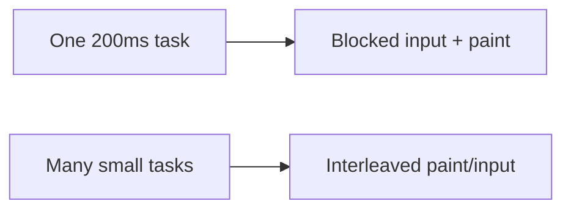

---

## 15. Errors and the event loop

Unhandled errors in tasks vs microtasks both surface as failures, but async boundaries matter:

```ts
setTimeout(() => {
  throw new Error("task boom")
}, 0)

Promise.resolve().then(() => {
  throw new Error("micro boom")
})
```

- Timeout throw: host reports as error in that task (browser `error` event / Node `uncaughtException` paths depending on version and hooks).
- Promise throw: becomes **unhandled rejection** unless `.catch` / `try/catch` around `await`.

Always handle Promise rejections. See [Async](/javascript/11-async) and errors chapters.

---

## 16. Worker threads / Web Workers (brief)

The event loop story is **per thread / per realm**.

- **Web Worker**: separate JS stack + its own loop; talks via messages (`postMessage`).
- **Node Worker threads**: similar idea for CPU-bound work.

They do **not** share your main-thread call stack. Use them to move CPU work off the UI/server main loop.

---

## 17. Production pitfalls

1. **Assuming `setTimeout(0)` runs “immediately next”** — microtasks and other tasks may come first; delay is minimum.
2. **Microtask infinite loops** — freeze without a `while (true)`.
3. **`process.nextTick` recursion** — starves I/O.
4. **Heavy sync work** — blocks timers, I/O callbacks, paint.
5. **Trusting timer order across environments** — write logic that does not depend on timeout-vs-immediate races.
6. **Background tab timer throttling** — animations and polls stall; use Page Visibility API.
7. **Closing over huge data in pending callbacks** — memory stays alive until the callback runs / is cleared.

---

## 18. Worked interview drills

### Drill A

```ts
console.log(1)
setTimeout(() => console.log(2), 0)
Promise.resolve().then(() => console.log(3))
console.log(4)
```

Answer: `1 4 3 2`

### Drill B

```ts
setTimeout(() => console.log("T1"), 0)
setTimeout(() => {
  console.log("T2")
  Promise.resolve().then(() => console.log("P_in_T2"))
}, 0)
Promise.resolve().then(() => {
  console.log("P1")
  setTimeout(() => console.log("T3"), 0)
})
```

Answer: `P1`, `T1`, `T2`, `P_in_T2`, `T3`

### Drill C (Node I/O)

```ts
fs.readFile(__filename, () => {
  setTimeout(() => console.log("timeout"), 0)
  setImmediate(() => console.log("immediate"))
  process.nextTick(() => console.log("nextTick"))
  Promise.resolve().then(() => console.log("promise"))
})
```

Typical: `nextTick`, `promise`, `immediate`, `timeout`

### Drill D — await

```ts
async function main() {
  console.log("A")
  await Promise.resolve()
  console.log("B")
}
main()
console.log("C")
```

Answer: `A C B`

Draw queues for each until you can explain without memorizing.

---

## 19. Mental checklist when you see async code

1. What runs **synchronously** now?
2. What is handed to a **host API**?
3. When the host finishes, which **queue** does the callback enter (task vs microtask vs nextTick)?
4. After the current stack clears, what drains first?
5. Could a flood of high-priority jobs starve lower ones or rendering?

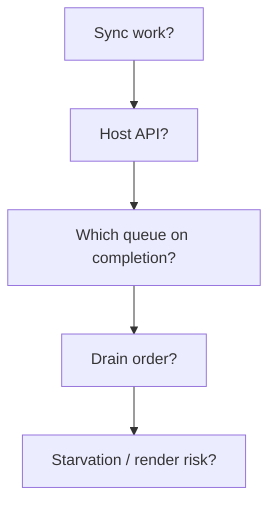

---

## 20. How this connects to Promises and async/await

The event loop answers **when** callbacks run. Promises answer **how** you structure async success/failure. Together:

- Promise settlement → microtask reactions
- `async` functions → Promise-returning + `await` as microtask continuation
- Aborting / cancellation → separate concern (`AbortController`) on top of the same loop

Deep dive: [Async](/javascript/11-async).

---

## 21. Optional: more accurate HTML loop notes

For deeper reading (not required to pass most interviews):

- A **task** has a task source (DOM manipulation, user interaction, networking, history, …). The browser may have multiple task queues per source and pick fairly.
- **Microtask checkpoint**: run after callbacks, when the stack is empty, and at other defined times.
- **Rendering** is not guaranteed after every task; the browser coalesces frames.
- **Idle period** callbacks differ from microtasks.

If an interviewer asks for “spec accurate,” mention task sources and that rendering is opportunistic — then return to the teaching model.

---

## 22. Optional: libuv threadpool (Node)

Not every Node I/O uses the same mechanism:

- Network sockets: typically evented on the main loop
- File system, DNS (some), crypto (some): **threadpool** (default size 4, configurable)

When the threadpool finishes, a callback is queued onto the main loop — your JS still runs single-threaded on the main stack.

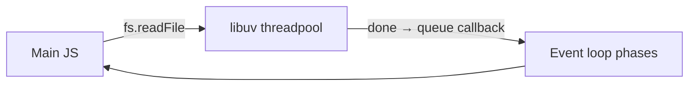

CPU-heavy JS still blocks the main thread even if the threadpool is idle — offload with `worker_threads` if needed.

---

## 23. `await` in loops and the loop

```ts
for (const url of urls) {
  await fetch(url) // sequential — each await yields to the event loop
}
```

vs

```ts
await Promise.all(urls.map((u) => fetch(u))) // concurrent host work
```

Sequential `await` in a loop is often a performance bug. The event loop can interleave other tasks between iterations, but the **fetches themselves** do not overlap.

---

## 24. Unpacking a real UI click

1. User clicks.
2. Browser creates an event; queues a task to dispatch it.
3. Current task finishes; microtasks drain; eventually the event task runs.
4. Your listener runs on the stack (`onClick`).
5. If you `setState` → framework schedules an update (often microtask or rAF depending on library).
6. Later, rendering commits; paint.

Knowing where your code sits (task vs microtask vs rAF) explains “why didn’t my spinner show before the heavy work?” — because you never returned to the loop/paint:

```ts
button.onclick = () => {
  showSpinner() // DOM write
  heavySyncWork() // never yielded — paint may not happen until this finishes
  hideSpinner()
}
```

Fix: `await` a timeout/rAF before heavy work, or move heavy work to a worker.

---

## 25. Summary diagram — keep this in your head

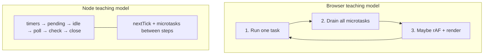

**One sentence:** JavaScript runs to completion on a stack; the host finishes async work elsewhere; the event loop decides which queued callback runs next — microtasks before the next task in browsers, and phases plus nextTick in Node.

---

## 26. Slow-motion: a `fetch` that updates the DOM

```ts
button.onclick = async () => {
  console.log("1 click handler start")
  status.textContent = "Loading…"
  try {
    const res = await fetch("/api/item")
    console.log("2 after await fetch")
    const data = await res.json()
    console.log("3 after await json")
    status.textContent = data.name
  } catch (e) {
    status.textContent = "Error"
  }
  console.log("4 handler end")
}
```

What actually happens:

1. Click is dispatched as a **task**. Your handler runs on the stack.
2. `status.textContent = "Loading…"` mutates the DOM **synchronously**. Whether you *see* it before the network returns depends on whether the browser gets a **render opportunity** before more sync work — here you `await fetch` soon, which **yields**, so a paint of “Loading…” is likely.
3. `fetch` starts in the host. The async function returns a Promise; the click task ends; microtasks drain; eventually the browser can paint.
4. When the response arrives, the host fulfills the fetch Promise → **microtask** resumes your async function after the first `await`.
5. `res.json()` is another async parse → another await → another resume microtask.
6. Final DOM write `status.textContent = data.name` — visible on a later render opportunity.

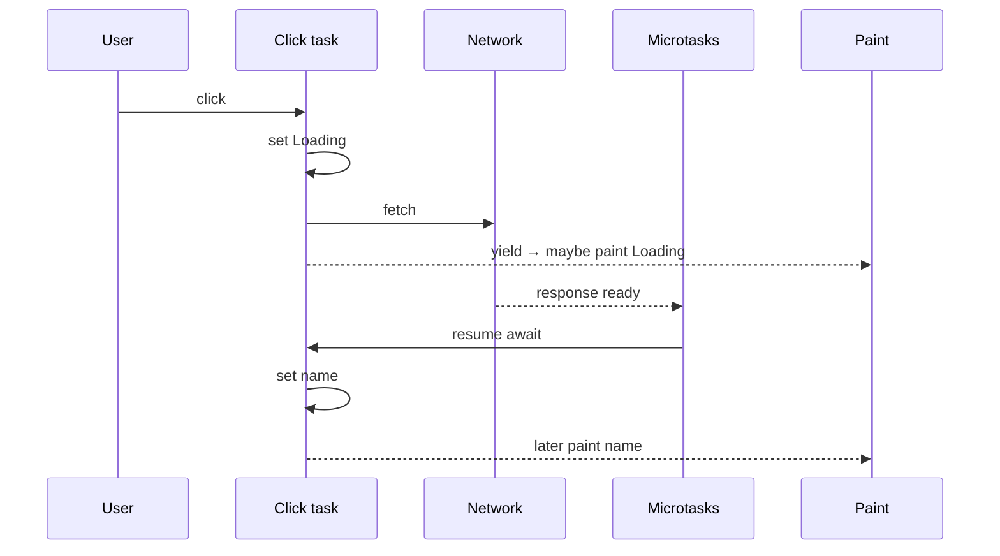

**Interview insight:** `await` is how you voluntarily return to the event loop so loading UI can paint.

---

## 27. Slow-motion: Promise chain vs async function

These two are equivalent in scheduling spirit:

```ts
function withThen() {
  console.log("t0")
  return Promise.resolve()
    .then(() => {
      console.log("t1")
      return Promise.resolve()
    })
    .then(() => {
      console.log("t2")
    })
}

async function withAwait() {
  console.log("a0")
  await Promise.resolve()
  console.log("a1")
  await Promise.resolve()
  console.log("a2")
}

console.log("start")
withThen()
withAwait()
console.log("end")
```

Typical output shape:

```text
start
t0
a0
end
t1
a1
t2
a2
```

Both `t1`/`a1` are microtasks scheduled from the initial script task. Exact interleaving between the two chains depends on registration order — both are “after sync, before next timer.”

---

## 28. `queueMicrotask` vs `Promise.resolve().then`

```ts
queueMicrotask(() => console.log("q"))
Promise.resolve().then(() => console.log("p"))
```

Both enqueue microtasks. Differences:

| | `queueMicrotask` | `Promise.then` |
| --- | --- | --- |
| Creates a Promise? | no | yes (then returns one) |
| Extra allocation | lighter | heavier |
| Error handling | uncaught exception path | rejection if you throw inside then (unless handled) |
| Intent | “schedule microtask” | “react to a Promise” |

Prefer `queueMicrotask` when you are not modeling a value pipeline — clearer intent.

---

## 29. Combining Node phases with a real server request

Simplified story of an HTTP request in Node:

1. Socket becomes readable → **poll** phase notices I/O.
2. Your `http` request callback runs (JS on the stack).
3. You `process.nextTick` or return a Promise from an async handler framework.
4. `nextTick` / microtasks drain before leaving this turn of work.
5. You call `res.end()` — more I/O scheduled.
6. Later phases handle write completion / close.

If your request handler does **CPU-heavy JSON transform** for 200ms sync, other sockets wait — same single-thread rule as the browser. That is why people use queues, workers, or break up work with `setImmediate` between chunks:

```ts
async function handleBigArray(items: unknown[]) {
  const chunkSize = 1000
  for (let i = 0; i < items.length; i += chunkSize) {
    processChunk(items.slice(i, i + chunkSize))
    // yield to the event loop so other connections get service
    await new Promise<void>((r) => setImmediate(r))
  }
}
```

---

## 30. Observable ordering checklist (print this)

When you open a code snippet in an interview:

```text
[ ] List every console.log / side effect in source order
[ ] Mark each async schedule: timer | promise/micro | nextTick | immediate | rAF | I/O
[ ] Run all sync first — write those outputs
[ ] Drain nextTick (Node) then microtasks — include newly queued ones
[ ] Take one macrotask / next phase callback — repeat
[ ] Do not invent parallelism — one stack
```

Worked mini:

```ts
console.log("s1")
setTimeout(() => {
  console.log("t")
  queueMicrotask(() => console.log("m2"))
}, 0)
queueMicrotask(() => {
  console.log("m1")
  setTimeout(() => console.log("t2"), 0)
})
console.log("s2")
```

Fill the checklist:

- Sync: `s1`, `s2`
- Micros: `m1` (schedules t2)
- Task t: `t` then micro `m2`
- Task t2: `t2`

Output: `s1 s2 m1 t m2 t2`

---

## 31. What the event loop is *not*

Clear these myths explicitly:

1. **Not a second JS thread** — it schedules work on the same thread’s stack.
2. **Not part of ECMAScript proper** — hosts define queues/phases; ES defines Jobs (Promise jobs) that hosts integrate.
3. **Not a fairness guarantee for your app logic** — a bad microtask loop starves everything.
4. **Not a replacement for locks** — you still get races on shared mutable state between turns (`let x` read-modify-write across awaits).

```ts
let balance = 100

async function withdraw(amount: number) {
  const current = balance // turn A
  await checkFraud() // yields — other code can interleave
  balance = current - amount // stale write risk
}
```

Async concurrency ≠ thread safety. Design for interleaving.

---

## Interview Questions

### Q1. What is the event loop?
**Expected:** The host mechanism that, when the call stack is empty, selects queued callbacks (tasks/microtasks/phases) to run next, enabling async I/O without multi-threaded JS on that thread.  
**Common wrong:** “A special JavaScript thread that runs in parallel with your code.”  
**Follow-ups:** Does it make JavaScript multi-threaded? (No — one stack per realm; workers are separate.)

### Q2. Microtask vs macrotask?
**Expected:** Microtasks (Promise.then, queueMicrotask, MutationObserver) run after the current task before the next task/render; macrotasks/tasks include timers, I/O, UI events, messages.  
**Common wrong:** “Microtasks run in parallel.”  
**Follow-ups:** Show output of sync + Promise + setTimeout.

### Q3. Why does `setTimeout(fn, 0)` not run immediately?
**Expected:** It queues a task for later; current script and queued microtasks run first; delay is a minimum.  
**Common wrong:** “The browser ignores 0.”  
**Follow-ups:** What can starve timers?

### Q4. `process.nextTick` vs `setImmediate`?
**Expected:** `nextTick` runs before continuing the loop / before immediates; `setImmediate` runs in the check phase. Prefer not to starve I/O with nextTick.  
**Common wrong:** “They are identical browser APIs.”  
**Follow-ups:** Order inside an I/O callback with timeout 0?

### Q5. Where do `await` continuations run?
**Expected:** As microtasks (Promise reactions), after the current synchronous execution completes.  
**Common wrong:** “Await blocks the thread like sleep.”  
**Follow-ups:** Output of async function with await null interleaved with sync logs.

### Q6. How does the browser decide to paint?
**Expected:** Opportunistically after tasks/microtasks when a frame is due; rAF runs before paint; not guaranteed after every task.  
**Common wrong:** “Paint after every line of JS.”  
**Follow-ups:** Why heavy sync work prevents a spinner from showing.

### Q7. Can microtasks starve the page?
**Expected:** Yes — endlessly scheduling microtasks never returns to tasks/rendering.  
**Common wrong:** “Only `while(true)` can freeze a page.”  

### Q8. MessageChannel purpose in scheduling?
**Expected:** Queue a macrotask with `postMessage`, often used to yield without timer clamping.  
**Common wrong:** “It is a microtask API.”  

## Common Mistakes

- Treating Promise callbacks as running in parallel threads.
- Relying on `setTimeout(0)` vs `setImmediate` order from the main module.
- Flooding `process.nextTick` or microtasks.
- Blocking the main thread with CPU work and blaming the network.
- Expecting precise timer intervals in background tabs.
- Forgetting to handle Promise rejections (different failure path than throw in a task).
- Using `await` in a loop accidentally serializing independent I/O.
- Assuming MutationObserver is synchronous with the DOM write (it is microtask-batched).

## Trade-offs / Production Notes

- **Yield** long work (chunking, workers, `scheduler.yield` where available) to keep input and paint responsive.
- Prefer **`queueMicrotask` / Promises** for portable “after current JS” scheduling; reserve **`nextTick`** for Node-specific ordering needs.
- Prefer **`requestAnimationFrame`** for visual updates; timers for delays and non-visual scheduling.
- In Node servers, understand **phases + threadpool** when debugging latency under load.
- Measure with Performance panel / `perf_hooks` — do not guess queue behavior under production load.
- Related: [Async](/javascript/11-async), [Memory](/javascript/12-memory), [Functions](/javascript/09-functions) (debounce/throttle), [Performance](/javascript/22-performance).
