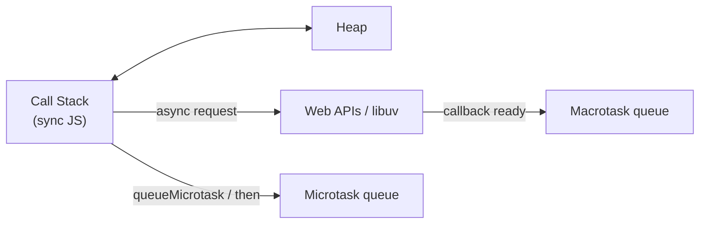
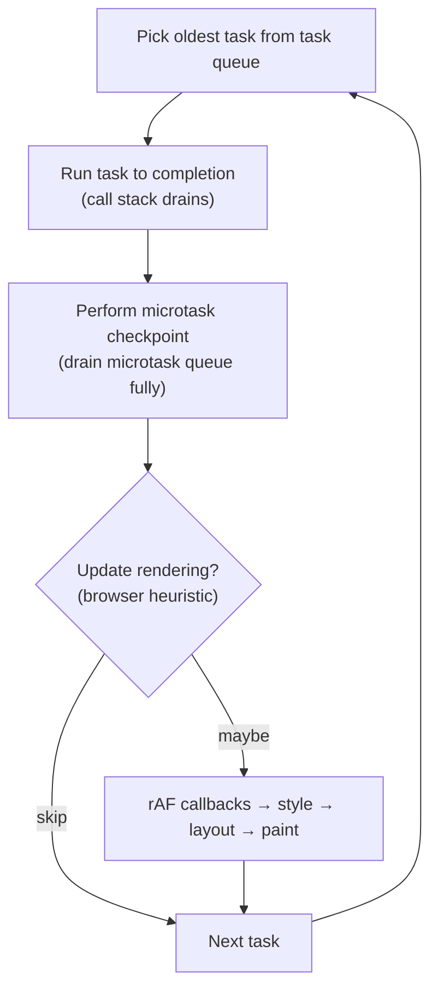
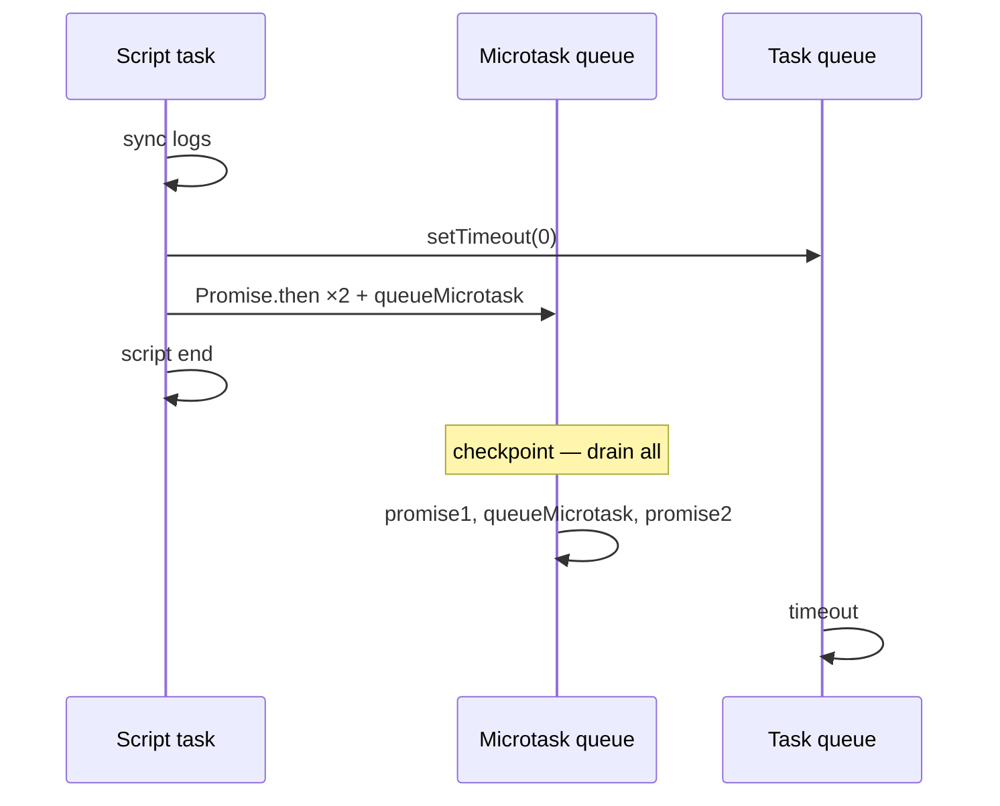
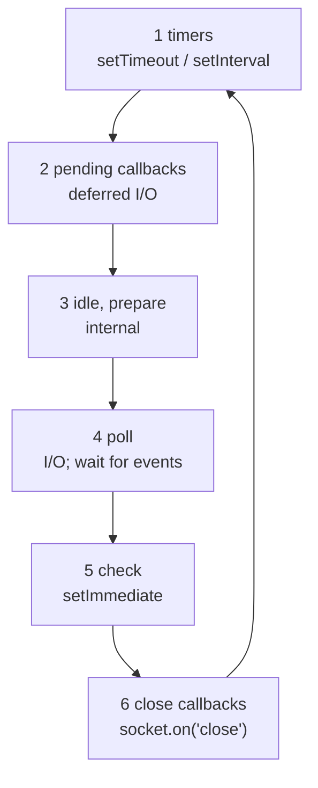
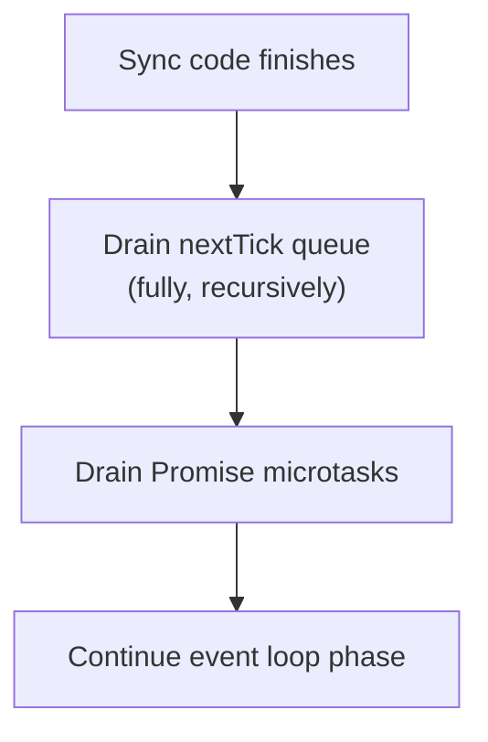
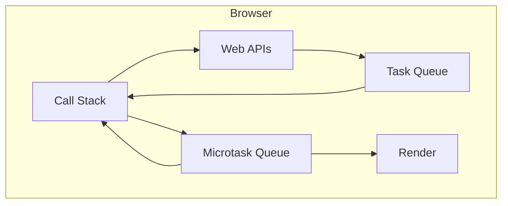
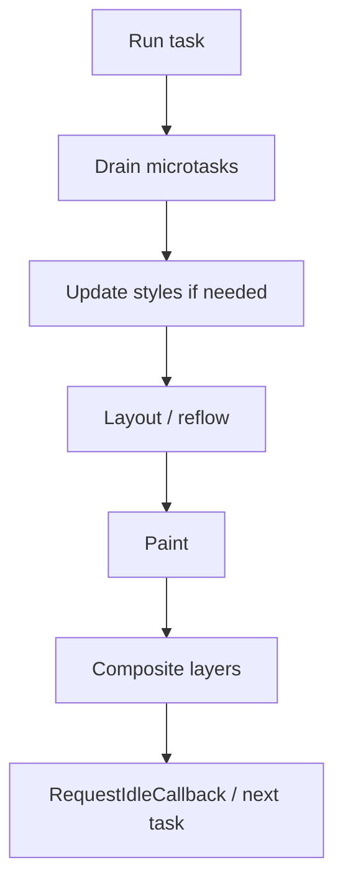
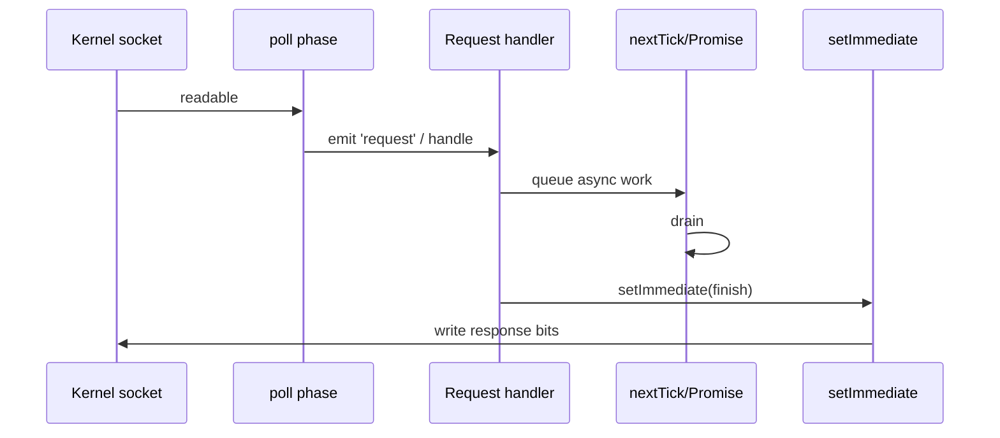
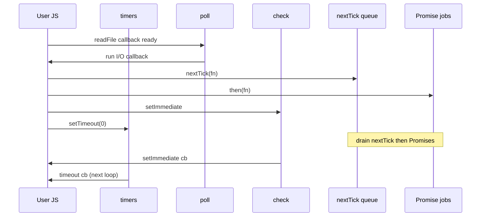

# Event Loop

JS runs **one call stack** at a time per realm. Async work completes elsewhere (browser Web APIs / Node libuv), then callbacks are queued. The **event loop** decides *when* those callbacks run relative to rendering (browser) or I/O phases (Node).

This chapter is interview-dense: browser model → microtasks vs macrotasks → ordering drills → Node phases → every scheduling primitive → production pitfalls.

Cross-links: [Node event loop phases](/node/02-event-loop) · [libuv](/node/01-libuv) · [Async JS](/javascript/11-async) · [Browser event loop](/browser/03-event-loop).

---

## Why a single thread still feels concurrent



- **CPU-bound sync work** blocks everything (including paint / I/O callbacks).
- **I/O / timers / events** complete off-stack; results become tasks.
- **Promises** schedule microtasks — higher priority than timers/UI events in the HTML model.

---

## Browser model — end to end

### Pieces

| Piece | Role |
| --- | --- |
| Call stack | Currently executing frames |
| Web APIs | `setTimeout`, `fetch`, DOM events, `IndexedDB`, … |
| Task queue (macrotask / task) | Timer callbacks, event handlers, `postMessage`, … |
| Microtask queue | `Promise.then/catch/finally`, `queueMicrotask`, `MutationObserver` |
| Rendering | Style → layout → paint → (optional) compositor — opportunity between tasks |

### High-level loop (HTML event loop)

Simplified but interview-accurate:



Critical rules:

1. One **task** runs at a time until the stack is empty.  
2. After that task (and after many host callbacks), run **all** microtasks — including those queued *during* the microtask flush (until empty / starvation limits).  
3. Rendering may happen after a microtask checkpoint, not in the middle of sync JS.  
4. `requestAnimationFrame` fires **before** the next paint, typically after microtasks from the preceding turn.

---

## Macrotasks (tasks) vs microtasks

| | Macrotask (task) | Microtask |
| --- | --- | --- |
| Examples | `setTimeout`, `setInterval`, `setImmediate` (Node), UI events, `MessageChannel`, `postMessage`, I/O callbacks (Node phases) | `Promise.then`, `queueMicrotask`, `MutationObserver`, `process.nextTick` (Node — *special*) |
| When | Between turns of the loop | After current script/task, before next render / next macrotask |
| Starvation risk | Long tasks block input/paint | Infinite microtask chain blocks render forever |

```ts
console.log("script start")

setTimeout(() => console.log("timeout"), 0)

Promise.resolve()
  .then(() => console.log("promise1"))
  .then(() => console.log("promise2"))

queueMicrotask(() => console.log("queueMicrotask"))

console.log("script end")

/*
script start
script end
promise1
queueMicrotask
promise2
timeout
*/
```

Why: entire script is one task. Microtasks flush before the timer task.



---

## Call stack → Web APIs → queues (browser walkthrough)

```ts
document.body.addEventListener("click", () => {
  console.log("click")
  Promise.resolve().then(() => console.log("micro from click"))
})

setTimeout(() => console.log("timer"), 0)
```

1. Click happens → browser queues a **task** for the event listener.  
2. When that task runs, listener executes (`click`).  
3. `then` schedules microtask.  
4. Listener returns → microtask runs (`micro from click`) **before** the next timer/event task.  
5. Separately, timer completion queued a task; it runs in a later turn (`timer`), order vs click depends on timing.

### `fetch` path

```ts
fetch("/api")
  .then((r) => r.json())
  .then((data) => console.log(data))
```

1. `fetch` calls into networking (Web API / browser process).  
2. Stack clears; page can paint.  
3. Response → task/microtask plumbing (implementation schedules promise resolution).  
4. Your `.then` handlers are microtasks once the promise fulfills.

---

## Rendering, `requestAnimationFrame`, and layout

```ts
setTimeout(() => console.log("timeout"), 0)
requestAnimationFrame(() => console.log("rAF"))
Promise.resolve().then(() => console.log("micro"))
```

Typical order in an idle frame (approximate — browsers vary on same-ms races):

1. Current script finishes  
2. Microtasks (`micro`)  
3. Optionally rAF + paint (`rAF`)  
4. Timer task (`timeout`)  

Interview line: **microtasks before the next render; rAF before paint; timers are tasks and may be deferred to later frames under load.**

### Forced sync layout thrash

```ts
element.style.width = "100px"
void element.offsetHeight // forces layout now
element.style.height = "100px"
```

Reading geometry after writes can force layout **inside** a task — jank. Batch reads/writes; prefer `rAF` for visual updates.

---

## `queueMicrotask`

```ts
queueMicrotask(() => {
  console.log("micro")
})
```

Same queue priority as `Promise.then`. Prefer for "after current JS, before paint/timers" without creating a Promise. Errors in microtasks are reported as unhandled exceptions per host rules.

---

## `MutationObserver` — also microtasks

```ts
const obs = new MutationObserver(() => {
  console.log("mutated")
})
obs.observe(document.body, { childList: true })
document.body.appendChild(document.createElement("div"))
console.log("after append")
// after append
// mutated  ← microtask after current script
```

Observers deliver records as microtasks — can starve rendering if you mutate DOM in a loop that re-triggers the observer.

---

## `MessageChannel` — macrotask scheduling hack

Used historically to get a **sooner macrotask** than `setTimeout(0)` (which has nested timer clamping).

```ts
function macrotask(fn: () => void) {
  const { port1, port2 } = new MessageChannel()
  port1.onmessage = () => fn()
  port2.postMessage(null)
}

macrotask(() => console.log("channel task"))
Promise.resolve().then(() => console.log("micro"))
// micro
// channel task
```

React's older scheduler used MessageChannel / `postMessage` for yielding. Still a valid interview topic for "break up long work without waiting 4ms."

---

## Timer realities in browsers

| API | Notes |
| --- | --- |
| `setTimeout(fn, 0)` | Queues timer task; minimum delay often **clamped** (esp. nested ≥5 levels → 4ms+) |
| `setInterval` | Drift; overlaps if `fn` slower than interval |
| Inactive tabs | Timers heavily throttled (often ≥1s) |
| `scheduler.postTask` | Newer prioritization API (where supported) |

```ts
setTimeout(() => console.log("A"), 0)
setTimeout(() => console.log("B"), 0)
// A then B — queue order for equal delay
```

---

## Classic ordering drills

### Drill 1

```ts
console.log(1)
setTimeout(() => console.log(2), 0)
Promise.resolve().then(() => console.log(3))
console.log(4)
// 1 4 3 2
```

### Drill 2 — microtasks spawn microtasks

```ts
Promise.resolve()
  .then(() => {
    console.log("A")
    Promise.resolve().then(() => console.log("B"))
  })
  .then(() => console.log("C"))
// A B C  — B runs before C because C is chained after A's handler returns,
// but B was queued during A's handler; exact order: A, then B, then C
```

Clarify carefully: after `A`'s handler, both the inner `then(B)` and the outer chain `then(C)` are queued; **FIFO** → `B` then `C`.

### Drill 3 — async/await

```ts
async function f() {
  console.log("f1")
  await null
  console.log("f2")
}
console.log("s1")
f()
console.log("s2")
// s1 f1 s2 f2
```

`await` continues as a microtask (roughly equivalent to Promise resolve then continue).

### Drill 4 — click + timeout + promise

```ts
setTimeout(() => console.log("timer"), 0)
button.addEventListener("click", () => {
  console.log("click")
  Promise.resolve().then(() => console.log("p"))
})
button.click() // sync dispatch in many cases
// click p timer   (synthetic click runs now as part of script)
```

User-generated clicks are tasks; programmatic `el.click()` often runs listeners **synchronously**.

---

## Node.js event loop — phases

Node's loop (libuv) is **not** identical to the browser. Phases matter for `setImmediate` vs `setTimeout`, I/O, and `close` handlers.



Between phases (and after many operations), Node runs **microtasks** / **`nextTick`**. Exact interleaving: **`process.nextTick` drains before other microtasks** (Promise jobs) in Node.

Full phase deep dive: [/node/02-event-loop](/node/02-event-loop).

### Phase cheat sheet

| Phase | Runs |
| --- | --- |
| **timers** | Expired `setTimeout` / `setInterval` callbacks |
| **pending callbacks** | Some system TCP errors / deferred I/O callbacks |
| **idle, prepare** | Internal only |
| **poll** | Fetch new I/O events; execute I/O callbacks; may block for timeout |
| **check** | `setImmediate` callbacks |
| **close callbacks** | `socket.destroy()`, `handle.close` |

### Poll phase behavior (interview)

- If poll queue has callbacks → run them.  
- Else if `setImmediate` scheduled → leave poll → check phase.  
- Else wait for I/O up to timer delay, then proceed appropriately.  

This is why **I/O callback → `setImmediate` vs `setTimeout(0)`** has a defined preference.

---

## `setTimeout` vs `setImmediate` (Node)

```ts
setTimeout(() => console.log("timeout"), 0)
setImmediate(() => console.log("immediate"))
```

**Outside I/O:** order is **non-deterministic** (depends on process startup timing).

**Inside I/O callback:** `setImmediate` runs first (check phase before timers on next iteration):

```ts
import { readFile } from "node:fs"

readFile("file.txt", () => {
  setTimeout(() => console.log("timeout"), 0)
  setImmediate(() => console.log("immediate"))
})
// immediate
// timeout
```

---

## `process.nextTick` — before Promises

```ts
setTimeout(() => console.log("timer"), 0)
Promise.resolve().then(() => console.log("promise"))
process.nextTick(() => console.log("nextTick"))
// nextTick
// promise
// timer
```



**Starvation:** recursive `nextTick` prevents the event loop from reaching poll — never `nextTick` in unbounded recursion. Prefer `queueMicrotask` / `setImmediate` for yielding.

```ts
// ❌ starves loop
function bomb() {
  process.nextTick(bomb)
}
```

---

## Promise jobs in Node vs browser

Both use a microtask-like queue for `then`. Node adds **`nextTick` ahead of Promises**. Browser has no `nextTick`; `queueMicrotask` ≈ Promise job queue.

| Schedule | Browser | Node |
| --- | --- | --- |
| `process.nextTick` | n/a | before Promises |
| `queueMicrotask` / `then` | microtask | after nextTick |
| `setTimeout(0)` | task | timers phase |
| `setImmediate` | n/a (unless polyfill) | check phase |
| `MessageChannel` | task | task-like |
| `MutationObserver` | microtask | jsdom only / n/a |

---

## `setImmediate` polyfills in browser

Often implemented via `postMessage` / MessageChannel — i.e. **macrotask**, not Node's check phase. Don't assume Node semantics in the browser.

---

## Unhandled rejection & error timing

```ts
Promise.reject(new Error("x"))
// microtask publishes unhandledrejection if no catch
```

```ts
setTimeout(() => {
  throw new Error("y")
}, 0)
// error in timer task — window.onerror / Node uncaughtException path
```

Microtask errors vs task errors hit different hooks — relevant for observability.

---

## Long tasks & yielding strategies

| Technique | Queue | Use |
| --- | --- | --- |
| Split sync work + `await Promise.resolve()` | microtask | yield to other micros / UI barely |
| `MessageChannel` / `setTimeout(0)` | macrotask | let paint/input run |
| `scheduler.yield?.()` | browser scheduler | modern cooperative scheduling |
| `setImmediate` (Node) | check | continue after I/O |
| Worker threads / `worker_threads` | other thread | CPU heavy — [Worker Threads](/node/06-worker-threads) |

```ts
async function chunked(items: number[], work: (n: number) => void) {
  for (let i = 0; i < items.length; i++) {
    work(items[i]!)
    if (i % 1000 === 0) {
      await new Promise<void>((r) => {
        const { port1, port2 } = new MessageChannel()
        port1.onmessage = () => r()
        port2.postMessage(null)
      })
    }
  }
}
```

---

## `async`/`await` and the loop

```ts
async function load() {
  const a = await fetch("/a")
  const b = await fetch("/b") // sequential
  return [a, b]
}

async function loadParallel() {
  const [a, b] = await Promise.all([fetch("/a"), fetch("/b")])
  return [a, b]
}
```

Each `await` is a suspension — stack clears; continuation is a microtask when the promise settles. Sequential awaits add latency; see [Async](/javascript/11-async).

---

## Node: pending, close, idle (what to say)

- **pending callbacks:** obscure; mention "deferred I/O errors from previous round" if asked for completeness.  
- **idle/prepare:** internal bookkeeping — "not for user JS."  
- **close:** `socket.on('close')` runs in close phase — after I/O teardown scheduled.

```ts
import net from "node:net"

const server = net.createServer((socket) => {
  socket.on("close", () => console.log("close phase-ish"))
  socket.destroy()
})
```

---

## Mixing queues — mega drill (know this cold)

```ts
console.log("start")

setTimeout(() => console.log("timeout"), 0)

setImmediate?.(() => console.log("immediate")) // Node

Promise.resolve().then(() => {
  console.log("promise")
  process.nextTick?.(() => console.log("nextTick inside then"))
})

process.nextTick?.(() => console.log("nextTick"))

queueMicrotask(() => console.log("queueMicrotask"))

console.log("end")
```

**Node (typical):**

```
start
end
nextTick
promise
queueMicrotask
nextTick inside then
timeout / immediate (race if not in I/O)
```

**Browser (no nextTick/setImmediate):**

```
start
end
promise
queueMicrotask
timeout
```

---

## Microtask checkpoint locations (mental list)

Microtasks run when the JS stack empties, including:

- End of each **task**  
- After `nextTick` drain (Node) before continuing  
- Often after native operations return to JS  

They do **not** run mid-function between two sync lines.

```ts
queueMicrotask(() => console.log("m"))
console.log("a")
console.log("b")
// a b m
```

---

## Starvation & priority inversion

```ts
function spin() {
  Promise.resolve().then(spin)
}
// spin() // never paints — microtask forever
```

Macrotasks can also starve each other if one task never ends (infinite `while`).

**Production:** time-budget long work; prefer Workers for CPU; monitor Long Tasks API in browsers.

---

## Interaction with streams & backpressure (Node)

`readable.on('data')` callbacks run as I/O / poll-related tasks. If you `process.nextTick` heavy work per chunk, you can delay poll and hurt throughput. Prefer `for await` / `readable[Symbol.asyncIterator]` with explicit flow control — [Streams](/node/03-streams).

---

## Worker event loops

Each Worker / `worker_threads` thread has its **own** event loop and stack. `postMessage` uses structured clone; scheduling is independent. Main thread is not blocked by worker JS (only by large transfers / main-thread handling of messages).

---

## Interview blackboard diagram (draw this)



Then for Node, draw the six phases ring with nextTick/Promise sitting between phase transitions.

---

## Comparison table — schedule "run this soon"

| Goal | Browser | Node |
| --- | --- | --- |
| After sync, before paint/timers | `queueMicrotask` / `then` | `nextTick` (earlier) or `queueMicrotask` |
| After I/O, before timers | — | `setImmediate` |
| Yield to paint/input | MessageChannel / `setTimeout(0)` | `setImmediate` / `setTimeout(0)` |
| Animation-aligned | `requestAnimationFrame` | n/a (no DOM) |
| Fixed delay | `setTimeout` | `setTimeout` |

---

## Common production bugs tied to the loop

1. **Assuming `setTimeout(0)` runs before `then`** — opposite.  
2. **Infinite microtasks** — frozen UI.  
3. **Recursive `nextTick`** — frozen Node process.  
4. **CPU sync in request handlers** — delayed timers & peer requests on same thread.  
5. **Relying on timer order across tabs** after background throttling.  
6. **Closing over mutable state in queued callbacks** — [Closures](/javascript/05-closures).  

---

## Testing & determinism

- Fake timers (`vi.useFakeTimers`, Sinon) control macrotasks; still flush microtasks with `await Promise.resolve()` or framework helpers.  
- Don't assert `setTimeout` vs `setImmediate` order without an I/O boundary.  
- Prefer dependency injection over real time in unit tests.

---

## Deep dive — browser task sources

The HTML spec groups tasks by **task source** so the browser can prioritize (UI vs networking vs timers) without violating per-source FIFO:

| Task source (examples) | Typical callbacks |
| --- | --- |
| DOM manipulation | some parser / DOM ops |
| User interaction | click, keydown |
| Networking | `fetch` / XHR completion plumbing |
| History traversal | `popstate` |
| Timer | `setTimeout` / `setInterval` |

Interview takeaway: **you don't control cross-source ordering**, only relative order within what you schedule yourself on one path.

---

## Deep dive — render pipeline vs JS



- **rAF** runs before the next paint (with the frame).  
- **requestIdleCallback** runs when the browser has spare time in a frame — not for critical UX.  
- Layout thrashing = forced sync layout inside a task (read geometry after write).

```ts
// bad: write/read/write forces layout twice
el.style.width = "100px"
const w = el.offsetWidth
el.style.height = `${w}px`

// better: batch writes; read in rAF or after
requestAnimationFrame(() => {
  el.style.width = "100px"
  el.style.height = "100px"
})
```

More: [Browser rendering](/javascript/20-rendering), [Browser pipeline](/browser/02-rendering-pipeline).

---

## Deep dive — `postMessage` vs `MessageChannel` vs `setTimeout`

| API | Queue | Notes |
| --- | --- | --- |
| `setTimeout(0)` | timer task | nested clamp ~4ms; throttled in background |
| `window.postMessage` | task | must filter `event.origin` / source |
| `MessageChannel` | task | private ports; no origin noise |
| `queueMicrotask` | microtask | before next task/paint |

```ts
// Yield to macrotask (scheduler-style)
export function yieldToTask(): Promise<void> {
  return new Promise((resolve) => {
    const c = new MessageChannel()
    c.port1.onmessage = () => resolve()
    c.port2.postMessage(null)
  })
}

async function processAll(items: string[]) {
  for (let i = 0; i < items.length; i++) {
    handle(items[i]!)
    if (i % 100 === 0) await yieldToTask()
  }
}
```

React 16+ cooperative scheduling historically used MessageChannel for this reason.

---

## Deep dive — Promise scheduling edge cases

### Thenables and sync resolve

```ts
Promise.resolve().then(() => console.log("A"))
Promise.resolve({
  then(resolve: (v: unknown) => void) {
    console.log("thenable")
    resolve(1)
  },
}).then(() => console.log("B"))
console.log("sync")
// sync
// thenable   (may run while adopting)
// A / B ordering — microtasks FIFO after adoption
```

### Errors in microtasks

```ts
queueMicrotask(() => {
  throw new Error("micro boom")
})
// reported as exception; does not stop other already-queued microtasks in all hosts the same way — don't rely on aborting the queue
```

### `await` in loops vs `Promise.all`

```ts
for (const u of urls) {
  await fetch(u) // N serial turns
}
await Promise.all(urls.map((u) => fetch(u))) // parallel host work; N microtask completions
```

---

## Deep dive — Node phase walkthrough with code

### Timers phase

```ts
setTimeout(() => console.log("t1"), 0)
setTimeout(() => console.log("t2"), 0)
```

Callbacks with expired deadlines run in insertion order (within the phase limits / `maxTimers`).

### Poll phase + I/O

```ts
import { readFile } from "node:fs"

console.log("A")
readFile("./x.txt", () => {
  console.log("B poll/io")
  setImmediate(() => console.log("C check"))
  setTimeout(() => console.log("D timers"), 0)
  process.nextTick(() => console.log("E nextTick"))
  Promise.resolve().then(() => console.log("F promise"))
})
console.log("G")
```

Typical:

```
A
G
B poll/io
E nextTick
F promise
C check
D timers
```

### Close phase

```ts
import { createServer } from "node:net"

const server = createServer()
server.listen(0, () => {
  server.close(() => console.log("close callback"))
  console.log("after close scheduled")
})
```

---

## Deep dive — `nextTick` vs `queueMicrotask` vs `setImmediate`

```ts
import { nextTick } from "node:process"

nextTick(() => console.log("1 nextTick"))
queueMicrotask(() => console.log("2 micro"))
Promise.resolve().then(() => console.log("3 then"))
setImmediate(() => console.log("4 immediate"))
setTimeout(() => console.log("5 timeout"), 0)

/*
1 nextTick
2 micro
3 then
4/5 race outside I/O
*/
```

**Rule of thumb for Node libraries:**

| Need | Prefer |
| --- | --- |
| Run after current op, before I/O | `nextTick` (sparingly) |
| Promise-compatible microtask | `queueMicrotask` / `then` |
| Yield so poll can run | `setImmediate` |
| Delay N ms | `setTimeout` |

Recursive `nextTick` = **starve I/O**. Recursive `then` = starve timers/render (browser) / starve phases (Node after nextTick drain).

---

## Deep dive — HTTP server mental model



If the handler does **CPU-heavy sync JSON parse of 50MB**, poll does not run — other connections wait. Fix: streaming parsers, Workers, or break work with `setImmediate` chunks.

See [Node performance](/node/11-performance), [Cluster](/node/05-cluster).

---

## Deep dive — browser input responsiveness

Long task (>50ms) delays:

1. Subsequent input tasks (click feels laggy)  
2. rAF / paint (jank)  
3. Timer tasks  

Tools: Performance panel → Long Tasks; `PerformanceObserver` with `longtask` entry type; Web Vitals INP.

```ts
const obs = new PerformanceObserver((list) => {
  for (const e of list.getEntries()) {
    console.log("longtask", e.duration)
  }
})
obs.observe({ type: "longtask", buffered: true })
```

---

## Deep dive — `scheduler` API (modern browsers)

```ts
// Where supported
await scheduler.yield?.()

scheduler.postTask?.(() => work(), { priority: "background" })
```

Priorities (`user-blocking`, `user-visible`, `background`) beat ad-hoc MessageChannel hacks when available — still know MessageChannel for interviews / support matrices.

---

## Deep dive — ordering cheat sheet (memorize)

| Snippet | Typical order |
| --- | --- |
| sync + `then` + `setTimeout(0)` | sync → then → timeout |
| sync + `nextTick` + `then` (Node) | sync → nextTick → then |
| I/O cb + `setImmediate` + `setTimeout(0)` | I/O → nextTick/promise → immediate → timeout |
| `rAF` + `then` + `setTimeout(0)` | sync → then → (rAF+paint) → timeout (approx) |
| `MutationObserver` + `then` | both microtasks; FIFO by schedule order |
| `button.click()` + listener schedules `then` | listener sync → then → later tasks |

---

## Deep dive — async generators & the loop

```ts
async function* ticks() {
  for (let i = 0; i < 3; i++) {
    await new Promise((r) => setTimeout(r, 0))
    yield i
  }
}

;(async () => {
  for await (const n of ticks()) {
    console.log(n)
  }
})()
```

Each `await` inside the generator is a suspension; each `yield` resumes the consumer's async iterator protocol — multiple microtasks/macrotasks interleaved. Don't assume a single contiguous stack.

---

## Deep dive — unref / ref (Node timers)

```ts
const t = setTimeout(() => console.log("hi"), 1000)
t.unref() // allow process to exit before it fires
```

Useful for soft background work that shouldn't keep the process alive — interview + production hygiene for CLI tools.

---

## Deep dive — connecting to Promises chapter

Implementing Promise correctly **requires** microtask enqueue (see [Async — Promise from scratch](/javascript/11-async)). If handlers ran sync on already-resolved promises, `then` ordering races would break composition:

```ts
const p = Promise.resolve(1)
p.then(() => console.log("A"))
console.log("B")
// B A  — always, because then is async
```

---

## Deep dive — debugging checklist

1. Log with labels + `performance.now()`.  
2. Ask: is this sync, microtask, or task?  
3. In Node: am I inside I/O? That flips immediate vs timeout.  
4. Flush: `await Promise.resolve()` in tests after arranging micros.  
5. Fake timers: still need explicit microtask flush.  
6. Suspect starvation if UI/I/O freezes but CPU is busy in tiny promise chains.

---

## Worked whiteboard script (say this out loud)

> "JavaScript has a single call stack. Host APIs handle async work. When complete, callbacks become tasks or microtasks. After every task, the engine drains the microtask queue completely — that's why Promise.then runs before setTimeout(0). Browsers may render after a microtask checkpoint. Node runs phases: timers, pending, poll, check, close — with process.nextTick draining before Promises between operations. setImmediate is the check phase; inside I/O it beats setTimeout(0)."

---

## Extra drills (write output)

### Drill A

```ts
console.log("1")
setTimeout(() => {
  console.log("2")
  Promise.resolve().then(() => console.log("3"))
}, 0)
Promise.resolve().then(() => {
  console.log("4")
  setTimeout(() => console.log("5"), 0)
})
console.log("6")
// 1 6 4 2 3 5
```

### Drill B (Node)

```ts
setImmediate(() => console.log("I"))
setTimeout(() => console.log("T"), 0)
process.nextTick(() => console.log("N"))
Promise.resolve().then(() => console.log("P"))
// N P then I/T race
```

### Drill C

```ts
queueMicrotask(() => {
  console.log("m1")
  queueMicrotask(() => console.log("m2"))
})
queueMicrotask(() => console.log("m3"))
// m1 m3 m2
```

### Drill D

```ts
async function x() {
  console.log("x1")
  await y()
  console.log("x2")
}
async function y() {
  console.log("y1")
}
console.log("s")
x()
console.log("e")
// s x1 y1 e x2
```

---

## Interview Questions

**Q: What is the event loop?**  
The coordinator that takes tasks from queues and runs them on the single JS call stack, interleaving microtasks and (in browsers) render opportunities.

**Q: Microtask vs macrotask?**  
Microtasks run after the current task when the stack is empty, before the next macrotask / paint. Macrotasks are queued events/timers/I/O turns.

**Q: Order: `setTimeout(0)` vs `Promise.then`?**  
`then` first (microtask), then timeout (task).

**Q: What does `process.nextTick` do?**  
Queues a callback that runs after the current operation completes, **before** Promise microtasks, potentially delaying the rest of the loop if abused.

**Q: `setImmediate` vs `setTimeout(0)` in an I/O callback?**  
`setImmediate` runs first (check before timers).

**Q: Why can Promises starve rendering?**  
Continuously queueing microtasks never returns to the task/render step.

**Q: Is Node's event loop the same as the browser's?**  
Same single-threaded JS idea; different phase model (timers/pending/poll/check/close) and `nextTick`/`setImmediate`.

**Q: Where does `MutationObserver` fire?**  
Microtask queue.

**Q: How does `MessageChannel` help scheduling?**  
Posts a macrotask sooner/more predictably than nested `setTimeout(0)` clamps.

**Q: What happens on `await`?**  
Function suspends; continuation scheduled as a microtask when the awaited promise fulfills/rejects.

**Q: Can two JS stacks run in one page?**  
Main + Workers each have stacks; SharedArrayBuffer/Atomics for coordination — still no parallel JS on the *same* heap without workers.

**Q: How do you unblock the UI during heavy work?**  
Chunk + yield to macrotasks, or move to a Worker.

## Common Mistakes

- Teaching "Promise is a macrotask."  
- Ignoring `nextTick` priority in Node answers.  
- Claiming `setTimeout(0)` always fires in 0ms.  
- Blocking the poll phase with CPU work in Node.  
- Forgetting microtasks drain *completely* (including newly queued ones).  
- Using `await` in a loop without understanding sequential scheduling.  
- Expecting paint between two synchronous lines.

## Trade-offs / Production Notes

- **Prefer Promises/`async` for control flow**; know the queues when debugging races.  
- **Never use `nextTick` for deferral of large work** — use `setImmediate` or queue libraries.  
- **Browser perf:** Long Tasks >50ms are UX bugs; schedule with Scheduler API when available.  
- **Node servers:** one long CPU task blocks all connections on that worker — cluster/workers for scale ([Cluster](/node/05-cluster), [Scaling](/node/10-scaling)).  
- Deep Node phases: [/node/02-event-loop](/node/02-event-loop).  
- Implement promises next: [Asynchronous JS](/javascript/11-async).  
- Memory retained by queued callbacks: [Memory](/javascript/12-memory).

---

## Appendix A — full browser path annotated

```ts
console.log("A sync")

setTimeout(() => {
  console.log("B timer task")
  queueMicrotask(() => console.log("C micro from timer"))
}, 0)

fetch("/empty").then(() => {
  console.log("D fetch then (micro after network task plumbing)")
})

document.body.addEventListener("click", () => {
  console.log("E click task")
  Promise.resolve().then(() => console.log("F micro from click"))
})

requestAnimationFrame(() => console.log("G rAF before paint"))

queueMicrotask(() => console.log("H micro from script"))

console.log("I sync end")
```

**If no click and fetch is slow**, approximate first turn:

1. `A` `I` (script task sync)  
2. `H` (microtask checkpoint)  
3. Possibly `G` + paint (frame-aligned)  
4. `B` then `C` (timer task + its micros)  
5. Later `D` when network completes  

**If user clicks before timer**, click task may interleave — FIFO per task source, not global absolute order across sources.

---

## Appendix B — Node `fs` + phases diagram



---

## Appendix C — mapping every primitive

| Primitive | Browser queue | Node queue / phase |
| --- | --- | --- |
| `Promise.then` / `catch` / `finally` | microtask | after `nextTick` |
| `queueMicrotask` | microtask | after `nextTick` |
| `MutationObserver` | microtask | n/a (no DOM) |
| `process.nextTick` | n/a | before Promise jobs |
| `setTimeout` / `setInterval` | timer task | timers phase |
| `setImmediate` | polyfill → task | check phase |
| `MessageChannel` / `postMessage` | task | task-like |
| `requestAnimationFrame` | before paint | n/a |
| `requestIdleCallback` | idle period | n/a |
| I/O callbacks (`fs`, net) | (browser: networking tasks) | poll (mostly) |
| `socket.on('close')` | — | close phase |
| DOM UI events | user-interaction tasks | — |

---

## Appendix D — starvation demos (don't run in prod)

```ts
// Microtask starvation (browser freezes paint)
function microBomb() {
  Promise.resolve().then(microBomb)
}

// nextTick starvation (Node never reaches poll)
function tickBomb() {
  process.nextTick(tickBomb)
}

// Macrotask forever (also freezes — one task never ends)
function syncBomb() {
  while (true) {}
}
```

Interview: explain *which* queue is wedged and *what* stops (paint vs I/O vs timers).

---

## Appendix E — test helpers

```ts
/** Flush microtasks once (approx). */
export function flushMicrotasks() {
  return new Promise<void>((r) => queueMicrotask(() => r()))
}

/** Flush one macrotask turn. */
export function flushMacrotask() {
  return new Promise<void>((r) => setTimeout(r, 0))
}

/** Node: wait until after check phase. */
export function flushImmediate() {
  return new Promise<void>((r) => setImmediate(r))
}
```

Vitest/Jest fake timers: advance timers, then `await flushMicrotasks()` — order bugs hide here.

---

## Appendix F — senior follow-up answers (short)

**"Why not always use microtasks for scheduling?"**  
They starve rendering/I/O if you chain unbounded work. Macrotasks let the host breathe.

**"Is `await` a microtask?"**  
The continuation after a fulfilled await is scheduled similarly to a then callback (microtask). The await expression itself doesn't "block the event loop" — the function suspends and the stack clears.

**"Does `fs.readFileSync` use the event loop?"**  
It blocks the thread — no loop progress until it returns. Prefer async I/O.

**"Where do Worker `message` events land?"**  
As tasks on the receiving realm's event loop — structured clone / transfer happens in the host before your handler runs.

**"libuv threadpool?"**  
Some Node I/O (DNS, fs, crypto) uses a pool; completion posts back to the event loop — see [libuv](/node/01-libuv).

---

## Appendix G — one-page revision card

```
BROWSER:  [Stack] → empty → [Microtasks drain] → [maybe rAF/paint] → [next Task]
NODE:     phases ring timers → pending → idle → poll → check → close
          between ops: nextTick → Promises
ORDER:    sync → nextTick(N) → promise/micro → setImmediate(check) / timers
STARVE:   infinite then/nextTick = death; long sync = death
YIELD:    MessageChannel / setImmediate / scheduler.yield / Worker
```

Keep this card for the 30-minute warm-up on the [home](/) track.
