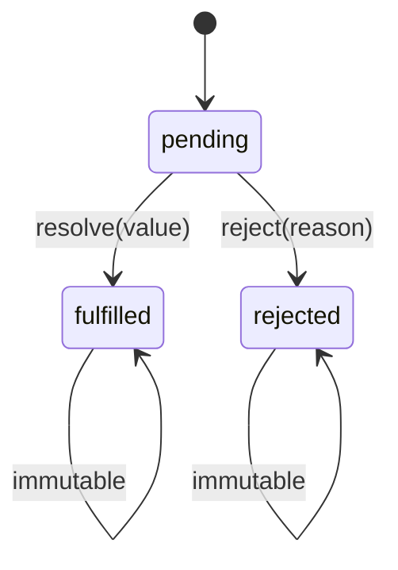

# Asynchronous JS

Callbacks → Promises → `async`/`await`. Interview staple: **implement Promise from scratch**, plus concurrency helpers and error semantics.

Related: [Event Loop](/javascript/10-event-loop) · [Coding: Promise](/coding/02-promise) · [Node event loop](/node/02-event-loop).

---

## Why Promises

Callback hell & inversion of control:

```ts
getUser(id, (err, user) => {
  if (err) return fail(err)
  getOrders(user.id, (err, orders) => {
    if (err) return fail(err)
    /* ... */
  })
})
```

Promises: return a **thenable** representing a future value; chain linearly; centralize errors.

```ts
getUser(id)
  .then((user) => getOrders(user.id))
  .then((orders) => /* ... */)
  .catch(fail)
```

---

## Promise states



- Settled = fulfilled | rejected.  
- Settling is **one-shot**; further resolve/reject ignored.  
- `then` always returns a **new** Promise.

---

## Implement Promise from scratch

Minimal A+–inspired teaching implementation (not a full Promises/A+ compliance suite, but enough for interviews).

```ts
type Executor<T> = (
  resolve: (value: T | PromiseLike<T>) => void,
  reject: (reason?: unknown) => void,
) => void

type OnFulfilled<T, R> = (value: T) => R | PromiseLike<R>
type OnRejected<R> = (reason: unknown) => R | PromiseLike<R>

const enum State {
  Pending,
  Fulfilled,
  Rejected,
}

function isThenable(x: unknown): x is PromiseLike<unknown> {
  return x !== null && (typeof x === "object" || typeof x === "function") && typeof (x as any).then === "function"
}

function enqueueMicrotask(fn: () => void) {
  queueMicrotask(fn)
}

export class MyPromise<T> {
  private state: State = State.Pending
  private value?: T
  private reason?: unknown
  private fulfillQueue: Array<(v: T) => void> = []
  private rejectQueue: Array<(r: unknown) => void> = []

  constructor(executor: Executor<T>) {
    const resolve = (value: T | PromiseLike<T>) => this.resolve(value)
    const reject = (reason?: unknown) => this.reject(reason)
    try {
      executor(resolve, reject)
    } catch (e) {
      this.reject(e)
    }
  }

  private resolve(value: T | PromiseLike<T>) {
    if (this.state !== State.Pending) return

    if (isThenable(value)) {
      // assimilate thenable — avoid sync re-entrancy issues
      try {
        value.then(
          (v) => this.resolve(v as T | PromiseLike<T>),
          (r) => this.reject(r),
        )
      } catch (e) {
        this.reject(e)
      }
      return
    }

    this.state = State.Fulfilled
    this.value = value as T
    this.fulfillQueue.splice(0).forEach((cb) => cb(this.value as T))
  }

  private reject(reason?: unknown) {
    if (this.state !== State.Pending) return
    this.state = State.Rejected
    this.reason = reason
    this.rejectQueue.splice(0).forEach((cb) => cb(this.reason))
  }

  then<R1 = T, R2 = never>(
    onFulfilled?: OnFulfilled<T, R1> | null,
    onRejected?: OnRejected<R2> | null,
  ): MyPromise<R1 | R2> {
    return new MyPromise<R1 | R2>((resolve, reject) => {
      const handleFulfill = (value: T) => {
        enqueueMicrotask(() => {
          if (typeof onFulfilled !== "function") {
            resolve(value as unknown as R1)
            return
          }
          try {
            resolve(onFulfilled(value) as R1 | PromiseLike<R1>)
          } catch (e) {
            reject(e)
          }
        })
      }

      const handleReject = (reason: unknown) => {
        enqueueMicrotask(() => {
          if (typeof onRejected !== "function") {
            reject(reason)
            return
          }
          try {
            resolve(onRejected(reason) as R1 | R2 | PromiseLike<R1 | R2>)
          } catch (e) {
            reject(e)
          }
        })
      }

      if (this.state === State.Fulfilled) handleFulfill(this.value as T)
      else if (this.state === State.Rejected) handleReject(this.reason)
      else {
        this.fulfillQueue.push(handleFulfill)
        this.rejectQueue.push(handleReject)
      }
    })
  }

  catch<R = never>(onRejected?: OnRejected<R> | null) {
    return this.then(null, onRejected)
  }

  finally(onFinally?: (() => void) | null) {
    return this.then(
      (v) => {
        onFinally?.()
        return v
      },
      (r) => {
        onFinally?.()
        throw r
      },
    )
  }

  static resolve<U>(value: U | PromiseLike<U>): MyPromise<U> {
    return new MyPromise<U>((resolve) => resolve(value))
  }

  static reject<U = never>(reason?: unknown): MyPromise<U> {
    return new MyPromise<U>((_, reject) => reject(reason))
  }
}
```

### Key implementation talking points

1. **State machine** — pending → settled once.  
2. **Handler queues** — attach `then` before settle.  
3. **Async then** — handlers via `queueMicrotask` (never sync if you want A+ feel).  
4. **Thenable assimilation** — `resolve(promise)` unwraps.  
5. **Penetration** — missing `onFulfilled` passes value through; missing `onRejected` passes rejection through.  
6. **Errors in executor / handlers** → reject.

### Self-resolution guard (mention)

A+ requires rejecting if a promise resolves to itself — add an identity check in production-grade code.

---

## `Promise` static helpers

### `Promise.all`

```ts
function promiseAll<T>(inputs: Array<T | PromiseLike<T>>): Promise<T[]> {
  return new Promise((resolve, reject) => {
    const arr = [...inputs]
    if (arr.length === 0) {
      resolve([])
      return
    }
    const out: T[] = new Array(arr.length)
    let left = arr.length
    arr.forEach((p, i) => {
      Promise.resolve(p).then((v) => {
        out[i] = v
        if (--left === 0) resolve(out)
      }, reject)
    })
  })
}
```

Fails fast on first rejection.

### `Promise.allSettled`

```ts
function promiseAllSettled<T>(
  inputs: Array<T | PromiseLike<T>>,
): Promise<Array<PromiseSettledResult<T>>> {
  return Promise.all(
    inputs.map((p) =>
      Promise.resolve(p).then(
        (value) => ({ status: "fulfilled" as const, value }),
        (reason) => ({ status: "rejected" as const, reason }),
      ),
    ),
  )
}
```

### `Promise.race` / `Promise.any`

```ts
function promiseRace<T>(inputs: Iterable<T | PromiseLike<T>>): Promise<T> {
  return new Promise((resolve, reject) => {
    for (const p of inputs) Promise.resolve(p).then(resolve, reject)
  })
}

function promiseAny<T>(inputs: Array<T | PromiseLike<T>>): Promise<T> {
  return new Promise((resolve, reject) => {
    const errors: unknown[] = []
    let left = inputs.length
    if (!left) {
      reject(new AggregateError([], "All promises were rejected"))
      return
    }
    inputs.forEach((p, i) => {
      Promise.resolve(p).then(resolve, (err) => {
        errors[i] = err
        if (--left === 0) reject(new AggregateError(errors, "All promises were rejected"))
      })
    })
  })
}
```

| Helper | Resolves when | Rejects when |
| --- | --- | --- |
| `all` | all fulfill | first reject |
| `allSettled` | all settle | never (for input rejects) |
| `race` | first settle | first reject (if that settles first) |
| `any` | first fulfill | all reject → `AggregateError` |

---

## `async` / `await`

Syntactic sugar over Promises:

```ts
async function load(id: string) {
  try {
    const user = await fetchUser(id)
    const orders = await fetchOrders(user.id)
    return { user, orders }
  } catch (e) {
    throw e
  }
}
```

- `async` functions always return a Promise.  
- `await` pauses the function; continuation is a microtask.  
- `await` non-thenables → wraps as resolved.  
- Rejection → throw at the `await` point.

```ts
async function f() {
  return 1
}
f() // Promise<number>
```

---

## Error handling patterns

```ts
await p // throws if rejected inside async

p.catch((e) => fallback) // recover to fulfilled

p.then(onOk, onErr) // note: onErr does not catch errors in onOk
p.then(onOk).catch(onErr) // catches both
```

Unhandled rejection: always `catch` or `await` in a try — Node may crash on unhandledRejections depending on flags.

---

## Cancellation

Promises are not cancelable natively. Patterns:

```ts
const ac = new AbortController()
fetch(url, { signal: ac.signal })
ac.abort()

// cooperative
let cancelled = false
async function work() {
  for (const chunk of chunks) {
    if (cancelled) throw new Error("cancelled")
    await process(chunk)
  }
}
```

`AbortSignal` is the production standard for fetch/ORM/query libs.

---

## Concurrency limits

```ts
async function mapPool<T, R>(
  items: T[],
  concurrency: number,
  fn: (item: T, i: number) => Promise<R>,
): Promise<R[]> {
  const results: R[] = new Array(items.length)
  let i = 0
  async function worker() {
    while (i < items.length) {
      const idx = i++
      results[idx] = await fn(items[idx]!, idx)
    }
  }
  await Promise.all(Array.from({ length: Math.min(concurrency, items.length) }, () => worker()))
  return results
}
```

---

## Callback ↔ Promise bridges

```ts
function promisify<T>(
  fn: (cb: (err: unknown, value: T) => void) => void,
): () => Promise<T> {
  return () =>
    new Promise((resolve, reject) => {
      fn((err, value) => (err ? reject(err) : resolve(value)))
    })
}
```

Node: `util.promisify` / `fs/promises`.

---

## Microtask timing (async)

```ts
async function example() {
  console.log(1)
  await Promise.resolve()
  console.log(2)
}
console.log(0)
example()
console.log(3)
// 0 1 3 2
```

See [Event Loop](/javascript/10-event-loop) drills.

---

## Interview Questions

**Q: Implement Promise.**  
State machine + handler queues + microtask scheduling + thenable unwrap — walk through code above.

**Q: Difference between `then(a,b)` and `then(a).catch(b)`?**  
`catch` also handles throws/rejections from `a`.

**Q: What does `Promise.resolve` do with a thenable?**  
Adopts its state (assimilation).

**Q: `all` vs `allSettled`?**  
`all` fails fast; `allSettled` waits for every outcome.

**Q: Is `async/await` slower?**  
Negligible vs clarity; extra microtasks per await — batch if ultra-hot.

**Q: How do you cancel?**  
AbortController / cooperative flags — not `promise.cancel()`.

## Common Mistakes

- Returning a Promise inside `then` without understanding flatten.  
- `async` function with sequential awaits that should be parallel.  
- Swallowing errors with empty `catch`.  
- Creating Promises for already-sync values unnecessarily.  
- Forgetting that `finally` callbacks that throw override settlement.  
- Resolving with `undefined` accidentally from missing `return`.

## Trade-offs / Production Notes

- Prefer `async/await` for readability; raw `then` for small transforms / library internals.  
- Use `allSettled` for fan-out where partial success matters (dashboards).  
- Always pass `AbortSignal` through service layers.  
- Pair with event-loop knowledge when debugging "wrong order" bugs.  
- Full test-suite-level Promise: see also [Coding Promise](/coding/02-promise).
