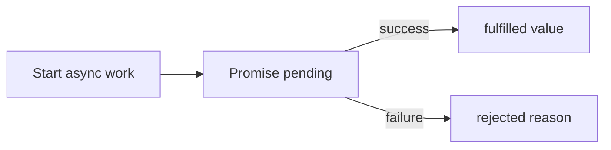
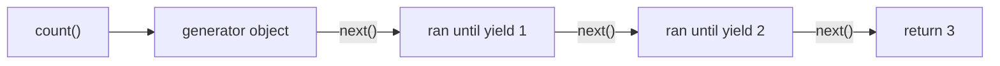
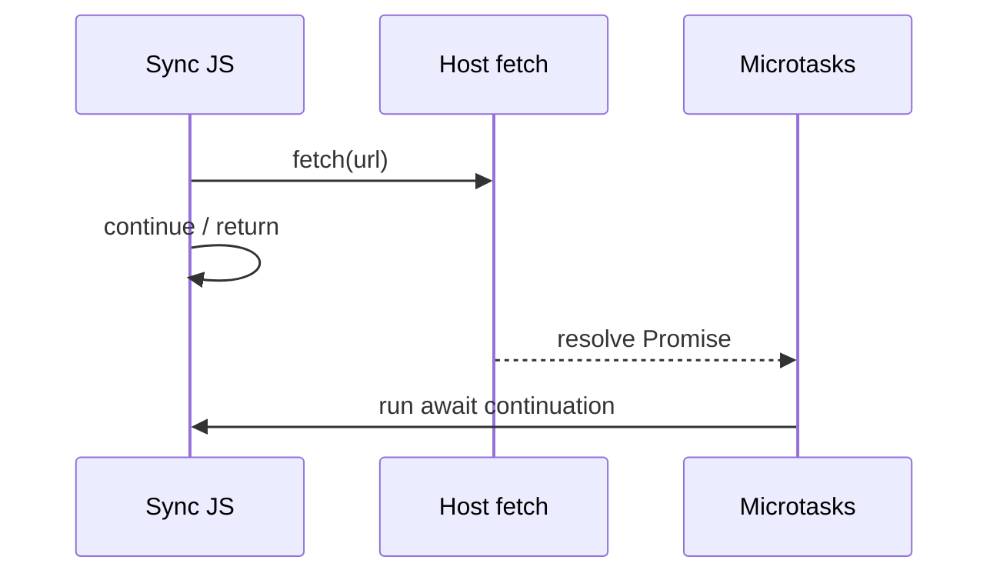

```mermaid
gantt
  title Sequential vs parallel
  dateFormat X
  axisFormat %s
  section Sequential
  fetchA :0, 3
  fetchB :3, 6
  section Parallel
  fetchA :0, 3
  fetchB :0, 3
```

# Async JavaScript

This chapter teaches asynchronous JavaScript from scratch. You do not need to already know Promises, `async`/`await`, generators, or `AbortController`. By the end you should explain **why async exists**, **what a Promise is (including implementing one)**, **how `await` desugars**, and **how to cancel work**.

The **event loop** decides *when* callbacks run. This chapter focuses on *how* you structure async results. Read [Event Loop](/javascript/10-event-loop) alongside if queues still feel fuzzy.

---

## 1. The problem: waiting without freezing

JavaScript on the main thread has **one call stack**. If you wait for a network response by blocking:

```ts
// Pseudocode — not real JS
const data = blockingFetch("/api/user") // freeze the page for 200ms–2s
console.log(data)
```

the UI cannot paint, clicks cannot run, and the tab feels dead.

Instead we need:

1. Start the slow work.
2. Continue doing other things.
3. When the result arrives, run some code with that result.

Historically that meant **callbacks**:

```ts
fetchUser("/api/user", (err, user) => {
  if (err) {
    handle(err)
    return
  }
  fetchOrders(user.id, (err2, orders) => {
    if (err2) {
      handle(err2)
      return
    }
    render(user, orders)
  })
})
```

This works but nests badly (“callback hell”), scatters error handling, and makes control flow hard to read.

**Promises** give you a standard object that represents “a value that will exist later (or fail).” **`async`/`await`** makes Promise code look like straight-line code.



---

## 2. What a Promise is, in plain language

A **Promise** is an object that is in one of three states:

| State | Meaning |
| --- | --- |
| **pending** | work not finished yet |
| **fulfilled** | succeeded; has a **value** |
| **rejected** | failed; has a **reason** (often an `Error`) |

Settled means fulfilled or rejected. A Promise **settles at most once** — it never goes back to pending, and it does not fulfill *and* reject.

```ts
const p = new Promise<number>((resolve, reject) => {
  // executor runs immediately (sync)
  setTimeout(() => {
    resolve(42) // fulfill with 42
    // reject(new Error("nope")) // OR reject — not both meaningfully
  }, 100)
})

p.then((value) => {
  console.log(value) // 42 — runs as a microtask after resolve
})
```

Plain language:

> You give the Promise constructor a function (the **executor**). That function receives `resolve` and `reject`. When the async work finishes, call one of them. Callers attach `.then` / `.catch` to react later.

---

## 3. Promise internals step by step

### 3.1 The executor runs now

```ts
console.log("A")
const p = new Promise((resolve) => {
  console.log("B") // still synchronous!
  resolve(1)
})
console.log("C")
p.then(() => console.log("D"))
console.log("E")
```

Output: `A B C E D`

- `B` runs during construction (sync).
- `D` runs later as a **microtask** (see event loop).

### 3.2 `then` always returns a new Promise

```ts
const p2 = p1.then(onFulfilled, onRejected)
```

- If `onFulfilled` returns a normal value `x`, `p2` fulfills with `x`.
- If it throws, `p2` rejects with that error.
- If it returns a Promise, `p2` **adopts** that Promise’s fate (flattening).

This is why chaining works:

```ts
Promise.resolve(1)
  .then((x) => x + 1)
  .then((x) => x * 2)
  .then((x) => console.log(x)) // 4
```

### 3.3 Reactions are queued, not called inline

Even if the Promise is already fulfilled:

```ts
Promise.resolve("done").then((v) => console.log(v))
console.log("after")
// after
// done
```

Handlers run as **microtasks**, never immediately in the same turn as `then` registration (for standard Promises). That keeps ordering predictable.

### 3.4 Error propagation down the chain

```ts
Promise.resolve()
  .then(() => {
    throw new Error("boom")
  })
  .then(() => console.log("skipped"))
  .catch((err) => {
    console.log("caught", err.message)
  })
  .then(() => console.log("continues after catch"))
```

A rejection skips fulfilled handlers until a `catch` (or `then` with a rejection handler) deals with it. After a successful catch, the chain can fulfill again.

### 3.5 `finally`

```ts
p.finally(() => {
  hideSpinner() // runs on fulfill OR reject
})
```

`finally` does not receive the value/reason (unless you use the Promise result). It still returns a Promise that passes through the previous outcome (unless the finally callback throws / returns a rejecting Promise).

---

## 4. Implement Promise from scratch (teaching version)

The goal is not to pass every edge case of the Promises/A+ spec. The goal is to **understand** states, reactions, async delivery, and chaining.

```ts
type Resolve<T> = (value: T | PromiseLike<T>) => void
type Reject = (reason?: unknown) => void
type Executor<T> = (resolve: Resolve<T>, reject: Reject) => void

type Reaction = {
  onFulfilled?: ((value: any) => any) | null
  onRejected?: ((reason: any) => any) | null
  resolve: Resolve<any>
  reject: Reject
}

class MyPromise<T> {
  private state: "pending" | "fulfilled" | "rejected" = "pending"
  private value: T | undefined
  private reason: unknown
  private reactions: Reaction[] = []

  constructor(executor: Executor<T>) {
    const resolve: Resolve<T> = (value) => {
      // Ignore resolve/reject after settlement
      if (this.state !== "pending") return

      // Simplified: if value is thenable, we should adopt it.
      // Full A+ does careful thenable resolution — see note below.
      if (isThenable(value)) {
        value.then(resolve as any, reject)
        return
      }

      this.state = "fulfilled"
      this.value = value as T
      this.flush()
    }

    const reject: Reject = (reason) => {
      if (this.state !== "pending") return
      this.state = "rejected"
      this.reason = reason
      this.flush()
    }

    try {
      executor(resolve, reject)
    } catch (err) {
      reject(err)
    }
  }

  then<TResult1 = T, TResult2 = never>(
    onFulfilled?: ((value: T) => TResult1 | PromiseLike<TResult1>) | null,
    onRejected?: ((reason: any) => TResult2 | PromiseLike<TResult2>) | null,
  ): MyPromise<TResult1 | TResult2> {
    return new MyPromise<TResult1 | TResult2>((resolve, reject) => {
      this.reactions.push({
        onFulfilled: onFulfilled as any,
        onRejected: onRejected as any,
        resolve: resolve as any,
        reject,
      })
      // If already settled, schedule flush
      if (this.state !== "pending") {
        this.flush()
      }
    })
  }

  catch<TResult = never>(
    onRejected?: ((reason: any) => TResult | PromiseLike<TResult>) | null,
  ) {
    return this.then(null, onRejected)
  }

  private flush() {
    // Deliver reactions asynchronously (microtask)
    queueMicrotask(() => {
      if (this.state === "pending") return

      const queue = this.reactions
      this.reactions = []

      for (const r of queue) {
        try {
          if (this.state === "fulfilled") {
            if (typeof r.onFulfilled !== "function") {
              // Pass through
              r.resolve(this.value as any)
            } else {
              const result = r.onFulfilled(this.value)
              r.resolve(result)
            }
          } else {
            if (typeof r.onRejected !== "function") {
              r.reject(this.reason)
            } else {
              const result = r.onRejected(this.reason)
              r.resolve(result) // recovering catch fulfills the next promise
            }
          }
        } catch (err) {
          r.reject(err)
        }
      }
    })
  }
}

function isThenable(value: unknown): value is PromiseLike<any> {
  return (
    value !== null &&
    (typeof value === "object" || typeof value === "function") &&
    typeof (value as any).then === "function"
  )
}
```

### 4.1 Teaching comments — what each part is doing

1. **`state` / `value` / `reason`** — the Promise’s memory of what happened.
2. **`reactions`** — list of waiting `.then` handlers plus the `resolve`/`reject` of the **downstream** Promise each `then` created.
3. **`resolve`/`reject` ignore late calls** — settlement is one-shot.
4. **`queueMicrotask` in `flush`** — handlers never run synchronously inside `resolve` / `then` in a way that reenters unpredictably; they run after current JS.
5. **Pass-through** — if you omit `onFulfilled`, the value flows to the next Promise (needed for `.then().catch()` patterns).
6. **Thenable adoption** — resolving with another Promise-like waits on it (simplified).

### 4.2 Try it

```ts
const p = new MyPromise<number>((resolve) => {
  setTimeout(() => resolve(10), 0)
})

p.then((x) => x + 1)
  .then((x) => {
    console.log(x) // 11
  })
```

### 4.3 What a production Promise also does

- Full **Promise Resolution Procedure** (avoid infinite cycles if `p.resolve(p)`)
- Assimilate any thenable carefully (call `then` once, guard against double settle)
- `finally`, `Promise.all`, `race`, `allSettled`, `any`
- Unhandled rejection tracking

You do not need to rewrite all of that in an interview — explain states, microtask delivery, and chaining.

---

## 5. Static helpers you must know

### 5.1 `Promise.resolve` / `Promise.reject`

```ts
Promise.resolve(1) // already fulfilled
Promise.reject(new Error("x")) // already rejected
Promise.resolve(fetch("/api")) // adopts the fetch promise
```

### 5.2 `Promise.all` — all succeed, or fail fast

```ts
const [a, b] = await Promise.all([fetchA(), fetchB()])
```

- Fulfills with an array of values in order when **all** fulfill.
- Rejects as soon as **any** rejects (other work may still be in flight — does not auto-cancel).

```ts
function promiseAll<T>(promises: Array<Promise<T>>): Promise<T[]> {
  return new Promise((resolve, reject) => {
    if (promises.length === 0) {
      resolve([])
      return
    }
    const results: T[] = new Array(promises.length)
    let remaining = promises.length
    promises.forEach((p, i) => {
      Promise.resolve(p).then(
        (value) => {
          results[i] = value
          remaining--
          if (remaining === 0) resolve(results)
        },
        reject, // fail fast
      )
    })
  })
}
```

### 5.3 `Promise.allSettled` — wait for everyone, no fail-fast

```ts
const settled = await Promise.allSettled([p1, p2])
// { status: 'fulfilled', value } | { status: 'rejected', reason }
```

Use when you want every result even if some fail (dashboard with independent widgets).

### 5.4 `Promise.race` — first to settle wins

```ts
await Promise.race([
  fetch(url),
  new Promise((_, rej) => setTimeout(() => rej(new Error("timeout")), 5000)),
])
```

First fulfill **or** reject wins. Timeout patterns often use `race` (cancellation still needs AbortController for the fetch itself).

### 5.5 `Promise.any` — first fulfill wins; reject only if all reject

```ts
await Promise.any([mirror1, mirror2]) // AggregateError if all reject
```

---

## 6. `async` / `await` — syntax over Promises

### 6.1 `async` means “returns a Promise”

```ts
async function load(): Promise<number> {
  return 1
}

load().then((n) => console.log(n)) // 1
```

Even if you `return 1`, callers receive a Promise fulfilled with `1`. If you throw:

```ts
async function fail() {
  throw new Error("x")
}
fail().catch((e) => console.log(e.message))
```

### 6.2 `await` pauses the async function

```ts
async function main() {
  console.log("A")
  const value = await Promise.resolve(1)
  console.log("B", value)
}
main()
console.log("C")
// A C B 1
```

`await` roughly means:

1. Evaluate the expression (if not a Promise, wrap with `Promise.resolve`).
2. Attach a continuation for the rest of the function.
3. Return control to the caller (the async function’s Promise stays pending until the rest finishes).

Desugared intuition:

```ts
function main() {
  console.log("A")
  return Promise.resolve(1).then((value) => {
    console.log("B", value)
  })
}
```

### 6.3 `try/catch` with await

```ts
async function loadUser(id: string) {
  try {
    const res = await fetch(`/api/users/${id}`)
    if (!res.ok) throw new Error(`HTTP ${res.status}`)
    return await res.json()
  } catch (err) {
    logError(err)
    throw err // rethrow if callers should handle
  }
}
```

This replaces `.then/.catch` chains for sequential logic. Prefer `await` for readability; prefer `.then` when transforming streams of Promises in a pipeline style.

### 6.4 Sequential vs parallel — the classic footgun

```ts
// BAD: sequential awaits — second starts after first finishes
const a = await fetchA()
const b = await fetchB()

// GOOD: start both, then await both
const pa = fetchA()
const pb = fetchB()
const [a2, b2] = await Promise.all([pa, pb])
```



---

## 7. Generators — pauseable functions (and async’s cousin)

A **generator** function can pause with `yield` and later resume:

```ts
function* count() {
  console.log("start")
  yield 1
  yield 2
  return 3
}

const g = count()
g.next() // { value: 1, done: false } — logs start
g.next() // { value: 2, done: false }
g.next() // { value: 3, done: true }
```



### 7.1 Why generators matter for async history

Before `async/await` was standard, libraries (co, Redux-Saga, etc.) used generators so you could write:

```ts
function* load() {
  const user = yield fetchUser()
  const orders = yield fetchOrders(user.id)
  return { user, orders }
}
```

A runner would take each yielded Promise, wait for it, then call `generator.next(result)`.

**`async/await` is the language-level version of that idea** specialized for Promises. You rarely need generators for async today, but interviews still ask.

### 7.2 Async generators

```ts
async function* pages(url: string) {
  let next: string | null = url
  while (next) {
    const res = await fetch(next)
    const data = await res.json()
    yield data.items
    next = data.nextUrl
  }
}

for await (const items of pages("/api?page=1")) {
  console.log(items)
}
```

`for await...of` consumes async iterables — useful for streams of pages or chunks.

### 7.3 `yield*` and iterators

```ts
function* a() {
  yield 1
  yield 2
}
function* b() {
  yield* a()
  yield 3
}
;[...b()] // [1, 2, 3]
```

---

## 8. Cancellation with `AbortController`

Promises do **not** cancel by themselves. If you `race` a timeout, `fetch` may still complete in the background unless you abort it.

### 8.1 The pattern

```ts
const controller = new AbortController()
const { signal } = controller

const p = fetch("/api/slow", { signal })

// later — user navigated away
controller.abort()

try {
  await p
} catch (err) {
  if (err instanceof DOMException && err.name === "AbortError") {
    console.log("cancelled")
  } else {
    throw err
  }
}
```

Plain language:

> `AbortController` is a shared **signal**. You pass `signal` into APIs that support cancellation. Calling `abort()` notifies them to stop.

### 8.2 Listening manually

```ts
function sleep(ms: number, signal?: AbortSignal) {
  return new Promise<void>((resolve, reject) => {
    if (signal?.aborted) {
      reject(new DOMException("Aborted", "AbortError"))
      return
    }
    const id = setTimeout(resolve, ms)
    signal?.addEventListener(
      "abort",
      () => {
        clearTimeout(id)
        reject(new DOMException("Aborted", "AbortError"))
      },
      { once: true },
    )
  })
}
```

### 8.3 Linking timeouts

```ts
const controller = new AbortController()
const id = setTimeout(() => controller.abort(), 5000)

try {
  await fetch(url, { signal: controller.signal })
} finally {
  clearTimeout(id)
}
```

Modern platforms also offer `AbortSignal.timeout(5000)` where available.

### 8.4 Why this matters in SPAs

Without abort:

- Stale responses can overwrite newer UI state.
- Network and CPU keep working after unmount.

Always abort on unmount / route change when using `fetch` in effects.

---

## 9. Common Promise anti-patterns

### 9.1 Nested `then` instead of chaining / await

```ts
// Unnecessary nesting
getUser().then((u) => {
  getOrders(u.id).then((o) => {
    render(u, o)
  })
})

// Flat
const u = await getUser()
const o = await getOrders(u.id)
render(u, o)
```

### 9.2 Swallowing errors

```ts
await fetch(url).catch(() => null) // hides failures — sometimes OK, often not
```

### 9.3 Creating Promises wrapping Promises for no reason

```ts
// Unnecessary
return new Promise((resolve) => {
  fetch(url).then(resolve)
})

// Just return the promise
return fetch(url)
```

### 9.4 Forgetting that `Promise.all` does not cancel siblings

When one fails, others keep going unless you pass an `AbortSignal` and abort on failure.

---

## 10. Top-level await

In ES modules you can:

```ts
const config = await loadConfig()
export const url = config.url
```

This delays module evaluation until the await completes, and can delay importers. Use sparingly for init; know it blocks dependent modules. See [Modules](/javascript/13-modules).

---

## 11. Worked example — put it together

```ts
type User = { id: string; name: string }

async function fetchUser(id: string, signal: AbortSignal): Promise<User> {
  const res = await fetch(`/api/users/${id}`, { signal })
  if (!res.ok) throw new Error(`HTTP ${res.status}`)
  return res.json()
}

async function loadProfile(id: string, signal: AbortSignal) {
  const user = await fetchUser(id, signal)
  const [orders, prefs] = await Promise.all([
    fetch(`/api/orders?user=${user.id}`, { signal }).then((r) => r.json()),
    fetch(`/api/prefs?user=${user.id}`, { signal }).then((r) => r.json()),
  ])
  return { user, orders, prefs }
}

const ac = new AbortController()
loadProfile("1", ac.signal)
  .then((data) => console.log(data))
  .catch((err) => {
    if (err.name === "AbortError") return
    console.error(err)
  })

// on navigate away:
// ac.abort()
```

Ideas in play:

- `async/await` for sequential dependency (`user` before parallel fetches)
- `Promise.all` for independent parallel work
- `AbortSignal` threaded through for cancellation

---

## 12. How async connects to the event loop

| Mechanism | Queue behavior |
| --- | --- |
| Promise then/catch/finally | microtasks |
| `await` continuation | microtasks |
| `setTimeout` | tasks |
| `fetch` completion | host → Promise settlement → microtasks for then/await |



---

## Interview Questions

### Q1. What is a Promise?
**Expected:** An object representing a future result with states pending/fulfilled/rejected; settles once; handlers run as microtasks via then/catch.  
**Common wrong:** “A callback” / “a thread.”  
**Follow-ups:** What does `then` return?

### Q2. Difference between callbacks and Promises?
**Expected:** Promises standardize success/failure, compose via chaining, avoid inversion-of-control pitfalls, enable async/await. Callbacks are raw “call me later.”  
**Common wrong:** “Promises are faster.”  
**Follow-ups:** What problem does Promise solve that nested callbacks create?

### Q3. How would you implement Promise?
**Expected:** Store state/value; queue reactions; resolve/reject settle once; flush reactions asynchronously; then returns a new Promise linked to handlers.  
**Common wrong:** “Call then handlers synchronously inside resolve.”  
**Follow-ups:** Why microtask deferral?

### Q4. `Promise.all` vs `allSettled` vs `race` vs `any`?
**Expected:** all fail-fast all-success; allSettled wait all; race first settle; any first fulfill.  
**Common wrong:** Mixing race and any.  
**Follow-ups:** Does all cancel other fetches on failure? (No — need AbortController.)

### Q5. What does `async`/`await` compile/desugar to?
**Expected:** async returns Promise; await is then-continuation / microtask pause of the async function.  
**Common wrong:** “Await blocks the OS thread.”  
**Follow-ups:** Output ordering with await and sync logs.

### Q6. How do you cancel a fetch?
**Expected:** Pass `AbortController.signal` to fetch; call `abort()`; handle AbortError.  
**Common wrong:** “Reject a Promise and fetch stops.”  
**Follow-ups:** Why race-with-timeout alone is insufficient?

### Q7. What is a generator?
**Expected:** A function that can pause at yield and resume via next(); returns an iterator. Async/await is related historically via runners.  
**Common wrong:** “Same as async function.”  

## Common Mistakes

- Sequential `await` in a loop for independent I/O.
- Forgetting to `return` inside `then` chains.
- Assuming `Promise.all` cancels in-flight work on failure.
- Unhandled rejections (missing catch / try).
- Using `async` where a sync function suffices (always returns a Promise — changes call sites).
- Creating `new Promise` around existing Promises unnecessarily.
- Ignoring AbortError vs real errors in UI.

## Trade-offs / Production Notes

- Prefer **`async/await`** for sequential business logic; use **`Promise.all`** for parallelism.
- Always plan **cancellation** for fetch tied to component lifetime.
- Use **`allSettled`** for partial-failure dashboards; **`all`** when any failure should fail the operation.
- Keep Promise implementations in interviews conceptual; cite microtasks and chaining.
- Related: [Event Loop](/javascript/10-event-loop), [Modules](/javascript/13-modules) (top-level await), [Errors](/javascript/18-errors), [Functions](/javascript/09-functions).
