# Memory Management

This chapter teaches how JavaScript uses memory from scratch. You do not need to already know “stack,” “heap,” “mark-and-sweep,” or “WeakMap.” By the end you should explain **where values live**, **how references keep objects alive**, **how garbage collection reclaims memory**, and **how leaks happen — and how you look for them**.

Related: [Closures](/javascript/05-closures) (retained environments), [Event Loop](/javascript/10-event-loop) (callbacks keeping data alive), [Prototypes](/javascript/07-prototype) (shared objects on the heap).

---

## 1. The problem: finite memory, infinite-looking apps

A long-lived page or Node process keeps allocating objects: DOM nodes, arrays of records, closures, caches, sockets.

If nothing ever freed memory, the tab would grow until the OS kills it. JavaScript uses **automatic garbage collection (GC)**: you rarely `free()` by hand. Instead the engine discovers what is **unreachable** and reclaims it.

Your job:

1. Understand what **keeps** an object reachable.
2. Avoid accidentally retaining huge graphs you no longer need.
3. Use the right tools (`WeakMap`, clearing listeners, bounded caches) when lifetimes differ.

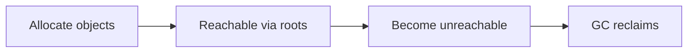

---

## 2. Stack vs heap — two places memory lives

### 2.1 The call stack (structured, short-lived)

When a function runs, the engine pushes a **frame** onto the **call stack**. The frame holds things like:

- where to return to
- local variable slots for primitives / references
- bookkeeping for the call

When the function returns, its frame is popped. That memory is released in a simple LIFO way — **not** the same algorithm as heap GC.

```ts
function add(a: number, b: number) {
  const sum = a + b // locals live in this frame
  return sum
}
add(1, 2) // frame created, then destroyed on return
```

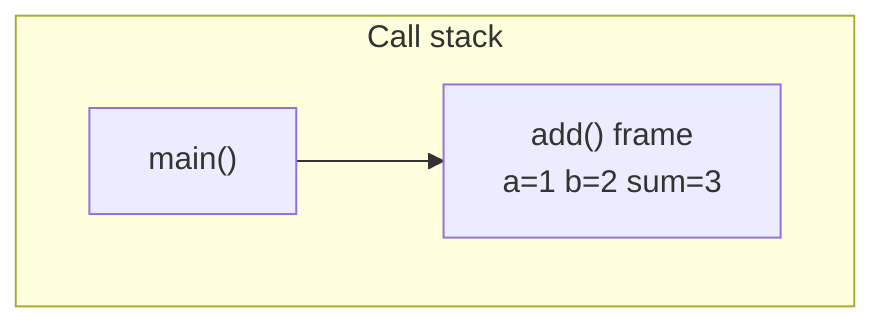

### 2.2 The heap (objects that outlive a frame)

**Objects**, **arrays**, **functions**, **closures’ environments** — these live on the **heap**, a large region where allocation order is not LIFO.

Locals on the stack often hold **references** (pointers) into the heap:

```ts
function make() {
  const user = { name: "Ada" } // object on heap
  return user // reference escapes the frame
}
const u = make() // heap object still reachable via u
```

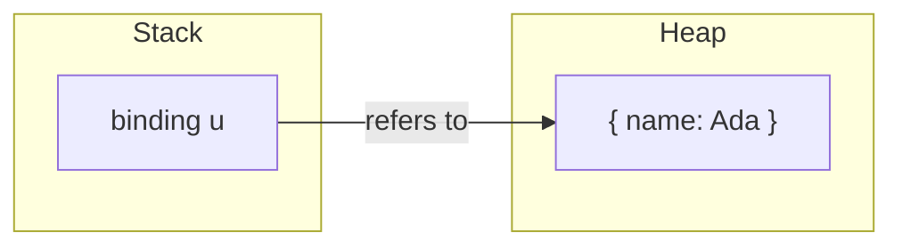

### 2.3 Primitives vs objects (practical model)

| Kind | Examples | Typical storage story |
| --- | --- | --- |
| Primitives | `number`, `string`, `boolean`, `null`, `undefined`, `symbol`, `bigint` | Often in the frame or tagged values; strings may be heap-allocated internally |
| Objects | `{}`, arrays, functions, dates | Heap allocations; variables hold references |

Interview-friendly line:

> Locals are on the stack; objects are on the heap; variables hold either primitive values or **references** to heap objects.

Engines optimize heavily (on-stack allocation escape analysis, etc.). The stack/heap model is still the right mental model for leaks and references.

---

## 3. References — sharing one object

```ts
const a = { n: 1 }
const b = a // copy the reference, not the object
b.n = 2
console.log(a.n) // 2 — same heap object
```

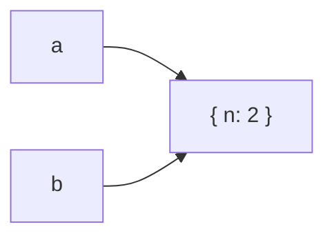

Reassignment changes what a binding points to:

```ts
let a = { n: 1 }
a = { n: 2 } // previous { n: 1 } may become unreachable
```

If nothing else points at `{ n: 1 }`, GC can reclaim it.

### 3.1 Passing arguments

```ts
function bump(obj: { n: number }) {
  obj.n++ // mutates the shared heap object
}
const x = { n: 1 }
bump(x)
x.n // 2
```

The function receives a **copy of the reference**, not a deep copy of the object.

---

## 4. Reachability and roots

GC does not ask “will the programmer use this again?” It asks:

> Is this object **reachable** by following references from a set of **roots**?

### 4.1 What are roots?

Examples of roots:

- Global / `globalThis` properties
- The current call stack’s references
- Registered callbacks still held by the host (timers, listeners, outstanding Promise handlers)
- Modules’ exported live bindings (module scope stays for the app lifetime)

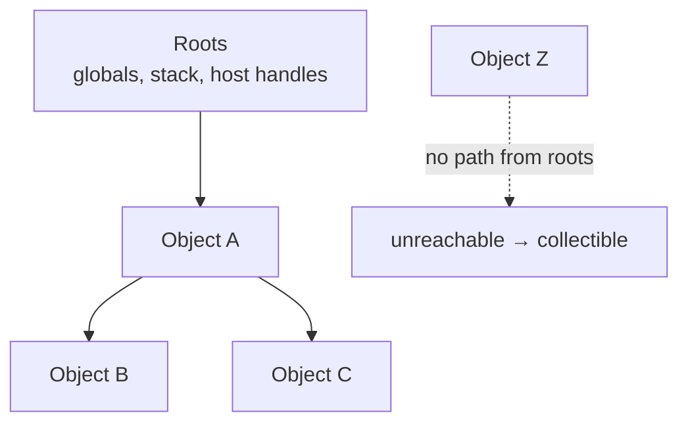

### 4.2 Becoming unreachable

```ts
let node = { value: 1, next: { value: 2, next: null as null | object } }
node = null as any
// If nothing else points into that list, both objects can be collected
```

You do not need to set every field to `null` manually in normal code — dropping the **root reference** is enough if no other path exists.

---

## 5. Mark-and-sweep — how GC typically works

Modern JS engines (V8, SpiderMonkey, JavaScriptCore) use sophisticated collectors (generational, incremental, concurrent). The **classic teaching algorithm** is **mark-and-sweep**:

### 5.1 Mark phase

1. Start from roots.
2. Recursively mark every object you can reach as “alive.”

### 5.2 Sweep phase

1. Walk the heap (or free lists).
2. Anything **not** marked is unreachable — reclaim it.
3. Clear marks for the next cycle.

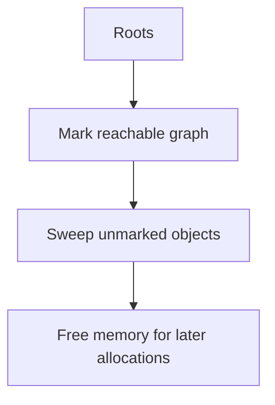

### 5.3 Why not reference counting alone?

**Reference counting** stores “how many pointers point at me” and frees at zero. Cycles are a problem:

```ts
const a: any = {}
const b: any = {}
a.ref = b
b.ref = a
// Even if nothing else points to a or b, each has count 1 — leak under pure refcount
```

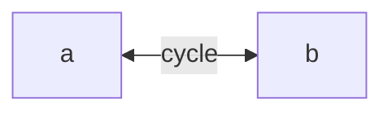

Mark-and-sweep handles cycles: if neither is reachable from roots, neither gets marked, both are swept.

Engines may still use refcount ideas in places, but **cycle-safe tracing GC** is the interview model for JS.

### 5.4 Generational intuition (bonus)

Many objects die young. Engines often split:

- **Young generation** — collect frequently (cheap)
- **Old generation** — collect less often (objects that survived)

You do not control this directly; writing code that creates huge short-lived objects can increase GC frequency (sometimes OK, sometimes jank).

---

## 6. Closures and retained memory

Closures keep their **lexical environment** alive as long as the function is reachable.

```ts
function makeHandler() {
  const huge = new Array(1e6).fill("x")
  const tiny = 1
  return () => tiny
}

const handler = makeHandler()
// `handler` may retain the environment that still has `huge`
// depending on engine optimizations — do not rely on partial GC
```

Safer pattern when you only need `tiny`:

```ts
function makeHandler() {
  const huge = new Array(1e6).fill("x")
  const tiny = 1
  // use huge...
  return ((t: number) => () => t)(tiny)
}
```

Or null out large locals when done in long-lived scopes (rare; prefer structuring so large data does not share an environment with a long-lived closure).

See [Closures](/javascript/05-closures).

---

## 7. Common leak patterns (teach each slowly)

### 7.1 Uncleared timers

```ts
const data = fetchBig()
setInterval(() => {
  console.log(data.length)
}, 1000)
// Until clearInterval, the callback retains `data`
```

Fix: `clearInterval` when the component unmounts / work ends.

### 7.2 DOM listeners not removed

```ts
function setup(el: HTMLElement) {
  const onScroll = () => {
    /* ... */
  }
  el.addEventListener("scroll", onScroll)
  // if el is removed from DOM but something still holds el, or
  // if you keep el and forget removeEventListener, retention continues
}
```

Prefer `AbortController` with `{ signal }` so all listeners drop on abort:

```ts
const ac = new AbortController()
el.addEventListener("scroll", onScroll, { signal: ac.signal })
// later
ac.abort()
```

### 7.3 Detached DOM nodes

A node removed from the document but still referenced from JS stays alive:

```ts
const el = document.getElementById("panel")!
el.remove()
window._leak = el // still reachable — leak until cleared
```

In DevTools heap snapshots, look for **Detached HTMLElement**.

### 7.4 Unbounded caches

```ts
const cache = new Map<string, object>()
function get(key: string) {
  if (!cache.has(key)) cache.set(key, load(key))
  return cache.get(key)
}
// cache grows forever as keys diversify
```

Fixes:

- LRU with max size
- TTL expiration
- `WeakMap` when keys are objects you do not own lifetimes for

### 7.5 Global registries

```ts
;(window as any).registry = (window as any).registry || []
registry.push(bigObject)
```

Globals live for the page lifetime. Prefer module-scoped stores you can clear, or weak collections.

### 7.6 Closures in long-lived observers

```ts
const huge = getHuge()
new MutationObserver(() => {
  console.log(huge.length)
}).observe(document.body, { childList: true, subtree: true })
```

The observer retains the callback, which retains `huge`, for as long as the observer is connected. `disconnect()` when done.

### 7.7 Promises retaining resolvers / graphs

A pending Promise and its handlers keep closed-over data alive until settlement (and until nothing references the Promise/handlers). Hung promises can pin memory.

---

## 8. `WeakMap` and `WeakSet` — weak keys

Normal `Map` keys keep objects alive:

```ts
const map = new Map<object, string>()
let obj: object | null = { id: 1 }
map.set(obj, "meta")
obj = null
// the object is STILL reachable via map keys — not collected
```

**`WeakMap`** holds keys **weakly**:

```ts
const wm = new WeakMap<object, string>()
let obj: object | null = { id: 1 }
wm.set(obj, "meta")
obj = null
// if no other refs, object (and its entry) can be collected
```

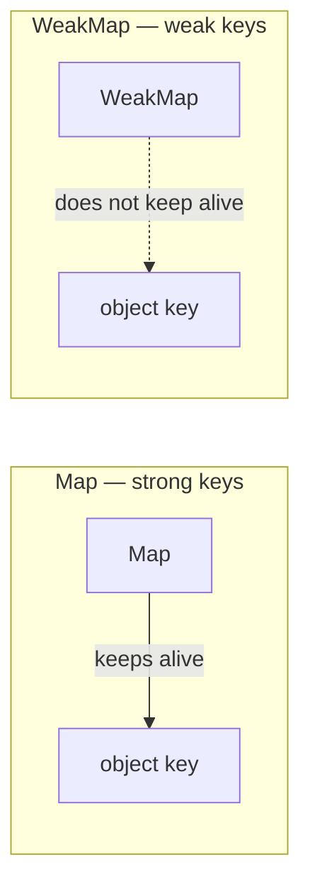

### 8.1 Rules

- Keys must be **objects** (or symbols in some weak collections — know `WeakMap`/`WeakSet` object keys for interviews).
- No iteration over WeakMap keys (enumeration would expose GC nondeterminism).
- Values in WeakMap are still held **strongly** while the entry exists. If you need weak values, that is a different problem (WeakRef).

`WeakSet` is a set of weakly held objects (membership flags without retaining).

### 8.2 Classic use: private metadata

```ts
const secret = new WeakMap<object, string>()

class User {
  constructor(name: string) {
    secret.set(this, name)
  }
  getName() {
    return secret.get(this)
  }
}
```

When a `User` instance is unreachable, its WeakMap entry can disappear — no leftover metadata pinning it (unlike a module-level `Map` from instance → data).

### 8.3 `WeakRef` and `FinalizationRegistry` (awareness)

- `WeakRef` — hold a weak reference to an object; `.deref()` may return `undefined` after GC.
- `FinalizationRegistry` — schedule a callback after an object is collected (not for critical logic; GC timing is unpredictable).

Use rarely; prefer structured lifetime management.

---

## 9. Measuring memory — DevTools thinking

### 9.1 Performance / Memory mental workflow

1. **Reproduce** a steady scenario (open panel, close panel, repeat).
2. Take a **heap snapshot**.
3. Perform the action N times.
4. Take another snapshot.
5. Compare — look for objects that **grow without bound**.

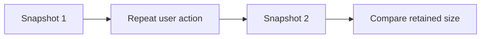

### 9.2 What to look for

| Signal | Suspicion |
| --- | --- |
| Detached HTMLElement count rising | DOM/node references or listeners |
| Your class instances climbing | Cache / global registry / uncleared observer |
| `Module` / closure contexts huge | Closures retaining large data |
| Strings / arrays huge | Unbounded buffers or logs |

### 9.3 Allocation timeline

Record allocation while interacting. Spikes that never drop after GC suggest leaks; spikes that drop after GC suggest normal churn.

### 9.4 Node

```bash
node --expose-gc app.js
```

```ts
// experimental teaching — force GC only in diagnostics
global.gc?.()
console.log(process.memoryUsage())
```

Use heap snapshots via Chrome DevTools attaching to Node, or `clinic` / `heapdump` tools in serious investigations.

### 9.5 `performance.memory` (Chrome)

```ts
// non-standard, Chrome-only
console.log((performance as any).memory?.usedJSHeapSize)
```

Useful as a rough signal, not a portable API.

---

## 10. Practical habits that prevent leaks

1. **Symmetric setup/teardown** — every `addEventListener` has a remove (or AbortSignal); every `setInterval` has a clear.
2. **Bound caches** — max size + eviction.
3. **Prefer WeakMap** for metadata keyed by objects you do not own.
4. **Do not stash DOM nodes** on globals “for convenience.”
5. **Abort fetches** on unmount so handlers and response bodies are not retained longer than needed.
6. **Be careful with module-level arrays** that only push.
7. **Test long sessions** — leaks show after minutes/hours, not first click.

---

## 11. Memory vs performance (trade-offs)

| Choice | Memory | Speed / UX |
| --- | --- | --- |
| Cache aggressively | higher | faster repeats |
| Recompute each time | lower | more CPU |
| Keep large source data in closures | higher | convenient |
| Pass only needed fields | lower | a bit more code |
| Structured clone to worker | copies (higher briefly) | main thread freer |

There is no universal “use less memory.” Measure the bottleneck: sometimes a cache is correct; sometimes it is a leak wearing a costume.

---

## 12. Worked example — find the leak

```ts
const listeners: Array<() => void> = []

export function mount(el: HTMLElement) {
  const data = loadHugeDataset()
  const onClick = () => {
    console.log(data.size)
  }
  el.addEventListener("click", onClick)
  listeners.push(onClick) // retains onClick → retains data FOREVER
}

export function unmount(el: HTMLElement) {
  // forgot to removeEventListener and clear listeners
  el.remove()
}
```

Problems:

1. `listeners` array keeps every `onClick` forever.
2. Each `onClick` closes over `data`.
3. Even after `el.remove()`, JS retains the handler and dataset.

Fixed sketch:

```ts
export function mount(el: HTMLElement) {
  const data = loadHugeDataset()
  const ac = new AbortController()
  el.addEventListener(
    "click",
    () => {
      console.log(data.size)
    },
    { signal: ac.signal },
  )
  return () => ac.abort() // drop listener; if nothing else refs data, GC can reclaim
}
```

---

## 13. Stack overflow vs heap out-of-memory

Different failures:

```ts
function recurse(): never {
  return recurse()
}
recurse() // RangeError: Maximum call stack size exceeded
```

```ts
const chunks: number[][] = []
while (true) {
  chunks.push(new Array(1e7).fill(1))
} // eventually heap OOM — tab/process killed
```

Stack overflow: too deep call chain. Heap OOM: too much reachable (or briefly allocated) data.

---

## 14. Summary diagram

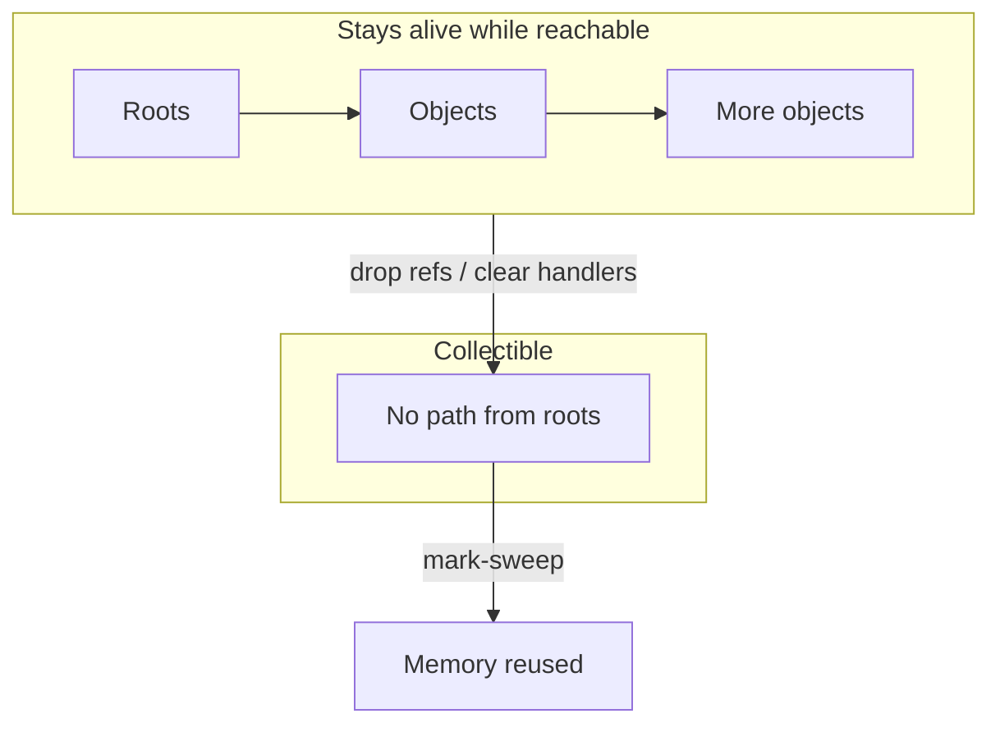

**One sentence:** Stack frames manage call locals; heap objects live until unreachable from roots; GC mark-and-sweep (with modern variants) finds them; leaks are almost always **forgotten references** — timers, listeners, caches, globals, and closures.

---

## 15. Strings, ropes, and hidden costs (practical)

Engines often optimize strings internally (sometimes rope-like concatenation). Still:

```ts
let s = ""
for (let i = 0; i < 1e5; i++) {
  s += i // may create many intermediate strings
}
```

Prefer array join for huge assembly:

```ts
const parts: string[] = []
for (let i = 0; i < 1e5; i++) parts.push(String(i))
const s = parts.join("")
```

Also: keeping a small `substring` of a huge string can historically retain the large parent in some engines — prefer copying when slicing large untrusted content if you must retain a tiny piece long-term (engine-dependent; know the issue exists).

---

## 16. Structured cloning and transfer

```ts
// Worker message — structured clone copies graph (CPU + memory spike)
worker.postMessage({ big: hugeArrayBuffer })

// Transfer ownership — no copy of the buffer; original becomes neutered
worker.postMessage(hugeArrayBuffer, [hugeArrayBuffer])
```

Transferable objects move memory between realms without duplicating the payload. Use when shipping large binary data to workers.

---

## 17. Memory in React-like UIs (pattern level)

Even without React specifics, UI frameworks share leak shapes:

1. **Subscriptions in effects** without cleanup
2. **Closures over props/state** in long-lived listeners
3. **Module-level stores** retaining old screen data after navigate
4. **Image / blob URLs** (`URL.createObjectURL`) not revoked

```ts
const url = URL.createObjectURL(blob)
img.src = url
// later
URL.revokeObjectURL(url)
```

Teardown symmetry is the theme again.

---

## 18. Retained size vs shallow size

In heap snapshots:

- **Shallow size** — memory for the object itself
- **Retained size** — memory that would be freed if this object were collected (itself + objects only reachable through it)

When hunting leaks, sort by **retained size**. A small object holding a huge graph is the usual villain.

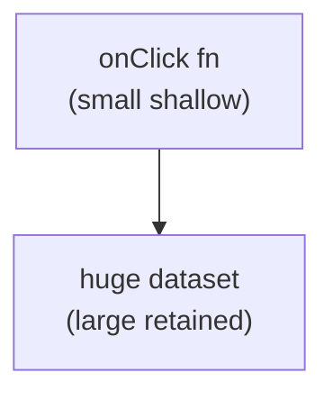

---

## Interview Questions

### Q1. Stack vs heap in JavaScript?
**Expected:** Stack holds call frames / locals; heap holds objects; variables often store references into the heap.  
**Common wrong:** “All JS values live only on the heap” / “primitives never touch the heap” as absolute laws.  
**Follow-ups:** What happens to heap objects when a function returns?

### Q2. How does JS garbage collection work at a high level?
**Expected:** Trace reachability from roots (mark) and reclaim unmarked objects (sweep); handles cycles unlike naive refcount.  
**Common wrong:** “JS uses only reference counting.”  
**Follow-ups:** Why are cycles a problem for refcount?

### Q3. What is a memory leak in a GC language?
**Expected:** Objects remain reachable unintentionally (forgotten references), so GC cannot free them; memory grows over time.  
**Common wrong:** “GC makes leaks impossible.”  
**Follow-ups:** Give three common browser leak sources.

### Q4. WeakMap vs Map?
**Expected:** WeakMap keys are weak — they do not prevent GC of the key object; no key iteration; for metadata keyed by objects.  
**Common wrong:** “WeakMap values are weak.”  
**Follow-ups:** Why can’t you iterate WeakMap keys?

### Q5. How do closures cause retention?
**Expected:** A reachable function keeps its lexical environment; variables in that environment stay alive even if unused by the function (engine-dependent optimizations exist but aren’t guarantees).  
**Common wrong:** “Closures copy values then free the scope.”  
**Follow-ups:** How to structure code to avoid retaining `huge`?

### Q6. How do you investigate a leak in Chrome?
**Expected:** Heap snapshots before/after actions; look for growing retained objects / detached DOM; allocation instrumentation.  
**Common wrong:** “console.log memory once.”  
**Follow-ups:** What does Detached HTMLElement indicate?

## Common Mistakes

- Believing GC eliminates the need to tear down listeners/timers.
- Growing `Map` caches with no eviction.
- Using `Map` instead of `WeakMap` for per-object metadata.
- Storing detached DOM nodes in arrays/globals.
- Accidental retention via module-level registries.
- Trusting FinalizationRegistry for app correctness.
- Confusing stack overflow with heap OOM.

## Trade-offs / Production Notes

- **Cache consciously** — measure hit rate vs retained size.
- Prefer **AbortSignal**-based listener/fetch lifetimes in UI code.
- In Node, watch **`process.memoryUsage()`** and heap snapshots under load; unbounded queues are classic server leaks.
- Optimize for **reachability clarity** first; micro-optimizing GC is rarely the first win.
- Related: [Closures](/javascript/05-closures), [Event Loop](/javascript/10-event-loop), [Async](/javascript/11-async) (AbortController), [Performance](/javascript/22-performance).
