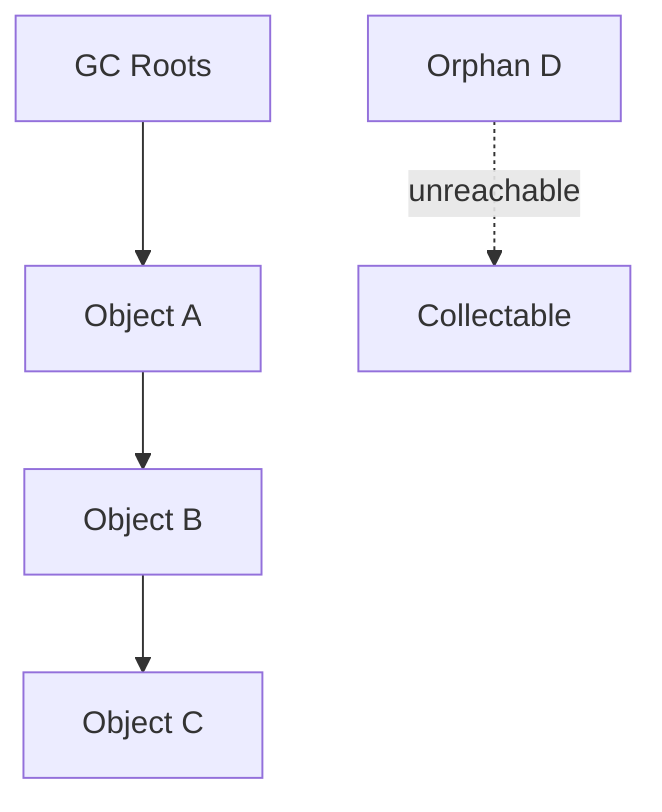

# Memory Management

JS is garbage-collected. Interviews: **reachability**, leak patterns, heap snapshots, and how closures/DOM/caches retain memory. Related: [Closures](/javascript/05-closures) · [Browser Memory & GC](/browser/07-memory-gc) · [V8](/node/07-v8).

---

## Reachability model

An object is alive if reachable from **roots** via references.

Roots include: call stack locals, global/module bindings, in-flight microtasks/tasks, DOM trees (browser), handles registered with the host.



Mark-sweep / generational / incremental collectors differ by engine; the **mental model for apps is reachability**, not manual free.

---

## Stack vs heap

| | Stack | Heap |
| --- | --- | --- |
| Stores | frames, primitives in slots, refs | objects, arrays, closures, large buffers |
| Lifetime | pop on return | until unreachable |
| Overflow | deep recursion | OOM / GC thrash |

```ts
function f() {
  const x = 1 // stack slot
  const o = { x } // object on heap; binding holds ref
  return o
}
```

---

## V8 GC sketch (interview level)


- **Young generation:** short-lived objects; cheap scavenges.  
- **Old generation:** long-lived; more expensive major GC.  
- **Hidden classes / shapes:** objects with stable property order optimize better — see [V8](/node/07-v8).

Promotion of accidentally long-lived objects (caches, closures) increases major GC cost.

---

## Common leak patterns

### 1. Global / module caches without bounds

```ts
const cache = new Map<string, ArrayBuffer>()
export function get(key: string, load: () => ArrayBuffer) {
  if (!cache.has(key)) cache.set(key, load())
  return cache.get(key)!
}
// grows forever — use LRU / TTL / WeakRef patterns
```

### 2. Closures retaining large graphs

```ts
function attach(button: HTMLButtonElement, huge: DataView) {
  button.addEventListener("click", () => {
    console.log(huge.byteLength)
  })
}
```

See [Closures — memory](/javascript/05-closures#memory--gc--when-closures-leak).

### 3. Detached DOM

Node removed from tree but retained by JS reference or listener → **detached HTMLElement** in heap snapshots.

```ts
let orphan: HTMLElement | null = document.getElementById("x")
orphan?.remove()
// orphan still references the node
orphan = null // now collectable (if no listeners)
```

### 4. Forgotten timers / observers

```ts
setInterval(() => poll(), 1000) // no clearInterval
new MutationObserver(() => {}).observe(el, { childList: true }) // no disconnect
new IntersectionObserver(() => {}).observe(el) // no unobserve/disconnect
```

### 5. Uncleared event listeners

```ts
window.addEventListener("resize", handler)
// SPA navigates away without removeEventListener / AbortController
```

### 6. Growing arrays / logs

```ts
const audit: string[] = []
export function log(m: string) {
  audit.push(m)
}
```

### 7. Closures in React with unstable deps

Effects that re-subscribe without cleanup; refs holding previous fiber props graphs — profile with React DevTools + memory tab.

### 8. Native buffers / Blobs

```ts
const buf = await res.arrayBuffer() // large
// keep only what you need; transfer to Worker when possible
```

Node: `Buffer` slices may retain parent pool — prefer `Buffer.from` copy when retaining long-term — [Buffers](/node/04-buffers).

---

## WeakRef, WeakMap, WeakSet

| Structure | Keys/targets | Collectable while held? |
| --- | --- | --- |
| `Map` | strong | no |
| `WeakMap` | object keys weak | key can be GC'd → entry goes |
| `WeakSet` | objects weak | yes |
| `WeakRef` | weak to target | yes; `deref()` may be `undefined` |
| `FinalizationRegistry` | cleanup callback | after GC (not guaranteed timing) |

```ts
const wm = new WeakMap<object, string>()
let obj: object | null = {}
wm.set(obj, "meta")
obj = null // entry can disappear

const ref = new WeakRef({ n: 1 })
ref.deref()?.n
```

**Use cases:** memoizing derived data per object without pinning it; DOM→metadata maps.

**Don't use for:** critical business caches that must exist; FinalizationRegistry for logic correctness (timing non-deterministic).

---

## Structured clone & transfer

```ts
const buf = new ArrayBuffer(1 << 20)
worker.postMessage(buf, [buf]) // transfer — neutered on sender
```

Transfers move ownership — reduces peak memory vs clone.

---

## Measuring memory

### Browser DevTools

1. Performance / Memory → Heap snapshot.  
2. Compare snapshots before/after action.  
3. Look for **Detached** nodes, growing retainer paths.  
4. Allocation instrumentation on timeline.

### Node

```bash
node --expose-gc --inspect app.js
```

```ts
import v8 from "node:v8"
v8.getHeapStatistics()
process.memoryUsage() // rss, heapUsed, external, arrayBuffers
```

```bash
node --max-old-space-size=4096 app.js
```

Clinic heapsnapshot / Chrome DevTools against `inspect` for production-like leaks.

---

## Retainer paths (how to read a snapshot)

Example: `Window` → listeners → closure → `HugeArray`.

Ask: **what GC root still points here?** Fix by cutting the edge (remove listener, clear Map entry, null module binding).

---

## Memory vs event loop

Queued tasks/microtasks retain closed-over state until they run. A huge backlog of promises retains arguments:

```ts
for (let i = 0; i < 1e6; i++) {
  Promise.resolve(bigObjects[i]).then((x) => use(x))
}
```

Backpressure matters — [Event Loop](/javascript/10-event-loop), [Streams](/node/03-streams).

---

## Immutability & retention

Persistent structures share structure (good) but keep old versions alive if referenced (undo stacks). Cap history depth.

```ts
const history: State[] = []
function push(s: State) {
  history.push(s)
  if (history.length > 50) history.shift()
}
```

---

## `Object.freeze` & GC

Freezing does not help GC. It prevents mutation only.

---

## Strings & ropes

Large concatenated strings / retained substrings (engine-dependent) can pin big parents. Avoid keeping tiny slices of huge strings long-term if profiling shows it.

---

## Interview Questions

**Q: How does JS GC know what to free?**  
Unreachable from roots — mark phase finds reachable set; rest reclaimed.

**Q: What is a memory leak in GC languages?**  
Unintended **reachability** — references you forgot to clear, not forgotten `free`.

**Q: WeakMap vs Map?**  
WeakMap keys are weak; don't prevent GC of the key; non-enumerable; keys must be objects.

**Q: How do you find a leak?**  
Reproduce → heap snapshots diff → inspect retainer path → cut reference.

**Q: Do closures always leak?**  
No — only if the function remains reachable and keeps a large environment alive.

**Q: `rss` vs `heapUsed`?**  
`rss` = process resident memory (includes native). `heapUsed` = V8 heap. Native addons/buffers can make rss ≫ heapUsed.

## Common Mistakes

- Blaming GC for leaks that are reference bugs.  
- Unbounded memoization.  
- SPA listeners without cleanup.  
- Using FinalizationRegistry for must-run dispose (use explicit `dispose` / `using` / AbortController).  
- Holding full request objects in long-lived caches.  
- Ignoring `external` / ArrayBuffer memory in Node metrics.

## Trade-offs / Production Notes

- **Caches:** every cache needs eviction (LRU, TTL, size). Redis for multi-process — [Redis](/backend/05-redis).  
- **Observability:** track `heapUsed` / container RSS / GC pause metrics in prod.  
- **Workers:** isolate heavy allocations; transfer ArrayBuffers.  
- **React:** list virtualization to avoid huge DOM; cleanup effects.  
- Prefer explicit lifecycle (`Disposable` / `AbortSignal`) over weak finalizers for resources (sockets, FDs).  
- Next soft skills: know when to say "I'd take a heap snapshot" in a system design discussion about FE memory.
