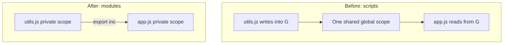
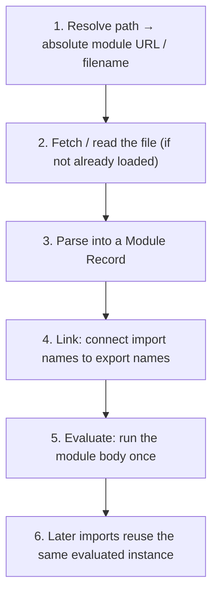
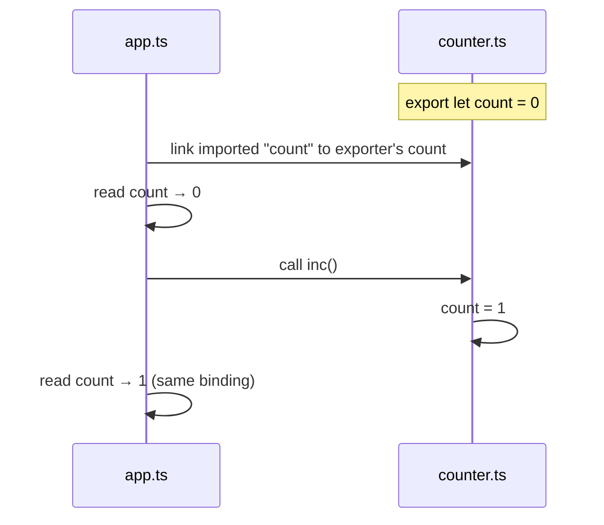
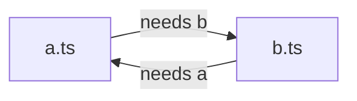

# Modules

This chapter teaches modules from scratch. You do not need to already know ESM, CommonJS, “live bindings,” or bundlers. By the end you should be able to explain **what a module is**, **how `import`/`export` work**, **why circular imports behave oddly**, and **how Node’s older `require` system differs**.

---

## 1. The problem modules solve

Imagine two script tags on a page:

```html
<script src="utils.js"></script>
<script src="app.js"></script>
```

```js
// utils.js
var count = 0
function inc() {
  count++
}

// app.js
inc()
console.log(count)
```

This works only because **everything shares one big global scope**. That causes real problems:

1. **Name collisions** — if another file also declares `var count`, they overwrite each other.
2. **Hidden dependencies** — `app.js` uses `inc` but never says “I depend on `utils.js`.” Load order is fragile.
3. **Hard to optimize** — tools cannot reliably tell which functions are unused.
4. **No privacy** — every `var`/`function` at the top level is public to the whole page.

A **module** is a file that:

- has its **own scope** (top-level variables are private to that file by default)
- **declares** what it needs (`import`) and what it shares (`export`)
- is evaluated **once**, then reused by whoever imports it



---

## 2. Two module systems you will meet

JavaScript ended up with **two** mainstream systems:

| System | Typical syntax | Where you see it |
| --- | --- | --- |
| **ESM** (ECMAScript Modules) | `import` / `export` | Browsers, modern Node, Vite, TypeScript |
| **CJS** (CommonJS) | `require` / `module.exports` | Older Node, many npm packages |

They are **not the same thing**. Think of them as two different ways to connect files. Interviews almost always ask you to compare them.

This chapter teaches **ESM first** (the language standard), then CommonJS, then how they interact.

---

## 3. Your first ESM module — step by step

### 3.1 Exporting: making something usable by other files

Create a file that **owns** a value and chooses to share it:

```ts
// math.ts

// Private to this file — other files cannot see `secret`
const secret = 42

// Named export: other files can import the name `add`
export function add(a: number, b: number) {
  return a + b
}

// Another named export
export const PI = 3.14159
```

What `export` means in plain language:

> “This binding (`add`, `PI`) exists in **this** file’s scope, and I am allowing other modules to **read** it by name.”

Things that are **not** exported stay private. That is encapsulation.

### 3.2 Importing: pulling a name from another file

```ts
// app.ts
import { add, PI } from "./math.js"

console.log(add(2, 3)) // 5
console.log(PI)
```

Read this left to right:

1. `import { add, PI }` — I want the bindings named `add` and `PI`
2. `from "./math.js"` — they come from the module at this path

The curly braces mean **named imports**. The names must match the exported names (unless you rename — covered below).

### 3.3 Renaming on import

If a name clashes, or you want a clearer local name:

```ts
import { add as sum } from "./math.js"
sum(1, 2)
```

`add` is still the export name in `math.ts`. Locally you call it `sum`.

### 3.4 Default export (one “main” export)

A module may also have **one** default export:

```ts
// greeter.ts
export default function greet(name: string) {
  return `Hello, ${name}`
}
```

```ts
// app.ts
import greet from "./greeter.js" // no curly braces
```

Important mental model:

- **Named exports**: many, imported with `{ name }`
- **Default export**: at most one, imported **without** `{}`

You can mix them:

```ts
// tools.ts
export default function main() {}
export const VERSION = "1.0.0"
```

```ts
import main, { VERSION } from "./tools.js"
```

> [!TIP]
> In libraries, **prefer named exports**. Defaults are easy to mis-import (`import x` vs `import { x }`) and harder for tooling to tree-shake through barrel files. Interviews like this opinion if you can justify it.

### 3.5 Import the whole module as a namespace

```ts
import * as MathNS from "./math.js"

MathNS.add(1, 2)
MathNS.PI
```

`MathNS` is an object-like **module namespace**. Useful when a file exports many things and you want a prefix.

---

## 4. Module scope vs script scope (critical)

In a classic script, top-level `var` becomes a browser global (`window.x`).

In a **module**:

```ts
// module file
const x = 1
function f() {}
// x and f are NOT put on window / globalThis
```

Also, modules are always in **strict mode**:

```ts
// In a module this throws (in a sloppy script it might create a global)
undeclared = 1 // ReferenceError
```

And top-level `this` is `undefined` in ESM (not `window`).

```ts
console.log(this) // undefined in an ES module
```

---

## 5. How the runtime actually loads a module

When you write `import ... from "./math.js"`, the engine does not “copy-paste” the file. It roughly does this:



Key consequences:

1. **A module runs once.** If `app.ts` and `api.ts` both import `./math.js`, `math.js` body does **not** run twice.
2. **Imports are hoisted** (linking happens before your module body runs). You can `import` at the top; the dependency is prepared first.
3. **Static structure**: normal `import` paths must be analyzable at parse time (not a random runtime string). Dynamic loading uses `import()` — later.

Minimal illustration of “runs once”:

```ts
// counter-module.ts
console.log("counter-module evaluated")
export let n = 0
export function bump() {
  n++
}

// a.ts
import { bump } from "./counter-module.js"
bump()

// b.ts
import { n } from "./counter-module.js"
console.log(n) // 1 — same module instance that a.ts already bumped
```

You will only see `"counter-module evaluated"` **once** for that graph.

---

## 6. Live bindings — the part most people misunderstand

### 6.1 Wrong intuition: “import copies the value”

People often think:

```ts
import { count } from "./counter.js"
// surely `count` is a snapshot number copied at import time?
```

In **ESM**, that is wrong for bindings.

### 6.2 Correct intuition: “import is a live window onto their variable”

```ts
// counter.ts
export let count = 0

export function inc() {
  count += 1 // mutates the binding inside counter.ts
}
```

```ts
// app.ts
import { count, inc } from "./counter.js"

console.log(count) // 0
inc()
console.log(count) // 1  ← you see the new value
```

What happened:

- `count` in `app.ts` is **not a separate copy**.
- It is a **read-only live binding** connected to `count` inside `counter.ts`.
- When `inc()` changes `count` over there, your import sees it.
- You **cannot** assign to the imported name from `app.ts`:

```ts
count = 10 // SyntaxError (imported binding is not assignable)
```

The exporter can reassign; the importer can only read (or call functions that reassign).



### 6.3 Objects vs bindings (don’t confuse them)

```ts
// state.ts
export const user = { name: "Ada" }
```

```ts
import { user } from "./state.js"

user.name = "Grace" // allowed — you mutated the object
// user = {}        // not allowed — rebinding the import
```

- Replacing the **binding** (`user = ...`) is forbidden for the importer.
- Mutating the **object** the binding points to is allowed (same as any shared reference).

---

## 7. Circular dependencies (A imports B imports A)

### 7.1 What “circular” means

```ts
// a.ts
import { b } from "./b.js"
export const a = "A"
console.log("in a, b =", b)

// b.ts
import { a } from "./a.js"
export const b = "B"
console.log("in b, a =", a)
```



This is legal in ESM, but **dangerous** if you read values at the top level while the cycle is still evaluating.

### 7.2 What happens, in slow motion

Module evaluation is roughly: **start loading dependencies first**, then run bodies. With a cycle, one module is still unfinished when the other starts reading it.

A typical outcome:

1. Start evaluating `a.ts`
2. `a.ts` needs `b.ts` → start evaluating `b.ts`
3. `b.ts` needs `a.ts` → but `a.ts` has not finished yet, so `a` may still be in the temporal dead zone / uninitialized → often `undefined` when logged at top level
4. `b.ts` finishes, exports `b`
5. `a.ts` continues and can now see `b`

So one of these logs may print `undefined`. That is not a random bug — it is **partial initialization**.

### 7.3 How to fix cycles in practice

**Option A — don’t read sibling exports at top level; use functions:**

```ts
// a.ts
import { getB } from "./b.js"
export function getA() {
  return "A"
}
export function print() {
  console.log(getB()) // safe: called later, after both evaluated
}

// b.ts
import { getA } from "./a.js"
export function getB() {
  return "B + " + getA()
}
```

**Option B — extract shared state into a third module** both import (breaks the cycle).

**Interview line:** Cycles are allowed; top-level reads across a cycle can see incomplete exports; defer access into functions or remove the cycle.

---

## 8. Dynamic `import()` — loading later, not at parse time

Normal `import` is **static**: must be written in a fixed form so tools know the graph ahead of time.

Sometimes you want to load a module **only when needed** (slow page route, optional feature, language pack):

```ts
button.addEventListener("click", async () => {
  const mod = await import("./heavy-chart.js")
  mod.renderChart()
})
```

What to know:

1. `import("./heavy-chart.js")` returns a **Promise**.
2. When it resolves, you get the **module namespace** (`default` + named exports as properties).
3. First call evaluates the module; later calls reuse it (still once).
4. This is the foundation of **code splitting** in bundlers (separate network chunk).

```ts
const { default: Chart, VERSION } = await import("./heavy-chart.js")
```

> [!WARNING]
> Avoid `import(\`./plugins/${userInput}.js\`)` with unsanitized input. That can load arbitrary code (security bug). Keep dynamic paths constrained to a known allowlist.

---

## 9. `import.meta` — data about *this* module

```ts
import.meta.url
```

This is the full URL of the current module file (e.g. `file:///.../app.js` or `https://example.com/app.js`).

Useful when you need to resolve a sibling asset relative to the current file:

```ts
const url = new URL("./worker.js", import.meta.url)
```

In Vite you will also see **non-standard** fields injected at build time:

```ts
import.meta.env.DEV
import.meta.hot
```

Those are bundler features, not core JavaScript language.

---

## 10. CommonJS (Node’s older system) from scratch

Before ESM was widely supported in Node, Node used **CommonJS**.

### 10.1 Exporting with `module.exports`

```js
// math.cjs
function add(a, b) {
  return a + b
}

const PI = 3.14

// Put an object on module.exports — that object is what others receive
module.exports = {
  add,
  PI,
}
```

You may also see:

```js
exports.add = add
exports.PI = PI
```

`exports` is initially an alias for `module.exports`. If you **replace** `module.exports = ...` entirely, later `exports.foo =` assignments on the old object are easy to get wrong — prefer one style consistently.

### 10.2 Importing with `require`

```js
// app.cjs
const math = require("./math.cjs")

math.add(2, 3)
math.PI
```

`require` is a **function call**:

1. Resolve the path
2. If not in cache, load and evaluate the file
3. Return `module.exports`
4. Cache the result by resolved filename

So `require` is **synchronous** and returns a **plain object** (whatever was assigned to `module.exports`).

### 10.3 ESM live bindings vs CJS returned object

| | ESM `import` | CJS `require` |
| --- | --- | --- |
| When load runs | Linking graph, then evaluate | Sync call at that line |
| What you get | Live bindings to exported names | The exports **object** value |
| Updates to exporter’s `let` | Visible through the binding | Not “live” like ESM; you hold the object reference returned |
| Top-level await | Yes in ESM | No |

```js
// CJS: you typically mutate the exports object if you need shared mutable state
// counter.cjs
module.exports = { count: 0, inc() { module.exports.count++ } }
```

```js
const c = require("./counter.cjs")
c.inc()
console.log(c.count) // 1 — same object reference
```

That is **shared object reference**, which feels similar to live updates but is a different mechanism than ESM’s binding model.

### 10.4 Helpers CJS gives you (ESM does not)

In CommonJS files, Node provides:

- `__filename` — absolute path of current file
- `__dirname` — directory of current file
- `require`, `module`, `exports`

In ESM you build them yourself:

```ts
import { fileURLToPath } from "node:url"
import { dirname } from "node:path"

const __filename = fileURLToPath(import.meta.url)
const __dirname = dirname(__filename)
```

### 10.5 How Node decides ESM vs CJS

Rough rules (Node):

- `"type": "module"` in `package.json` → `.js` files treated as ESM
- `"type": "commonjs"` (default) → `.js` treated as CJS
- `.mjs` → always ESM
- `.cjs` → always CJS

---

## 11. Using ESM and CJS together (interop)

This is a frequent interview / production pain point.

### 11.1 ESM importing a CJS package

Often works:

```ts
import fs from "node:fs"           // depending on the package shape
import pkg from "some-cjs-lib"
import { named } from "some-cjs-lib" // sometimes synthesized from exports
```

Node may expose `module.exports` as the **default** import. Named imports from CJS depend on static analysis of that exports object — it can be surprising.

### 11.2 CJS requiring an ESM module

**Usually fails** for pure ESM:

```js
// inside a .cjs file
const mod = require("./esm-only.mjs") // Error in many cases
```

Why: ESM can use top-level `await` and live bindings; `require` is sync and expects a finished `module.exports` object.

**Fix from CJS:** use dynamic import (async):

```js
async function main() {
  const mod = await import("./esm-only.mjs")
  mod.hello()
}
main()
```

### 11.3 Dual packages

Some libraries ship **both** ESM and CJS entry points (`package.json` `"exports"` with `"import"` / `"require"` conditions). That is convenient but can cause the infamous **“two copies of React”** problem if different parts of the app resolve different builds of the same library.

**Practical advice:** prefer ESM-first for new code; understand the package’s export map before debugging “invalid hook call” / duplicate singleton bugs.

---

## 12. Bundlers (Vite/webpack) vs native browser ESM

### Native ESM in the browser

```html
<script type="module" src="/app.js"></script>
```

```ts
// app.js
import { add } from "./math.js" // note: browsers usually need the full specifier including .js
```

The browser fetches each module over the network. Many small files can mean many requests (HTTP/2 helps; huge unbundled graphs can still hurt).

### Bundlers

Tools like Vite/esbuild/webpack:

1. Start from an entry file
2. Follow the static `import` graph
3. Emit fewer **chunks** of JS for production
4. Optionally split at `import()` boundaries


### Tree-shaking (dead code elimination)

If you write:

```ts
import { add } from "./math.js"
// never import multiply
```

a bundler may drop `multiply` **if** it can prove `math.js` has no side effects.

Things that defeat tree-shaking:

- Top-level code with side effects (`console.log`, polyfilling `window`, …) in files you import
- Barrel files that re-export everything (`export * from ...`) pulling large graphs
- Dynamic access patterns tools cannot analyze

```json
// package.json hint used by webpack/Vite ecosystems
{
  "sideEffects": false
}
```

Meaning: “you may assume files in this package are safe to drop if unused” (unless listed otherwise).

---

## 13. Side effects at module top level

Anything at the top level of a module runs **when that module is first evaluated**:

```ts
// analytics.ts
track("analytics module loaded") // runs on first import — maybe unwanted

export function pageView() {}
```

Prefer explicit functions:

```ts
export function initAnalytics() {
  track("analytics module loaded")
}
```

In SSR frameworks (Next.js, etc.), module top-level code may run on the **server and the client**. Browser-only APIs (`window`, `document`) at top level will crash SSR — put them inside `useEffect` / `init()` after you know you are in the browser. Related: [Next.js RSC](/nextjs/02-rsc).

---

## 14. TypeScript-only: `import type`

```ts
import type { User } from "./types"
```

This import exists **only for the type checker**. It is erased when compiling to JS — no runtime module load for that line.

Use it when you need a type but do not want to pull a runtime dependency (or when `verbatimModuleSyntax` requires explicit type imports).

Path aliases like `@/components/...` are **not** native JS. TypeScript understands them via `tsconfig` paths; the **bundler** must also be configured to resolve them.

More: [TypeScript module resolution](/typescript/07-module-resolution).

---

## 15. Worked example — put it together

```ts
// config.ts
export const API_URL = "/api"

// client.ts
import { API_URL } from "./config.js"

export async function getUser(id: string) {
  const res = await fetch(`${API_URL}/users/${id}`)
  return res.json()
}

// app.ts
import { getUser } from "./client.js"

const user = await getUser("1") // top-level await is allowed in ESM
console.log(user)
```

Evaluation order:

1. Load `app.ts`
2. See dependency `client.ts` → load it
3. `client.ts` depends on `config.ts` → load & evaluate `config.ts`
4. Evaluate `client.ts`
5. Evaluate `app.ts` (including top-level await)

---

## Interview Questions

### Q1. What is a JavaScript module, in one sentence?
**Expected:** A file with its own scope that explicitly exports bindings and imports dependencies, evaluated once per resolved module.  
**Common wrong:** “Any `.js` file” (scripts are not modules unless treated as such).  
**Follow-ups:** How do browsers mark a script as a module? (`type="module"`)

### Q2. Difference between ESM and CommonJS?
**Expected:** ESM uses static `import`/`export` with live bindings and browser support; CJS uses sync `require` returning `module.exports`, historically Node-only.  
**Common wrong:** “They are identical syntax sugar.”  
**Follow-ups:** Can CJS `require` an ESM file? (Usually no — use `import()`.)

### Q3. What is a live binding?
**Expected:** An imported name reads the exporter’s binding; updates in the exporter are visible; the importer cannot reassign that name.  
**Common wrong:** “Import always copies the primitive once.”  
**Follow-ups:** Can the importer mutate an imported object’s properties? (Yes.)

### Q4. Why can circular imports print `undefined`?
**Expected:** One module is read before it finished evaluating, so its exports are not initialized yet.  
**Common wrong:** “JavaScript forbids cycles.”  
**Follow-ups:** How do you fix it? (Defer reads into functions; extract shared module.)

### Q5. When should you use dynamic `import()`?
**Expected:** Lazy-load heavy/rare code paths for smaller initial bundles; optional features.  
**Common wrong:** “Use it for every function for ‘performance’.”  
**Follow-ups:** Security risk of user-controlled specifiers?

### Q6. Why do people prefer named exports over default?
**Expected:** Clearer names, better refactor/tooling, more reliable tree-shaking through re-exports.  
**Common wrong:** “Default is always best for DX.”  

## Common Mistakes

- Writing `import x from "./mod"` when `x` was a **named** export (or the reverse).
- Forgetting that browsers/Node ESM often need the **`.js` extension** in relative paths.
- Assuming `require()` works on pure ESM.
- Reading values at top level across a circular dependency.
- Putting `window` / `document` at module top level in code that also runs on the server.
- Believing `import { count }` copied a number forever (missing live bindings).
- Using open-ended dynamic import paths with user input.

## Trade-offs / Production Notes

- **ESM-first** for new apps and libraries; document CJS support explicitly if you publish dual packages.
- Keep modules **side-effect free** when possible so bundlers can tree-shake.
- Native unbundled ESM can mean many requests — bundling is still useful for production.
- Package `"exports"` maps protect internals but change how deep imports work — read them when debugging resolution.
- Related: [Event Loop](/javascript/10-event-loop), [Async](/javascript/11-async), [TypeScript modules](/typescript/07-module-resolution), [Next caching](/nextjs/10-caching).
