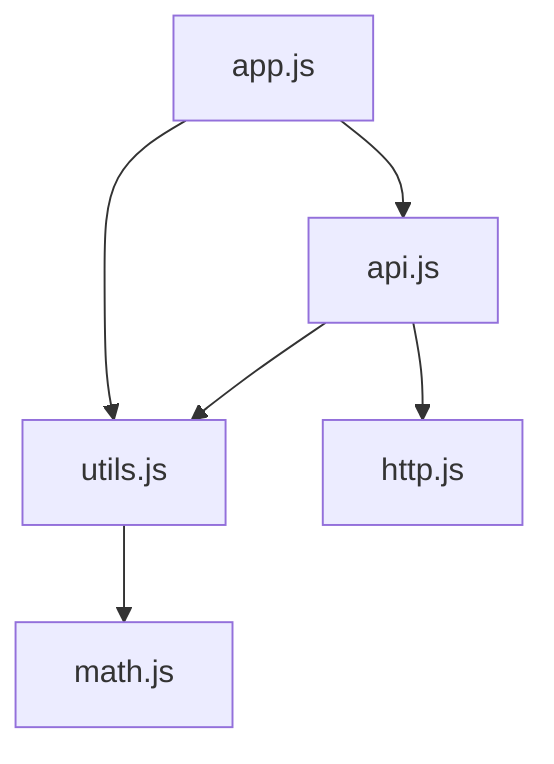
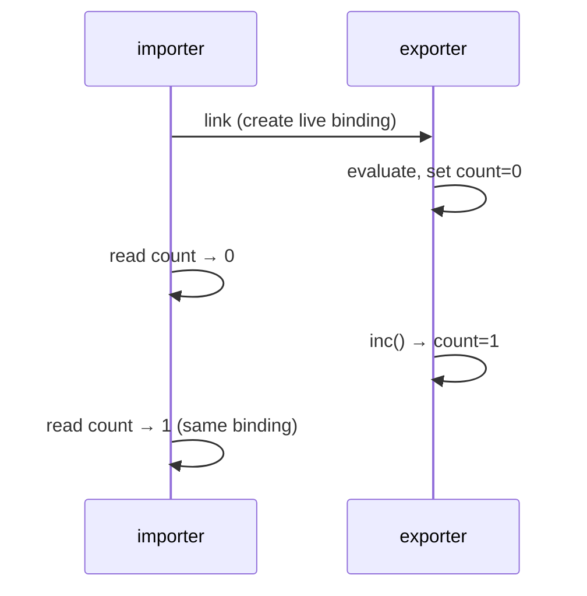
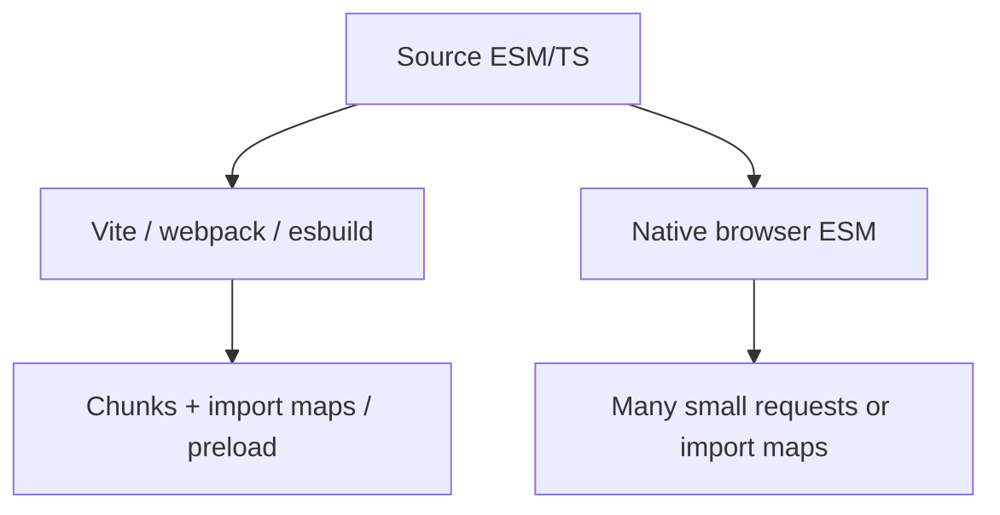

# Modules

ESM vs CJS, live bindings, circular deps, and how bundlers / browsers actually load code — interview staple for senior FE and Node roles.

## Why modules exist

Scripts without modules share one global scope → naming collisions, unpredictable load order, no tree-shaking. Modules give:

- Explicit dependency graph
- Encapsulated scope (top-level `var`/`let`/`const`/`function` are module-local)
- Static structure analyzers can use (for bundling / dead-code elimination)
- Distinct evaluation timing (once per module URL / resolved specifier)



## ESM essentials

```ts
// math.ts
export const PI = 3.14159
export function add(a: number, b: number) {
  return a + b
}
export default class Calculator {
  add = add
}

// app.ts
import calc, { PI, add as sum } from "./math.js"
import * as MathNS from "./math.js"
```

Rules interviewers expect:

| Rule | Detail |
| --- | --- |
| Strict mode | Always — no silent `this` → global |
| Top-level `await` | Allowed in ESM (delays module evaluation) |
| `this` at top level | `undefined` |
| Extension | Browsers need full specifier incl. `.js`; Node ESM often too |
| Dual package | `"type": "module"` or `.mjs` |

### Named vs default

Default is syntactic sugar for a binding named `default`. Prefer **named exports** in libraries — better tree-shaking, rename-friendly refactors, no "was default a function or object?" ambiguity.

```ts
// Prefer
export function createClient() { /* ... */ }

// Avoid as the only public API when you have many exports
export default { createClient }
```

## Live bindings (not copies)

ESM imports are **live read-only bindings** to the exporter's local binding — not snapshots.

```ts
// counter.ts
export let count = 0
export function inc() {
  count += 1
}

// consumer.ts
import { count, inc } from "./counter.js"
console.log(count) // 0
inc()
console.log(count) // 1  ← live
// count = 5            // SyntaxError: Assignment to constant binding
```

CJS `require` returns a **copied exports object snapshot** (mutable object, but values already assigned at require time for that evaluation).



## Evaluation order & circular dependencies

Modules evaluate depth-first, post-order-ish: dependencies first, then body. Circular graphs get **partially initialized** exports.

```ts
// a.ts
import { b } from "./b.js"
export const a = "A"
console.log("a sees b =", b) // may be undefined if cycle

// b.ts
import { a } from "./a.js"
export const b = "B"
console.log("b sees a =", a) // often undefined in cycle
```


**Interview answer:** Cycles are legal; use functions that run after both modules finish evaluating, or refactor shared state into a third module. Avoid reading sibling exports at top level in a cycle.

## Dynamic `import()`

```ts
const mod = await import(`./locales/${locale}.js`) // path must be constrained!
const { heavy } = await import("./heavy.js")
```

Returns a Promise of the module namespace object. Use for route-based splitting, conditional polyfills, plugin loading.

Security: never interpolate unsanitized user input into the specifier (arbitrary module execution).

## `import.meta`

```ts
import.meta.url          // file:// or https:// URL of current module
import.meta.resolve?.("./x.js") // relative resolution (where supported)
```

In Vite/bundlers: `import.meta.env`, `import.meta.hot` — build-time injected, not standard JS.

## CommonJS (Node classic)

```js
// math.cjs
const PI = 3.14
function add(a, b) { return a + b }
module.exports = { PI, add }
// or exports.add = add

// app.cjs
const math = require("./math.cjs")
```

Characteristics:

- Synchronous load/evaluate
- `module.exports` is a mutable object
- `require` cache keyed by resolved filename
- No static `import` analysis → harder tree-shaking
- `__filename`, `__dirname`, `require`, `module`, `exports` injected

```ts
// ESM equivalents
import { fileURLToPath } from "node:url"
import { dirname } from "node:path"
const __filename = fileURLToPath(import.meta.url)
const __dirname = dirname(__filename)
```

## Interop ESM ↔ CJS

| Direction | Typical behavior |
| --- | --- |
| ESM `import` CJS | Default import often = `module.exports`; named imports may be synthesized |
| CJS `require` ESM | **Fails** for pure ESM (async graph / live bindings) — use dynamic `import()` |

Node `"exports"` map + `"module"` / `"import"` / `"require"` conditions control dual packages. Dual publishing is a footgun (two copies of React problem) — prefer ESM-first with clear CJS wrapper if needed.

## Bundlers vs native ESM



Interview talking points:

- Bundlers rewrite `import` to chunk IDs, hoist CSS, inject HMR
- Tree-shaking needs side-effect-free modules (`"sideEffects": false` in package.json)
- `/*#__PURE__*/` annotations help drop unused calls
- Barrel files (`index.ts` re-exports everything) often defeat tree-shaking

## Side effects & initialization

```ts
// bad: runs on import even if unused
console.log("init")
window.__APP__ = true

// better: explicit init()
export function init() { /* ... */ }
```

Top-level code runs once on first evaluation. In SSR + CSR dual evaluation, beware double init and browser-only APIs at module scope — see [Next.js / RSC](/nextjs/02-rsc).

## TypeScript module notes

```ts
import type { User } from "./types" // erased — no runtime
export type { User }
```

`verbatimModuleSyntax` / `importsNotUsedAsValues` force explicit `import type`. Path aliases (`@/`) are compile-time only unless the bundler/runtime resolves them.

## Interview Questions

**Q: Difference between ESM and CJS?**  
ESM: static structure, live bindings, async-capable, browser-native. CJS: sync `require`, exports object copy/cache, Node-legacy. Interop is asymmetric.

**Q: What is a live binding?**  
Importer's binding reads the exporter's local variable; updates are visible; reassignment from importer is illegal.

**Q: How do circular dependencies work?**  
Partial exports during evaluation; one side may see `undefined`. Defer reads into functions or break the cycle.

**Q: Why can barrel files hurt performance?**  
They pull large graphs into a chunk and block tree-shaking; prefer deep imports or bundler-optimized package exports.

**Q: When use dynamic `import()`?**  
Code-split rarely used routes/features; load locale packs; optional heavy deps. Not for every function call (overhead + waterfall).

**Q: Does `export default` tree-shake well?**  
Worse than named when re-exported through barrels; named + `sideEffects` metadata is clearer for tooling.

## Common Mistakes

- Mixing default/named incorrectly (`import x from` vs `import { x }`).
- Assuming CJS `require` of ESM works.
- Reading circular exports at top level.
- Putting browser APIs at module top level in universal bundles.
- Forgetting `.js` extensions in NodeNext / native ESM.
- Mutating imported bindings.
- Using string-dynamic paths that prevent static analysis and enable supply-chain attacks.

## Trade-offs / Production Notes

- **ESM-first** for new libraries; document CJS story explicitly.
- Keep modules **side-effect free** when possible; isolate polyfills.
- Package `"exports"` prevent deep imports of internals — good for semver, bad for accidental tight coupling (intentional).
- Measure: too many tiny ESM requests without bundling/HTTP2 can hurt mobile TTI; bundling isn't obsolete.
- Related: [Event Loop](/javascript/10-event-loop), [Async](/javascript/11-async), [TypeScript module resolution](/typescript/07-module-resolution), [Next caching](/nextjs/10-caching).
