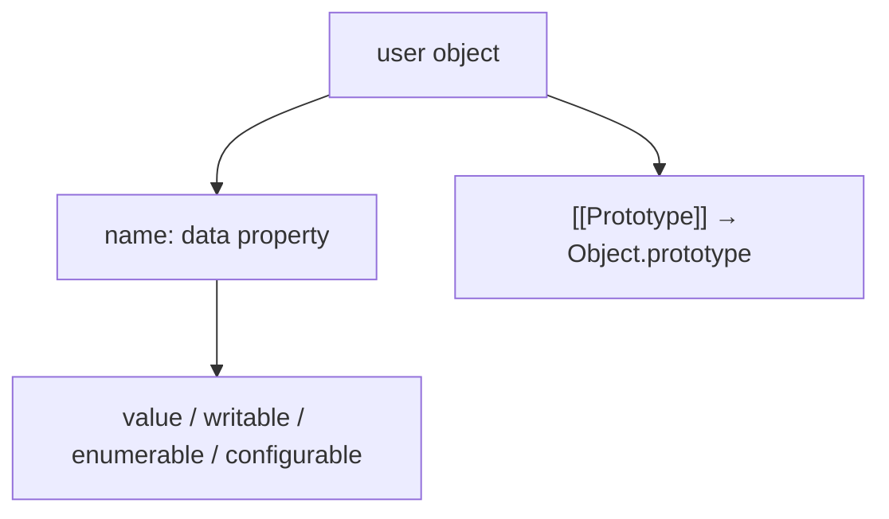
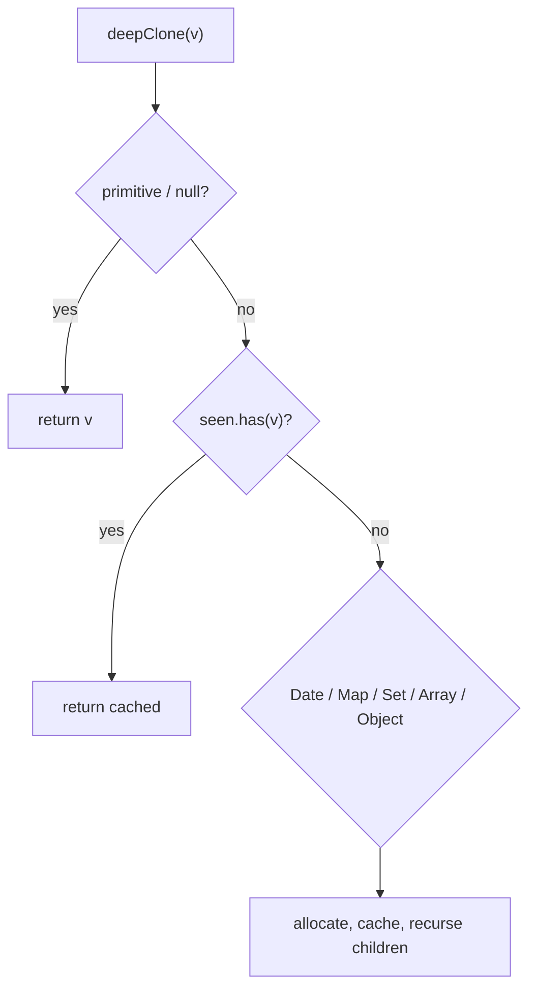

# Objects

Property descriptors, prototypes (brief), immutability (`freeze` / `seal` / `preventExtensions`), and deep clone — what seniors implement on whiteboards.

## Object model in one glance

An ordinary object is a collection of **properties**, each with a **descriptor**, plus an internal `[[Prototype]]` link.

```ts
const user = { name: "Ada" }
Object.getOwnPropertyDescriptor(user, "name")
// { value: "Ada", writable: true, enumerable: true, configurable: true }
```



## Data vs accessor descriptors

```ts
const person: { first: string; last: string; fullName?: string } = {
  first: "Grace",
  last: "Hopper",
}

Object.defineProperty(person, "fullName", {
  get() {
    return `${this.first} ${this.last}`
  },
  set(v: string) {
    const [first, ...rest] = v.split(" ")
    this.first = first
    this.last = rest.join(" ")
  },
  enumerable: true,
  configurable: true,
})
```

| Field | Data property | Accessor |
| --- | --- | --- |
| `value` | ✓ | — |
| `writable` | ✓ | — |
| `get` / `set` | — | ✓ |
| `enumerable` | both | both |
| `configurable` | both | both |

Cannot mix `value`/`writable` with `get`/`set` on the same define call.

### Defaults when using `defineProperty`

If you omit flags, they default to **`false`** (unlike object literals where they default to `true`):

```ts
Object.defineProperty({}, "x", { value: 1 })
// writable: false, enumerable: false, configurable: false
```

## `enumerable` / `configurable` / `writable` effects

```ts
const o: Record<string, unknown> = {}
Object.defineProperty(o, "hidden", {
  value: 42,
  enumerable: false,
  writable: true,
  configurable: true,
})

Object.keys(o)                    // []
for (const k in o) { /* skips hidden */ }
JSON.stringify(o)                 // "{}"  — non-enumerable skipped
({ ...o })                        // {}    — spread uses enumerable own
Object.assign({}, o)              // {}
```

`configurable: false` locks the descriptor shape (can't delete; limited redefines). `writable: false` makes assignment fail in strict mode.

## Property key kinds

```ts
const sym = Symbol("id")
const o = {
  a: 1,
  [sym]: 2,
  10: "n",
}

Object.keys(o)                  // string keys that are enumerable ("10","a") — order: integer-index then creation
Object.getOwnPropertyNames(o)   // includes non-enumerable strings
Object.getOwnPropertySymbols(o) // [sym]
Reflect.ownKeys(o)              // names + symbols
```

## Prototype lookup vs own properties

```ts
const proto = { x: 1 }
const child = Object.create(proto)
child.y = 2

child.x           // 1 (inherited)
Object.hasOwn(child, "x") // false
"x" in child      // true (includes prototype)
```

Assignment usually sets an **own** data property (unless an inherited accessor setter exists). See [Prototype Chain](/javascript/07-prototype).

## `Object.create` / `Object.assign` / spread

```ts
const base = { role: "user" as const }
const u = Object.create(base, {
  id: { value: 1, enumerable: true, writable: true, configurable: true },
})

const merged = Object.assign({}, base, { name: "Ada" })
const merged2 = { ...base, name: "Ada" } // shallow; ignores symbols unless well-known handling
```

`Object.assign` and spread copy **enumerable own** properties (spread also invokes getters). Nested objects remain shared references.

## Immutability APIs (shallow)

```ts
const cfg = { host: "api", nested: { retries: 3 } }

Object.preventExtensions(cfg) // can't add keys
Object.seal(cfg)              // preventExtensions + configurable:false on existing
Object.freeze(cfg)            // seal + writable:false on data props

cfg.nested.retries = 5        // still mutates! shallow only
```

| API | Add props | Delete | Reconfigure | Change values |
| --- | --- | --- | --- | --- |
| preventExtensions | ✗ | ✓* | ✓* | ✓ |
| seal | ✗ | ✗ | ✗ | ✓ |
| freeze | ✗ | ✗ | ✗ | ✗ (data) |

\*subject to existing configurability.

```ts
Object.isExtensible(cfg)
Object.isSealed(cfg)
Object.isFrozen(cfg)
```

Deep freeze:

```ts
function deepFreeze<T extends object>(obj: T): T {
  const props = Reflect.ownKeys(obj)
  for (const key of props) {
    const value = (obj as Record<PropertyKey, unknown>)[key]
    if (value && typeof value === "object") deepFreeze(value)
  }
  return Object.freeze(obj)
}
```

Caveats: cycles need a `WeakSet`; doesn't freeze closures inside methods; breaks libraries that mutate configs.

## Deep clone implementation

Interviewers want you to discuss **JSON**, **`structuredClone`**, and a **hand-rolled** recursive clone — and when each fails.

### Option A — `structuredClone` (prefer in modern runtimes)

```ts
const copy = structuredClone({
  d: new Date(),
  m: new Map([["a", 1]]),
  s: new Set([1, 2]),
  buf: new Uint8Array([1, 2]),
  n: 1n,
})
```

Fails on functions, DOM nodes, prototypes custom class instances (become plain objects / throw depending), and some host objects.

### Option B — JSON (lossy)

```ts
JSON.parse(JSON.stringify(obj))
// drops undefined, functions, symbols; Date → string; NaN/Infinity → null
```

### Option C — Hand-rolled (classic interview)

```ts
function deepClone<T>(value: T, seen = new WeakMap<object, unknown>()): T {
  if (value === null || typeof value !== "object") return value

  if (typeof value === "function") {
    throw new Error("Cannot clone functions")
  }

  const obj = value as object
  if (seen.has(obj)) return seen.get(obj) as T

  if (value instanceof Date) return new Date(value) as T
  if (value instanceof RegExp) return new RegExp(value.source, value.flags) as T

  if (value instanceof Map) {
    const out = new Map()
    seen.set(obj, out)
    value.forEach((v, k) => out.set(deepClone(k, seen), deepClone(v, seen)))
    return out as T
  }

  if (value instanceof Set) {
    const out = new Set()
    seen.set(obj, out)
    value.forEach((v) => out.add(deepClone(v, seen)))
    return out as T
  }

  if (ArrayBuffer.isView(value)) {
    // TypedArray / DataView — copy underlying buffer slice
    return new (value.constructor as { new (buf: ArrayBufferLike): T })(
      value.buffer.slice(value.byteOffset, value.byteOffset + value.byteLength),
    )
  }

  if (Array.isArray(value)) {
    const out: unknown[] = []
    seen.set(obj, out)
    for (let i = 0; i < value.length; i++) out[i] = deepClone(value[i], seen)
    return out as T
  }

  // Plain object — preserve descriptor-ish via define (simplified: values only)
  const proto = Object.getPrototypeOf(value)
  const out = Object.create(proto)
  seen.set(obj, out)
  for (const key of Reflect.ownKeys(value)) {
    const desc = Object.getOwnPropertyDescriptor(value, key)!
    if ("value" in desc) {
      Object.defineProperty(out, key, {
        ...desc,
        value: deepClone(desc.value, seen),
      })
    } else {
      // accessors: copy descriptor as-is (shared getters) or throw — state choice
      Object.defineProperty(out, key, desc)
    }
  }
  return out as T
}
```



**Talk track:** mention `WeakMap` for cycles, typed arrays, prototype preservation policy, and that production often uses `structuredClone` or Immer for immutable updates instead of general deep clone.

## `Object` static helpers worth memorizing

```ts
Object.keys / values / entries
Object.fromEntries
Object.hasOwn          // preferred over hasOwnProperty.call
Object.getPrototypeOf / setPrototypeOf  // setPrototypeOf is slow / discouraged
Object.groupBy         // modern grouping
```

## Interview Questions

**Q: Difference between `freeze`, `seal`, `preventExtensions`?**  
Freeze: no add/delete/reconfigure/value change. Seal: no add/delete/reconfigure, values mutable. preventExtensions: no add only.

**Q: Why is `Object.freeze` insufficient for Redux-style immutability?**  
Shallow; nested refs still mutate. Need deep freeze, structural sharing, or immutable libs.

**Q: `for…in` vs `Object.keys`?**  
`for…in` walks enumerable props including inherited. `Object.keys` — own enumerable strings only.

**Q: How do you deep clone with cycles?**  
Track originals → clones in a `WeakMap`; on revisit return the mapped clone.

**Q: What does non-configurable mean?**  
Can't delete property; can't change configurable/enumerable (and writable only false→false direction for data props); accessors locked.

**Q: Spread vs `Object.assign`?**  
Both shallow. Spread is expression syntax; triggers getters; doesn't copy prototype. Assign can target an existing object.

## Common Mistakes

- Expecting `freeze` to deep-freeze.
- Using `JSON` clone and losing `Date` / `undefined` / `Map`.
- Forgetting `WeakMap` → infinite recursion on cycles.
- Cloning class instances into plain objects and wondering why methods/`instanceof` break.
- Checking ownership with `obj.hasOwnProperty` without `.call` (shadowed method) — use `Object.hasOwn`.
- Assuming `__proto__` is a normal key (legacy accessor on `Object.prototype`).

## Trade-offs / Production Notes

- Prefer **immutable update patterns** (copy-on-write) over deep-cloning large graphs every render.
- Config objects: freeze in production builds to catch accidental mutation early.
- Don't `Object.setPrototypeOf` in hot paths — deopts.
- Security: merging user JSON into objects (`__proto__` / `constructor.prototype`) → prototype pollution; use `Object.create(null)` or null-prototype merges.
- Related: [Fundamentals](/javascript/01-fundamentals), [Prototype](/javascript/07-prototype), [Machine Coding](/javascript/23-machine-coding), [Memory](/javascript/12-memory).
