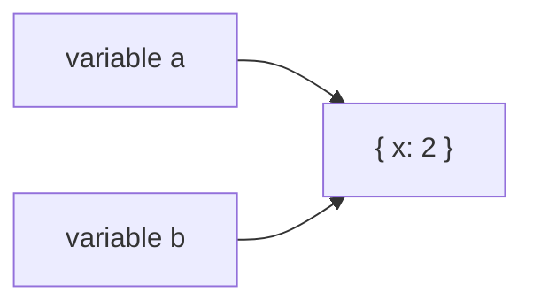
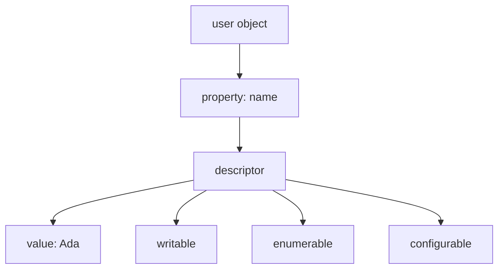
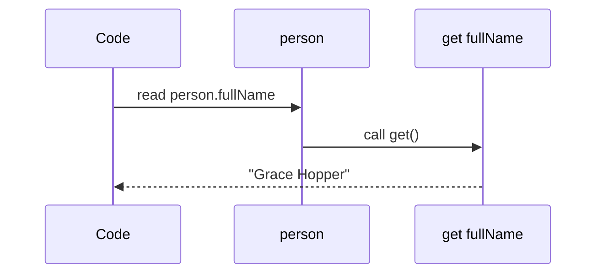
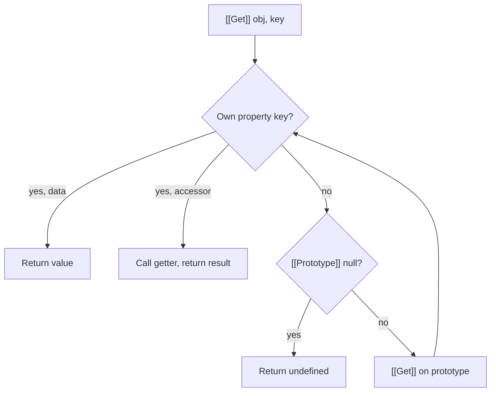
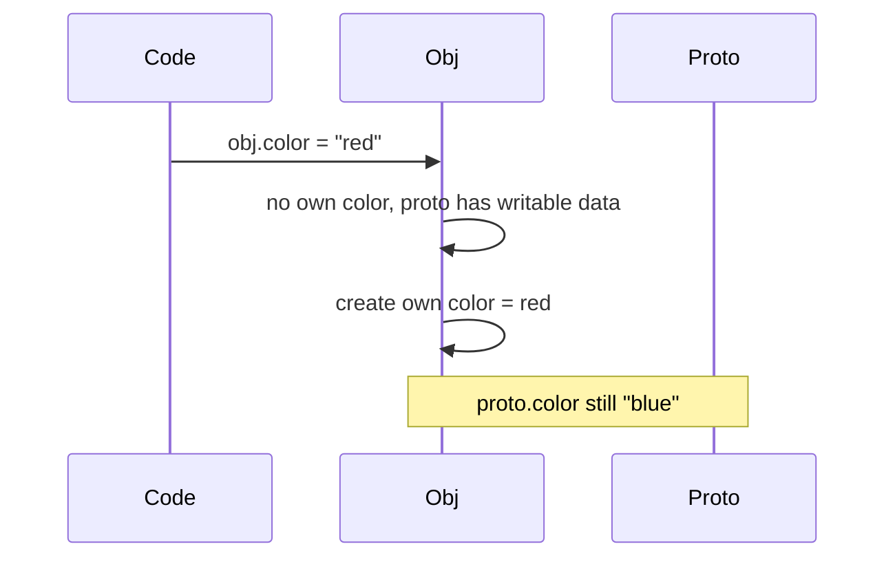
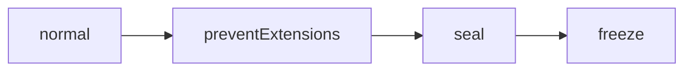
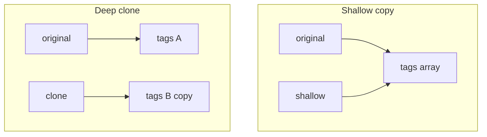

# Objects

This chapter teaches JavaScript objects from scratch. You do not need to already know property descriptors, `[[Get]]`/`[[Set]]`, or `Object.freeze`. By the end you should be able to explain **what a property really is**, **how reading and writing work under the hood**, **what freeze/seal/preventExtensions actually guarantee**, and **how to deep-clone (and when you should not)**.

---

## 1. What is an object, in plain language?

An **object** is a bag of named values (and, later, behavior). You create one with curly braces:

```ts
const user = {
  name: "Ada",
  age: 36,
}
```

Read that as:

> “There is a value called `user`. It has a property `name` whose current value is `"Ada"`, and a property `age` whose current value is `36`.”

Important first facts:

1. **Objects are mutable by default** — you can add, change, or delete properties later.
2. **Objects are reference values** — assigning `user` to another variable does **not** copy the bag; both variables point at the same bag.
3. **Property names are strings** (or Symbols). Even `obj[1]` uses the string key `"1"`.

```ts
const a = { x: 1 }
const b = a
b.x = 2
console.log(a.x) // 2 — same object
```



That “two names, one bag” idea is why clone and immutability matter later.

---

## 2. Creating and reading properties — the surface APIs

### 2.1 Dot vs bracket

```ts
const book = { title: "Dune", year: 1965 }

book.title          // "Dune"  — dot: fixed identifier
book["title"]       // "Dune"  — bracket: expression / dynamic key
book["ye" + "ar"]   // 1965
```

Use **dot** when the key is a known valid identifier. Use **brackets** when the key is computed, has spaces, or comes from a variable.

### 2.2 Adding, changing, deleting

```ts
const o: Record<string, unknown> = {}
o.color = "red"     // add
o.color = "blue"    // change
delete o.color      // remove (if allowed — see configurable later)
```

### 2.3 What “missing” means

```ts
const o = { a: 1 }
o.b          // undefined — no such own property (or value is undefined)
"b" in o     // false
"a" in o     // true
o.hasOwnProperty("a") // true (prefer Object.hasOwn in modern code)
Object.hasOwn(o, "a") // true
```

`in` walks the **prototype chain**. `Object.hasOwn` only checks the object itself. Interviews care about that difference.

---

## 3. Properties are not just values — they have descriptors

When you write `{ name: "Ada" }`, the engine stores more than `"Ada"`. Each property has a **property descriptor**: a small record of rules.

```ts
const user = { name: "Ada" }
Object.getOwnPropertyDescriptor(user, "name")
// {
//   value: "Ada",
//   writable: true,
//   enumerable: true,
//   configurable: true
// }
```

Plain language for the three flags:

| Flag | Meaning in plain English |
| --- | --- |
| **writable** | Can I change the stored value with assignment? |
| **enumerable** | Does this property show up in `for…in`, `Object.keys`, spreads? |
| **configurable** | Can I delete it or change its descriptor later? |



Object literals set all three flags to **`true`**. That is why everyday objects feel flexible.

---

## 4. Data properties vs accessor properties

There are **two shapes** of descriptor. You cannot mix them on one property.

### 4.1 Data property (stores a value)

Has: `value`, `writable`, `enumerable`, `configurable`.

### 4.2 Accessor property (runs code on get/set)

Has: `get`, `set`, `enumerable`, `configurable` — **no** `value` / `writable`.

```ts
const person: {
  first: string
  last: string
  fullName?: string
} = {
  first: "Grace",
  last: "Hopper",
}

Object.defineProperty(person, "fullName", {
  get() {
    return `${this.first} ${this.last}`
  },
  set(v: string) {
    const [first, ...rest] = v.split(" ")
    this.first = first
    this.last = rest.join(" ")
  },
  enumerable: true,
  configurable: true,
})

person.fullName           // "Grace Hopper"
person.fullName = "Ada Lovelace"
person.first              // "Ada"
```

When you **read** `person.fullName`, the engine calls the getter. When you **write**, it calls the setter. There is no separate stored `fullName` string unless the setter creates one.



---

## 5. `Object.defineProperty` — teaching the defaults trap

You can create or rewrite a property with full control:

```ts
const o: Record<string, unknown> = {}
Object.defineProperty(o, "id", {
  value: 1,
  writable: false,
  enumerable: false,
  configurable: false,
})
```

**Critical interview fact:** if you omit flags in `defineProperty`, they default to **`false`** — unlike object literals.

```ts
Object.defineProperty({}, "x", { value: 1 })
// writable: false, enumerable: false, configurable: false
```

That surprises people who expect “I only set the value; the rest should be like a normal property.”

`Object.defineProperties` does several at once. `Object.create(proto, props)` creates an object with a chosen prototype and optional descriptors.

---

## 6. What each flag actually does (walkthrough)

### 6.1 `enumerable: false` — hidden from most listings

```ts
const o: Record<string, unknown> = {}
Object.defineProperty(o, "hidden", {
  value: 42,
  enumerable: false,
  writable: true,
  configurable: true,
})

Object.keys(o)        // []
JSON.stringify(o)     // "{}"
;({ ...o })           // {}
Object.assign({}, o)  // {}
o.hidden              // 42 — still readable by name
```

Non-enumerable does **not** mean private. It means “do not list me in the common enumeration APIs.”

### 6.2 `writable: false` — assignment fails (or is ignored)

```ts
"use strict"
const o = {}
Object.defineProperty(o, "x", { value: 1, writable: false, configurable: true })
o.x = 2 // TypeError in strict mode
```

In sloppy mode, the assignment may fail silently. Modules and modern code are strict — treat it as an error.

### 6.3 `configurable: false` — locked structure

Once `configurable` is `false`:

- you generally cannot `delete` the property
- you cannot flip most descriptor fields
- for data properties you **can** still change `value` if `writable` is still `true`
- you can set `writable` from `true` → `false`, but not back to `true`

```ts
const o = {}
Object.defineProperty(o, "locked", {
  value: 1,
  writable: true,
  enumerable: true,
  configurable: false,
})

o.locked = 2                 // ok while writable
Object.defineProperty(o, "locked", { writable: false }) // allowed one-way
// Object.defineProperty(o, "locked", { writable: true }) // TypeError
delete o.locked              // fails
```

---

## 7. How reading works: `[[Get]]`

When you write `obj.prop` or `obj["prop"]`, the engine does not only look at `obj`. Spec-wise this is the internal operation **`[[Get]]`**.

Simplified teaching algorithm:



Walkthrough:

```ts
const proto = { greet() { return "hi" } }
const obj = Object.create(proto)
obj.name = "Ada"

obj.name   // own data property → "Ada"
obj.greet  // not own → look on proto → function
obj.missing // not found up the chain → undefined
```

`Object.getPrototypeOf(obj)` returns the prototype. Almost every ordinary object eventually links to `Object.prototype`, then `null`.

> [!NOTE]
> Prototypes are covered in depth elsewhere. Here you only need: **missing own properties continue the search on `[[Prototype]]`**.

---

## 8. How writing works: `[[Set]]`

Assignment `obj.prop = value` uses **`[[Set]]`**. The short teaching version:

1. If `obj` has an **own accessor** with a `set`, call that setter and stop.
2. If `obj` has an **own data** property:
   - if `writable`, store the new value
   - if not writable, fail (strict) / ignore (sloppy)
3. If not own, walk the prototype chain:
   - inherited **setter** → call it with `this = obj` (important!)
   - inherited **non-writable data** → fail
   - otherwise, usually **create a new own data property** on `obj` (shadowing)

```ts
const proto = {}
Object.defineProperty(proto, "x", {
  set(v: number) {
    console.log("setter on proto", v)
  },
  get() {
    return 0
  },
  configurable: true,
  enumerable: true,
})

const obj = Object.create(proto)
obj.x = 5 // runs proto's setter; does NOT put own data `x` unless setter does
```

Shadowing example (common interview):

```ts
const proto = { color: "blue" }
const obj = Object.create(proto)
obj.color = "red" // creates OWN "color" on obj
obj.color         // "red"
delete obj.color
obj.color         // "blue" again — inherited
```



---

## 9. Freezing the shape: `preventExtensions`, `seal`, `freeze`

These three APIs restrict what you can do to an object. They are **shallow** — they affect one object, not nested ones.

### 9.1 Why they exist

Sometimes you want to say:

- “Nobody may add new keys.”
- “Nobody may add or delete keys.”
- “Nobody may add, delete, or change values.”

That is useful for constants, security-ish hardening, and catching accidental mutation in tests.

### 9.2 `Object.preventExtensions(obj)`

**Cannot add** new properties. Existing ones stay as they were (still writable/configurable unless you changed them).

```ts
const o: Record<string, unknown> = { a: 1 }
Object.preventExtensions(o)
o.a = 2        // ok
o.b = 3        // TypeError in strict mode
Object.isExtensible(o) // false
```

### 9.3 `Object.seal(obj)`

Calls prevent-extensions **and** sets every **own** property’s `configurable` to `false`.

Result:

- no add
- no delete
- no reconfigure descriptors
- **values can still change** if `writable: true`

```ts
const o = { a: 1 }
Object.seal(o)
o.a = 9        // ok
delete o.a     // fails
o.b = 2        // fails
Object.isSealed(o) // true
```

### 9.4 `Object.freeze(obj)`

Seal **plus** set every own data property `writable: false`. Accessors keep their getters/setters but cannot be reconfigured; setters can still run if present.

```ts
const o = { a: 1 }
Object.freeze(o)
o.a = 9        // fails
Object.isFrozen(o) // true
```

### 9.5 Comparison table

| | Add props | Delete props | Change values | Reconfigure |
| --- | --- | --- | --- | --- |
| Normal | yes | yes* | yes* | yes* |
| `preventExtensions` | no | yes* | yes* | yes* |
| `seal` | no | no | yes* | no |
| `freeze` | no | no | no (data) | no |

\*subject to that property’s own `writable` / `configurable` flags.



### 9.6 Shallow trap — the classic gotcha

```ts
const state = Object.freeze({
  user: { name: "Ada" },
})

state.user = { name: "Grace" } // fails — frozen top level
state.user.name = "Grace"      // SUCCEEDS — nested object not frozen
```

`freeze` does **not** deep-freeze. If you need deep immutability, freeze recursively (careful with cycles) or use a library / immutable data structure.

---

## 10. Deep clone from scratch — teaching, not just a snippet

### 10.1 The problem

```ts
const original = {
  name: "Ada",
  tags: ["math", "cs"],
  meta: { active: true },
}

const shallow = { ...original }
shallow.tags.push("poetry")
console.log(original.tags) // includes "poetry" — nested array shared!
```

Spread / `Object.assign` copy **one level**. Nested objects and arrays are still shared references.

A **deep clone** builds a new tree so nested values are independent.



### 10.2 What “clone” must decide

Before coding, list the hard cases:

1. Primitives (`number`, `string`, `boolean`, `null`, `undefined`, `bigint`, `symbol`) — return as-is (symbols are unique; cloning identity is subtle).
2. Arrays — new array, clone each element.
3. Plain objects — new object, clone each enumerable own property (policy choice).
4. `Date`, `Map`, `Set`, `RegExp`, `ArrayBuffer`, typed arrays — special constructors.
5. Functions — usually **do not clone**; keep the same reference or refuse.
6. Cycles — `const a = {}; a.self = a` — need a memo map.
7. Prototype / descriptors / non-enumerable — JSON loses them; a serious clone may use `getOwnPropertyDescriptors`.

### 10.3 Why `JSON.parse(JSON.stringify(x))` is a teaching anti-pattern

It “works” for plain JSON-like data and fails for:

- `undefined`, functions, symbols (dropped or broken)
- `Date` → string
- `Map`/`Set` → `{}`
- `Infinity` / `NaN` → `null`
- cycles → throw
- prototypes / non-enumerable props → lost

Use it only when you **intentionally** want JSON-shaped data.

### 10.4 Structured clone (platform)

```ts
const clone = structuredClone(original)
```

Available in modern browsers and Node. Handles many built-ins and cycles. Still does **not** clone functions. Prefer this in real apps when available.

### 10.5 Teaching implementation — recursive clone with cycle guard

```ts
function deepClone<T>(input: T, seen = new WeakMap<object, unknown>()): T {
  // 1. Primitives and functions: return as-is
  if (input === null || typeof input !== "object") {
    return input
  }

  // 2. Cycles: if we already started cloning this object, reuse the clone
  if (seen.has(input as object)) {
    return seen.get(input as object) as T
  }

  // 3. Built-ins with special identity
  if (input instanceof Date) {
    return new Date(input.getTime()) as T
  }
  if (input instanceof RegExp) {
    return new RegExp(input.source, input.flags) as T
  }
  if (input instanceof Map) {
    const out = new Map()
    seen.set(input, out)
    input.forEach((v, k) => {
      out.set(deepClone(k, seen), deepClone(v, seen))
    })
    return out as T
  }
  if (input instanceof Set) {
    const out = new Set()
    seen.set(input, out)
    input.forEach((v) => out.add(deepClone(v, seen)))
    return out as T
  }

  // 4. Arrays
  if (Array.isArray(input)) {
    const out: unknown[] = []
    seen.set(input, out)
    for (let i = 0; i < input.length; i++) {
      if (i in input) {
        out[i] = deepClone(input[i], seen)
      }
    }
    return out as T
  }

  // 5. Plain objects — preserve descriptor flags when possible
  const proto = Object.getPrototypeOf(input)
  const out = Object.create(proto)
  seen.set(input as object, out)

  for (const key of Reflect.ownKeys(input as object)) {
    const desc = Object.getOwnPropertyDescriptor(input as object, key)!
    if (desc.get || desc.set) {
      // Accessors: copy the descriptor (getters/setters shared by reference)
      Object.defineProperty(out, key, desc)
    } else {
      Object.defineProperty(out, key, {
        ...desc,
        value: deepClone(desc.value, seen),
      })
    }
  }

  return out as T
}
```

Walk the algorithm out loud in an interview:

1. Non-objects return immediately.
2. `WeakMap` remembers “original → clone” so cycles do not recurse forever.
3. Special-case types that JSON would destroy.
4. For arrays/objects, create the shell **before** filling children (needed for cycles).
5. Recurse into nested values.

### 10.6 Minimal interview version (if time is short)

```ts
function deepCloneSimple<T>(value: T, seen = new WeakMap()): T {
  if (value === null || typeof value !== "object") return value
  if (seen.has(value as object)) return seen.get(value as object)

  if (Array.isArray(value)) {
    const arr: unknown[] = []
    seen.set(value, arr)
    value.forEach((item, i) => {
      arr[i] = deepCloneSimple(item, seen)
    })
    return arr as T
  }

  const obj: Record<string | symbol, unknown> = {}
  seen.set(value as object, obj)
  for (const [k, v] of Object.entries(value as object)) {
    obj[k] = deepCloneSimple(v, seen)
  }
  return obj as T
}
```

Mention what you skipped: Dates, Maps, descriptors, symbols, prototypes.

---

## 11. Related object APIs you will see next to these topics

```ts
Object.keys(o)              // enumerable own string keys
Object.values(o)
Object.entries(o)
Object.fromEntries(entries)
Object.assign(target, ...sources) // shallow copy into target
Object.hasOwn(o, key)
Reflect.ownKeys(o)         // strings + symbols, incl. non-enumerable
```

`for…in` enumerates enumerable keys along the prototype chain (usually skip with `Object.hasOwn` checks). Prefer `Object.keys` / `Object.entries` for own enumerable string keys.

---

## 12. Worked example — config object that must not grow

```ts
type Config = { apiUrl: string; retries: number }

function hardenConfig(config: Config): Readonly<Config> {
  // Shallow freeze is enough if all fields are primitives
  return Object.freeze({ ...config })
}

const cfg = hardenConfig({ apiUrl: "/api", retries: 3 })
// cfg.retries = 5  // TypeError at runtime; TS also complains with Readonly
```

If config gains nested objects, either deep-freeze or treat nested pieces as separately frozen modules.

---

## Interview Questions

### Q1. What is a property descriptor?
**Expected:** Metadata for a property: for data props `value`/`writable`/`enumerable`/`configurable`; for accessors `get`/`set`/`enumerable`/`configurable`.  
**Common wrong:** “Just the value of the property.”  
**Follow-ups:** Defaults of `defineProperty` vs object literal?

### Q2. Difference between `freeze`, `seal`, and `preventExtensions`?
**Expected:** preventExtensions blocks adding; seal also makes props non-configurable (no delete); freeze also makes data props non-writable. All are shallow.  
**Common wrong:** “`freeze` deep-freezes the whole tree.”  

### Q3. How does `obj.x` find a value?
**Expected:** `[[Get]]`: own property first (value or getter), else walk `[[Prototype]]`, else `undefined`.  
**Common wrong:** “Only looks at own keys.”  

### Q4. What happens on `obj.x = 1` if `x` only exists on the prototype?
**Expected:** Usually creates an own property on `obj` (shadowing), unless an inherited setter runs or inherited data is non-writable.  
**Common wrong:** “Always mutates the prototype.”  

### Q5. Implement deep clone — what must you handle?
**Expected:** Nested objects/arrays, cycles via a memo map, and preferably built-ins like `Date`/`Map`; note functions/`JSON` limits.  
**Common wrong:** Only `JSON.parse(JSON.stringify(...))` with no caveats.  

### Q6. Is non-enumerable the same as private?
**Expected:** No — still readable if you know the key; not true encapsulation (`#private` fields are different).  

## Common Mistakes

- Assuming `Object.freeze` protects nested objects.
- Using `defineProperty` and forgetting flags default to `false`.
- Treating spread / `Object.assign` as a deep clone.
- Using `JSON` clone for `Date`, `Map`, `undefined`, or cyclic graphs.
- Confusing `in` (prototype chain) with `Object.hasOwn` (own only).
- Believing non-enumerable properties cannot be read.
- Forgetting assignment can **shadow** inherited properties instead of editing the prototype.

## Trade-offs / Production Notes

- Prefer **`structuredClone`** (or a maintained library) over hand-rolled deep clone in production.
- `freeze` is useful for catching accidental mutation in tests and for constant config — not a security boundary against determined code.
- For React state, prefer **immutable updates** (new objects) over mutating then freezing.
- True privacy: use **closures** or **`#private` fields**, not `enumerable: false`.
- Related: [Prototypes](/javascript/04-this-prototypes) (if present in your notes), [Arrays](/javascript/15-arrays), [TypeScript utility types](/typescript/) for `Readonly` / `ReadonlyDeep` patterns.
