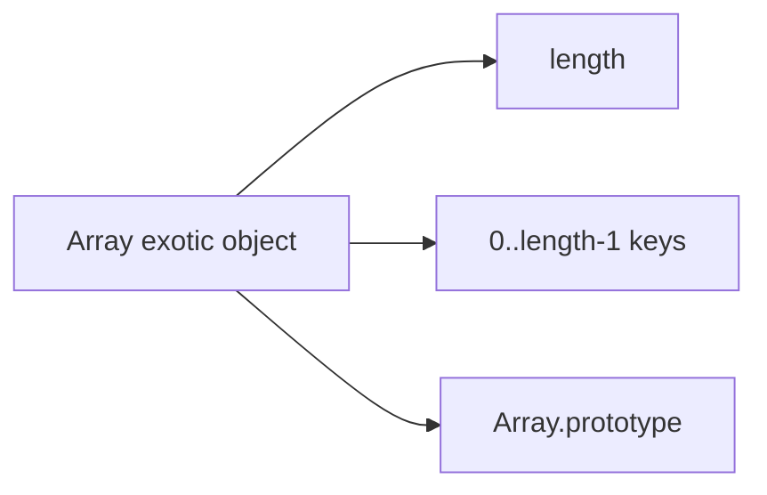
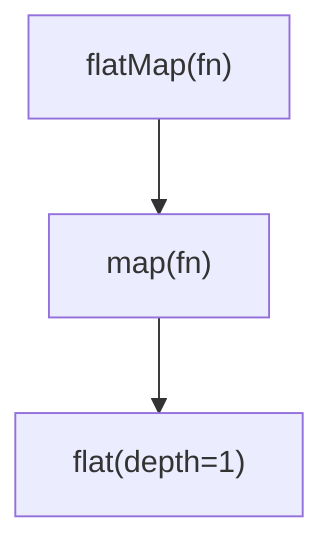
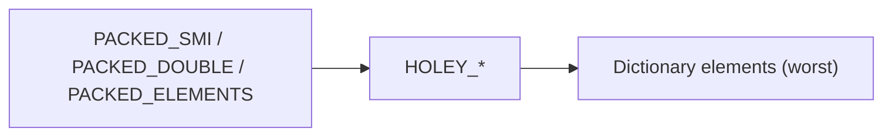

# Arrays

Dense methods, sparse arrays, iteration protocols, and **implementing** `map` / `filter` / `reduce` / `some` / `every` / `flat` / `flatMap` from scratch — standard machine-coding + theory combo.

## Mental model

Arrays are objects with special `length` and integer-index keys. They can be **sparse** (holes).

```ts
const a = []
a[2] = "x"
// [ <2 empty items>, "x" ]
a.length // 3
0 in a   // false  ← hole
```



## Mutating vs non-mutating

| Mutating | Non-mutating (returns new) |
| --- | --- |
| `push` `pop` `shift` `unshift` | `concat` `slice` |
| `splice` `sort` `reverse` | `toSorted` `toReversed` `toSpliced` `with` |
| `fill` `copyWithin` | `map` `filter` `flat` `flatMap` |

Prefer non-mutating in React state updates.

## `length` traps

```ts
const a = [1, 2, 3]
a.length = 1        // truncates → [1]
a.length = 5        // extends with holes
a[10] = 1           // length becomes 11
```

## Implement core HOFs

Interview implementations should: skip holes like native (or document if you don't), pass `(value, index, array)`, and respect `thisArg` if asked.

### `map`

```ts
function myMap<T, U>(
  arr: ArrayLike<T>,
  fn: (value: T, index: number, array: ArrayLike<T>) => U,
  thisArg?: unknown,
): U[] {
  const len = arr.length >>> 0
  const out = new Array<U>(len)
  for (let i = 0; i < len; i++) {
    if (i in Object(arr)) {
      out[i] = fn.call(thisArg, arr[i] as T, i, arr)
    }
  }
  return out
}
```

### `filter`

```ts
function myFilter<T>(
  arr: ArrayLike<T>,
  pred: (value: T, index: number, array: ArrayLike<T>) => unknown,
  thisArg?: unknown,
): T[] {
  const len = arr.length >>> 0
  const out: T[] = []
  for (let i = 0; i < len; i++) {
    if (i in Object(arr)) {
      const v = arr[i] as T
      if (pred.call(thisArg, v, i, arr)) out.push(v)
    }
  }
  return out
}
```

### `reduce` / `reduceRight`

```ts
function myReduce<T, U>(
  arr: ArrayLike<T>,
  fn: (acc: U, value: T, index: number, array: ArrayLike<T>) => U,
  init?: U,
): U {
  const len = arr.length >>> 0
  let i = 0
  let acc: U

  if (arguments.length >= 3) {
    acc = init as U
  } else {
    // find first present element
    while (i < len && !(i in Object(arr))) i++
    if (i >= len) throw new TypeError("Reduce of empty array with no initial value")
    acc = arr[i++] as unknown as U
  }

  for (; i < len; i++) {
    if (i in Object(arr)) {
      acc = fn(acc, arr[i] as T, i, arr)
    }
  }
  return acc
}
```

**Always provide `initialValue`** in production — empty arrays and type widening are common bugs.

### `some` / `every`

```ts
function mySome<T>(
  arr: ArrayLike<T>,
  pred: (value: T, index: number, array: ArrayLike<T>) => unknown,
  thisArg?: unknown,
): boolean {
  const len = arr.length >>> 0
  for (let i = 0; i < len; i++) {
    if (i in Object(arr) && pred.call(thisArg, arr[i] as T, i, arr)) return true
  }
  return false
}

function myEvery<T>(
  arr: ArrayLike<T>,
  pred: (value: T, index: number, array: ArrayLike<T>) => unknown,
  thisArg?: unknown,
): boolean {
  const len = arr.length >>> 0
  for (let i = 0; i < len; i++) {
    if (i in Object(arr) && !pred.call(thisArg, arr[i] as T, i, arr)) return false
  }
  return true // vacuously true for empty
}
```

### `flat` / `flatMap`

```ts
function myFlat<T>(arr: readonly T[], depth = 1): unknown[] {
  const result: unknown[] = []
  const dive = (input: readonly unknown[], d: number) => {
    for (let i = 0; i < input.length; i++) {
      if (!(i in Object(input))) continue
      const v = input[i]
      if (d > 0 && Array.isArray(v)) dive(v, d - 1)
      else result.push(v)
    }
  }
  dive(arr as unknown[], depth)
  return result
}

function myFlatMap<T, U>(
  arr: ArrayLike<T>,
  fn: (value: T, index: number, array: ArrayLike<T>) => U | U[],
  thisArg?: unknown,
): U[] {
  // Spec: map then flatten depth 1 (and flatten only arrays, not array-likes)
  return myFlat(
    myMap(arr, (v, i, a) => fn.call(thisArg, v, i, a), thisArg),
    1,
  ) as U[]
}
```



## Iteration: `for…of`, iterators, holes

```ts
const sparse = [, 1, , 2]
;[...sparse]           // [undefined, 1, undefined, 2] — holes become undefined when spreading
for (const v of sparse) {
  // yields undefined for holes
}
sparse.forEach((v) => {}) // skips holes!
sparse.map((v) => v)      // preserves holes
```

Know which methods **skip holes** (`forEach`, `filter` callback not called) vs **visit as `undefined`**.

## Search & predicates

```ts
arr.includes(NaN)           // true (SameValueZero)
arr.indexOf(NaN)            // -1
arr.find((x) => Number.isNaN(x))
arr.findLast / findLastIndex
arr.at(-1)                  // last element
```

## Sort

```ts
;[10, 2, 1].sort()          // [1, 10, 2] lexicographic by default ToString
;[10, 2, 1].sort((a, b) => a - b)
;[10, 2, 1].toSorted((a, b) => a - b) // non-mutating
```

Comparator must be consistent; unstable assumptions across engines historically — don't rely on stability for equal keys unless you know the engine (modern V8 is stable).

## `Array.from` / `Array.of`

```ts
Array.from("hi")                    // ["h","i"]
Array.from({ length: 3 }, (_, i) => i) // [0,1,2]
Array.of(1, 2, 3)                   // vs new Array(3) empty slots
```

## Typed arrays (brief)

`Uint8Array`, etc. are not `Array.isArray` true; fixed length; hold numbers; useful for binary protocols / WASM / crypto. Methods overlap partially with Array.

## Performance notes

- Avoid `unshift` / `shift` on large arrays (O(n)).
- Prefer `for` / `for…of` over tiny callback chains in hot paths if profiling says so — readability usually wins first.
- Spreading huge arrays onto call stacks (`fn(...huge)`) throws RangeError — use loops.
- Sparse arrays defeat packed element kinds in V8 → slower.



## Interview Questions

**Q: Implement `Array.prototype.map`.**  
Loop `0..length`, call callback for present indices, write to new array at same index (preserve holes).

**Q: Difference `map` vs `forEach`?**  
`map` returns new array of results; `forEach` returns `undefined`, used for side effects. Both skip holes for callbacks.

**Q: Why provide `reduce` initial value?**  
Empty array throws otherwise; also fixes accumulator type and avoids using first element as acc incorrectly.

**Q: `flatMap` vs `map` + `flat`?**  
`flatMap` is map then flatten depth 1 — often faster / clearer for 1:many transforms.

**Q: How does `includes` treat `NaN`?**  
SameValueZero — can find `NaN`. `indexOf` uses Strict Equality — cannot.

**Q: Mutating sort in React state?**  
Bug: sort mutates; use `toSorted` or copy first `[...arr].sort(...)`.

## Common Mistakes

- Using `sort` without comparator for numbers.
- Relying on `forEach` + `async` and expecting sequential awaits (it won't wait).
- Confusing holes with `undefined` entries.
- `arr.slice(0)` vs deep clone — still shallow.
- Building arrays with `new Array(n).map(...)` — map skips holes; use `Array.from({ length: n }, fn)`.

## Trade-offs / Production Notes

- Immutable array methods (`toSorted`, etc.) reduce accidental shared-mutation bugs at a copy cost.
- For huge lists in UI → virtualization, not smarter `map` — see [FE system design](/frontend-system-design/01-feed).
- At API boundaries validate `Array.isArray` before assuming methods exist.
- Related: [Functions](/javascript/09-functions), [Machine Coding](/javascript/23-machine-coding), [Performance](/javascript/22-performance).
