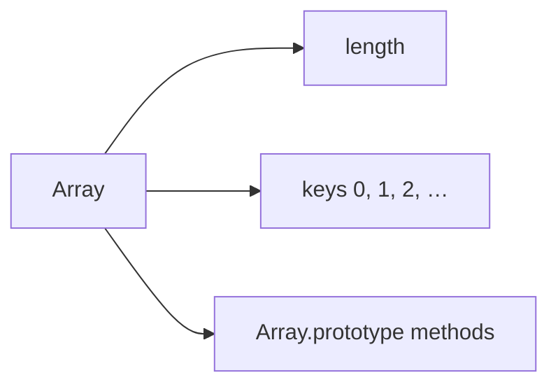
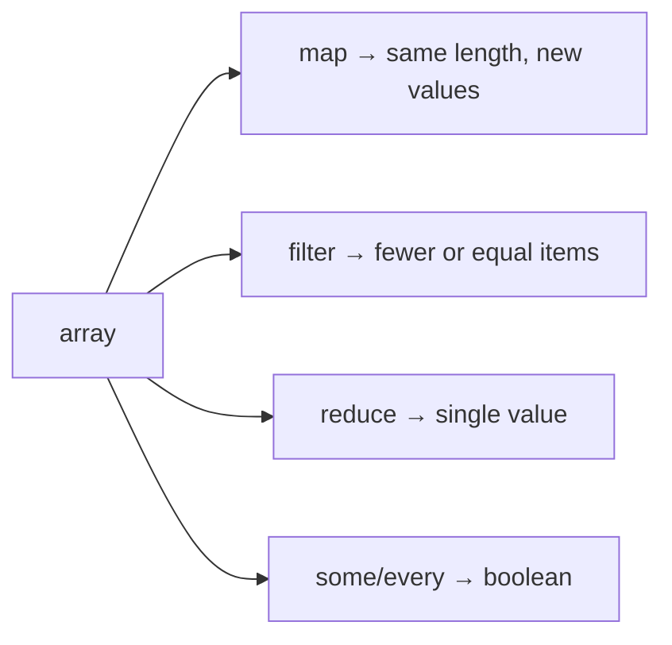
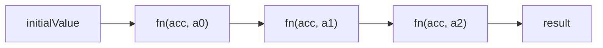

# Arrays

This chapter teaches JavaScript arrays from scratch — including **why** methods like `map`, `filter`, and `reduce` exist — and walks you through **implementing** them yourself. You do not need to already know higher-order functions or sparse arrays. By the end you should be able to implement the common iteration helpers and explain their contracts in an interview.

---

## 1. What is an array?

An **array** is an ordered list of values, indexed starting at `0`:

```ts
const fruits = ["apple", "banana", "cherry"]
fruits[0]   // "apple"
fruits.length // 3
```

Plain language:

> “Slot 0 holds `"apple"`, slot 1 holds `"banana"`, … and `length` tells how many slots the list claims to have.”

Under the hood, arrays are **objects** with:

- integer-index keys (`"0"`, `"1"`, …)
- a special `length` property
- methods on `Array.prototype` (`map`, `push`, …)

```ts
typeof []           // "object"
Array.isArray([])   // true — the reliable check
```



---

## 2. Creating arrays

```ts
const a = [1, 2, 3]           // literal — prefer this
const b = Array(3)            // length 3, but HOLES — avoid for “empty then fill”
const c = Array.from({ length: 3 }, (_, i) => i) // [0,1,2]
const d = [..."hi"]           // ["h","i"]
```

`Array(3)` does **not** give you `[undefined, undefined, undefined]`. It gives a sparse array with empty slots (holes). That matters for every method below.

---

## 3. Sparse arrays (holes) — learn this early

```ts
const a = []
a[2] = "x"
// [ <2 empty items>, "x" ]
a.length // 3
0 in a   // false  ← hole at index 0
1 in a   // false
2 in a   // true
a[0]     // undefined — but for a different reason than a real undefined entry
```

Compare:

```ts
const withHole = ["a", , "c"]
const withUndef = ["a", undefined, "c"]

0 in withHole   // true
1 in withHole   // false  — hole
1 in withUndef  // true   — key exists, value undefined
```

Native `map` / `filter` / `forEach` **skip holes**. A real `undefined` value is still visited. Interview implementations should match that (or say so if they do not).

---

## 4. Mutating vs non-mutating — why it matters

Some methods **change the array in place**. Others **return a new array** and leave the original alone.

| Mutating (change `arr`) | Non-mutating (new result) |
| --- | --- |
| `push` `pop` `shift` `unshift` | `concat` `slice` |
| `splice` `sort` `reverse` | `toSorted` `toReversed` `toSpliced` `with` |
| `fill` `copyWithin` | `map` `filter` `flat` `flatMap` |

In UI code (React state), prefer non-mutating updates so you do not accidentally share a mutated array across renders.

```ts
// mutating — dangerous if other code still holds `arr`
arr.push(4)

// non-mutating
const next = [...arr, 4]
```

---

## 5. `length` traps

```ts
const a = [1, 2, 3]
a.length = 1   // truncates → [1]
a.length = 5   // extends with holes → length 5, indices 1–4 empty
a[10] = 1      // length becomes 11
```

`length` is not “count of defined elements.” It is “one past the highest index the array claims.”

---

## 6. Why higher-order array methods exist

Before `map`/`filter`/`reduce`, you wrote loops everywhere:

```ts
const nums = [1, 2, 3, 4]
const doubled: number[] = []
for (let i = 0; i < nums.length; i++) {
  doubled.push(nums[i]! * 2)
}
```

That works, but:

1. **Intent is buried** — the reader must simulate the loop to see “double each element.”
2. **Easy to get wrong** — off-by-one, mutate the wrong array, forget holes.
3. **Hard to compose** — filter then map becomes nested loop soup.

Higher-order methods name the **intent**:

| Method | Intent in one sentence |
| --- | --- |
| `map` | Build a **new array** by transforming every element |
| `filter` | Build a **new array** with elements that pass a test |
| `reduce` | Boil the list down to **one value** (sum, object, whatever) |
| `some` | Is **at least one** element true for the test? |
| `every` | Are **all** elements true for the test? |
| `flat` | Un-nest arrays by some depth |
| `flatMap` | Map, then flatten one level (map-then-concat) |



The callback almost always receives `(value, index, array)`. Optional `thisArg` sets `this` inside a non-arrow callback.

---

## 7. Implement `map` from scratch

### 7.1 What `map` must guarantee

- Returns a **new** array
- Result length equals input `length` (holes stay holes in the result for native `map`)
- Calls `fn(value, index, array)` only for **existing** indices (`i in arr`)
- Does not mutate the original

### 7.2 Implementation

```ts
function myMap<T, U>(
  arr: ArrayLike<T>,
  fn: (value: T, index: number, array: ArrayLike<T>) => U,
  thisArg?: unknown,
): U[] {
  const len = Number(arr.length) >>> 0 // ToLength-style: uint32
  const out = new Array<U>(len)

  for (let i = 0; i < len; i++) {
    if (i in Object(arr)) {
      out[i] = fn.call(thisArg, arr[i] as T, i, arr)
    }
    // else: leave a hole at out[i]
  }

  return out
}

myMap([1, 2, 3], (x) => x * 2) // [2, 4, 6]
```

Why `>>> 0`? Interview shorthand for “treat length like a uint32,” matching much of the spec’s `ToLength` / array exotic behavior for weird `length` values.

Why `fn.call(thisArg, …)`? So `arr.map(fn, obj)` can use methods as callbacks with the right `this`.

### 7.3 Tiny walkthrough

```ts
myMap([10, 20], (v, i) => `${i}:${v}`)
// i=0 → "0:10"
// i=1 → "1:20"
// → ["0:10", "1:20"]
```

---

## 8. Implement `filter` from scratch

### 8.1 Why `filter` exists

You often want “keep the ones that match” without a manual push loop. `filter` returns a **dense** new array of kept items (no holes reserved for rejects).

### 8.2 Implementation

```ts
function myFilter<T>(
  arr: ArrayLike<T>,
  pred: (value: T, index: number, array: ArrayLike<T>) => unknown,
  thisArg?: unknown,
): T[] {
  const len = Number(arr.length) >>> 0
  const out: T[] = []

  for (let i = 0; i < len; i++) {
    if (i in Object(arr)) {
      const value = arr[i] as T
      if (pred.call(thisArg, value, i, arr)) {
        out.push(value)
      }
    }
  }

  return out
}

myFilter([1, 2, 3, 4], (n) => n % 2 === 0) // [2, 4]
```

Truthiness: native `filter` keeps the element when the predicate returns a **truthy** value — not only strict `true`.

---

## 9. Implement `reduce` from scratch

### 9.1 Why `reduce` exists

`map` and `filter` always produce arrays. Sometimes you want a **number**, a **string**, a **Map**, or an **object**. `reduce` threads an **accumulator** through the list.

Mental model:

```text
acc0 + item0 → acc1
acc1 + item1 → acc2
…
→ final value
```



### 9.2 With and without `initialValue`

```ts
;[1, 2, 3].reduce((acc, n) => acc + n, 0) // 6 — start at 0
;[1, 2, 3].reduce((acc, n) => acc + n)    // 6 — start at first element 1
```

Without initial value:

- first **present** element becomes the starting accumulator
- callback starts at the next present index
- empty array → `TypeError`

### 9.3 Implementation

```ts
function myReduce<T, U>(
  arr: ArrayLike<T>,
  fn: (acc: U, value: T, index: number, array: ArrayLike<T>) => U,
  ...init: [U?]
): U {
  const len = Number(arr.length) >>> 0
  let i = 0
  let acc: U
  let found = false

  if (init.length >= 1) {
    acc = init[0] as U
    found = true
  } else {
    // Find first present element as initial accumulator
    for (; i < len; i++) {
      if (i in Object(arr)) {
        acc = arr[i] as unknown as U
        found = true
        i++
        break
      }
    }
    if (!found) {
      throw new TypeError("Reduce of empty array with no initial value")
    }
  }

  for (; i < len; i++) {
    if (i in Object(arr)) {
      acc = fn(acc!, arr[i] as T, i, arr)
    }
  }

  return acc!
}

myReduce([1, 2, 3], (a, b) => a + b, 0) // 6
```

### 9.4 Teaching examples

Sum:

```ts
myReduce([1, 2, 3], (a, n) => a + n, 0)
```

Group by:

```ts
type Pet = { type: string; name: string }
const pets: Pet[] = [
  { type: "dog", name: "Rex" },
  { type: "cat", name: "Mia" },
  { type: "dog", name: "Ada" },
]

const byType = myReduce(
  pets,
  (acc, pet) => {
    ;(acc[pet.type] ??= []).push(pet.name)
    return acc
  },
  {} as Record<string, string[]>,
)
// { dog: ["Rex", "Ada"], cat: ["Mia"] }
```

> [!TIP]
> Prefer a readable `for…of` if the `reduce` callback becomes a novel. Interviews reward clear `reduce` for aggregations — not clever one-liners.

---

## 10. Implement `some` and `every`

### 10.1 Why they exist

You often ask yes/no questions about a list:

- “Is there **any** failing validation?” → `some`
- “Did **every** item succeed?” → `every`

They **short-circuit**: `some` stops on first truthy; `every` stops on first falsy. That can skip expensive work.

Empty array quirks (math / logic):

```ts
;[].some(() => true)  // false — nothing succeeded
;[].every(() => false) // true  — nothing failed (“vacuous truth”)
```

### 10.2 Implementations

```ts
function mySome<T>(
  arr: ArrayLike<T>,
  pred: (value: T, index: number, array: ArrayLike<T>) => unknown,
  thisArg?: unknown,
): boolean {
  const len = Number(arr.length) >>> 0
  for (let i = 0; i < len; i++) {
    if (i in Object(arr) && pred.call(thisArg, arr[i] as T, i, arr)) {
      return true
    }
  }
  return false
}

function myEvery<T>(
  arr: ArrayLike<T>,
  pred: (value: T, index: number, array: ArrayLike<T>) => unknown,
  thisArg?: unknown,
): boolean {
  const len = Number(arr.length) >>> 0
  for (let i = 0; i < len; i++) {
    if (i in Object(arr) && !pred.call(thisArg, arr[i] as T, i, arr)) {
      return false
    }
  }
  return true
}
```

Relationship:

```ts
!mySome(arr, (x) => !pred(x)) // similar spirit to every(pred)
```

---

## 11. Implement `flat` from scratch

### 11.1 Why `flat` exists

APIs sometimes return nested lists:

```ts
const nested = [1, [2, 3], [4, [5]]]
```

You want one list. `flat(depth)` un-nests up to `depth` levels (`depth` default `1`). `flat(Infinity)` fully flattens arrays-of-arrays.

```ts
;[1, [2, 3], [4, [5]]].flat()   // [1, 2, 3, 4, [5]]
;[1, [2, 3], [4, [5]]].flat(2)  // [1, 2, 3, 4, 5]
```

### 11.2 Implementation

```ts
function myFlat<T>(arr: readonly T[], depth = 1): unknown[] {
  const result: unknown[] = []

  function flatten(input: readonly unknown[], d: number) {
    for (let i = 0; i < input.length; i++) {
      if (!(i in input)) continue // skip holes like native
      const value = input[i]
      if (Array.isArray(value) && d > 0) {
        flatten(value, d - 1)
      } else {
        result.push(value)
      }
    }
  }

  flatten(arr as readonly unknown[], depth)
  return result
}
```

Only **arrays** flatten. Array-likes that are not real arrays stay as elements unless you convert them first.

---

## 12. Implement `flatMap` from scratch

### 12.1 Why `flatMap` exists

A very common pattern:

1. For each item, produce **zero or more** output items (an array)
2. Concatenate those arrays into one list

Example: split sentences into words:

```ts
const lines = ["hi there", "bye"]
lines.map((s) => s.split(" "))     // [["hi","there"],["bye"]]
lines.flatMap((s) => s.split(" ")) // ["hi","there","bye"]
```

`flatMap` is conceptually `map` then `flat(1)` — but engines can do it in one pass, and the callback is expected to return a value that gets flattened **one** level if it is an array.

### 12.2 Implementation

```ts
function myFlatMap<T, U>(
  arr: ArrayLike<T>,
  fn: (value: T, index: number, array: ArrayLike<T>) => U | readonly U[],
  thisArg?: unknown,
): U[] {
  const len = Number(arr.length) >>> 0
  const out: U[] = []

  for (let i = 0; i < len; i++) {
    if (!(i in Object(arr))) continue
    const mapped = fn.call(thisArg, arr[i] as T, i, arr)
    if (Array.isArray(mapped)) {
      // flatten exactly one level
      for (let j = 0; j < mapped.length; j++) {
        if (j in mapped) out.push(mapped[j] as U)
      }
    } else {
      out.push(mapped as U)
    }
  }

  return out
}
```

Returning a non-array just inserts one element (like `map`).

---

## 13. Putting them together — small recipes

```ts
const users = [
  { id: 1, active: true, tags: ["a", "b"] },
  { id: 2, active: false, tags: ["b"] },
  { id: 3, active: true, tags: ["c"] },
]

const activeIds = users.filter((u) => u.active).map((u) => u.id)
// [1, 3]

const allTags = users.flatMap((u) => u.tags)
// ["a","b","b","c"]

const tagCounts = allTags.reduce(
  (acc, tag) => {
    acc[tag] = (acc[tag] ?? 0) + 1
    return acc
  },
  {} as Record<string, number>,
)
```

Prefer **filter + map** when each step is clear. Prefer **flatMap** when one item expands to many. Prefer **reduce** when the result is not “another list of the same kind of thing.”

---

## 14. Iteration: `for…of`, indices, and array-likes

```ts
const arr = ["a", "b"]
for (const value of arr) { /* values */ }
for (const [i, value] of arr.entries()) { /* index + value */ }
```

`map`/`filter` work on **array-likes** (`{ length, 0, 1, … }`) when you call `Array.prototype.map.call(nodeList, …)` or use `Array.from`.

```ts
Array.from(document.querySelectorAll("div")) // real array
```

---

## 15. Worked whiteboard session (talk track)

Prompt: “Implement `map`, then `filter`, then show sum with `reduce`.”

1. State contracts: new array, skip holes, `(v,i,arr)`, optional `thisArg`.
2. Write `myMap` with `for` + `i in arr`.
3. Write `myFilter` pushing into a growing array.
4. Write `myReduce` with initial value first (simpler), then mention empty-without-init edge case.
5. Note native methods are on `Array.prototype` and handle exotic arrays / species — your version teaches the idea.

---

## Interview Questions

### Q1. Difference between `map` and `forEach`?
**Expected:** `map` builds and returns a new array of transformed values; `forEach` is for side effects and returns `undefined`.  
**Common wrong:** “They are the same.”  

### Q2. What does `reduce` do without an initial value?
**Expected:** Uses the first present element as the accumulator and starts combining from the next; empty array throws.  
**Common wrong:** “Defaults to 0.”  

### Q3. How do array methods treat holes?
**Expected:** Most callback methods skip holes; a hole is not the same as an index holding `undefined`.  
**Follow-ups:** Does `map` preserve holes in the output? (Yes for native.)

### Q4. Implement `flatMap` in words.
**Expected:** For each element, call fn; if result is an array, concatenate one level into the output; else push the single value.  
**Common wrong:** Deep-flatten recursively.

### Q5. Why is `[].every(() => false)` true?
**Expected:** Vacuous truth — there is no element that fails the predicate.  
**Common wrong:** “Bug in JavaScript.”  

### Q6. Mutating `sort` vs `toSorted`?
**Expected:** `sort` reorders in place and returns the same array; `toSorted` returns a new sorted array. Prefer non-mutating in React state.

## Common Mistakes

- Using `map` only for side effects (use `forEach` / `for…of`).
- Forgetting `reduce` needs an initial value for empty arrays / non-sum shapes.
- Treating holes like `undefined` entries.
- Nesting `map`+`filter`+`reduce` into unreadable chains when a loop is clearer.
- Expecting `flat` to flatten non-array iterables automatically.
- Mutating arrays that are part of React/Vue state.
- Writing `Array(n).map(...)` and wondering why the callback never runs (holes!).

## Trade-offs / Production Notes

- **Clarity over cleverness** — a named helper beats a dense `reduce` in most codebases.
- Native methods are battle-tested and optimized; reimplement for interviews/learning, not production replacements.
- For large lists, prefer single-pass logic (one `reduce` / one loop) over many intermediate arrays if profiling shows cost.
- TypeScript: annotate accumulator types in `reduce` or inference gets `{}` / `unknown` wrong.
- Related: [Objects](/javascript/14-objects), [Functions](/javascript/09-functions), machine coding [Infinite scroll](/machine-coding/03-infinite-scroll).
