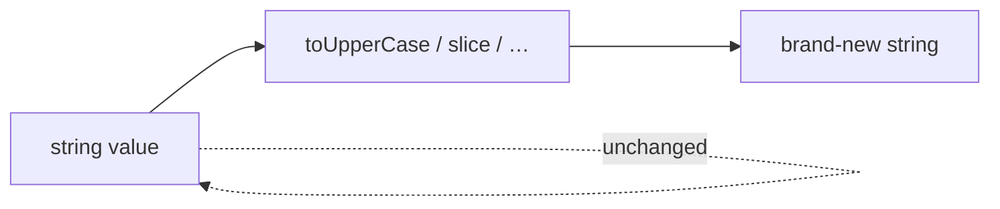
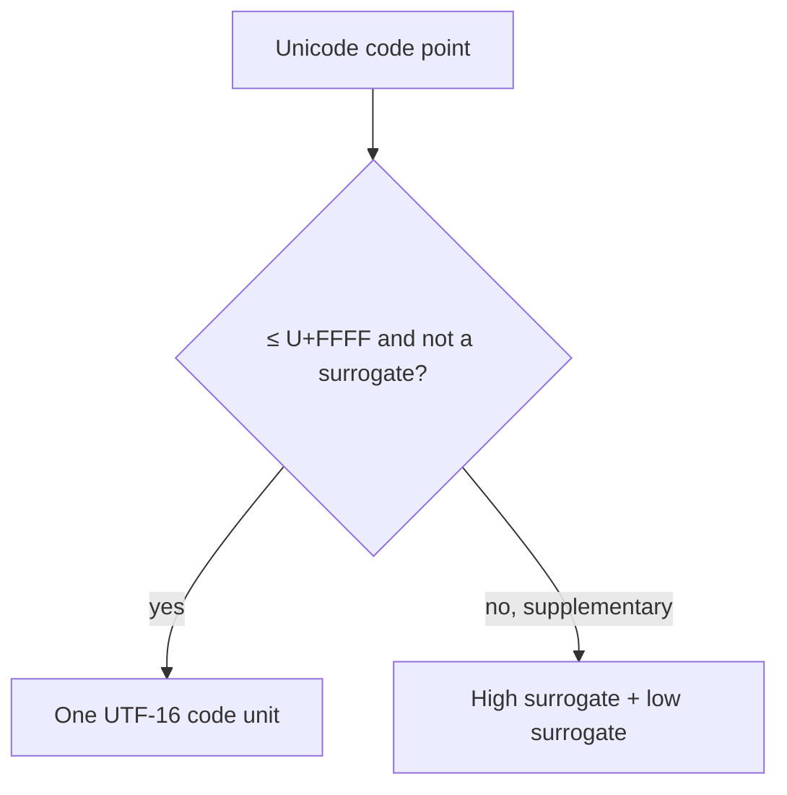
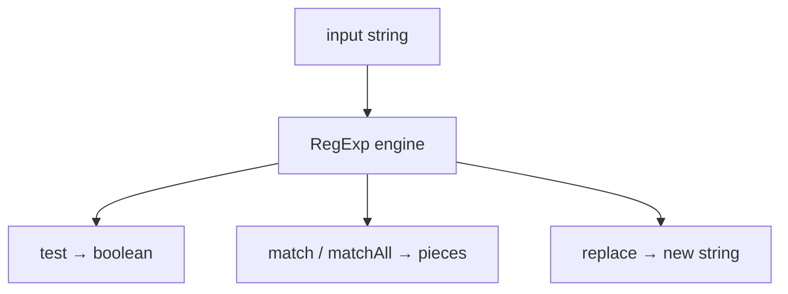
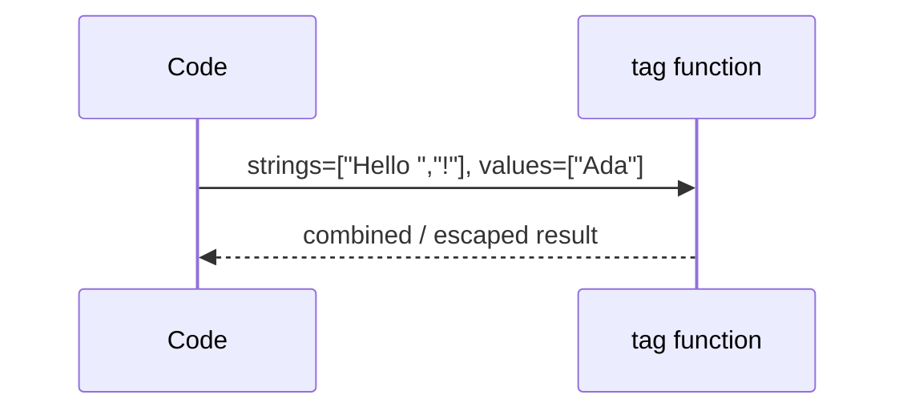

# Strings

This chapter teaches JavaScript strings from zero: what a string is, why `"𠮷".length` can be `2`, how Unicode and UTF-16 fit together, how basic regex works, and how template literals behave. You do not need prior encoding knowledge. By the end you should be able to explain **code units vs code points vs graphemes** and avoid the classic emoji/`length` bugs.

---

## 1. What is a string?

A **string** is a sequence of characters used for text:

```ts
const greeting = "hello"
const also = 'hello'
const again = `hello` // template literal — covered later
```

First facts:

1. Strings are **primitives** (`typeof "hi" === "string"`).
2. Strings are **immutable** — methods return new strings; they do not edit the old one in place.
3. Indexing uses **UTF-16 code units**, not always “what a human calls one character.”

```ts
let s = "hi"
s.toUpperCase() // "HI"
console.log(s)  // "hi" — original unchanged

s[0] = "H"      // has no effect on the string primitive
```



---

## 2. Why encoding enters the chat

Computers store numbers. Text needs a mapping: “this number means this character.”

Three layers you must separate:

| Layer | Meaning | Example |
| --- | --- | --- |
| **Code point** | Unicode’s ID for an abstract character | U+1F600 😀 |
| **Encoding** | How that ID becomes bytes/units in memory | UTF-8, UTF-16 |
| **Grapheme cluster** | What a user perceives as “one character” | “é” may be `e` + combining accent; flags may be 2 code points |

JavaScript’s string model is built on **UTF-16 code units**. That single sentence explains most interview string traps.

---

## 3. Unicode in plain language

**Unicode** assigns every character a number called a **code point**, written like `U+0041` (Latin `A`) or `U+1F4A9` (💩).

Unicode space is huge (up to U+10FFFF). Not every code point fits in 16 bits.

Historically, people hoped 16 bits would be enough (UCS-2). It was not. **UTF-16** was designed so:

- Code points `U+0000`–`U+FFFF` (except a reserved range) use **one** 16-bit unit
- Higher code points use **two** 16-bit units called a **surrogate pair**



JavaScript strings are sequences of those **UTF-16 code units**. So “one index” ≠ “one emoji” for many emoji and rarer CJK characters.

---

## 4. Code units vs code points — the core lesson

### 4.1 A BMP character (one unit)

```ts
const a = "A"
a.length           // 1
a.charCodeAt(0)    // 65
a.codePointAt(0)   // 65
```

### 4.2 A supplementary character (two units)

```ts
const emoji = "𠮷" // U+20BB7 (not an emoji, but needs a surrogate pair)
emoji.length            // 2  ← code units
emoji[0]                // "\uD842"  half a character!
emoji[1]                // "\uDFB7"
emoji.charCodeAt(0)     // 0xD842 — high surrogate
emoji.codePointAt(0)    // 0x20BB7 — full code point
;[...emoji]             // ["𠮷"] — iterates code points
Array.from(emoji)       // same
```

```ts
const grin = "😀" // U+1F600
grin.length       // 2
;[...grin].length // 1
```

### 4.3 API cheat sheet

| API | Operates on |
| --- | --- |
| `length`, `[]`, `charAt`, `charCodeAt`, `slice` (by index) | **code units** |
| `codePointAt`, `String.fromCodePoint`, `for…of`, spread | **code points** |
| `Intl.Segmenter` | **grapheme clusters** (user-perceived) |

```ts
const flag = "🇮🇳" // two regional-indicator code points
;[...flag].length // 2 code points
// Often 1 grapheme:
[...new Intl.Segmenter("en", { granularity: "grapheme" }).segment(flag)].length
```

> [!WARNING]
> Never truncate with `s.slice(0, 1)` if the string may contain emoji — you can split a surrogate pair and produce invalid / mojibake text. Prefer code-point or grapheme-aware slicing.

---

## 5. Creating strings and conversions

```ts
String(1)        // "1"
String(null)     // "null"
String(undefined)// "undefined"
;(255).toString(16) // "ff"
```

```ts
const name = "Ada"
const msg = "Hello, " + name
const better = `Hello, ${name}` // template — section 9
```

Prefer templates for readability. Prefer `String(x)` over `x + ""` when the intent is “convert to string.”

`String.raw` keeps backslashes mostly literal in a template (useful for Windows paths / regex authoring):

```ts
String.raw`C:\new` // "C:\\new" as characters C : \ n e w — no newline escape
```

---

## 6. Searching and extracting (everyday toolkit)

```ts
const s = "Hello World"

s.includes("World")   // true
s.startsWith("He")    // true
s.endsWith("ld")      // true
s.indexOf("o")        // 4
s.lastIndexOf("o")    // 7
s.slice(0, 5)         // "Hello" — negative indices OK
s.substring(0, 5)     // similar; negatives coerced oddly — prefer slice
```

`slice` teaching rules:

- `slice(start, end)` — end exclusive
- Negative `start`/`end` count from the end
- Out-of-range indices are clamped; does not throw

```ts
"abcdef".slice(-3)    // "def"
"abcdef".slice(2, 4)  // "cd"
```

---

## 7. “Modifying” strings (always new values)

```ts
"  x  ".trim()
"  x  ".trimStart()
"x".padStart(3, "0")  // "00x"
"ab".repeat(3)        // "ababab"
"a-b-c".split("-")    // ["a","b","c"]
;["a", "b"].join("-") // "a-b"
```

Replace:

```ts
"hello".replace("l", "L")     // "heLlo" — first only
"hello".replaceAll("l", "L")  // "heLLo"
"hello".replace(/l/g, "L")    // "heLLo" — regex with g
```

Case:

```ts
"Hello".toLowerCase()
"Hello".toUpperCase()
"i".toLocaleUpperCase("tr") // Turkish locale rules can differ
```

---

## 8. Regex basics from zero

A **regular expression** is a pattern for matching text.

### 8.1 Creating a regex

```ts
const re1 = /hello/i          // literal — compile once when the script loads
const re2 = new RegExp("hello", "i") // dynamic pattern from a string
```

Flags you will use constantly:

| Flag | Meaning |
| --- | --- |
| `i` | ignore case |
| `g` | global — find many; required for `matchAll` / `replace` all |
| `m` | `^` / `$` match line starts/ends |
| `s` | `.` also matches newline |
| `u` | Unicode mode — better code point handling |
| `y` | sticky — match at `lastIndex` only |

### 8.2 Simple pattern pieces

```ts
;/abc/       // exact abc
;/./         // one code unit (with `u`, one code point-ish behavior improves)
;/[abc]/     // one of a, b, or c
;/[a-z]/     // range
;/\d/        // digit      [0-9]
;/\w/        // word char  [A-Za-z0-9_]
;/\s/        // whitespace
;/^hi/       // start
;/bye$/      // end
;/a+/        // one or more a
;/a*/        // zero or more
;/a?/        // zero or one
;/a{2,4}/    // 2–4 times
;/(ab|cd)/   // group / alternation
```

### 8.3 Testing and matching

```ts
;/^\d+$/.test("123")          // true — whole string digits
"abc123".match(/\d+/)         // ["123"]
"a1b2".match(/\d+/g)          // ["1","2"]
;[... "a1b2".matchAll(/\d+/g)] // richer match objects with index
```

```ts
const re = /(\d{4})-(\d{2})-(\d{2})/
const m = "Date 2024-07-16".match(re)
// m[0] full match, m[1] year, m[2] month, m[3] day
```

Named groups:

```ts
const re = /(?<year>\d{4})-(?<month>\d{2})/
const m = "2024-07".match(re)
m?.groups?.year // "2024"
```

### 8.4 `u` flag — why it matters with Unicode

Without `u`, `.` and quantifiers can split surrogate pairs badly. With `u`, patterns become code-point aware in important ways:

```ts
;/^.|$/.test("😀")   // careful — may be wrong mentally without u
;/^.$/u.test("😀")   // true — one code point
```

### 8.5 Replace with a function

```ts
"a1b2".replace(/\d/g, (digit) => String(Number(digit) + 1))
// "a2b3"
```

### 8.6 Common regex pitfalls

- Forgetting the `g` flag when you want all matches
- Building `new RegExp(userInput)` without escaping — injection / broken patterns
- Using regex for HTML parsing (do not)
- Stateful `/g` regex reused with `.test` / `.exec` advancing `lastIndex` unexpectedly

```ts
const re = /a/g
re.test("a") // true, lastIndex moved
re.test("a") // false — surprise on same string
```

Prefer `matchAll` or create a fresh regex when confused.



---

## 9. Template literals from scratch

### 9.1 Interpolation

```ts
const name = "Ada"
const n = 3
const s = `Hello, ${name}! You have ${n * 2} messages.`
```

`${…}` can hold any expression. The result is coerced to string.

### 9.2 Multi-line

```ts
const poem = `line 1
line 2`
```

Newlines inside backticks are real newlines — no `\n` required.

### 9.3 Nested templates

```ts
const rows = [1, 2].map((n) => `<li>${n}</li>`).join("")
const html = `<ul>${rows}</ul>`
```

### 9.4 Tagged templates (advanced but interview-common)

A **tag** is a function that receives the string pieces and the interpolated values separately:

```ts
function highlight(strings: TemplateStringsArray, ...values: unknown[]) {
  return strings.reduce((out, str, i) => {
    const v = i < values.length ? `<b>${String(values[i])}</b>` : ""
    return out + str + v
  }, "")
}

const user = "Ada"
highlight`Hello ${user}!`
// "Hello <b>Ada</b>!"
```

Libraries use tags for HTML escaping, CSS-in-JS, GraphQL (`gql\`…``), i18n, etc.



### 9.5 Templates are not “safe HTML”

```ts
const userInput = ""
const bad = `<div>${userInput}</div>` // XSS if injected into HTML
```

Escape or use APIs that treat text as text (`textContent`), not raw HTML concatenation.

---

## 10. Comparing and sorting strings

```ts
"a" === "a"     // true
"a" < "b"       // true — UTF-16 unit order roughly
"ä".localeCompare("z", "de") // locale-aware
```

For human-facing sort, prefer `localeCompare` or `Intl.Collator`:

```ts
const collator = new Intl.Collator("en", { sensitivity: "base" })
;["a", "B", "c"].sort(collator.compare)
```

---

## 11. Worked example — safe preview truncate

Goal: first ~20 **code points**, add ellipsis if truncated, without splitting surrogates.

```ts
function preview(text: string, maxCodePoints: number): string {
  const chars = Array.from(text) // split by code points
  if (chars.length <= maxCodePoints) return text
  return chars.slice(0, maxCodePoints).join("") + "…"
}

preview("Hello 😀 world", 8) // does not crack the emoji
```

Even better for “visible characters”: `Intl.Segmenter` with `grapheme`.

---

## 12. Performance notes (light)

- Building huge strings with `+=` in a tight loop can be slow in older engines; arrays + `join` used to be the advice. Modern engines optimize `+=` well for many cases — measure if it matters.
- Regexes are powerful but can be catastrophic (`(a+)+$` on long `aaaa…b`). Prefer simple patterns; avoid pathological nesting on untrusted input (ReDoS).

---

## Interview Questions

### Q1. Why can a string’s `length` be 2 for one emoji?
**Expected:** JS strings are UTF-16 code units; supplementary code points use a surrogate pair (two units).  
**Common wrong:** “Emoji are two characters.”  

### Q2. Code unit vs code point vs grapheme?
**Expected:** Unit = UTF-16 slot; code point = Unicode scalar; grapheme = user-perceived character (may be multiple code points).  
**Follow-ups:** Which APIs for each?

### Q3. How do you iterate by code point?
**Expected:** `for…of`, spread, or `Array.from(str)`.  
**Common wrong:** Classic `for (i=0;i<length;i++)` with `str[i]`.  

### Q4. Difference between `slice` and `substring`?
**Expected:** Prefer `slice`; it supports negatives. `substring` swaps/coerces oddly.  

### Q5. What does the regex `u` flag do?
**Expected:** Unicode mode — patterns treat input in a code-point-aware way (e.g. `.` matches one code point for emoji).  

### Q6. What is a tagged template?
**Expected:** A function called with the literal segments and interpolated values separately, enabling custom processing (escape, DSL).  

## Common Mistakes

- Truncating with unit indices and splitting surrogate pairs.
- Using `indexOf` + manual loops where `includes` / `matchAll` is clearer.
- Reusing a global regex and getting bitten by `lastIndex`.
- Assuming template interpolation escapes HTML.
- Sorting with raw `<` for locale-sensitive text.
- Parsing HTML with regex.
- Believing string methods mutate the original.

## Trade-offs / Production Notes

- Validate/normalize Unicode at system boundaries (NFC vs NFD can break equality/`length` assumptions).
- Use `Intl.Segmenter` when “character” means UX, not encoding.
- Prefer `replaceAll` / `matchAll` over subtle `/g` state.
- For security-sensitive HTML, use vetted escaping libraries or framework text bindings — not string concat.
- Related: [Numbers](/javascript/17-numbers), [Arrays](/javascript/15-arrays) (`split`/`join`), [Browser security / XSS](/browser/06-security).
