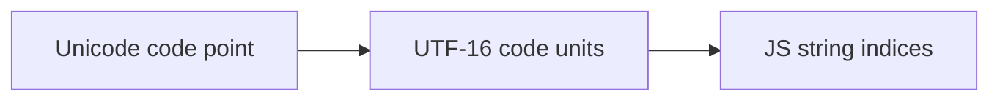
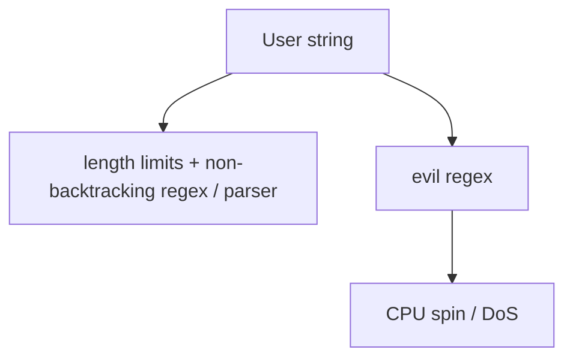

# Strings

Immutability, indexing vs code points, common methods, template pitfalls, and encoding — frequent soft spots in FE interviews.

## Strings are primitive & immutable

```ts
let s = "hi"
s[0] = "H"       // ignored / TypeError in strict with wrappers
s.toUpperCase()  // returns new string; s still "hi"
```

Concatenation and methods always allocate new strings (engines optimize short-lived cases).

## Indexing: UTF-16 code units

JS strings are sequences of **UTF-16 code units**. Many emoji / rare characters are **surrogate pairs** (2 units).

```ts
const emoji = "𠮷" // U+20BB7
emoji.length           // 2
emoji[0]               // "\uD842" half
;[...emoji]            // ["𠮷"] via code points
Array.from(emoji)      // same
emoji.codePointAt(0)   // 0x20BB7
```



| API | Level |
| --- | --- |
| `length`, `charAt`, `[]`, `charCodeAt` | code units |
| `codePointAt`, `fromCodePoint`, spread / `for…of` | code points |
| `Intl.Segmenter` | grapheme clusters (user-perceived characters) |

```ts
const flag = "🇮🇳" // regional indicators
;[...flag].length           // 2 code points
new Intl.Segmenter().segment(flag) // 1 grapheme (engine/Intl dependent)
```

## Creating & converting

```ts
String(1)           // "1"
String(null)        // "null"
;(1).toString(16)   // "1"
String.raw`C:\n`    // raw template (no escape processing)
```

Prefer template literals for readability; prefer explicit `String(x)` over `x + ""` at boundaries.

## Search & extract

```ts
const s = "Hello World"

s.includes("World")      // true
s.startsWith("He")
s.endsWith("ld")
s.indexOf("o")           // 4
s.lastIndexOf("o")
s.slice(0, 5)            // "Hello"  (supports negative)
s.substring(0, 5)        // similar; negative → 0 — prefer slice
s.substr(0, 5)           // legacy — avoid
```

## Modify-ish (return new)

```ts
"  x  ".trim()
"x".padStart(3, "0")     // "00x"
"ab".repeat(3)           // "ababab"
"a-b-c".split("-")
["a","b"].join("-")
"Hello".replace("l", "L")       // first only
"Hello".replaceAll("l", "L")
"Hello".replace(/l/g, "L")
```

### `replace` with function

```ts
"a1b2".replace(/\d/g, (m) => String(Number(m) + 1)) // "a2b3"
```

## Templates & tagged templates

```ts
const user = "Ada"
const msg = `Hello, ${user}!`

function highlight(strings: TemplateStringsArray, ...values: unknown[]) {
  return strings.reduce(
    (out, str, i) => out + str + (i < values.length ? `<b>${values[i]}</b>` : ""),
    "",
  )
}
highlight`Hi ${user}` // "Hi <b>Ada</b>"
```

Tagged templates power: `styled-components`, GraphQL `gql`, localization, `String.raw`.

**XSS:** never drop unsanitized user values into HTML via templates — see [Security](/javascript/21-security).

## Pattern matching

```ts
const re = /(\w+)@(\w+)\.(\w+)/
const m = "a@b.com".match(re)
// m[0] full, m[1].. groups; with /d flag: indices

for (const m of "a1 b2".matchAll(/(\w)(\d)/g)) {
  console.log(m[1], m[2])
}
```

`match` with `/g` returns strings only (no groups). Prefer `matchAll` for global + groups.

## Normalization & locale

```ts
"é".normalize("NFC")
"café".localeCompare("cafe", "en", { sensitivity: "base" })
"İ".toLocaleLowerCase("tr")  // Turkish dotless i rules
```

Sorting UI strings: `localeCompare` or `Intl.Collator`, not raw `<`.

## Encoding at the boundary

```ts
const bytes = new TextEncoder().encode("hi 𠮷")
const str = new TextDecoder().decode(bytes)

btoa(String.fromCharCode(...new Uint8Array(bytes))) // careful with large buffers
// Prefer base64 via Buffer (Node) or hex/base64 libs for binary
```

URL encoding: `encodeURIComponent` vs `encodeURI` — know the difference (`&`, `?`, `/`).

## Performance

- Repeated `s += chunk` in a loop is usually fine in modern engines; for huge builds use array + `join` if profiling warrants.
- Building HTML with string concat vs DOM APIs / frameworks — frameworks win on safety.
- Avoid regex with catastrophic backtracking on user input (ReDoS).



## Interview Questions

**Q: Why can `length` be 2 for one emoji?**  
UTF-16 surrogate pair = two code units; one code point.

**Q: `slice` vs `substring`?**  
Prefer `slice` (negative indices). `substring` swaps args if start > end and coerces negatives to 0.

**Q: How to iterate by code point?**  
`for…of`, spread, or `codePointAt` loop advancing 1 or 2 units.

**Q: Difference `encodeURI` vs `encodeURIComponent`?**  
Component encodes reserved characters (`&`, `=`, `/`, …) — use for query values. `encodeURI` leaves URI structure chars.

**Q: Is string comparison `===` locale-aware?**  
No — binary code unit comparison. Use `Intl` for linguistic equality/sort.

**Q: What are tagged templates for?**  
Custom parsing of literal + interpolations without intermediate string concat — DSLs, escaping, styling.

## Common Mistakes

- Truncating with `substr(0, n)` mid-surrogate → broken characters; use code-point aware truncation.
- Sorting names with `a < b`.
- Using `replace` without `/g` / `replaceAll` expecting all replacements.
- HTML interpolation without escaping.
- Assuming `split('')` equals code-point split for emoji.
- Parsing integers with `parseInt` without radix (`parseInt("08")` legacy octal traps in old engines — always pass `10`).

## Trade-offs / Production Notes

- Display length ≠ `string.length` — use `Intl.Segmenter` for input limits that match UX.
- Keep i18n in message catalogs; avoid concatenating translated sentences.
- Validate/normalize Unicode at API edges (NFC) when comparing identifiers.
- Related: [Numbers](/javascript/17-numbers), [Security](/javascript/21-security), [Browser APIs](/javascript/19-browser-apis).
