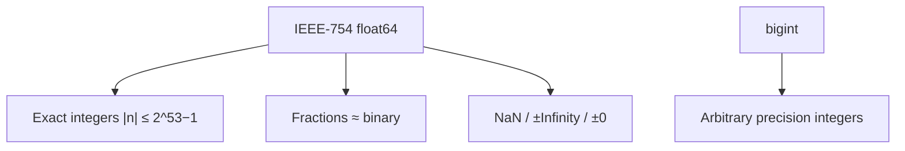
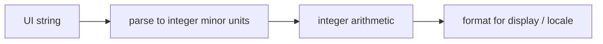

# Numbers

IEEE-754 doubles, safe integers, `NaN`/`Infinity`, `bigint`, parsing, and money — classic senior gotchas.

## One number type (almost)

Until `bigint`, all numeric values were IEEE-754 **binary64** doubles: 1 sign + 11 exponent + 52 mantissa bits.

```ts
typeof 1        // "number"
typeof 1.5      // "number"
typeof NaN      // "number"
typeof Infinity // "number"
typeof 1n       // "bigint"
```



## The 0.1 + 0.2 problem

```ts
0.1 + 0.2 === 0.3           // false
0.1 + 0.2                   // 0.30000000000000004
Number.EPSILON              // 2^-52 — relative spacing around 1
```

Compare floats with tolerance:

```ts
function nearlyEqual(a: number, b: number, eps = Number.EPSILON) {
  return Math.abs(a - b) <= eps * Math.max(1, Math.abs(a), Math.abs(b))
}
```

## Safe integers

```ts
Number.MAX_SAFE_INTEGER     // 9007199254740991  (2^53 - 1)
Number.MIN_SAFE_INTEGER
Number.isSafeInteger(2 ** 53)     // false
Number.MAX_SAFE_INTEGER + 1 === Number.MAX_SAFE_INTEGER + 2 // true
```

DB snowflake IDs / Twitter IDs must be **strings** or `bigint` in JS — JSON.parse will corrupt them as numbers.

## `NaN`, `Infinity`, signed zero

```ts
Number("oops")        // NaN
0 / 0                 // NaN
1 / 0                 // Infinity
-1 / 0                // -Infinity

NaN === NaN           // false
Object.is(NaN, NaN)   // true
Number.isNaN(NaN)     // true
Number.isNaN("x" as never) // false — no coerce
isNaN("x")            // true — coerces

Object.is(+0, -0)     // false
1 / +0                // Infinity
1 / -0                // -Infinity
```

`Number.isFinite(value)` — no coercion; prefer over global `isFinite`.

## Parsing

```ts
Number(" 12 ")        // 12
Number("")            // 0
Number("12a")         // NaN
parseInt("12a", 10)   // 12  (prefix)
parseInt("08", 10)    // 8
parseFloat("3.14abc") // 3.14
Number.parseInt === parseInt
```

Always pass radix `10` to `parseInt`. Prefer `Number` / schema validators when the whole string must be numeric.

```ts
const n = Number(input)
if (!Number.isFinite(n)) throw new Error("invalid")
```

## Math helpers interviewers expect

```ts
Math.floor(1.9)    // 1
Math.trunc(-1.9)   // -1  (toward 0)
Math.round(1.5)    // 2   (half away from 0 for positives — know banker's? JS is not banker's)
Math.ceil(-1.1)    // -1
Math.abs(-2)
Math.sign(-0)      // -0
Math.max(...arr)   // careful: stack limits
Math.hypot(3, 4)   // 5
Math.clz32(1)      // count leading zeros bits
```

Clamp:

```ts
const clamp = (n: number, min: number, max: number) =>
  Math.min(max, Math.max(min, n))
```

## Bitwise operators coerce to Int32

```ts
~~3.9            // 3
3.9 | 0          // 3
(2 ** 31) | 0    // -2147483648  (overflow to signed 32)
>>> 0            // ToUint32
```

Useful for quick trunc toward 0 within 32-bit range; dangerous for larger magnitudes.

## `bigint`

```ts
const a = 10n
const b = BigInt(10)
a + 1n           // ok
// a + 1         // TypeError — no mixed ops
a < 11           // ok — relational mixes allowed
0n === 0         // false
0n == 0          // true
```

JSON: `JSON.stringify(1n)` throws — serialize as string. `structuredClone` supports bigint.

## Money — never use float

```ts
// Bad
0.1 + 0.2 // dollars

// Better: integer cents
const cents = 10 + 20
;(cents / 100).toFixed(2) // display only

// Or decimal libraries (decimal.js, big.js) / banker's rules per domain
```



## `toFixed` / `toPrecision` / `toString`

```ts
(1.005).toFixed(2)    // "1.00" in many engines — binary surprise
(1.235).toFixed(2)    // rounding string conversion
;(255).toString(16)   // "ff"
Number.MAX_VALUE.toExponential()
```

Display currency with `Intl.NumberFormat`, not ad-hoc `toFixed` alone:

```ts
new Intl.NumberFormat("en-IN", { style: "currency", currency: "INR" }).format(1234.5)
```

## Random

```ts
Math.random() // [0, 1) — not CSPRNG
crypto.getRandomValues(new Uint32Array(1))
crypto.randomUUID()
```

Never use `Math.random` for tokens, IDs in security contexts, or shuffling secrets.

## Interview Questions

**Q: Why is `0.1 + 0.2 !== 0.3`?**  
Binary floating point can't represent those decimals exactly; sum is the closest representable value.

**Q: What is `Number.MAX_SAFE_INTEGER`?**  
Largest integer n where n and n±1 are exactly representable — `2^53 - 1`.

**Q: `Number.isNaN` vs `isNaN`?**  
Former no coercion; latter runs ToNumber first.

**Q: Can you JSON-serialize bigint?**  
Not with vanilla `JSON.stringify` — custom replacer → string.

**Q: Why not floats for money?**  
Rounding errors accumulate; regulations need exact decimal. Use integer minor units or decimal types.

**Q: Difference `Math.trunc` vs `Math.floor` for negatives?**  
`trunc(-1.5) === -1`, `floor(-1.5) === -2`.

## Common Mistakes

- Storing IDs as numbers in JS clients.
- Comparing floats with `===`.
- `parseInt` without radix / using it for floats.
- Mixing bigint and number with `+`.
- Using `Math.random` for security.
- Assuming `toFixed` is exact decimal rounding of the mathematical value.

## Trade-offs / Production Notes

- APIs: send large integers as **strings**; document precision.
- Analytics counters: float is fine; financial ledgers: not.
- Prefer `Number.isFinite` guards at system boundaries.
- Related: [Fundamentals](/javascript/01-fundamentals), [Strings](/javascript/16-strings), [Security](/javascript/21-security).
