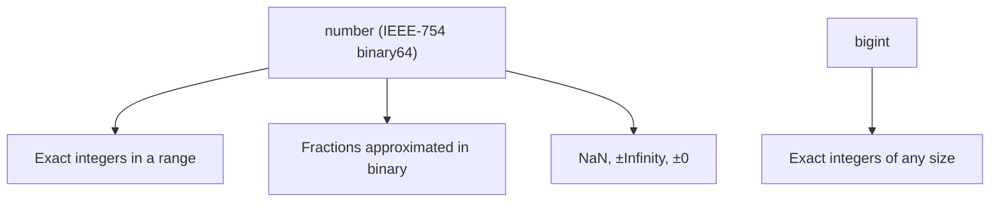
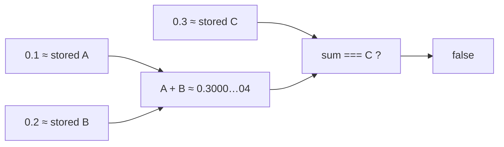
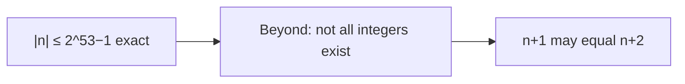

# Numbers

This chapter teaches how JavaScript numbers work from scratch — including **why `0.1 + 0.2 !== 0.3`**. You do not need prior knowledge of IEEE-754. By the end you should be able to explain floating-point representation, safe integers, `NaN`/`Infinity`, parsing pitfalls, and when to use `BigInt` or decimal strategies for money.

---

## 1. What kinds of numeric values exist?

For a long time JavaScript had **one** numeric type for everyday math: `number`. Later came `bigint` for arbitrary-size integers.

```ts
typeof 1        // "number"
typeof 1.5      // "number"
typeof NaN      // "number"  — yes, really
typeof Infinity // "number"
typeof 1n       // "bigint"
```

There is **no** separate `int` vs `float` type in the language. Both `1` and `1.5` are IEEE-754 **64-bit floating-point** values (often called “doubles”).



---

## 2. IEEE-754 in plain language

### 2.1 The problem floats solve

You need to represent a huge range of values (tiny fractions and large magnitudes) in a **fixed** number of bits. IEEE-754 binary64 uses **64 bits** roughly as:

| Part | Bits | Role |
| --- | --- | --- |
| Sign | 1 | Positive or negative |
| Exponent | 11 | Scale (where the point sits) |
| Significand / mantissa | 52 (+ 1 implicit) | The significant digits in **binary** |

Think of scientific notation, but base 2:

\[
(-1)^{\text{sign}} \times (1.m)_2 \times 2^{e}
\]

(with special cases for subnormals, zeros, infinities, NaN).

You do **not** need to memorize bit layouts for interviews. You need the consequences:

1. Many decimals that look simple in base 10 are **repeating** in base 2.
2. Only some integers are exact.
3. Arithmetic rounds to the nearest representable value.

### 2.2 Base 10 vs base 2 intuition

In base 10, `1/3 = 0.333…` — you cannot write it finitely. You round.

In base 2, `1/10` (our `0.1`) is the same kind of problem: a repeating fraction. The engine stores the **closest** 64-bit value to `0.1`, not the exact tenth.

```ts
0.1 // displays as 0.1, but the stored value is slightly off
```

---

## 3. Why `0.1 + 0.2 !== 0.3` — full walkthrough

### 3.1 The demo

```ts
0.1 + 0.2           // 0.30000000000000004
0.1 + 0.2 === 0.3   // false
```

This is not a JavaScript bug. The same surprise appears in Python, Java, C#, etc., with binary floating point.

### 3.2 Teaching story

1. `0.1` cannot be stored exactly → stored as a nearby double.
2. `0.2` cannot be stored exactly → another nearby double.
3. Adding those two approximations yields a value **near** `0.3`, but not equal to the double that represents `0.3` (which is also approximate!).
4. `===` checks exact bit-pattern equality of the results → `false`.



### 3.3 Seeing the error magnitude

```ts
;(0.1 + 0.2) - 0.3
// 5.551115123125783e-17  — tiny, but not zero
```

### 3.4 How to compare floats safely

Do not use `===` for computed floats. Compare with a tolerance:

```ts
function nearlyEqual(a: number, b: number, eps = Number.EPSILON) {
  return Math.abs(a - b) <= eps * Math.max(1, Math.abs(a), Math.abs(b))
}

nearlyEqual(0.1 + 0.2, 0.3) // true
```

`Number.EPSILON` is \(2^{-52}\) — roughly the spacing between `1` and the next representable number. Relative tolerances matter more for large magnitudes; absolute tolerances can be wrong there.

### 3.5 More surprises of the same family

```ts
0.1 + 0.1 + 0.1 === 0.3 // false often enough to scare you
1.0 - 0.9               // 0.09999999999999998
```

---

## 4. Which integers are exact?

Between \(-2^{53}\) and \(2^{53}\), **all integers** are exactly representable as doubles. Outside that, integers start to have gaps.

```ts
Number.MAX_SAFE_INTEGER  // 9007199254740991  (2^53 - 1)
Number.MIN_SAFE_INTEGER  // -9007199254740991

Number.isSafeInteger(2 ** 53 - 1) // true
Number.isSafeInteger(2 ** 53)     // false

Number.MAX_SAFE_INTEGER + 1 === Number.MAX_SAFE_INTEGER + 2
// true — both collapse to the same representable value
```



### 4.1 Why Twitter/Snowflake IDs break

Large IDs from databases often exceed `MAX_SAFE_INTEGER`. If JSON parses them as numbers, they **corrupt**:

```ts
JSON.parse('{"id": 9007199254740993}')
// id becomes 9007199254740992 — wrong
```

**Fix:** send IDs as **strings**, or use `BigInt` / custom JSON parsing.

---

## 5. Special values: `NaN`, `Infinity`, `±0`

### 5.1 `NaN` — “not a number,” type number

Produced by invalid math / failed coercion:

```ts
Number("oops") // NaN
0 / 0          // NaN
Math.sqrt(-1)  // NaN
```

Equality trap:

```ts
NaN === NaN           // false
Object.is(NaN, NaN)   // true
Number.isNaN(NaN)     // true
Number.isNaN("x" as never) // false — no coercion
isNaN("x")            // true — coerces to NaN first (avoid)
```

Prefer `Number.isNaN` or `Object.is(x, NaN)` or `Number.isFinite`.

### 5.2 `Infinity`

```ts
1 / 0     // Infinity
-1 / 0    // -Infinity
Number.POSITIVE_INFINITY
Number.isFinite(1 / 0) // false
```

### 5.3 Signed zero

IEEE-754 has `+0` and `-0`:

```ts
Object.is(+0, -0) // false
+0 === -0         // true  — === treats them equal
1 / +0            // Infinity
1 / -0            // -Infinity
```

Rare in app code; shows up in numerical algorithms and `Object.is`.

---

## 6. Parsing numbers from strings

### 6.1 `Number(...)` / unary `+`

```ts
Number(" 12 ")  // 12
Number("")      // 0
Number("12a")   // NaN
Number("0x10")  // 16
Number("1_000") // NaN — numeric separators not allowed in parse
```

### 6.2 `parseInt` / `parseFloat`

```ts
parseInt("12a", 10)  // 12  — parses prefix
parseInt("08", 10)   // 8   — always pass radix
parseInt("08")       // 8 in modern engines; historically octal surprises
parseFloat("3.14abc") // 3.14
```

**Always pass radix `10`** to `parseInt` in interviews and production.

### 6.3 Prefer `Number.isFinite` after conversion

```ts
function toNumber(raw: string): number | null {
  const n = Number(raw.trim())
  return Number.isFinite(n) ? n : null
}
```

---

## 7. Arithmetic, precedence, and bitwise quirks

```ts
2 + 3 * 4     // 14
(2 + 3) * 4   // 20
17 % 5        // 2
2 ** 10       // 1024
```

Bitwise operators (`|`, `&`, `^`, `~`, `<<`, `>>`, `>>>`) convert to **32-bit signed integers** (except `>>>` which is unsigned 32-bit). That truncates:

```ts
;(2 ** 53 - 1) | 0  // not the same as the original huge int
```

Do not use `| 0` as “fast floor” on numbers outside the 32-bit range without understanding truncation.

Useful math helpers:

```ts
Math.floor(1.9)   // 1
Math.ceil(1.1)    // 2
Math.round(1.5)   // 2
Math.trunc(1.9)   // 1
Math.abs(-3)
Math.max(1, 5, 2)
Math.min(...arr)
Math.random()     // [0, 1)
```

---

## 8. Rounding for display vs money

### 8.1 Display

```ts
;(0.1 + 0.2).toFixed(2)  // "0.30" — string!
Number((0.1 + 0.2).toFixed(2)) // 0.3 — still a float afterwards
```

`toFixed` returns a **string**. Good for UI; not a full money system.

### 8.2 Money — do not use raw floats

Classic failure:

```ts
0.1 + 0.2 // dollars? already wrong at the third decimal for banking
```

Common strategies:

1. **Integer cents** — store `1099` for `$10.99`; divide only for display.
2. **Decimal libraries** — `decimal.js`, `big.js`, etc.
3. **BigInt scaled integers** — same idea as cents with bigger scale.

```ts
// cents approach
function addDollars(a: string, b: string): string {
  const toCents = (s: string) => Math.round(Number(s) * 100)
  const sum = toCents(a) + toCents(b)
  return (sum / 100).toFixed(2)
}
```

Even `Math.round(Number(s) * 100)` can bite on pathological inputs — production systems often parse decimals carefully or use libraries.

---

## 9. `BigInt` — exact integers of any size

```ts
const huge = 9007199254740993n
huge + 1n // 9007199254740994n — exact

typeof huge // "bigint"
```

Rules:

```ts
1n + 1n   // ok
1n + 1    // TypeError — cannot mix bigint and number
BigInt(1) // 1n
Number(1n) // may lose precision if too big
```

Comparisons between bigint and number work for relational operators, but mixing in arithmetic does not:

```ts
1n < 2    // true
1n == 1   // true (loose)
1n === 1  // false
```

JSON has **no** bigint — you must serialize as string (or custom reviver).

When to use:

- Cryptography, IDs, counters beyond safe integers
- Not for money fractions (bigint is integers only — scale yourself)

---

## 10. `Infinity`, overflow, and underflow intuition

```ts
Number.MAX_VALUE * 2  // Infinity
Number.MIN_VALUE / 2  // may become 0 (underflow)
```

Very large finite numbers exist, but precision between them is coarse — you cannot represent every integer out there.

---

## 11. Worked example — nearly equal & safe ID handling

```ts
function assertClose(a: number, b: number) {
  if (!nearlyEqual(a, b)) {
    throw new Error(`Expected ${a} ≈ ${b}`)
  }
}

assertClose(0.1 + 0.2, 0.3)

type UserDTO = { id: string; score: number }
function parseUser(json: string): UserDTO {
  const raw = JSON.parse(json) as { id: string | number; score: number }
  return {
    id: String(raw.id), // never trust large numeric IDs
    score: raw.score,
  }
}
```

---

## 12. Quick mental checklist for interviews

When you see a number bug, ask:

1. Is this **binary float noise**? → tolerance or decimal/cents.
2. Is this **outside safe integer range**? → string / bigint.
3. Is this **`NaN` poisoning** a pipeline? → `Number.isFinite` guards.
4. Is this **parseInt without radix** / prefix parsing? → fix parser.
5. Is this **money**? → never raw float as source of truth.

---

## Interview Questions

### Q1. Why is `0.1 + 0.2 !== 0.3`?
**Expected:** `0.1` and `0.2` are not exact in binary64; their sum is a different approximation than `0.3`.  
**Common wrong:** “JavaScript math is broken uniquely.”  

### Q2. What is `Number.MAX_SAFE_INTEGER`?
**Expected:** `2^53 - 1` — largest integer safely representable without gaps in `number`.  
**Follow-ups:** What happens to JSON IDs larger than that?

### Q3. How do you check for `NaN`?
**Expected:** `Number.isNaN(x)` or `Object.is(x, NaN)` — not `x === NaN`, and prefer not global `isNaN` due to coercion.  

### Q4. When use `BigInt`?
**Expected:** Exact integers beyond safe range; not floating money. Mixing with `number` in arithmetic throws.  

### Q5. Difference between `parseInt` and `Number`?
**Expected:** `parseInt` parses a prefix and needs radix; `Number` requires the whole string to be a valid number (after trim).  

### Q6. How should money be stored?
**Expected:** Integer minor units (cents) or a decimal library — not raw IEEE floats as the ledger.  

## Common Mistakes

- Comparing floats with `===`.
- Parsing large IDs with `JSON.parse` into `number`.
- Using `isNaN` / `isFinite` globals and getting coercion bugs.
- Mixing `bigint` and `number` in `+`.
- Using `toFixed` and forgetting it returns a string.
- `parseInt("08")` without radix (habitually wrong even if engines improved).
- Assuming all integers are exact forever.

## Trade-offs / Production Notes

- **Floats are fine** for graphics, progress bars, sensors — with tolerance.
- **Money, quantities, ledgers** need cents / decimal / bigint-scale designs.
- Prefer `Number.isFinite` / `Number.isSafeInteger` at API boundaries.
- Document ID types as `string` in TypeScript when they come from 64-bit ints.
- Related: [Strings](/javascript/16-strings) (numeric separators in literals vs parse), [Errors](/javascript/18-errors), TypeScript `number` vs branded `Cents` types.
