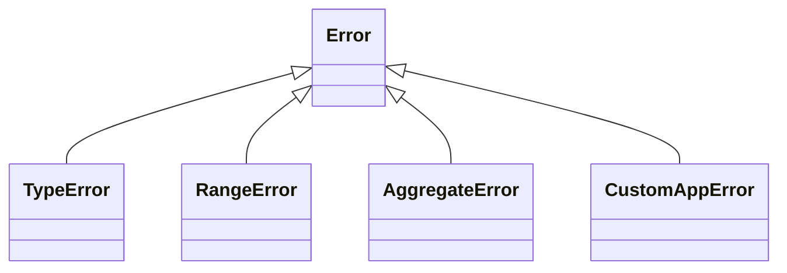
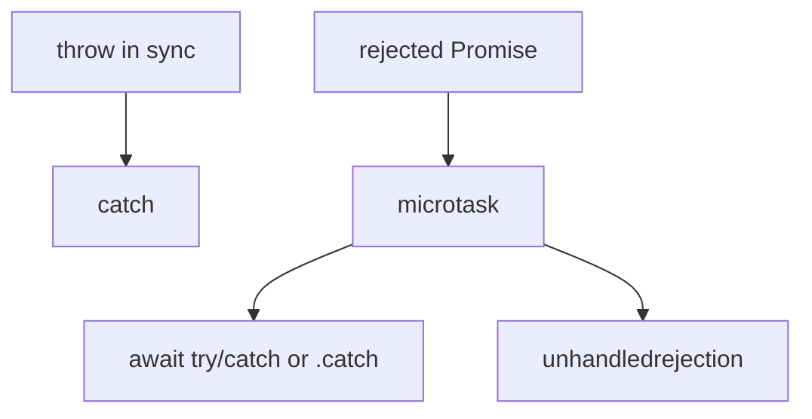

# Error Handling

Error types, `try/catch/finally`, async rejection paths, custom errors, and production patterns seniors are expected to describe.

## `Error` and subclasses

```ts
new Error("msg")
new TypeError("expected number")
new RangeError("index out of bounds")
new SyntaxError("…") // usually thrown by engine/parser
new URIError("…")
new AggregateError([e1, e2], "multiple") // Promise.any failures, etc.
```

```ts
const err = new Error("fail")
err.name        // "Error"
err.message     // "fail"
err.stack       // engine-dependent stack string
err.cause       // ES2022 — wrap underlying error
```



## Custom errors

```ts
class AppError extends Error {
  constructor(
    message: string,
    readonly code: string,
    options?: { cause?: unknown },
  ) {
    super(message, options)
    this.name = "AppError"
    // restore prototype chain when targeting ES5-ish runtimes:
    Object.setPrototypeOf(this, new.target.prototype)
  }
}

class HttpError extends AppError {
  constructor(
    readonly status: number,
    message: string,
    code = "HTTP_ERROR",
  ) {
    super(message, code)
    this.name = "HttpError"
  }
}

throw new HttpError(404, "Not found", "NOT_FOUND")
```

Use `instanceof` carefully across realms/iframes (different globals) — duck-type `code` / `name` at boundaries.

## `try` / `catch` / `finally`

```ts
function readConfig(path: string): string {
  let fd: number | undefined
  try {
    fd = open(path)
    return load(fd)
  } catch (e) {
    if (e instanceof AppError) throw e
    throw new AppError("config read failed", "CONFIG", { cause: e })
  } finally {
    if (fd !== undefined) close(fd) // always runs
  }
}
```

`finally` runs on return/throw from `try`/`catch`. A `return` inside `finally` **overrides** the try return (anti-pattern).

## Async: rejections are not `catch`ed by sync try

```ts
try {
  Promise.reject(new Error("nope")) // unhandled unless .catch / await
} catch {
  // does NOT run
}

try {
  await Promise.reject(new Error("nope"))
} catch (e) {
  // runs
}
```



### Fire-and-forget

```ts
void save().catch((e) => logger.error(e)) // explicit
// bare save() → unhandledrejection risk
```

## Pattern: Result types vs exceptions

```ts
type Result<T, E = AppError> =
  | { ok: true; value: T }
  | { ok: false; error: E }

function parseAge(raw: string): Result<number> {
  const n = Number(raw)
  if (!Number.isInteger(n) || n < 0) {
    return { ok: false, error: new AppError("bad age", "VALIDATION") }
  }
  return { ok: true, value: n }
}
```

| Approach | Use when |
| --- | --- |
| Exceptions | Truly unexpected / non-local abort |
| Result / error codes | Expected failure (validation, not-found) |
| Events / callbacks | Streaming / multi-error surfaces |

## Promise combinators & errors

```ts
await Promise.all([a, b])        // fail-fast first rejection
await Promise.allSettled([a, b]) // never rejects — inspect statuses
await Promise.any([a, b])        // rejects AggregateError if all fail
await Promise.race([a, b])       // first settle (fulfill or reject)
```

Implementations: [Machine Coding](/javascript/23-machine-coding).

## Global handlers (browser / Node)

```ts
// Browser
window.addEventListener("error", (ev) => {
  logger.error(ev.error ?? ev.message)
})
window.addEventListener("unhandledrejection", (ev) => {
  logger.error(ev.reason)
  // ev.preventDefault() sparingly
})

// Node
process.on("uncaughtException", (e) => { /* log & exit — process is unstable */ })
process.on("unhandledRejection", (reason) => { /* log; treat as crash in strict apps */ })
```

Production Node: prefer crash + restart on unknown state over continuing after `uncaughtException`.

## Operational vs programmer errors

```ts
// Operational: network down, 429, disk full → handle, retry, degrade
// Programmer: undefined is not a function → fix code, fail loud in prod with telemetry
```

Don't swallow:

```ts
try {
  await work()
} catch {
  // silent — production nightmare
}
```

## Error serialization

```ts
JSON.stringify(new Error("x")) // "{}"  — message not enumerable historically
```

Log explicitly:

```ts
function serializeError(e: unknown) {
  if (e instanceof Error) {
    return {
      name: e.name,
      message: e.message,
      stack: e.stack,
      cause: e.cause ? serializeError(e.cause) : undefined,
      ...(e instanceof AppError ? { code: e.code } : {}),
    }
  }
  return { message: String(e) }
}
```

## Interview Questions

**Q: Does `try/catch` catch rejected promises?**  
Only if the rejection is `await`ed inside the try (or you `.catch`). Sync `try` around `promise` creation does not.

**Q: What is `error.cause`?**  
Standard way to chain errors without hacking `.original` — preserves underlying stack context.

**Q: `Promise.all` vs `allSettled` for error handling?**  
`all` aborts on first failure; `allSettled` waits for all — better for batch jobs that should report every failure.

**Q: Should Node process continue after uncaughtException?**  
Generally no — state may be corrupt; log, flush, exit, let supervisor restart.

**Q: Why custom error classes?**  
Stable `code` for clients, `instanceof` branching, metrics by type, hide internal messages.

**Q: What does `finally` guarantee?**  
Runs on leave from try/catch whether return or throw — use for cleanup (but prefer `using`/disposers where available).

## Common Mistakes

- Empty `catch` blocks.
- Catching to log and rethrow incorrectly (losing stack) — use `cause`.
- Treating validation failures as 500s (or vice versa).
- Assuming `err.message` is safe to show to end users (info leak).
- Forgetting `AggregateError.errors`.
- Using `throw "string"` — breaks `instanceof Error` tooling.

## Trade-offs / Production Notes

- Map domain errors → HTTP status at the edge; keep core free of HTTP types when possible.
- Sample / rate-limit error telemetry to avoid cascades.
- User-facing messages ≠ log messages.
- Related: [Async](/javascript/11-async), [Machine Coding](/javascript/23-machine-coding), [Node production](/node/13-production), [Observability](/backend/09-observability).
