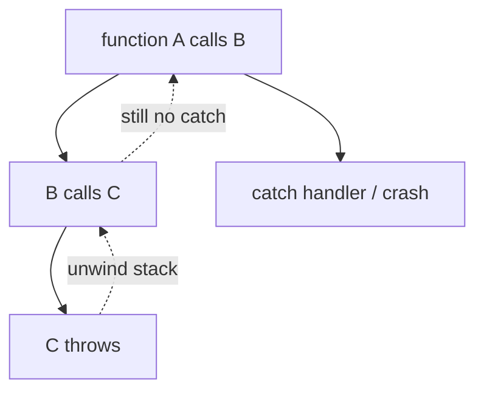
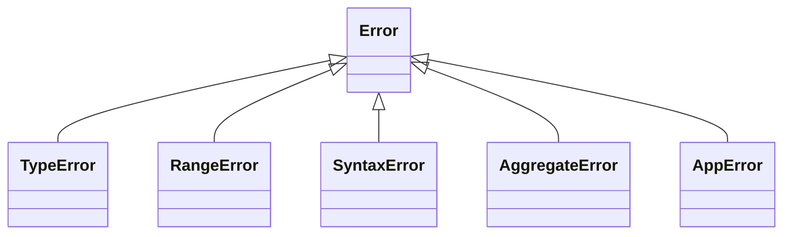
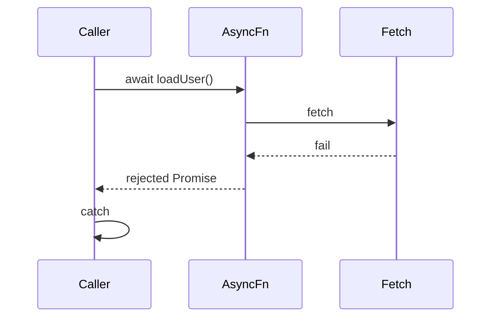
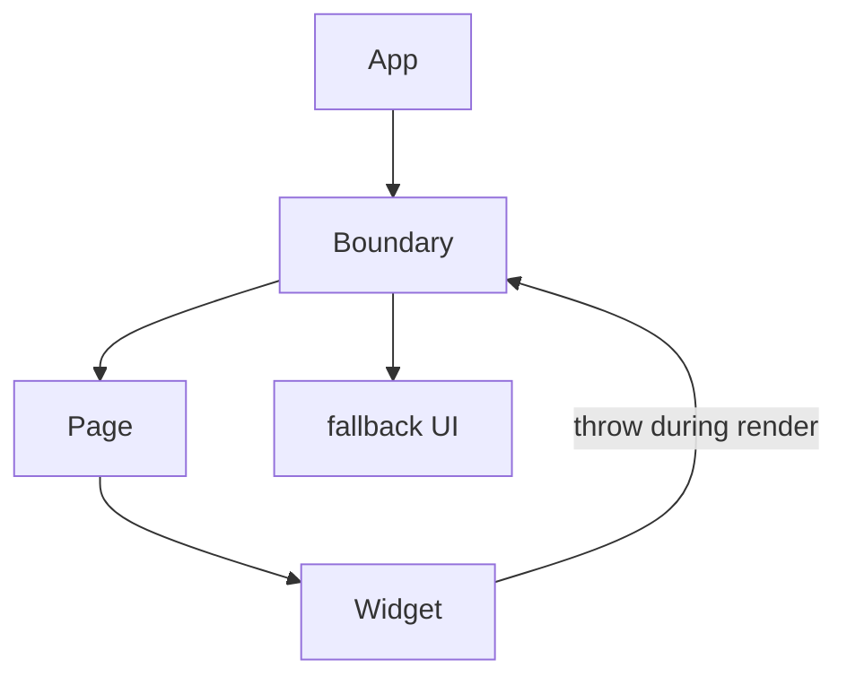

# Errors

This chapter teaches error handling from scratch: what an `Error` is, how `try` / `catch` / `finally` run, how to build custom errors, how async failures differ from sync throws, what “Error Boundaries” mean in UI frameworks, and how errors propagate in Node. You do not need prior experience with stacks or rejection handling. By the end you should be able to design a clear failure path for both sync and async code.

---

## 1. What is an “error” in a program?

Sometimes an operation cannot continue meaningfully:

- A file is missing
- JSON is malformed
- The user is not authenticated
- A network request fails

An **exception** is a way to **stop the normal path** and jump to a handler that knows what to do (retry, show a message, abort).

In JavaScript you **throw** a value (usually an `Error` object). Something up the call stack may **catch** it. If nothing catches it, the program (or the current async turn) fails loudly.

```ts
throw new Error("something went wrong")
```



---

## 2. The `Error` object — anatomy

```ts
const err = new Error("fail")
err.name     // "Error"
err.message  // "fail"
err.stack    // string stack trace (engine-dependent)
err.cause    // optional underlying error (ES2022)
```

Built-in subclasses you will see:

| Type | Typical meaning |
| --- | --- |
| `Error` | Generic |
| `TypeError` | Wrong type / bad method call |
| `RangeError` | Number out of allowed range |
| `SyntaxError` | Invalid syntax (often from `JSON.parse`, parsers) |
| `URIError` | Bad `encodeURI` / `decodeURI` usage |
| `AggregateError` | Multiple errors together (`Promise.any`, etc.) |

```ts
JSON.parse("{") // SyntaxError
;(null as unknown as { x: 1 }).x // TypeError at runtime
```



Always prefer throwing `Error` (or subclass) over throwing raw strings — stacks and tooling expect objects with `message` / `name`.

```ts
throw "nope"          // works, but hostile to debugging
throw new Error("nope") // do this
```

---

## 3. `try` / `catch` / `finally` — teaching the control flow

### 3.1 Basic shape

```ts
try {
  // risky work
} catch (e) {
  // handle failure
} finally {
  // always runs (cleanup)
}
```

Plain language:

1. Run `try`.
2. If something is thrown, skip the rest of `try` and run `catch`.
3. Whether success or failure, run `finally` (if present).
4. Then continue after the whole block — unless `catch`/`finally` rethrows or returns in a tricky way.

### 3.2 Walkthrough with return

```ts
function example(fail: boolean): string {
  try {
    if (fail) throw new Error("boom")
    return "ok"
  } catch (e) {
    return "caught"
  } finally {
    console.log("cleanup")
  }
}

example(false) // logs "cleanup", returns "ok"
example(true)  // logs "cleanup", returns "caught"
```

`finally` runs **even if** `try` or `catch` returns. Cleanup belongs here (close files, release locks, hide spinners).

### 3.3 `finally` can override a return (gotcha)

```ts
function f() {
  try {
    return 1
  } finally {
    return 2 // this wins — usually a mistake
  }
}
f() // 2
```

Do not return from `finally` unless you are deliberately forcing a result. Prefer cleanup only.

### 3.4 Catch binding

```ts
try {
  throw new Error("x")
} catch (e) {
  // e is unknown in TypeScript — narrow it
  if (e instanceof Error) {
    console.error(e.message)
  } else {
    console.error(String(e))
  }
}
```

Optional catch binding (when you do not need the value):

```ts
try {
  risky()
} catch {
  fallback()
}
```

---

## 4. Custom errors — teach a real pattern

### 4.1 Why custom errors?

So callers can **branch on kind**:

```ts
if (e instanceof NotFoundError) {
  return notFoundPage()
}
if (e instanceof AuthError) {
  redirectToLogin()
}
throw e // unknown — let it propagate
```

Strings or ad-hoc `{ code: 404 }` objects do not compose as well with `instanceof` and stacks.

### 4.2 Implementation

```ts
class AppError extends Error {
  constructor(
    message: string,
    readonly code: string,
    options?: { cause?: unknown },
  ) {
    super(message, options)
    this.name = "AppError"
    // Helps when targeting older downlevel compiles:
    Object.setPrototypeOf(this, new.target.prototype)
  }
}

class HttpError extends AppError {
  constructor(
    readonly status: number,
    message: string,
    code = "HTTP_ERROR",
  ) {
    super(message, code)
    this.name = "HttpError"
  }
}

class NotFoundError extends HttpError {
  constructor(message = "Not found") {
    super(404, message, "NOT_FOUND")
    this.name = "NotFoundError"
  }
}

throw new NotFoundError("User missing")
```

### 4.3 `cause` for wrapping

Wrap lower-level failures without losing the original:

```ts
try {
  JSON.parse(raw)
} catch (e) {
  throw new AppError("Invalid config JSON", "CONFIG", { cause: e })
}
```

Debuggers and logs can show the chain: outer message + inner `SyntaxError`.

### 4.4 Realm / iframe caveat

`instanceof Error` can fail across iframes (different global `Error` constructors). At boundaries, duck-type:

```ts
function isAppError(e: unknown): e is AppError {
  return (
    typeof e === "object" &&
    e !== null &&
    "code" in e &&
    typeof (e as { code: unknown }).code === "string"
  )
}
```

---

## 5. Sync example — resources and wrapping

```ts
declare function open(path: string): number
declare function load(fd: number): string
declare function close(fd: number): void

function readConfig(path: string): string {
  let fd: number | undefined
  try {
    fd = open(path)
    return load(fd)
  } catch (e) {
    if (e instanceof AppError) throw e
    throw new AppError("config read failed", "CONFIG", { cause: e })
  } finally {
    if (fd !== undefined) close(fd)
  }
}
```

Teaching points:

- `finally` closes the file even when `load` throws
- Unknown errors get wrapped with context; known `AppError`s pass through

---

## 6. Async errors — the part people miss

### 6.1 `throw` inside `async` becomes rejection

```ts
async function loadUser(id: string) {
  if (!id) throw new Error("id required") // rejects the returned Promise
  const res = await fetch(`/api/users/${id}`)
  if (!res.ok) throw new HttpError(res.status, "fetch failed")
  return res.json()
}
```

Callers must handle the Promise:

```ts
try {
  const user = await loadUser("1")
  console.log(user)
} catch (e) {
  console.error(e)
}

// or
loadUser("1").catch((e) => console.error(e))
```

### 6.2 `try/catch` does **not** catch async work you forgot to await

```ts
async function broken() {
  try {
    loadUser("1") // forgot await — returns a Promise, try succeeds immediately
  } catch (e) {
    // will NOT catch loadUser's failure
  }
}
```

```ts
async function fixed() {
  try {
    await loadUser("1")
  } catch (e) {
    // catches rejection
  }
}
```



### 6.3 Floating promises

```ts
loadUser("1") // no await, no .catch — rejection may become "unhandledRejection"
```

Always either:

- `await` in an async function with `try/catch`, or
- `.catch(...)`, or
- pass to a helper that logs (`void loadUser().catch(log)`)

### 6.4 `Promise.all` vs `allSettled`

```ts
try {
  await Promise.all([a(), b()]) // fails fast on first rejection
} catch (e) { /* first failure */ }

const results = await Promise.allSettled([a(), b()])
// each result is { status: "fulfilled", value } | { status: "rejected", reason }
```

`AggregateError` appears with `Promise.any` when **all** fail.

---

## 7. Error Boundaries — the UI idea (React-oriented)

Backend/services catch errors in handlers. **UI trees** need a similar idea: if one widget crashes while rendering, do not blank the whole page.

In React, an **Error Boundary** is a component that catches **render / lifecycle** errors in its children and shows a fallback UI.

```tsx
import { Component, type ErrorInfo, type ReactNode } from "react"

type Props = { children: ReactNode; fallback: ReactNode }
type State = { hasError: boolean }

class ErrorBoundary extends Component<Props, State> {
  state: State = { hasError: false }

  static getDerivedStateFromError(): State {
    return { hasError: true }
  }

  componentDidCatch(error: Error, info: ErrorInfo) {
    console.error("UI crash", error, info.componentStack)
    // report to logging service
  }

  render() {
    if (this.state.hasError) return this.props.fallback
    return this.props.children
  }
}

// usage
;<ErrorBoundary fallback={<p>Something went wrong.</p>}>
  <ProfilePage />
</ErrorBoundary>
```

Critical limits (interview favorite):

- Error Boundaries catch errors in **render**, constructors, and lifecycle methods of children.
- They do **not** catch errors inside **event handlers**, **async code**, or **SSR** the same way — handle those with local `try/catch` / `.catch`.
- React 18+ / frameworks may have additional recovery APIs; the **idea** stays: isolate failure domains in the tree.



---

## 8. Node.js: how errors propagate

### 8.1 Sync throw

Same as browsers: bubbles up the stack until `catch` or crashes the process (depending on environment / hooks).

### 8.2 Callback style (legacy)

```js
fs.readFile("x.txt", (err, data) => {
  if (err) {
    // handle — do not throw blindly inside without listener
    return void console.error(err)
  }
  console.log(data)
})
```

Convention: **first argument is `Error | null`**.

### 8.3 Promises / async

Unhandled rejections:

```ts
process.on("unhandledRejection", (reason) => {
  console.error("unhandledRejection", reason)
  // In modern Node, unhandled rejections may terminate the process
})
```

Also:

```ts
process.on("uncaughtException", (err) => {
  console.error("uncaughtException", err)
  // Log, then exit — process may be in unknown state
  process.exit(1)
})
```

Production guidance:

- Treat `uncaughtException` as **fatal** — log and exit; do not keep serving traffic casually.
- Prefer catching at request boundaries (HTTP handler) so one bad request does not kill the server.

### 8.4 Express-style request boundary (sketch)

```ts
app.get("/user/:id", async (req, res, next) => {
  try {
    const user = await loadUser(req.params.id)
    res.json(user)
  } catch (e) {
    next(e) // pass to error middleware
  }
})

app.use((err: unknown, _req, res, _next) => {
  if (err instanceof NotFoundError) {
    return res.status(404).json({ error: err.message, code: err.code })
  }
  console.error(err)
  res.status(500).json({ error: "Internal error" })
})
```

Map known domain errors to status codes; hide internals from clients.

---

## 9. Logging and user-facing messages

Separate three layers:

| Layer | Example |
| --- | --- |
| User message | “Could not save. Try again.” |
| App code / error code | `SAVE_FAILED` |
| Internal detail / stack | logged to Sentry, not shown |

```ts
function toClientError(e: unknown): { status: number; body: object } {
  if (e instanceof HttpError) {
    return { status: e.status, body: { code: e.code, message: e.message } }
  }
  console.error(e) // full detail server-side
  return { status: 500, body: { code: "INTERNAL", message: "Something went wrong" } }
}
```

Never leak stack traces or DB strings to end users in production.

---

## 10. Patterns: fail fast, recover, or wrap

```ts
// Fail fast — bad input
function sqrt(n: number) {
  if (n < 0) throw new RangeError("n must be ≥ 0")
  return Math.sqrt(n)
}

// Recover — optional path
function parseJsonSafe(raw: string): unknown | null {
  try {
    return JSON.parse(raw)
  } catch {
    return null
  }
}

// Wrap — add context at boundaries
async function loadSettings() {
  try {
    return await fetchSettings()
  } catch (e) {
    throw new AppError("settings unavailable", "SETTINGS", { cause: e })
  }
}
```

Empty `catch` that swallows everything is almost always wrong:

```ts
try {
  await save()
} catch {
  // silent — future you will hate this
}
```

At minimum log; usually rethrow or return a Result type.

---

## 11. Result types (alternative to exceptions)

Some codebases prefer explicit outcomes:

```ts
type Result<T, E = Error> =
  | { ok: true; value: T }
  | { ok: false; error: E }

function divide(a: number, b: number): Result<number, AppError> {
  if (b === 0) return { ok: false, error: new AppError("div by zero", "MATH") }
  return { ok: true, value: a / b }
}

const r = divide(10, 0)
if (!r.ok) {
  console.error(r.error.code)
} else {
  console.log(r.value)
}
```

Trade-off: more verbose, but control flow stays visible; no surprise throws. Exceptions still shine for truly exceptional / deep stack failures.

---

## 12. Worked end-to-end story

```ts
class ValidationError extends AppError {
  constructor(message: string) {
    super(message, "VALIDATION")
    this.name = "ValidationError"
  }
}

async function createUser(input: unknown) {
  if (typeof input !== "object" || input === null || !("email" in input)) {
    throw new ValidationError("email required")
  }
  const email = String((input as { email: unknown }).email)
  try {
    return await db.user.create({ email })
  } catch (e) {
    throw new AppError("db create failed", "DB", { cause: e })
  }
}

async function handler(body: unknown) {
  try {
    const user = await createUser(body)
    return { status: 201, body: user }
  } catch (e) {
    if (e instanceof ValidationError) {
      return { status: 400, body: { code: e.code, message: e.message } }
    }
    console.error(e)
    return { status: 500, body: { code: "INTERNAL", message: "Failed" } }
  }
}
```

---

## Interview Questions

### Q1. What does `finally` guarantee?
**Expected:** It runs after `try`/`catch` whether the try succeeded, threw, or returned — used for cleanup.  
**Common wrong:** “Only runs on errors.”  
**Follow-ups:** What if `finally` itself throws? (It propagates; can mask earlier errors.)

### Q2. How do you make a custom error?
**Expected:** `class X extends Error`, set `name`, pass `message` to `super`, optionally `cause` / custom fields like `code`.  

### Q3. Does `try/catch` catch async errors?
**Expected:** Only if you `await` the promise (or use `.catch`). Forgetting `await` leaves a floating rejection.  

### Q4. What is an Error Boundary?
**Expected:** UI component that catches render/lifecycle errors in children and shows fallback; does not replace handling in events/async.  

### Q5. `uncaughtException` in Node — keep running?
**Expected:** Generally no — log and exit; state may be corrupt. Catch at boundaries instead.  

### Q6. Why not `throw "string"`?
**Expected:** Loses structured `name`/`stack` conventions; harder to `instanceof` and log consistently.  

## Common Mistakes

- Empty `catch` blocks that swallow failures.
- Catching too broadly and hiding bugs.
- Forgetting `await` inside `try`.
- Returning from `finally` and overriding real results.
- Showing stack traces to end users.
- Using Error Boundaries for event-handler failures (they will not catch them).
- Mixing callback `err` style with throws inconsistently in Node.

## Trade-offs / Production Notes

- **Exceptions** for exceptional paths; **Result types** when failures are common and local.
- Centralize mapping of domain errors → HTTP/UI at the **boundary**, not in every helper.
- Instrument with `cause` chains and a logging service (Sentry, etc.).
- In React, place Error Boundaries around independent panels so one crash does not take the whole app.
- Related: [Async](/javascript/11-async), [Event Loop](/javascript/10-event-loop), [Modules](/javascript/13-modules), machine-coding error UX in forms.
