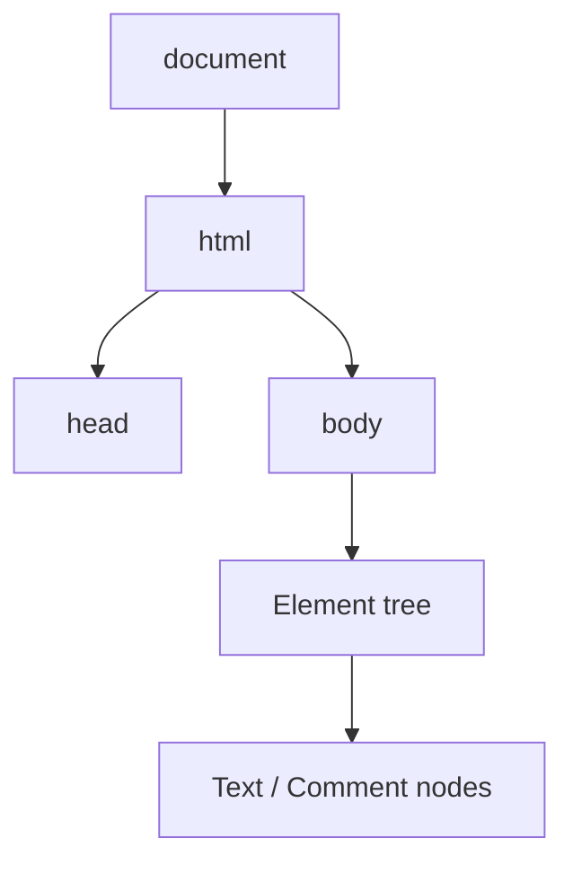
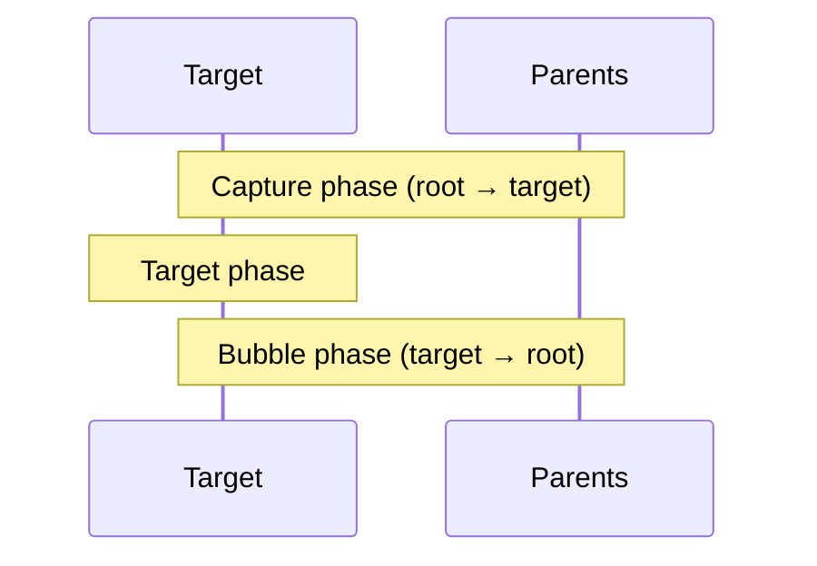
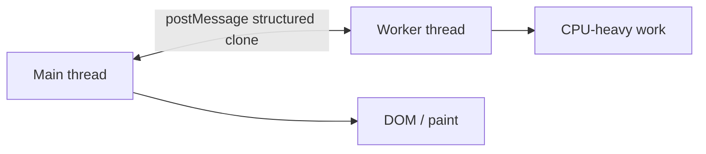

# Browser APIs

DOM, events, storage, network, observers, and workers — the Web platform surface senior FE interviews probe beyond framework APIs.

## DOM essentials

```ts
const el = document.querySelector<HTMLButtonElement>("#save")
el?.addEventListener("click", onSave)

document.createElement("div")
parent.append(child)           // modern; accepts nodes/strings
parent.appendChild(child)      // Node only
el.classList.add("active")
el.setAttribute("aria-busy", "true")
el.dataset.userId = "1"        // data-user-id
```



Reflow triggers: reading `offsetHeight` after writes → layout thrashing. Batch DOM reads then writes — see [Rendering](/javascript/20-rendering) & [Performance](/javascript/22-performance).

## Events & propagation

```ts
parent.addEventListener("click", handler, { capture: true, once: true, passive: true })
```



```ts
ev.stopPropagation()
ev.stopImmediatePropagation()
ev.preventDefault()
ev.target      // originating node (can be child)
ev.currentTarget // node with the listener
```

Delegation: one listener on parent for many children — critical for dynamic lists.

```ts
list.addEventListener("click", (e) => {
  const btn = (e.target as HTMLElement).closest("button[data-id]")
  if (!btn || !list.contains(btn)) return
  const id = btn.dataset.id
})
```

`passive: true` on touch/wheel improves scroll jank (can't `preventDefault`).

## Timers & animation

```ts
const id = setTimeout(fn, 0)     // macrotask ≥ 0
const i = setInterval(fn, 1000)
requestAnimationFrame((t) => {}) // before paint; use for visual work
queueMicrotask(() => {})         // microtask — see [Event Loop](/javascript/10-event-loop)
```

## Storage

| API | Lifetime | Size-ish | Scope | Notes |
| --- | --- | --- | --- | --- |
| `localStorage` | persistent | ~5MB | origin | sync, strings only |
| `sessionStorage` | tab session | ~5MB | origin+tab | sync |
| Cookies | configurable | ~4KB | configurable | sent with requests |
| IndexedDB | persistent | large | origin | async, structured clone |
| Cache Storage | persistent | large | origin | service worker / PWA |
| `sessionStorage` vs memory | — | — | — | memory lost on refresh |

```ts
localStorage.setItem("k", JSON.stringify(obj))
const v = JSON.parse(localStorage.getItem("k") ?? "null")

document.cookie = `token=${value}; Path=/; Secure; SameSite=Lax`
```

Never store secrets in `localStorage` (XSS → exfiltration). Prefer httpOnly cookies for session tokens — [Security](/javascript/21-security).

## Network

```ts
const res = await fetch("/api", {
  method: "POST",
  headers: { "Content-Type": "application/json" },
  body: JSON.stringify(payload),
  signal: AbortSignal.timeout(8_000),
  credentials: "include", // cookies cross-site rules apply
})
if (!res.ok) throw new HttpError(res.status, await res.text())
const data: User = await res.json()
```

```ts
const ac = new AbortController()
fetch(url, { signal: ac.signal })
ac.abort()
```

Other: `navigator.sendBeacon` for unload-safe analytics; WebSocket / EventSource for push.

## Observers

```ts
// Layout / size
new ResizeObserver((entries) => {
  for (const e of entries) console.log(e.contentRect)
}).observe(el)

// Viewport intersection — lazy load / infinite scroll
new IntersectionObserver((entries) => {
  if (entries[0]?.isIntersecting) loadMore()
}, { rootMargin: "100px" }).observe(sentinel)

// DOM mutations
new MutationObserver((muts) => {}).observe(root, {
  childList: true,
  subtree: true,
  attributes: true,
})

// Paint / layout shifts
new PerformanceObserver((list) => {
  for (const e of list.getEntries()) console.log(e)
}).observe({ type: "largest-contentful-paint", buffered: true })
```

## History & URL

```ts
const url = new URL(location.href)
url.searchParams.set("q", "ada")
history.pushState({ page: 1 }, "", url)
window.addEventListener("popstate", (e) => {
  // back/forward
})
```

SPA routers wrap this; know the native layer for interviews.

## Workers

```ts
// worker.ts
self.onmessage = (e) => {
  const result = heavy(e.data)
  self.postMessage(result)
}

// main
const w = new Worker(new URL("./worker.ts", import.meta.url), { type: "module" })
w.postMessage(data)
w.onmessage = (e) => console.log(e.data)
```



SharedWorker, ServiceWorker (network proxy / offline), Worklet (audio/paint) — name-drop with one use case each.

## Clipboard, media, permissions (awareness)

```ts
await navigator.clipboard.writeText(text) // requires permission / secure context
await navigator.mediaDevices.getUserMedia({ video: true })
```

Secure context (`https` or localhost) required for many powerful APIs.

## Interview Questions

**Q: Event bubbling vs capturing?**  
Capture root→target, then bubble target→root. Most handlers use bubble; capture for intercept-early.

**Q: Why event delegation?**  
Fewer listeners, works for dynamic children, lower memory.

**Q: `localStorage` vs cookies for auth?**  
httpOnly Secure SameSite cookies resist XSS theft better than LS tokens. LS is XSS-accessible JS.

**Q: What does `AbortController` do?**  
Cancels fetch/streams; propagates abort signals to ignore stale responses.

**Q: When use `requestAnimationFrame` vs `setTimeout`?**  
rAF syncs to refresh rate for animations; setTimeout is timer macrotask — drift, not paint-aligned.

**Q: Why workers?**  
Move CPU off main thread to keep input/RAF responsive; can't touch DOM directly.

## Common Mistakes

- Layout thrashing (interleaved read/write).
- Non-passive touch listeners blocking scroll.
- Storing JWTs in `localStorage`.
- Forgetting to `disconnect()` observers → leaks.
- Assuming `fetch` throws on 404 (it doesn't — check `res.ok`).
- Updating React state from observers without cleanup in `useEffect`.

## Trade-offs / Production Notes

- Prefer framework abstractions but know native escape hatches for perf debugging.
- Feature-detect (`"IntersectionObserver" in window`) + progressive enhancement.
- Cross-link: [Event Loop](/javascript/10-event-loop), [Rendering](/javascript/20-rendering), [Security](/javascript/21-security), [Browser storage](/browser/08-storage).
