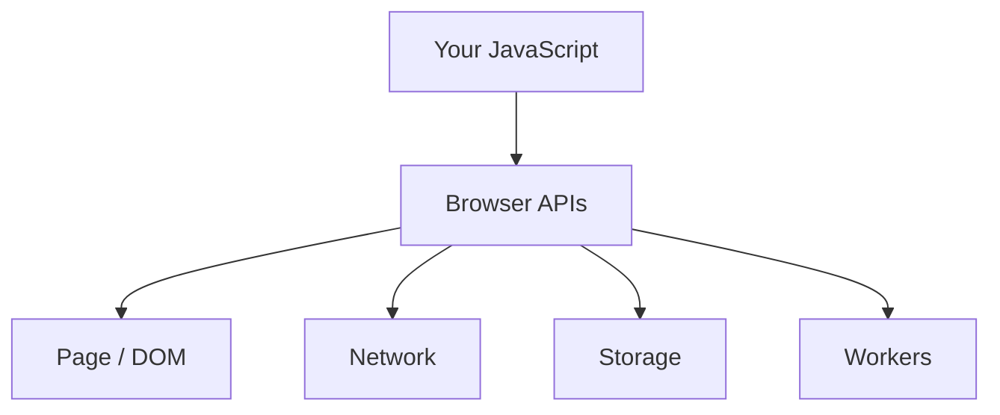
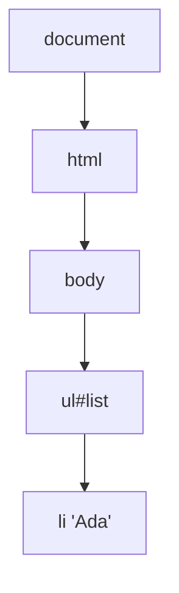
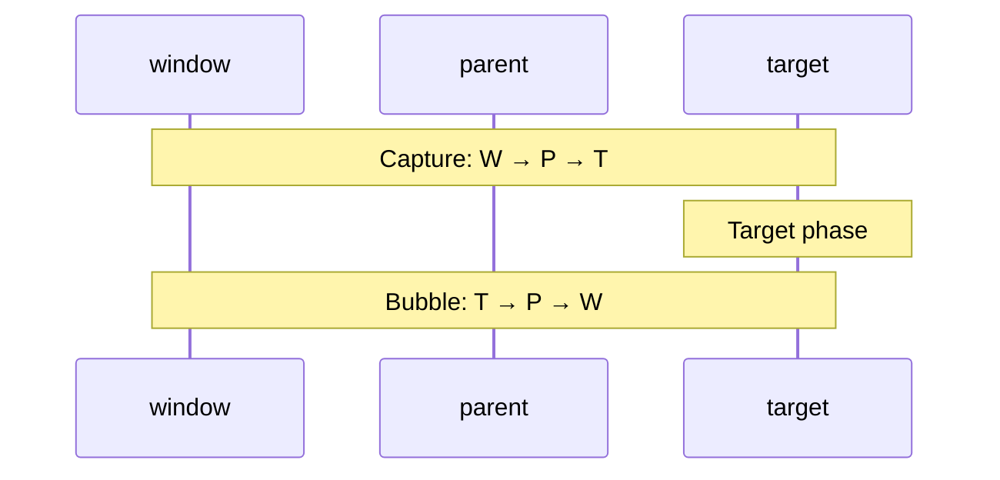
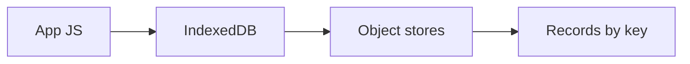
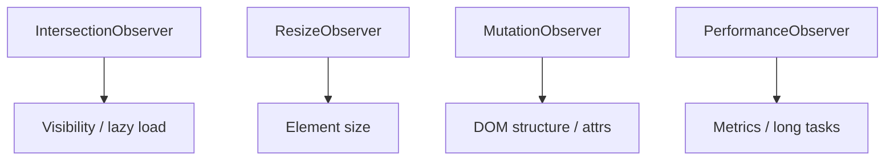
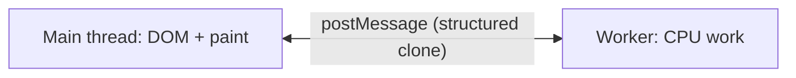

# Browser APIs

This chapter teaches browser APIs from scratch. You do not need to already know “observers,” IndexedDB, or workers. By the end you should be able to explain **what the DOM is**, **how events travel**, **what each storage option is for**, **why observers exist**, and **when to move work off the main thread**.

---

## 1. The problem these APIs solve

A JavaScript file alone cannot draw a button or save a user’s draft. The **browser** owns the page, network, disk, and GPU. It exposes **APIs** — functions and objects your code can call — so your script can:

1. **Change the page** (DOM)
2. **React to the user** (events)
3. **Remember data** (storage)
4. **Talk to servers** (`fetch`)
5. **Watch for changes** (observers) without busy-polling
6. **Do heavy work without freezing the UI** (workers)



Frameworks (React, Vue) sit **on top** of these APIs. Interviews often ask: “What is React actually calling under the hood?”

---

## 2. The DOM — the page as a tree of objects

### 2.1 Plain-language idea

When the browser reads HTML, it does not leave it as a string forever. It builds a live **tree of objects** called the **DOM** (Document Object Model).

Analogy: HTML is the blueprint; the DOM is the house you can walk through and remodel. Change a DOM node → the screen updates.

```html
<body>
  <ul id="list">
    <li>Ada</li>
  </ul>
</body>
```



### 2.2 Finding and changing nodes

```ts
const btn = document.querySelector<HTMLButtonElement>("#save")
btn?.addEventListener("click", () => {
  console.log("save clicked")
})

const div = document.createElement("div")
div.textContent = "Hello" // safe for untrusted text
document.body.append(div)

el.classList.add("active")
el.dataset.userId = "1" // becomes data-user-id="1"
el.setAttribute("aria-busy", "true")
```

| Method | What it is for |
| --- | --- |
| `querySelector` / `querySelectorAll` | Find nodes with CSS selectors |
| `createElement` + `append` | Build UI in code |
| `textContent` | Set **text** (does not parse HTML) |
| `innerHTML` | Parse HTML string — powerful, **dangerous** with user input |
| `classList` / `dataset` | Classes and `data-*` attributes |

### 2.3 Why DOM work can be “expensive”

Changing the tree can force the browser to **recalculate layout** (where everything sits). If you repeatedly **write** then **read** layout (`offsetHeight`, `getBoundingClientRect`) in a loop, the browser may reflow over and over — **layout thrashing**.

```ts
// Bad: write → read → write → read
for (const el of els) {
  el.style.width = "100px"
  void el.offsetHeight // forces layout now
}

// Better: write all, then read all (or use rAF)
for (const el of els) el.style.width = "100px"
```

Deep dive: [Rendering](/javascript/20-rendering).

---

## 3. Events — how the browser tells you “something happened”

### 3.1 Listeners

```ts
button.addEventListener("click", (ev) => {
  console.log(ev.target)        // who was clicked (may be a child)
  console.log(ev.currentTarget) // the element with this listener
})
```

Options you will see in interviews:

```ts
parent.addEventListener("click", handler, {
  capture: true,  // listen on the way DOWN
  once: true,     // auto-remove after one fire
  passive: true,  // promise not to preventDefault — helps scroll
})
```

### 3.2 Capture → target → bubble

When you click a button inside a list, the event does **not** only hit the button. It travels:

1. **Capture** — from `window` down toward the target  
2. **Target** — the element that was hit  
3. **Bubble** — back up toward `window`



Most code uses the **bubble** phase (default). Capture is for “intercept early” (outside-click libs, some analytics).

```ts
ev.stopPropagation()          // stop further travel
ev.stopImmediatePropagation() // also skip other listeners on same node
ev.preventDefault()           // cancel browser default (link nav, form submit)
```

### 3.3 Event delegation — one listener for many children

Problem: a list of 1,000 rows. Attaching 1,000 click handlers wastes memory and breaks when rows are added later.

Solution: listen on the **parent**, ask “which child was clicked?”

```ts
list.addEventListener("click", (e) => {
  const btn = (e.target as HTMLElement).closest("button[data-id]")
  if (!btn || !list.contains(btn)) return
  const id = btn.dataset.id
  // handle click for that row
})
```

`closest` walks up from the click target until it finds a matching selector. That is how dynamic UIs stay efficient.

---

## 4. Timers and animation frames

```ts
setTimeout(fn, 0)              // “soon” as a macrotask — not instantly
setInterval(fn, 1000)          // repeating macrotask — clear it!
requestAnimationFrame((t) => {
  // right before the next paint — use for visual updates
})
queueMicrotask(() => {})       // microtask — see [Event Loop](/javascript/10-event-loop)
```

Plain language:

| API | Use it when |
| --- | --- |
| `setTimeout` | Delay work, debounce, schedule non-visual tasks |
| `setInterval` | Polling / clocks (prefer clearer patterns when possible) |
| `requestAnimationFrame` | Animations and measuring layout before paint |
| `queueMicrotask` | Run ASAP after current JS, before next paint/macrotask |

`setTimeout(16)` is **not** reliable 60fps. Use `requestAnimationFrame` for animation.

---

## 5. Storage — remembering data in the browser

Different APIs exist because “save something” has different requirements: size, lifetime, whether it goes on every request, sync vs async.

| API | Lifetime | Size (rough) | Sync? | Sent to server? | Best for |
| --- | --- | --- | --- | --- | --- |
| `localStorage` | Until cleared | ~5MB | Yes | No | Small prefs, non-secret UI state |
| `sessionStorage` | Tab session | ~5MB | Yes | No | Per-tab wizard draft |
| Cookies | Configurable | ~4KB | N/A | Often yes | Auth session (with flags) |
| IndexedDB | Until cleared | Large | No (async) | No | Offline data, large structured records |
| Cache Storage | Until cleared | Large | Async | No | App shells / SW caches |

### 5.1 `localStorage` / `sessionStorage`

```ts
localStorage.setItem("theme", "dark")
const theme = localStorage.getItem("theme") // string | null

// Objects must be serialized
localStorage.setItem("user", JSON.stringify({ id: 1 }))
const user = JSON.parse(localStorage.getItem("user") ?? "null")
```

They are **synchronous** and **string-only**. Blocking the main thread with big JSON is a real footgun.

> [!WARNING]
> Never store access tokens or secrets in `localStorage`. Any XSS can read it. Prefer **HttpOnly** cookies for session auth — [Security](/javascript/21-security).

`sessionStorage` is per **tab**. Refresh keeps it; a new tab gets a fresh copy.

### 5.2 Cookies (brief — security chapter goes deeper)

```ts
document.cookie = `theme=dark; Path=/; Secure; SameSite=Lax`
```

Cookies can be sent automatically on requests. That is powerful for login sessions and dangerous for CSRF if misconfigured.

### 5.3 IndexedDB — a real database in the browser

**What it is for:** large structured data (offline apps, drafts, media metadata) that does not fit in `localStorage`.

**How it works (basic):**

1. Open a named database (versioned)
2. Create **object stores** (like tables)
3. Run **transactions** to read/write
4. Everything is **async** (callbacks or promises via wrappers / `idb` library)

```ts
// Sketch — real apps often use the `idb` helper library
const req = indexedDB.open("notes-db", 1)

req.onupgradeneeded = () => {
  const db = req.result
  db.createObjectStore("notes", { keyPath: "id" })
}

req.onsuccess = () => {
  const db = req.result
  const tx = db.transaction("notes", "readwrite")
  tx.objectStore("notes").put({ id: "1", text: "hello" })
}
```

Data is cloned with the **structured clone** algorithm (Dates, Maps, etc. can survive — unlike `JSON` in localStorage).



---

## 6. Network — `fetch` and friends

```ts
const res = await fetch("/api/users", {
  method: "POST",
  headers: { "Content-Type": "application/json" },
  body: JSON.stringify({ name: "Ada" }),
  signal: AbortSignal.timeout(8_000),
  credentials: "include", // send cookies when CORS allows
})

if (!res.ok) {
  throw new Error(`HTTP ${res.status}`)
}
const data: User = await res.json()
```

Critical facts:

- `fetch` **does not throw** on 404/500 — only on network failure / abort. Always check `res.ok` or `res.status`.
- Cancel with `AbortController` so stale responses do not update UI after navigate away.

```ts
const ac = new AbortController()
fetch(url, { signal: ac.signal })
ac.abort() // rejects with AbortError
```

Also know by name:

- `navigator.sendBeacon` — fire-and-forget on unload (analytics)
- `WebSocket` / `EventSource` — push from server

---

## 7. Observers — “tell me when X changes” without polling

Polling (`setInterval` + measure) wastes CPU. Observers are **push** APIs: the browser notifies you when something interesting happens.

### 7.1 `IntersectionObserver` — visibility

**For:** lazy-load images, infinite scroll, “was this ad seen?”, pause video off-screen.

**How:** you observe an element; the browser tells you when its intersection with a root (usually the viewport) crosses a threshold.

```ts
const io = new IntersectionObserver(
  (entries) => {
    for (const entry of entries) {
      if (entry.isIntersecting) {
        loadMore()
        // optionally io.unobserve(entry.target)
      }
    }
  },
  { root: null, rootMargin: "200px", threshold: 0 },
)

io.observe(sentinelEl)
```

`rootMargin: "200px"` means “start loading a bit **before** it enters the screen” — smoother infinite scroll.

### 7.2 `ResizeObserver` — element size changes

**For:** chart that must redraw when its container width changes; responsive components without listening to `window.resize` (which fires for the whole window, not one box).

```ts
const ro = new ResizeObserver((entries) => {
  for (const entry of entries) {
    const { width, height } = entry.contentRect
    redrawChart(width, height)
  }
})
ro.observe(chartContainer)
```

### 7.3 `MutationObserver` — DOM changed

**For:** integrate with third-party widgets that mutate the DOM; build editor tooling; detect when nodes appear.

```ts
const mo = new MutationObserver((mutations) => {
  for (const m of mutations) {
    // childList / attributes / characterData
  }
})
mo.observe(root, { childList: true, subtree: true, attributes: true })
```

Callbacks often run as **microtasks** — be careful not to create infinite mutation loops.

### 7.4 Always clean up

```ts
io.disconnect()
ro.disconnect()
mo.disconnect()
```

Forgotten observers keep references → memory leaks (especially in SPAs).



---

## 8. Clipboard API

**For:** “Copy invite link,” paste from clipboard in editors.

```ts
await navigator.clipboard.writeText("https://example.com/invite")
const text = await navigator.clipboard.readText()
```

Requires a **secure context** (HTTPS or localhost) and often a **user gesture** + permission. Older fallback: `document.execCommand("copy")` on a temporary `<textarea>` — still seen in legacy code.

---

## 9. Web Workers — a second JS thread

### 9.1 The problem

JavaScript on the page runs on the **main thread**, which also does layout and paint. A long CPU loop freezes clicks and scrolling.

### 9.2 The idea

A **Worker** is another JavaScript environment with its **own** event loop. You send messages in/out. It **cannot** touch the DOM.

```ts
// worker.ts
self.onmessage = (e: MessageEvent<number[]>) => {
  const sum = e.data.reduce((a, b) => a + b, 0)
  self.postMessage(sum)
}

// main.ts
const w = new Worker(new URL("./worker.ts", import.meta.url), { type: "module" })
w.postMessage([1, 2, 3, 4])
w.onmessage = (e) => console.log("sum", e.data)
```



Data is **copied** (structured clone), not shared by default. `SharedArrayBuffer` exists but has strict security requirements.

Name-drop relatives:

| Type | For |
| --- | --- |
| Dedicated `Worker` | One page, heavy CPU |
| `SharedWorker` | Shared across tabs of same origin (rarer) |
| `ServiceWorker` | Network proxy, offline, push — different job |
| Worklets | Audio / CSS paint — specialized |

---

## 10. `BroadcastChannel` — talk between tabs

**For:** “User logged out in tab A → log out tab B,” sync theme across tabs of the same origin.

```ts
const bc = new BroadcastChannel("auth")

bc.postMessage({ type: "logout" })

bc.onmessage = (e) => {
  if (e.data.type === "logout") clearLocalState()
}
```

Same-origin only. Simpler than `localStorage` `'storage'` events for many cases. Close when done: `bc.close()`.

---

## 11. History & URL (SPA foundation)

```ts
const url = new URL(location.href)
url.searchParams.set("q", "ada")
history.pushState({ page: 1 }, "", url) // change URL without full reload

window.addEventListener("popstate", () => {
  // back / forward
})
```

Client-side routers wrap this. Interviews like hearing the **native** layer underneath React Router / Next App Router navigation.

---

## 12. Permissions & secure contexts

Many powerful APIs need HTTPS (or localhost): clipboard, geolocation, camera, service workers, etc.

```ts
const stream = await navigator.mediaDevices.getUserMedia({ video: true })
```

Always feature-detect:

```ts
if ("IntersectionObserver" in window) {
  // use it
} else {
  // fallback
}
```

---

## Interview Questions

### Q1. What is the DOM?
**Expected:** A live tree of objects representing the page document. JavaScript reads and mutates nodes; the browser updates rendering from those changes.  
**Common wrong:** “DOM is just the HTML file on disk.”  
**Follow-ups:** Difference between HTML source and DOM after JS runs?

### Q2. Capture vs bubble?
**Expected:** Capture travels root→target, then bubble target→root. Default listeners use bubble. Capture intercepts earlier.  
**Common wrong:** “Bubble happens first.”  
**Follow-ups:** When would you use capture?

### Q3. Why event delegation?
**Expected:** One parent listener handles many children via `target`/`closest`; works for dynamic nodes; fewer listeners.  
**Common wrong:** “You must attach a listener to every button.”  
**Follow-ups:** Show the `closest` + `contains` guard pattern.

### Q4. `localStorage` vs cookies for auth tokens?
**Expected:** `localStorage` is readable by any XSS script. HttpOnly Secure cookies are not readable from JS and are the better default for session cookies (with CSRF defenses).  
**Common wrong:** “localStorage is fine for JWTs if the site uses HTTPS.”  
**Follow-ups:** What does SameSite do?

### Q5. What is IndexedDB for?
**Expected:** Async, large, structured client storage beyond the small sync string quota of Web Storage — offline apps, caches of records.  
**Common wrong:** “It’s just localStorage with a different name.”  
**Follow-ups:** Structured clone vs JSON?

### Q6. IntersectionObserver vs scroll listeners?
**Expected:** IO lets the browser report visibility efficiently; avoids expensive scroll handlers measuring layout every frame.  
**Common wrong:** “They are the same performance.”  
**Follow-ups:** What is `rootMargin` for?

### Q7. Why Web Workers?
**Expected:** Move CPU-heavy work off the main thread so input and painting stay responsive; workers cannot access the DOM; communicate via `postMessage`.  
**Common wrong:** “Workers make network requests faster.”  
**Follow-ups:** Service Worker vs dedicated Worker?

### Q8. Does `fetch` throw on HTTP 500?
**Expected:** No — network errors/abort throw; HTTP error statuses still resolve. Check `res.ok`.  
**Common wrong:** “fetch throws for any failure status.”  
**Follow-ups:** How do you cancel in-flight requests?

## Common Mistakes

- Using `innerHTML` with user content (XSS).
- Layout thrashing: interleaved DOM writes and geometry reads.
- Non-passive touch/wheel listeners blocking scroll.
- Storing secrets in `localStorage`.
- Forgetting `disconnect()` / `removeEventListener` / `clearInterval` → leaks.
- Assuming `fetch` throws on 404.
- Updating UI from async responses after the user navigated away (no AbortController).
- Expecting workers to update the DOM directly.

## Trade-offs / Production Notes

- Prefer framework APIs day-to-day, but use native observers/workers when profiling shows main-thread pain.
- Feature-detect and progressive-enhance; not every browser/API combo exists in older WebViews.
- Storage choice is a **security + size + sync** decision, not a personal preference.
- Related: [Event Loop](/javascript/10-event-loop), [Rendering](/javascript/20-rendering), [Security](/javascript/21-security), [Performance](/javascript/22-performance), [Browser storage](/browser/08-storage).
