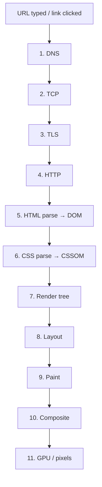
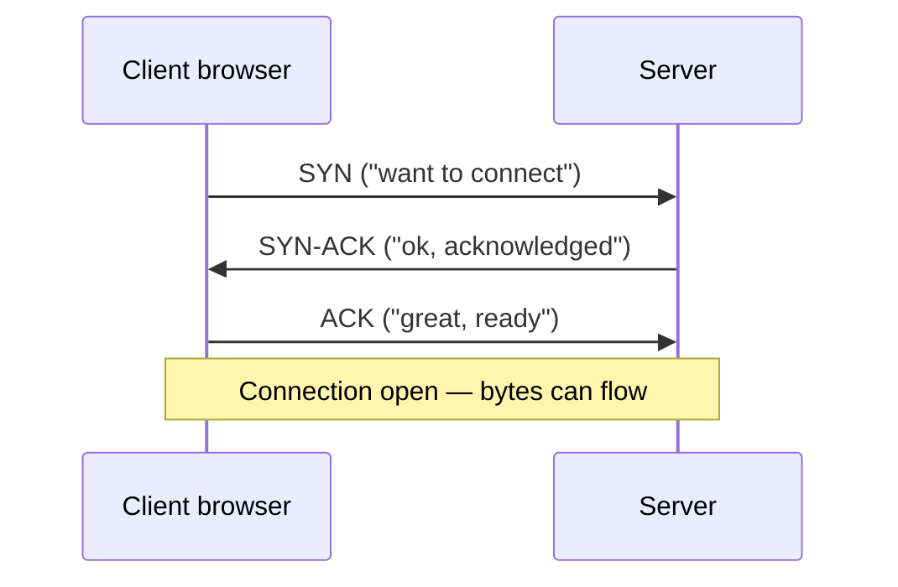
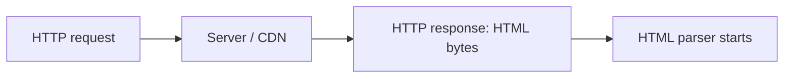
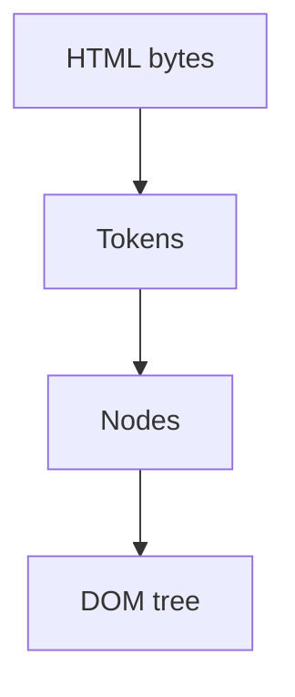
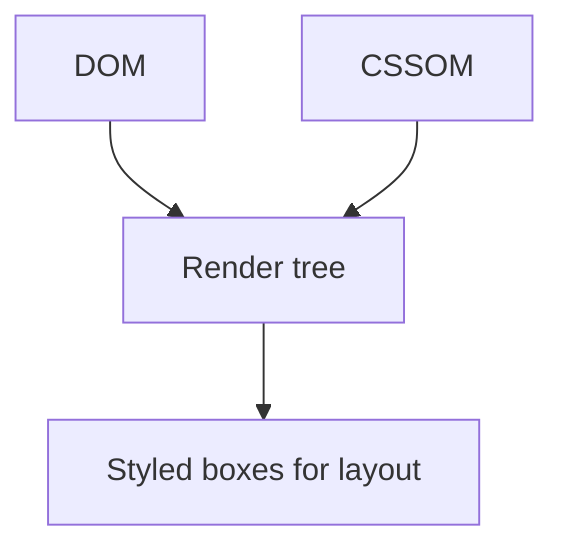
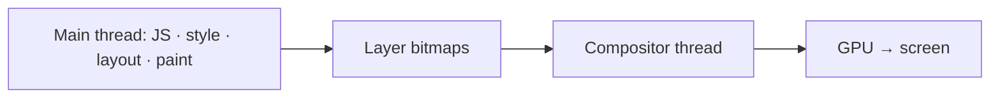
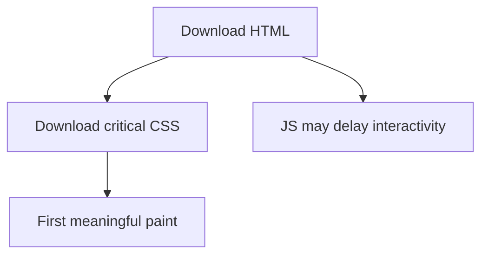

# Browser Rendering

This chapter teaches **how a URL becomes pixels on your screen**, from scratch. You do not need prior networking or browser-internals knowledge. By the end you should be able to walk an interviewer through **DNS → TCP → TLS → HTTP → HTML parse → DOM → CSS → CSSOM → render tree → layout → paint → composite → GPU**, with a beginner-friendly analogy for each step.

---

## 0. The big picture (one analogy)

Think of loading a website like **ordering a book and reading it aloud on stage**:

1. Find the bookstore’s address (**DNS**)
2. Walk there and shake hands (**TCP**)
3. Agree on a private speaking code (**TLS**)
4. Ask for the book and receive pages (**HTTP**)
5. Read the story’s structure (**HTML → DOM**)
6. Read the costume/style notes (**CSS → CSSOM**)
7. Decide what the audience should actually see (**render tree**)
8. Measure where everyone stands on stage (**layout**)
9. Draw the scenery (**paint**)
10. Stack transparent overlays for smooth motion (**composite**)
11. Project onto the screen (**GPU**)



---

## 1. URL — “where do I want to go?”

You type `https://example.com/path?q=1` or click a link.

| Part | Meaning |
| --- | --- |
| `https` | Scheme — use encrypted HTTP |
| `example.com` | Hostname — human name for a server |
| `/path` | Path — which resource |
| `?q=1` | Query — extra parameters |

The browser still only knows a **name**. Computers talk using **IP addresses** (like `93.184.216.34`). So next: look up the name.

---

## 2. DNS — “what’s the address of this name?”

**DNS** (Domain Name System) is the internet’s phone book.

Analogy: you know “Joe’s Pizza” but need the street address before you can go.

Lookup order (simplified):

1. Browser cache
2. OS cache
3. Router / ISP resolver
4. Authoritative name servers for that domain

Eventually: hostname → IP address.

```ts
// You don't call DNS from JS usually — the browser does.
// DevTools → Network → Timing → "DNS Lookup"
// Hints to start early:
```

```html
<link rel="dns-prefetch" href="//api.example.com" />
<link rel="preconnect" href="https://api.example.com" crossorigin />
```

- `dns-prefetch` — resolve name early  
- `preconnect` — DNS **plus** TCP **plus** TLS early (more expensive; use for critical origins only)

---

## 3. TCP — “open a reliable pipe”

**TCP** (Transmission Control Protocol) creates a **reliable, ordered** byte stream between your browser and the server.

Analogy: before talking business, both sides confirm “I hear you” three times — the **three-way handshake**:



Why it matters for performance: a cold connection costs **round trips** (RTT). Far servers = slower handshakes. CDNs put servers closer → smaller RTT.

TCP also starts cautiously (**slow start**) so a brand-new connection does not flood the network. Small critical files win early.

> HTTP/3 uses **QUIC** over UDP and folds transport + encryption differently — same *goal* (reliable request/response), different plumbing. Interviews usually want TCP first, then “H3 exists.”

---

## 4. TLS — “make the pipe private and trusted”

**TLS** (Transport Layer Security) is what makes `https` secure.

Analogy: after finding Joe’s Pizza, you agree on a secret code so eavesdroppers on the street cannot read your order, and you verify the restaurant’s ID badge (certificate).

Rough steps:

1. ClientHello — “here are the crypto options I support”
2. ServerHello + **certificate** — “use this; here’s my identity”
3. Browser verifies the certificate chain (is this really `example.com`?)
4. Keys agreed → encrypted application data

Cost: extra round trips on a cold connection. Session resumption / HTTP/3 0-RTT can make **repeat** visits cheaper.

Without TLS, Wi-Fi cafe attackers can read cookies and inject scripts. With TLS, they see encrypted blobs.

---

## 5. HTTP — “please give me `/index.html`”

Now the browser sends an **HTTP request** over the encrypted TCP connection:

```http
GET /index.html HTTP/1.1
Host: example.com
Accept: text/html
```

The server responds with status + headers + **body** (often HTML bytes).

Key idea: **TTFB** (Time To First Byte) = how long until the first response byte arrives. Slow backend → slow everything after.



### HTTP versions (interview-level)

| Version | Idea |
| --- | --- |
| HTTP/1.1 | Often one request at a time per connection; browsers open ~6 connections per origin |
| HTTP/2 | Many streams **multiplexed** on one connection |
| HTTP/3 | Multiplexing over QUIC/UDP — avoids TCP head-of-line blocking |

While HTML downloads, the parser will **discover** more URLs (`<link>`, `<script>`, ``) and queue more fetches.

---

## 6. HTML parsing → DOM

The browser reads HTML bytes and builds the **DOM** — a tree of objects (`Element`, `Text`, …).

Analogy: turning a screenplay script into a cast list and scene structure you can rearrange.

```html
<html>
  <body>
    <h1>Hello</h1>
    <script src="app.js"></script>
    <p>After script</p>
  </body>
</html>
```



### Scripts can block parsing

A classic `<script src="...">` without `async`/`defer`:

1. Parser pauses
2. Browser fetches (if needed) and **runs** the script
3. Script may read/alter the DOM **so far**
4. Parser resumes

That protects old pages that expected “script runs before the rest exists,” but it **delays** building the rest of the DOM.

| Attribute | Behavior |
| --- | --- |
| (none) | Fetch + execute; **parser blocked** |
| `defer` | Fetch in parallel; run **after** document parsed; **order preserved** |
| `async` | Fetch in parallel; run **whenever ready**; **order not guaranteed** |
| `type="module"` | Module graph; deferred by default |

```html
<script type="module" src="/app.js"></script>
```

Avoid `document.write` in modern apps — it can force painful reparsing.

---

## 7. CSS → CSSOM

In parallel (ideally), the browser fetches CSS and builds the **CSSOM** — a structure of selectors and rules.

Analogy: costume and lighting notes for each character type (`.button`, `#nav`, …).

```css
.button {
  color: white;
  background: navy;
}
```

### Why CSS is render-blocking

If the browser painted before CSS was ready, you would see **unstyled content**, then a flash into the real design (FOUC). So for **critical** stylesheets, the browser typically **waits** before first paint.

Tricks:

- `media="print"` stylesheets do not block screen paint
- Inline critical CSS vs external cached sheets — a production trade-off
- Non-critical CSS can be loaded with deferral patterns

---

## 8. Render tree — “what actually needs a box on screen?”

The browser combines **DOM + CSSOM** into a **render tree**: only nodes that will produce visible output (roughly).

| Case | In render tree? |
| --- | --- |
| Normal visible element | Yes |
| `display: none` | No |
| `visibility: hidden` | Yes (takes space, invisible) |
| `<head>` metadata | No |



Analogy: from the full cast list + costume notes, produce the **stage plot** of who appears and how they should look — extras that never appear are left out.

---

## 9. Layout (reflow) — “exactly where and how big?”

**Layout** computes geometry: `x`, `y`, `width`, `height` for each box, given viewport size, fonts, images, flex/grid rules, etc.

Analogy: measuring every actor’s marks on stage for this theater size.

Triggers include:

- First layout of the page
- Changing DOM structure or text
- Changing CSS that affects size/position
- Resizing the window
- Web fonts finishing load
- **Reading** certain properties after dirty writes (`offsetWidth`, `getBoundingClientRect`, …) — forces sync layout

```ts
// Layout thrashing: force layout repeatedly
el.style.width = "100px"
void el.offsetHeight // sync layout
el.style.height = "200px"
void el.offsetHeight // again
```

Batch writes, then reads. Or schedule visual work in `requestAnimationFrame`.

---

## 10. Paint — “draw the pixels into layers”

**Paint** fills in pixels: text glyphs, backgrounds, borders, shadows, images.

Analogy: painting each backdrop and costume onto canvases (layers).

Complex effects (large shadows, fancy filters) cost more paint time. Paint records can be split across **layers**.

---

## 11. Composite + GPU — “stack layers and show the frame”

Many pages have multiple **layers** (think Photoshop layers). The **compositor** stitches them into the final frame, often on a different thread, using the **GPU**.

Analogy: instead of repainting the whole stage every time a curtain slides, you slide a transparent overlay.



### Why `transform` / `opacity` animations feel smoother

Animating `transform` or `opacity` can often be handled by the compositor **without** re-layout and re-paint of the whole page every frame.

Animating `top`, `left`, `width`, `height` usually forces **layout + paint** every frame → jank.

```css
/* Prefer for motion */
.modal {
  transform: translateY(0);
  opacity: 1;
  transition: transform 0.2s, opacity 0.2s;
}
```

`will-change: transform` can promote a layer early — overuse wastes memory.

---

## 12. Critical rendering path (CRP)

The **critical rendering path** is the minimum chain of work before meaningful pixels appear.

Minimize:

1. **Number** of critical resources (blocking CSS/JS)
2. **Bytes** of those resources
3. **RTT depth** (how many sequential round trips)



Metrics you will hear (details in [Performance](/javascript/22-performance)):

- **FCP** — first contentful paint  
- **LCP** — largest contentful paint  
- **TTI / TBT** — how long until the page feels usable  
- **CLS** — layout shift score  
- **INP** — interaction responsiveness  

---

## 13. Frames, long tasks, and the event loop

Roughly 60Hz displays want a new frame every ~16ms. If your JS runs a **50ms+** task on the main thread, frames and input drop.

```ts
async function processChunks(items: Item[]) {
  for (const chunk of chunkArray(items, 100)) {
    work(chunk)
    await new Promise((r) => setTimeout(r, 0)) // yield to the browser
  }
}
```

Streaming HTML from the server lets the browser **parse and discover assets earlier** — SSR frameworks exploit this.

---

## 14. Fonts and images (stability)

Late-loading fonts can swap text metrics → layout shift (**CLS**).

```css
@font-face {
  font-family: "Display";
  src: url("/display.woff2") format("woff2");
  font-display: swap; /* or optional */
}
```

Always reserve space for images:

```html

```

Or CSS `aspect-ratio`.

---

## 15. DevTools map

| Panel | What you verify |
| --- | --- |
| Network | DNS / TCP / TLS / TTFB, waterfall, priorities |
| Performance | Long tasks, layout, paint, FPS |
| Rendering | Paint flashing, layer borders, CLS regions |
| Layers | Compositor layers |

---

## Interview Questions

### Q1. Walk me from URL to pixels.
**Expected:** Resolve DNS → TCP handshake → TLS → HTTP response → parse HTML into DOM (fetching discovered CSS/JS) → build CSSOM → combine into render tree → layout geometry → paint into layers → composite via GPU. Call out script/CSS blocking and that JS can force extra reflows.  
**Common wrong:** “The server sends a picture of the page.”  
**Follow-ups:** Where does HTTP/2 help in this story?

### Q2. DOM vs CSSOM vs render tree?
**Expected:** DOM is content structure; CSSOM is style rules; render tree is the visible formatted subset used for layout.  
**Common wrong:** Treating them as three names for the same tree.  
**Follow-ups:** Is `display:none` in the render tree?

### Q3. Why is CSS render-blocking?
**Expected:** To avoid painting unstyled content then flashing into the real design; browser waits for critical CSSOM before first paint.  
**Common wrong:** “CSS downloads after paint always.”  
**Follow-ups:** How can print CSS avoid blocking screen paint?

### Q4. `defer` vs `async`?
**Expected:** Both download without blocking the parser; `defer` runs after parse in order; `async` runs on load completion unordered. Modules defer by default.  
**Common wrong:** “They are identical.”  
**Follow-ups:** Which for a dependency-ordered app bundle?

### Q5. How do you animate at 60fps?
**Expected:** Prefer compositor-friendly properties (`transform`, `opacity`); avoid layout-inducing properties; keep main-thread JS short per frame; use `requestAnimationFrame`.  
**Common wrong:** “`setTimeout(16)` is enough.”  
**Follow-ups:** What does `will-change` do and when is it harmful?

### Q6. What is layout thrashing?
**Expected:** Alternating DOM writes with geometry reads that force repeated synchronous reflows.  
**Common wrong:** “Any DOM change is thrashing.”  
**Follow-ups:** How do you batch to fix it?

### Q7. What does the compositor do?
**Expected:** Combines pre-painted layers into frames, often off the main thread / on GPU, enabling cheaper animations when only layer properties change.  
**Common wrong:** “Paint and composite are the same step.”  
**Follow-ups:** Why can `top` animation be worse than `transform`?

## Common Mistakes

- Giant blocking scripts in `<head>` without `defer` / `type="module"`.
- Animating `left`/`top`/`width` instead of `transform`.
- Unsized images and late font swaps → CLS.
- Reading layout properties inside write loops.
- Overusing `will-change` and creating too many layers.
- Explaining only “HTML downloads” and skipping layout/paint/composite.

## Trade-offs / Production Notes

- Inline critical CSS can improve LCP but hurts cacheability — measure.
- SSR/streaming improves early HTML/LCP but adds TTFB and hydration cost ([Hydration](/nextjs/06-hydration)).
- Edge CDNs shrink DNS/TCP/TLS RTT; they do not fix heavy main-thread JS.
- Related: [Browser APIs](/javascript/19-browser-apis), [Performance](/javascript/22-performance), [Event Loop](/javascript/10-event-loop), [Browser rendering pipeline](/browser/02-rendering-pipeline).
