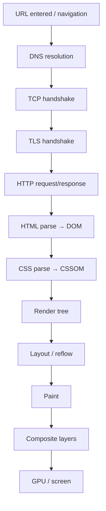
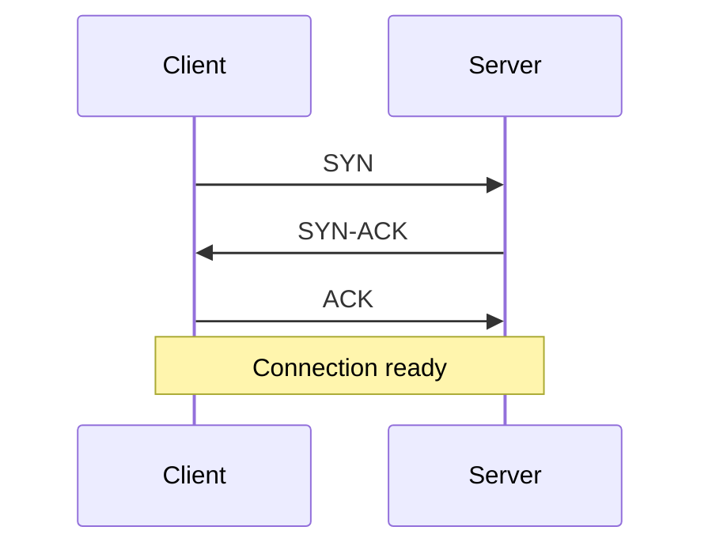
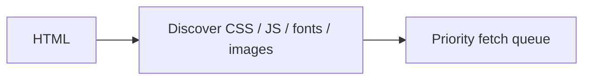
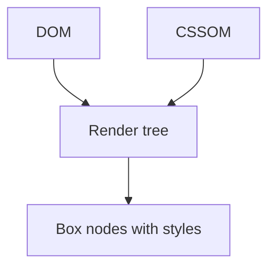
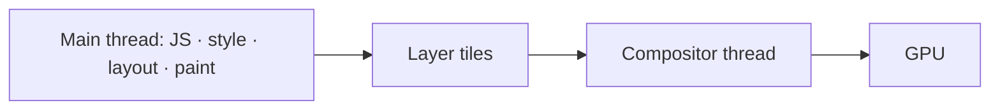
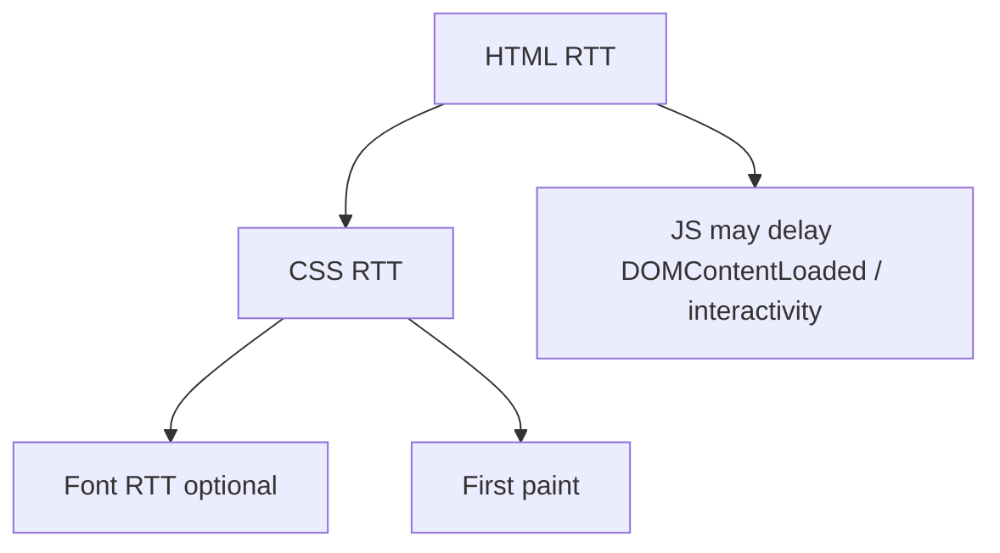

# Browser Rendering

Full path from URL keystroke to pixels: **DNS → TCP → TLS → HTTP → DOM → CSSOM → render tree → layout → paint → composite → GPU**. Senior FE interviews expect this story end-to-end.

## End-to-end pipeline



## 1. Navigation & DNS

Browser looks up hostname → IP (cache → recursive resolver → authoritative).

```ts
// DevTools: Timing → DNS Lookup
// Prefetch hints:
// <link rel="dns-prefetch" href="//api.example.com">
// <link rel="preconnect" href="https://api.example.com" crossorigin>
```

`preconnect` does DNS + TCP + TLS early — use for critical origins only (connection slots).

## 2. TCP

Three-way handshake: `SYN → SYN-ACK → ACK`. Then reliable ordered byte stream. Congestion control limits early throughput (**slow start**) — why first byte / small assets matter.



HTTP/2 and HTTP/3 multiplex differently (H3 uses QUIC/UDP — combines transport+TLS).

## 3. TLS

ClientHello → ServerHello + certificate → key exchange → encrypted application data.

Costs: extra RTT(s) on cold connect; session resumption / 0-RTT (H3) reduce repeat cost. Certificate validation + OCSP/CRL paths can add latency.

## 4. HTTP

```http
GET /index.html HTTP/1.1
Host: example.com
Accept: text/html
```

Response carries HTML. Critical path: **TTFB** (time to first byte) then download. HTTP/1.1 parallelism limited (~6 connections/origin); HTTP/2 multiplexes streams on one connection; watch **head-of-line blocking** at TCP layer (H3 improves).



Parser finds `<link rel=stylesheet>`, `<script>`, `` → speculative requests.

## 5. HTML parsing → DOM

Bytes → tokens → nodes → DOM tree. Speculative networking while parsing.

**Blocking script:** classic `<script src>` without `async`/`defer` stalls parser until fetched & executed (can read incomplete DOM).

| Attribute | Behavior |
| --- | --- |
| (none) | Fetch + exec, parser blocked |
| `defer` | Fetch parallel; exec after document parse, order preserved |
| `async` | Fetch parallel; exec ASAP, order not guaranteed |
| `type=module` | Defer-by-default; dependency graph |

```ts
// Prefer modules / defer for non-critical
// <script type="module" src="/app.js"></script>
```

`document.write` can force catastrophic re-parse — never in modern apps.

## 6. CSS → CSSOM

Stylesheets are **render-blocking** by default (browser won't paint until CSSOM for critical sheets is ready — avoid FOUC).

```css
/* CSSOM nodes: selectors + computed declarations */
.btn { color: red; }
```

Media-attr tricks: `media="print"` won't block screen paint. `preload` + `onload` swap patterns for non-critical CSS.

## 7. Render tree

Combine DOM + CSSOM → render tree of **visible** boxes only (`display:none` excluded; `visibility:hidden` included with layout).



## 8. Layout (reflow)

Calculate geometry: size, position for each box. Dependent on viewport, fonts, images.

Triggers: DOM geometry changes, font load, stylesheet change, reading layout-forcing properties (`offsetWidth`, `getBoundingClientRect`) after dirty writes.

```ts
// Thrash
el.style.width = "100px"
void el.offsetHeight // force layout
el.style.height = "100px"
void el.offsetHeight // again
```

Batch: write write write → read read read. Or `requestAnimationFrame`.

## 9. Paint

Fill pixels into layers: text, colors, borders, shadows, images. More expensive with complex effects.

## 10. Composite & GPU

Browser promotes some content to **compositor layers** (e.g. `transform`, `opacity`, `will-change`, video, canvas).

Animation of `transform`/`opacity` can run on compositor thread → skip layout/paint on main (ideal 60fps).

Animating `top`/`left`/`width` → layout + paint every frame — janky.



## Critical rendering path (CRP)

Minimize:

1. Critical resources count
2. Critical bytes
3. Critical RTT depth



Metrics: **FP / FCP / LCP / TTI / TBT / CLS / INP** — see [Performance](/javascript/22-performance).

## Incremental & streaming HTML

Server can flush HTML early → progressive DOM → earlier discovery of assets. SSR/streaming frameworks exploit this ([Next streaming](/nextjs/07-streaming)).

## Frames & the event loop

Between macrotasks, browser may style/layout/paint if needed. Long JS tasks (>50ms) delay input + frames → **Time to Interactive** / **INP** suffer.

```ts
// Yield long work
async function processChunks(items: Item[]) {
  for (const chunk of chunks(items, 100)) {
    work(chunk)
    await new Promise((r) => setTimeout(r, 0)) // or scheduler.yield()
  }
}
```

## Fonts & images (layout stability)

FOIT/FOUT: `font-display: swap | optional`. Reserve space with width/height or aspect-ratio to prevent **CLS**.

```html

```

## DevTools mapping

| Panel | What you verify |
| --- | --- |
| Network | DNS/TCP/TLS/TTFB, waterfall, priority |
| Performance | Long tasks, layout, paint, FPS |
| Rendering | Paint flashing, layer borders, CLS regions |
| Layers | Compositor layers |

## Interview Questions

**Q: Walk me through typing a URL to pixels.**  
DNS→TCP→TLS→HTTP→parse DOM while fetching CSS/JS→CSSOM→render tree→layout→paint→composite→GPU. Scripts/styles affect blocking; JS can force reflow.

**Q: DOM vs CSSOM vs render tree?**  
DOM = content structure; CSSOM = style rules; render tree = visible formatted objects for layout.

**Q: Why is CSS render-blocking?**  
Without styles, first paint would be unstyled then flash — browser waits for critical CSSOM.

**Q: `defer` vs `async`?**  
Both download parallel; `defer` preserves order and runs after parse; `async` runs on load completion unordered.

**Q: How do you animate at 60fps?**  
Prefer compositor props (`transform`, `opacity`); avoid layout-inducing properties; reduce main-thread JS per frame.

**Q: What causes layout thrashing?**  
Alternating DOM writes with layout reads forcing synchronous reflow repeatedly.

**Q: HTTP/2 benefit on CRP?**  
Multiplexing critical assets on one connection; still prioritize correctly (don't flood with low-priority).

## Common Mistakes

- Giant blocking bundles in `<head>` without defer/module.
- Animating `left/top` instead of `transform`.
- Unsized images → CLS.
- Reading layout in loops.
- Overusing `will-change` (wastes memory / layer count).
- Ignoring font swaps causing late layout shifts.

## Trade-offs / Production Notes

- Inline **critical CSS** vs cacheable external sheets — measure LCP.
- SSR improves FCP/LCP but adds TTFB/complexity; hydration cost → INP risk ([Hydration](/nextjs/06-hydration)).
- Edge CDN shrinks TCP/TLS RTT; doesn't fix huge JS main-thread work.
- Related: [Browser APIs](/javascript/19-browser-apis), [Performance](/javascript/22-performance), [Browser rendering pipeline](/browser/02-rendering-pipeline), [Networking](/browser/05-networking).
