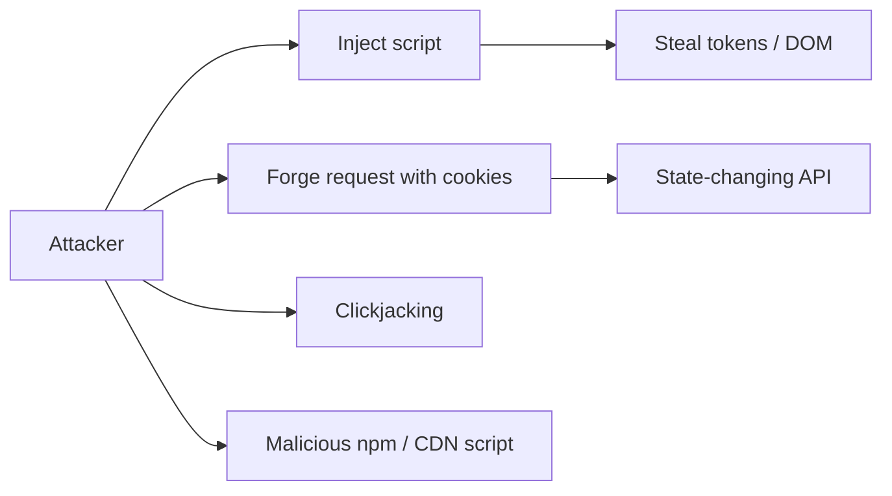
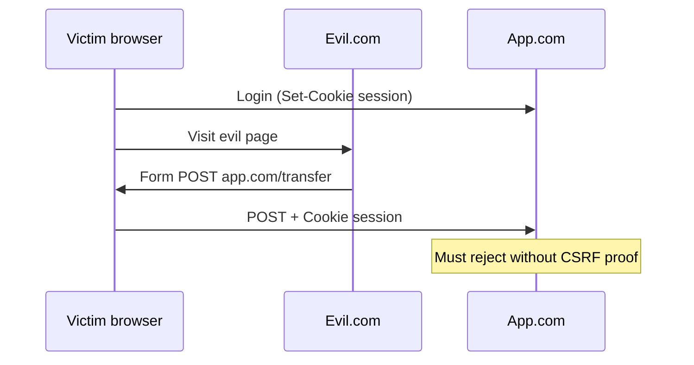
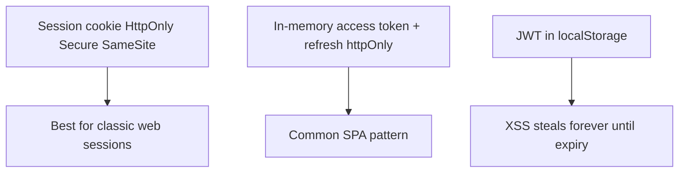

# Security

XSS, CSRF, CSP, cookies, supply chain — what mid/senior FE candidates must explain without hand-waving.

## Threat model (browser app)



## XSS — Cross-Site Scripting

Attacker runs JS in victim's origin → full access to DOM, `localStorage`, non-httpOnly cookies, authenticated `fetch` to same origin.

### Types

| Type | Mechanism |
| --- | --- |
| Stored | Malicious payload saved on server, served to others |
| Reflected | Payload in URL/request echoed into page |
| DOM-based | Client JS unsafe sink (`innerHTML`, `location`, etc.) |

```ts
// Vulnerable
el.innerHTML = userComment
el.outerHTML = `...${user}...`
document.write(user)
location.href = userInput // javascript: URL risks historically

// Safer
el.textContent = userComment
// or trusted sanitizer
el.setHTML(userComment) // Sanitizer API where available
DOMPurify.sanitize(html)
```

React escapes text children by default — **not** `dangerouslySetInnerHTML`, not `href={user}` without protocol allowlist, not `eval`/new Function.

```ts
// Dangerous URL
<a href={userHref}> // javascript:alert(1)
// Validate:
function safeUrl(u: string) {
  const parsed = new URL(u, window.location.origin)
  if (!["http:", "https:", "mailto:"].includes(parsed.protocol)) return "#"
  return parsed.href
}
```

## CSRF — Cross-Site Request Forgery

Browser automatically attaches cookies on requests to a site. Attacker page triggers victim's browser to hit your API → cookie auth acts as user.



### Defenses

```ts
// 1) SameSite cookies
// Set-Cookie: session=…; Secure; HttpOnly; SameSite=Lax  (or Strict)

// 2) Anti-CSRF token (double-submit or syncer pattern)
// Server issues token; client sends header X-CSRF-Token; server verifies

// 3) Prefer Authorization header tokens (not cookie) for APIs —
// but then store tokens carefully (memory / httpOnly cookie hybrid)

// 4) Check Origin / Referer on state-changing requests
```

`SameSite=Lax` blocks most cross-site POSTs with cookies; `None` requires `Secure` and needs CSRF tokens.

## Content Security Policy (CSP)

HTTP header (or meta) whitelisting script/style sources — mitigates XSS impact.

```http
Content-Security-Policy:
  default-src 'self';
  script-src 'self';
  object-src 'none';
  base-uri 'self';
  frame-ancestors 'none';
  img-src 'self' https: data:;
  connect-src 'self' https://api.example.com;
```

Avoid `'unsafe-inline'` / `'unsafe-eval'`. Prefer **nonces** or hashes for required inline scripts:

```http
script-src 'self' 'nonce-rAnd0m'
```

```html
<script nonce="rAnd0m">…</script>
```

Report-Only mode to deploy safely. `frame-ancestors` replaces `X-Frame-Options` for clickjacking.

## Cookies — flags that matter

| Flag | Effect |
| --- | --- |
| `HttpOnly` | JS cannot read — XSS can't exfiltrate easily |
| `Secure` | HTTPS only |
| `SameSite` | Lax / Strict / None — CSRF posture |
| `Path` / `Domain` | Scope |
| `__Host-` prefix | Forces Secure, Path=/, no Domain |

## CORS (not a CSRF substitute)

Browsers enforce cross-origin **reads** from JS. Server `Access-Control-Allow-Origin` etc. CORS does **not** block simple cookie-authenticated form POSTs (those aren't CORS-controlled the same way). Don't say "we have CORS so CSRF is fine."

```http
Access-Control-Allow-Origin: https://app.example.com
Access-Control-Allow-Credentials: true
```

Never `*` with credentials.

## Clickjacking

Embed your site in iframe → trick clicks. Defend: `frame-ancestors 'none'` / `X-Frame-Options: DENY`.

## Open redirects & header injection

```ts
// Bad
res.redirect(req.query.next)
// Allowlist relative paths or known hosts
```

## Supply chain / third-party scripts

Analytics, chat widgets, GTM = full trust in their JS. Prefer Subresource Integrity (SRI) for CDNs:

```html
<script
  src="https://cdn.example/lib.js"
  integrity="sha384-…"
  crossorigin="anonymous"
></script>
```

Lockfile + audit + minimal deps. Prototype pollution via unsafe merges — [Objects](/javascript/14-objects).

## Sensitive data storage



## Interview Questions

**Q: Explain XSS and how you prevent it.**  
Untrusted data treated as code. Escape/textContent, sanitize HTML, CSP nonces, avoid dangerous sinks, framework defaults.

**Q: Explain CSRF and defenses.**  
Cross-site request with victim cookies. SameSite, CSRF tokens, Origin checks, avoid cookie auth for pure APIs when possible.

**Q: Does CORS stop CSRF?**  
No. CORS restricts JS reading cross-origin responses; CSRF exploits cookie-authenticated requests.

**Q: What does CSP do?**  
Allowlists what can execute/load — reduces XSS blast radius; needs careful nonces to replace inline.

**Q: HttpOnly cookie vs localStorage for tokens?**  
HttpOnly not readable by JS → better under XSS. LS is trivial to steal with XSS.

**Q: What is DOM XSS?**  
Client-side source (URL, postMessage) flows to sink without sanitization — server never sees payload.

## Common Mistakes

- Claiming React makes XSS impossible (`dangerouslySetInnerHTML`, URLs, markdown libs).
- `SameSite=None` without CSRF tokens.
- CSP with `'unsafe-inline'` everywhere (theater).
- Disabling security headers in prod "temporarily."
- Logging secrets / putting tokens in query strings (Referer leak).

## Trade-offs / Production Notes

- Strict CSP breaks legacy inline scripts — migrate with nonces; ship Report-Only first.
- `SameSite=Strict` can break OAuth return navigations — often `Lax` + tokens.
- Defense in depth: escape + CSP + HttpOnly + least privilege APIs.
- Related: [Browser security](/browser/06-security), [Node security](/node/12-security), [Auth](/backend/07-auth), [Browser APIs](/javascript/19-browser-apis).
